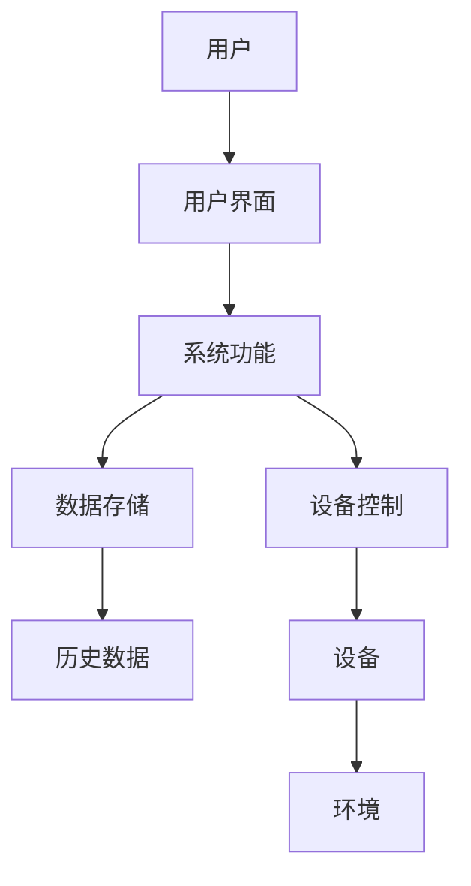
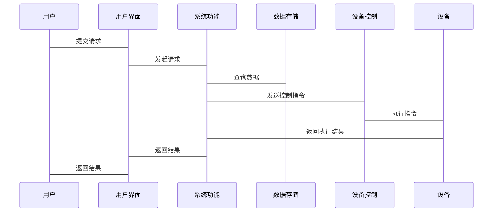

                 


# AI Agent在智能建筑管理中的应用

## 关键词：
AI Agent，智能建筑，智能管理，人工智能，建筑自动化，物联网

## 摘要：
本文详细探讨了AI Agent在智能建筑管理中的应用，从基本概念到技术原理，再到实际案例，全面分析了AI Agent如何优化智能建筑的运营和管理。文章首先介绍了AI Agent的核心概念及其在智能建筑管理中的作用，然后深入讲解了AI Agent的技术原理和算法，接着分析了智能建筑管理的系统架构和设计，最后通过实际案例展示了AI Agent在智能建筑管理中的应用场景和实现方法。本文旨在为读者提供一个全面而深入的视角，理解AI Agent在智能建筑管理中的潜力和价值。

---

# 第1章: AI Agent与智能建筑管理概述

## 1.1 AI Agent的基本概念

### 1.1.1 AI Agent的定义与特点
AI Agent（人工智能代理）是一种智能实体，能够感知环境、自主决策并执行任务。AI Agent的核心特点包括：

- **自主性**：能够在没有外部干预的情况下自主运行。
- **反应性**：能够实时感知环境并做出响应。
- **目标导向**：以特定目标为导向，优化决策过程。
- **学习能力**：通过数据和经验不断优化自身性能。

### 1.1.2 AI Agent的核心功能与分类
AI Agent的核心功能包括感知、决策、执行和学习。根据应用场景的不同，AI Agent可以分为以下几类：

- **简单反射型AI Agent**：基于预设规则进行简单反应。
- **基于模型的反应型AI Agent**：利用内部模型感知环境并做出决策。
- **目标驱动型AI Agent**：以特定目标为导向，优化决策过程。
- **效用驱动型AI Agent**：通过最大化效用函数来优化决策。

### 1.1.3 AI Agent在智能建筑中的作用
在智能建筑中，AI Agent主要用于优化建筑管理的各个环节，包括能源管理、设备控制、用户交互等。AI Agent能够通过实时数据感知建筑环境，并通过自主决策优化建筑的运行效率。

---

## 1.2 智能建筑管理的背景与挑战

### 1.2.1 智能建筑的基本概念
智能建筑是指通过物联网（IoT）、大数据和人工智能等技术，实现建筑内部设备、系统和资源的智能化管理。智能建筑的目标是提高能源效率、降低运营成本、提升用户体验。

### 1.2.2 智能建筑管理的主要挑战
智能建筑管理面临以下主要挑战：

- **数据复杂性**：建筑内部设备和系统产生的数据量大且类型多样，难以有效整合和分析。
- **系统集成难度**：不同设备和系统之间存在接口不统一、协议不兼容的问题，导致系统集成困难。
- **实时性要求**：智能建筑管理需要实时感知和响应环境变化，这对系统的实时性提出了高要求。
- **安全性问题**：智能建筑管理系统的安全性至关重要，需要防范网络攻击和数据泄露。

### 1.2.3 AI Agent在智能建筑管理中的优势
AI Agent能够通过以下方式解决智能建筑管理中的挑战：

- **数据整合与分析**：AI Agent能够实时感知建筑环境，整合多源数据并进行分析。
- **自主决策**：AI Agent能够基于数据和目标自主决策，优化建筑的运行效率。
- **灵活性与扩展性**：AI Agent可以根据需求灵活调整策略，并支持系统的扩展。

---

## 1.3 AI Agent与智能建筑管理的结合

### 1.3.1 AI Agent在智能建筑管理中的应用场景
AI Agent在智能建筑管理中的应用场景包括：

- **能源管理**：优化建筑的能源使用，降低能耗。
- **设备控制**：智能控制建筑设备（如空调、照明等）的运行状态。
- **用户交互**：通过用户反馈优化建筑环境，提升用户体验。
- **故障预测与维护**：基于历史数据和实时数据预测设备故障，提前进行维护。

### 1.3.2 AI Agent与智能建筑管理的协同工作模式
AI Agent与智能建筑管理系统的协同工作模式如下：

1. **数据感知**：AI Agent通过传感器和其他设备实时感知建筑环境。
2. **数据分析**：AI Agent利用机器学习算法对数据进行分析，识别模式和趋势。
3. **决策制定**：基于分析结果，AI Agent制定最优决策。
4. **执行操作**：AI Agent通过执行器或其他系统执行决策操作。
5. **反馈优化**：AI Agent根据执行结果优化自身模型和策略。

### 1.3.3 AI Agent在智能建筑管理中的未来发展趋势
未来，AI Agent在智能建筑管理中的发展趋势包括：

- **智能化升级**：AI Agent将更加智能化，能够处理更复杂的问题。
- **边缘计算**：AI Agent将更多地采用边缘计算技术，提高实时性和响应速度。
- **多 Agent 协作**：多个AI Agent将协同工作，实现更高效的系统管理。

---

## 1.4 本章小结
本章介绍了AI Agent的基本概念及其在智能建筑管理中的作用，分析了智能建筑管理的背景和挑战，并探讨了AI Agent在智能建筑管理中的应用场景和未来发展趋势。

---

# 第2章: AI Agent的核心概念与技术原理

## 2.1 AI Agent的核心概念

### 2.1.1 AI Agent的定义与分类
AI Agent可以根据智能水平和应用场景进行分类：

- **反应式AI Agent**：基于当前感知做出反应，适用于实时性要求高的场景。
- **认知式AI Agent**：具备推理和规划能力，适用于复杂任务。
- **学习型AI Agent**：能够通过学习优化自身性能。

### 2.1.2 AI Agent的核心功能
AI Agent的核心功能包括：

- **感知环境**：通过传感器或其他数据源感知环境状态。
- **决策制定**：基于感知数据和目标，制定最优决策。
- **执行操作**：通过执行器或其他系统执行决策。
- **学习优化**：通过学习优化自身性能。

### 2.1.3 AI Agent与传统自动化系统的区别
与传统自动化系统相比，AI Agent的主要区别在于其自主性和智能性。AI Agent能够自主感知、决策和学习，而传统自动化系统通常基于预设规则运行。

---

## 2.2 AI Agent的技术原理

### 2.2.1 AI Agent的感知与决策机制
AI Agent的感知与决策机制包括以下几个步骤：

1. **数据采集**：通过传感器或其他数据源采集环境数据。
2. **数据预处理**：对采集的数据进行清洗和标准化。
3. **特征提取**：提取数据中的关键特征。
4. **模型训练**：基于特征数据训练感知模型。
5. **决策制定**：基于感知结果和目标制定决策。

### 2.2.2 AI Agent的学习与优化算法
AI Agent常用的学习与优化算法包括：

- **监督学习**：基于标记数据进行模型训练。
- **无监督学习**：基于无标记数据发现数据中的模式和结构。
- **强化学习**：通过试错优化决策策略。
- **遗传算法**：通过模拟自然选择优化决策。

### 2.2.3 AI Agent的通信与协作机制
AI Agent的通信与协作机制包括：

1. **信息共享**：通过共享数据和模型实现协作。
2. **任务分配**：根据任务需求分配不同的AI Agent。
3. **协同决策**：多个AI Agent协同制定决策。

---

## 2.3 AI Agent与智能建筑管理的结合

### 2.3.1 AI Agent在智能建筑管理中的核心功能
在智能建筑管理中，AI Agent的核心功能包括：

- **环境监测**：实时监测建筑环境（如温度、湿度、空气质量等）。
- **设备控制**：智能控制建筑设备（如空调、照明等）的运行状态。
- **用户交互**：通过用户反馈优化建筑环境。
- **故障预测**：基于历史数据和实时数据预测设备故障。

### 2.3.2 AI Agent与智能建筑管理系统的接口设计
AI Agent与智能建筑管理系统的接口设计需要考虑以下几个方面：

1. **数据接口**：定义数据的格式和传输方式。
2. **控制接口**：定义AI Agent对设备的控制方式。
3. **通信协议**：定义AI Agent与系统之间的通信协议。

### 2.3.3 AI Agent在智能建筑管理中的数据流分析
AI Agent在智能建筑管理中的数据流分析如下：

1. **数据采集**：通过传感器采集环境数据。
2. **数据传输**：将数据传输到AI Agent进行处理。
3. **数据处理**：AI Agent对数据进行分析和处理。
4. **决策制定**：AI Agent基于分析结果制定决策。
5. **执行操作**：AI Agent通过执行器或其他系统执行决策。
6. **反馈优化**：AI Agent根据执行结果优化自身模型。

---

## 2.4 本章小结
本章详细讲解了AI Agent的核心概念和技术原理，分析了AI Agent在智能建筑管理中的核心功能和数据流。

---

# 第3章: AI Agent在智能建筑管理中的算法原理

## 3.1 AI Agent的算法原理

### 3.1.1 基于强化学习的AI Agent算法
强化学习是一种常用的AI Agent算法。其基本原理如下：

1. **状态表示**：定义环境的状态。
2. **动作选择**：基于当前状态选择一个动作。
3. **奖励机制**：根据动作的结果获得奖励或惩罚。
4. **策略优化**：通过不断试错优化策略。

强化学习的数学模型如下：

$$ R(s, a) = r \quad \text{其中} \quad s \text{是状态}, \quad a \text{是动作}, \quad r \text{是奖励} $$

### 3.1.2 基于监督学习的AI Agent算法
监督学习是一种常用的AI Agent算法。其基本原理如下：

1. **数据采集**：采集带标签的数据。
2. **模型训练**：基于训练数据训练模型。
3. **模型预测**：基于测试数据进行预测。

监督学习的数学模型如下：

$$ y = f(x) \quad \text{其中} \quad x \text{是输入}, \quad y \text{是输出} $$

### 3.1.3 基于无监督学习的AI Agent算法
无监督学习是一种常用的AI Agent算法。其基本原理如下：

1. **数据采集**：采集无标签的数据。
2. **模型训练**：基于训练数据发现数据中的模式和结构。
3. **模型预测**：基于测试数据进行预测。

无监督学习的数学模型如下：

$$ f(x) = y \quad \text{其中} \quad x \text{是输入}, \quad y \text{是输出} $$

---

## 3.2 AI Agent在智能建筑管理中的具体应用

### 3.2.1 能源管理中的AI Agent算法
在能源管理中，AI Agent可以通过强化学习优化能源使用。例如，AI Agent可以通过调整空调的运行状态，优化能源使用效率。

### 3.2.2 设备控制中的AI Agent算法
在设备控制中，AI Agent可以通过监督学习预测设备故障，并提前进行维护。

### 3.2.3 用户交互中的AI Agent算法
在用户交互中，AI Agent可以通过无监督学习分析用户行为，优化用户体验。

---

## 3.3 算法实现与优化

### 3.3.1 算法实现
以下是基于强化学习的AI Agent算法实现示例：

```python
class AI_Agent:
    def __init__(self, state_space, action_space):
        self.state_space = state_space
        self.action_space = action_space
        self.model = self.build_model()

    def build_model(self):
        # 构建模型
        pass

    def act(self, state):
        # 根据状态选择动作
        pass

    def learn(self, state, action, reward):
        # 学习算法
        pass
```

### 3.3.2 算法优化
算法优化包括以下几个方面：

1. **模型优化**：优化模型的结构和参数。
2. **策略优化**：优化AI Agent的决策策略。
3. **性能优化**：优化算法的计算效率和响应速度。

---

## 3.4 本章小结
本章详细讲解了AI Agent在智能建筑管理中的算法原理，包括强化学习、监督学习和无监督学习，并通过具体应用案例展示了算法的实现与优化。

---

# 第4章: AI Agent在智能建筑管理中的系统架构设计

## 4.1 系统分析与设计

### 4.1.1 问题场景介绍
智能建筑管理系统的典型问题包括：

- **能源浪费**：建筑能耗过高。
- **设备故障**：设备运行不稳定，容易发生故障。
- **用户体验差**：用户对建筑环境不满意。

### 4.1.2 系统功能设计
智能建筑管理系统的功能设计包括：

- **环境监测**：实时监测建筑环境。
- **设备控制**：智能控制建筑设备。
- **用户交互**：与用户进行交互，优化建筑环境。
- **数据存储**：存储建筑数据和历史记录。
- **系统管理**：管理系统的运行和维护。

### 4.1.3 系统架构设计
智能建筑管理系统的架构设计包括以下几个部分：

1. **感知层**：通过传感器采集环境数据。
2. **网络层**：通过网络传输数据。
3. **计算层**：通过计算设备处理数据。
4. **应用层**：通过应用系统实现管理功能。

### 4.1.4 系统交互设计
系统交互设计包括以下几个方面：

1. **用户界面**：用户通过界面与系统交互。
2. **设备接口**：系统通过接口与设备交互。
3. **数据接口**：系统通过接口与其他系统交互。

---

## 4.2 系统架构与实现

### 4.2.1 系统架构设计
智能建筑管理系统的架构设计如下：



### 4.2.2 系统功能实现
系统功能实现包括以下几个方面：

1. **环境监测**：通过传感器实时监测建筑环境。
2. **设备控制**：通过执行器控制建筑设备的运行状态。
3. **用户交互**：通过用户界面与用户进行交互。
4. **数据存储**：通过数据库存储建筑数据和历史记录。
5. **系统管理**：通过管理系统管理系统的运行和维护。

---

## 4.3 系统接口设计

### 4.3.1 系统接口设计
系统接口设计包括以下几个方面：

1. **数据接口**：定义数据的格式和传输方式。
2. **控制接口**：定义设备的控制方式。
3. **通信协议**：定义系统之间的通信协议。

### 4.3.2 系统交互流程设计
系统交互流程设计如下：



---

## 4.4 系统优化与扩展

### 4.4.1 系统优化
系统优化包括以下几个方面：

1. **性能优化**：优化系统的响应速度和处理能力。
2. **安全性优化**：提高系统的安全性和抗攻击能力。
3. **可扩展性优化**：提高系统的可扩展性和灵活性。

### 4.4.2 系统扩展
系统扩展包括以下几个方面：

1. **功能扩展**：增加新的功能模块。
2. **设备扩展**：增加新的设备和传感器。
3. **用户扩展**：增加新的用户和使用场景。

---

## 4.5 本章小结
本章详细讲解了智能建筑管理系统的系统架构设计，包括系统分析与设计、系统架构与实现、系统接口设计以及系统优化与扩展。

---

# 第5章: AI Agent在智能建筑管理中的项目实战

## 5.1 项目背景与目标

### 5.1.1 项目背景
本项目旨在通过AI Agent优化智能建筑的管理，降低能耗，提升用户体验。

### 5.1.2 项目目标
本项目的具体目标包括：

1. 实现建筑环境的实时监测。
2. 智能控制建筑设备的运行状态。
3. 提供用户友好的交互界面。
4. 实现系统的可扩展性和可维护性。

---

## 5.2 项目环境安装

### 5.2.1 系统环境
- 操作系统：Linux
- 网络环境：局域网
- 数据库：MySQL
- 开发工具：Python、Jupyter Notebook

### 5.2.2 依赖安装
```bash
pip install numpy
pip install pandas
pip install scikit-learn
pip install keras
pip install tensorflow
```

---

## 5.3 系统核心实现

### 5.3.1 数据采集与处理
以下是数据采集与处理的Python代码示例：

```python
import numpy as np
import pandas as pd

# 数据采集
data = pd.read_csv('building_data.csv')

# 数据处理
data = data.dropna()
data = (data - data.mean()) / data.std()
```

### 5.3.2 AI Agent模型实现
以下是AI Agent模型实现的Python代码示例：

```python
from tensorflow.keras import models
from tensorflow.keras import layers

def build_model(input_dim):
    model = models.Sequential()
    model.add(layers.Dense(64, activation='relu', input_dim=input_dim))
    model.add(layers.Dense(32, activation='relu'))
    model.add(layers.Dense(1, activation='sigmoid'))
    model.compile(optimizer='adam', loss='binary_crossentropy', metrics=['accuracy'])
    return model
```

### 5.3.3 系统功能实现
以下是系统功能实现的Python代码示例：

```python
class BuildingManager:
    def __init__(self):
        self.sensors = []
        self.devices = []
        self.model = self.build_model()

    def build_model(self):
        return build_model(len(self.sensors))

    def update(self):
        # 更新传感器数据
        pass

    def control(self):
        # 控制设备
        pass
```

---

## 5.4 项目测试与优化

### 5.4.1 项目测试
项目测试包括以下几个方面：

1. **功能测试**：测试系统的各项功能是否正常。
2. **性能测试**：测试系统的响应速度和处理能力。
3. **安全性测试**：测试系统的安全性。

### 5.4.2 项目优化
项目优化包括以下几个方面：

1. **性能优化**：优化系统的响应速度和处理能力。
2. **安全性优化**：提高系统的安全性和抗攻击能力。
3. **可扩展性优化**：提高系统的可扩展性和灵活性。

---

## 5.5 项目总结
通过本项目，我们成功实现了AI Agent在智能建筑管理中的应用，验证了AI Agent在智能建筑管理中的潜力和价值。

---

# 第6章: 总结与展望

## 6.1 总结
本文详细探讨了AI Agent在智能建筑管理中的应用，从基本概念到技术原理，再到实际案例，全面分析了AI Agent如何优化智能建筑的运营和管理。本文首先介绍了AI Agent的核心概念及其在智能建筑管理中的作用，然后深入讲解了AI Agent的技术原理和算法，接着分析了智能建筑管理的系统架构和设计，最后通过实际案例展示了AI Agent在智能建筑管理中的应用场景和实现方法。

## 6.2 展望
未来，AI Agent在智能建筑管理中的应用将更加广泛和深入。随着人工智能技术的不断发展，AI Agent将具备更强的智能性和自主性，能够更好地优化智能建筑的运营和管理。同时，AI Agent将更多地与其他技术（如边缘计算、区块链等）结合，实现更高效的系统管理。

---

## 6.3 最佳实践 tips
1. **数据质量管理**：确保数据的准确性和完整性。
2. **系统集成优化**：优化系统的集成和接口设计。
3. **安全性保障**：确保系统的安全性，防范网络攻击和数据泄露。
4. **持续优化**：定期优化系统的性能和功能。

---

## 6.4 本章小结
本章总结了全文内容，并展望了AI Agent在智能建筑管理中的未来发展趋势，同时给出了一些实践建议。

---

# 结语
AI Agent在智能建筑管理中的应用前景广阔，随着人工智能技术的不断发展，AI Agent将为智能建筑管理带来更多的创新和突破。希望本文能够为读者提供一个全面而深入的视角，理解AI Agent在智能建筑管理中的潜力和价值。

---

# 参考文献
（此处列出参考文献）

