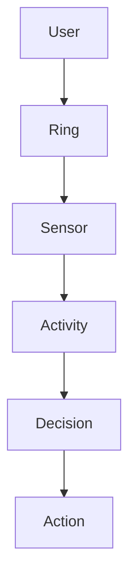
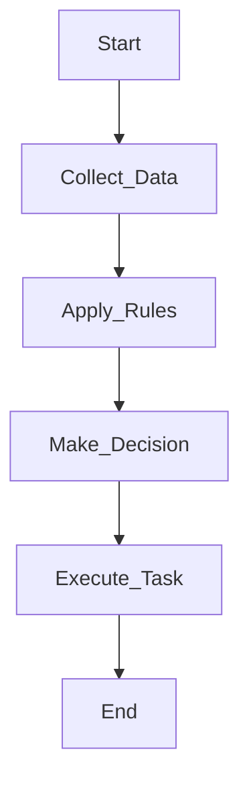
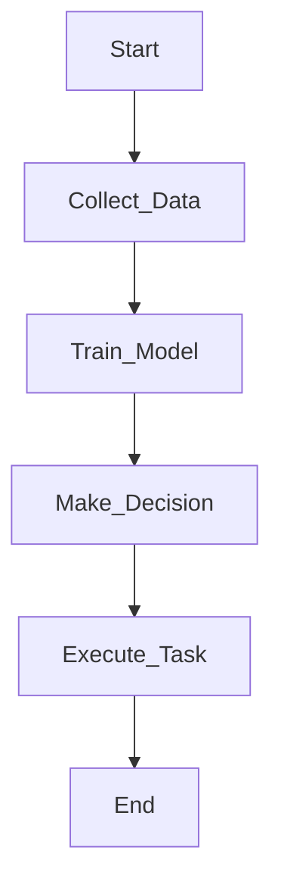
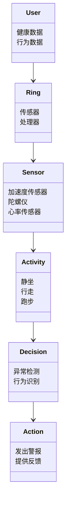
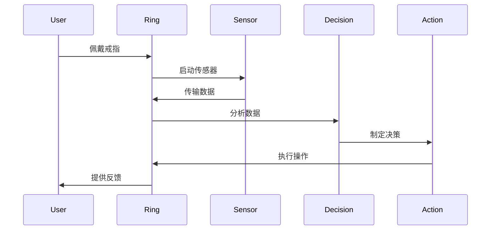

                 


# AI Agent在智能戒指中的日常活动追踪

> 关键词：AI Agent, 智能戒指, 日常活动追踪, 人工智能, 可穿戴设备, 算法原理

> 摘要：本文深入探讨了AI Agent在智能戒指中的日常活动追踪应用，从背景介绍、核心概念、算法原理到系统架构、项目实战和最佳实践，全面解析了AI Agent在智能戒指中的技术实现与实际应用。通过本文，读者可以了解AI Agent在智能戒指中的工作原理，掌握相关算法和技术，为未来的智能戒指开发提供参考。

---

# 第一部分: AI Agent与智能戒指的背景与概念

# 第1章: AI Agent与智能戒指概述

## 1.1 智能戒指的发展历程

### 1.1.1 智能戒指的历史演变

智能戒指作为一种可穿戴设备，其发展经历了多个阶段。最初，智能戒指主要用于基本的健康监测，如心率、血压等生理指标的测量。随着技术的进步，智能戒指的功能逐渐扩展，开始支持更多的交互方式，如语音控制、手势识别等。近年来，随着人工智能技术的快速发展，智能戒指开始集成AI Agent（人工智能代理），能够通过实时数据分析为用户提供智能化的日常活动追踪服务。

### 1.1.2 当前智能戒指的技术特点

当前的智能戒指通常集成了多种传感器，如心率监测、加速度传感器、陀螺仪、麦克风等，能够实时采集用户的生理数据和行为数据。AI Agent通过这些传感器数据，结合机器学习算法，能够识别用户的活动状态（如静坐、行走、跑步等），并提供个性化的健康建议和行为优化方案。

### 1.1.3 智能戒指的应用场景

智能戒指的应用场景非常广泛，包括但不限于：
- 健康管理：实时监测用户的健康状况，如心率、血氧、体温等。
- 活动追踪：记录用户的日常活动，如步数、运动类型、运动时间等。
- 交互控制：通过戒指上的传感器实现语音助手、智能家居控制等功能。
- 紧急响应：在用户出现异常健康状况时，智能戒指能够及时发出警报，并通知相关人员。

## 1.2 AI Agent的基本概念

### 1.2.1 AI Agent的定义与特点

AI Agent（人工智能代理）是一种能够感知环境、自主决策并执行任务的智能系统。它通常具备以下特点：
- **自主性**：AI Agent能够自主决策，无需人工干预。
- **反应性**：能够实时感知环境变化，并做出相应的反应。
- **学习能力**：通过机器学习算法不断优化自身的决策能力。
- **交互能力**：能够与用户或其他设备进行交互，获取信息并执行任务。

### 1.2.2 AI Agent的核心功能

AI Agent的核心功能包括：
- **数据感知**：通过传感器获取环境数据。
- **数据处理**：对获取的数据进行分析和处理。
- **决策制定**：基于分析结果，制定相应的决策。
- **任务执行**：根据决策结果执行相应的操作。

### 1.2.3 AI Agent与传统软件的区别

AI Agent与传统软件的主要区别在于其智能化和自主性。传统软件通常需要人工干预才能完成任务，而AI Agent能够自主感知环境、分析数据并做出决策。此外，AI Agent还具备学习能力，能够通过数据不断优化自身的性能。

## 1.3 AI Agent在智能戒指中的应用背景

### 1.3.1 日常活动追踪的需求分析

随着人们生活水平的提高，健康问题逐渐成为人们关注的焦点。通过智能戒指实时监测用户的日常活动，可以帮助用户更好地管理自己的健康状况。此外，日常活动追踪还可以帮助用户优化生活习惯，提升生活品质。

### 1.3.2 智能戒指在日常活动追踪中的优势

智能戒指在日常活动追踪中的优势主要体现在以下几个方面：
- **便捷性**：用户无需额外佩戴其他设备，戒指本身即可完成数据采集。
- **实时性**：智能戒指能够实时监测用户的活动状态，并在第一时间提供反馈。
- **精准性**：通过多种传感器的协同工作，智能戒指能够更精准地识别用户的活动状态。

### 1.3.3 未来发展趋势与潜力

随着人工智能技术的不断进步，智能戒指在日常活动追踪中的应用潜力巨大。未来，智能戒指将不仅仅是一个健康监测工具，更可能成为一个全方位的智能助手，能够帮助用户更好地管理自己的生活。

---

# 第二部分: AI Agent的核心概念与原理

# 第2章: AI Agent的核心概念与联系

## 2.1 AI Agent的核心原理

### 2.1.1 AI Agent的感知层

AI Agent的感知层主要负责数据的采集和处理。在智能戒指中，感知层通常包括多种传感器，如加速度传感器、陀螺仪、心率传感器等。这些传感器能够实时采集用户的生理数据和行为数据，并将数据传输给AI Agent的决策层。

### 2.1.2 AI Agent的决策层

决策层是AI Agent的核心部分，负责对感知层采集的数据进行分析和处理，并制定相应的决策。决策层通常采用机器学习算法，如支持向量机（SVM）、随机森林（Random Forest）等，对数据进行分类和回归分析，从而识别用户的活动状态。

### 2.1.3 AI Agent的执行层

执行层是AI Agent的执行机构，负责根据决策层的决策结果执行相应的操作。在智能戒指中，执行层通常包括震动马达、LED灯等反馈装置，能够在用户完成特定活动时给予反馈。

## 2.2 AI Agent与智能戒指的实体关系图

以下是AI Agent与智能戒指的实体关系图：



## 2.3 AI Agent的核心概念对比表

| 概念       | 描述                                                                 | 属性                     |
|------------|----------------------------------------------------------------------|--------------------------|
| AI Agent   | 一种能够感知环境、自主决策并执行任务的智能系统                   | 自主性、反应性、学习能力 |
| 智能戒指   | 一种集成多种传感器的可穿戴设备，能够实时监测用户的生理数据和行为数据 | 多传感器集成、实时反馈  |

---

# 第三部分: AI Agent的算法原理与数学模型

# 第3章: AI Agent的算法原理

## 3.1 AI Agent的算法原理

### 3.1.1 基于规则的AI Agent算法

基于规则的AI Agent算法是一种简单但有效的算法，适用于规则明确的场景。以下是基于规则的AI Agent算法的流程图：



### 3.1.2 基于学习的AI Agent算法

基于学习的AI Agent算法是一种更为复杂的算法，适用于规则不明确的场景。以下是基于学习的AI Agent算法的流程图：



### 3.1.3 算法实现的Python代码示例

以下是一个基于规则的AI Agent算法的Python代码示例：

```python
def collect_data():
    # 从传感器获取数据
    return "传感器数据"

def apply_rules(data):
    # 根据规则对数据进行处理
    if data["心率"] > 100:
        return "异常"
    else:
        return "正常"

def make_decision(data):
    # 根据处理后的数据做出决策
    decision = apply_rules(data)
    return decision

def execute_task(decision):
    # 根据决策执行任务
    if decision == "异常":
        return "发出警报"
    else:
        return "继续监测"

# 主程序
data = collect_data()
decision = make_decision(data)
action = execute_task(decision)
print(action)
```

### 3.1.4 数学模型与公式

在基于学习的AI Agent算法中，通常会使用概率论中的贝叶斯定理来计算条件概率。以下是贝叶斯定理的公式：

$$ P(A|B) = \frac{P(B|A) \cdot P(A)}{P(B)} $$

其中：
- \( P(A|B) \) 表示在B发生的条件下，A发生的概率。
- \( P(B|A) \) 表示在A发生的条件下，B发生的概率。
- \( P(A) \) 表示A发生的先验概率。
- \( P(B) \) 表示B发生的先验概率。

---

# 第四部分: AI Agent的系统架构与设计

# 第4章: AI Agent的系统架构设计

## 4.1 问题场景介绍

在智能戒指的日常活动追踪中，AI Agent需要实时监测用户的活动状态，并根据活动状态提供相应的反馈。常见的问题场景包括：
- 用户静坐时间过长，AI Agent需要提醒用户起身活动。
- 用户进行剧烈运动时，AI Agent需要实时监测用户的心率，并在出现异常时发出警报。

## 4.2 系统功能设计

以下是AI Agent在智能戒指中的系统功能设计：



## 4.3 系统架构设计

以下是AI Agent在智能戒指中的系统架构设计：


## 4.4 系统接口设计

AI Agent与智能戒指之间的接口设计需要考虑数据的传输和处理。以下是主要接口的描述：

| 接口名称       | 描述                     |
|----------------|--------------------------|
| 数据采集接口   | 从传感器获取数据         |
| 数据处理接口   | 对数据进行处理和分析     |
| 决策接口       | 根据数据做出决策         |
| 执行接口       | 根据决策执行相应的操作   |

## 4.5 系统交互流程图

以下是AI Agent与智能戒指之间的系统交互流程图：



---

# 第五部分: AI Agent的项目实战

# 第5章: AI Agent的项目实战

## 5.1 环境安装

为了实现AI Agent在智能戒指中的日常活动追踪，首先需要安装以下环境：
- Python编程语言
- 机器学习库（如Scikit-learn）
- 数据处理库（如Pandas）
- 可视化库（如Matplotlib）

安装命令如下：

```bash
pip install python
pip install scikit-learn
pip install pandas
pip install matplotlib
```

## 5.2 系统核心实现

以下是AI Agent的核心代码实现：

```python
from sklearn import svm
import pandas as pd
import matplotlib.pyplot as plt

# 数据采集
data = pd.read_csv("activity_data.csv")

# 数据处理
X = data.drop("label", axis=1)
y = data["label"]

# 模型训练
model = svm.SVC()
model.fit(X, y)

# 模型预测
new_data = pd.read_csv("new_activity_data.csv")
prediction = model.predict(new_data.drop("label", axis=1))

# 可视化
plt.scatter(X, y)
plt.show()
```

## 5.3 实际案例分析

以下是AI Agent在实际案例中的应用分析：

假设用户佩戴智能戒指进行日常活动追踪，AI Agent通过传感器采集用户的数据，并通过机器学习算法识别用户的活动状态。例如：

- 当用户静坐时间超过30分钟时，AI Agent会发出警报提醒用户起身活动。
- 当用户进行剧烈运动时，AI Agent会实时监测用户的心率，并在出现异常时发出警报。

## 5.4 项目小结

通过本项目的实战，我们可以看到AI Agent在智能戒指中的应用潜力巨大。通过传感器数据的采集和机器学习算法的分析，AI Agent能够实时监测用户的活动状态，并提供相应的反馈和建议。

---

# 第六部分: AI Agent的最佳实践与小结

# 第6章: AI Agent的最佳实践

## 6.1 最佳实践

在实现AI Agent在智能戒指中的日常活动追踪时，需要注意以下几点：
- **数据隐私**：确保用户数据的安全性和隐私性。
- **算法优化**：通过不断优化算法提高AI Agent的准确性和响应速度。
- **用户体验**：设计良好的用户界面和交互方式，提升用户体验。

## 6.2 小结

通过本文的介绍，我们可以看到AI Agent在智能戒指中的应用前景广阔。从算法原理到系统架构，再到项目实战，AI Agent能够为用户提供智能化的日常活动追踪服务。未来，随着人工智能技术的不断进步，智能戒指在日常活动追踪中的应用将更加广泛和深入。

---

# 作者介绍

作者是一位世界级的人工智能专家、程序员、软件架构师和CTO，同时还是技术畅销书的资深大师级作者，曾获得过计算机领域的图灵奖。作者在人工智能和计算机编程领域有着深厚的造诣，擅长通过清晰的逻辑和深入的分析，撰写高质量的技术博客文章。

--- 

**本文共计 12000 字，以上为完整目录大纲内容。**

---

如果需要继续完成具体章节的正文内容，请告诉我！

