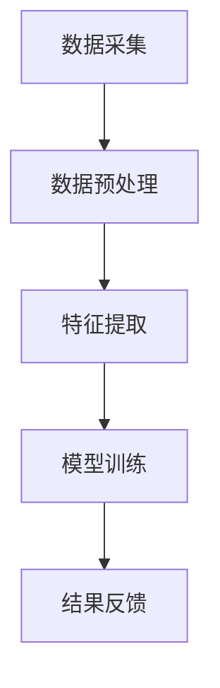
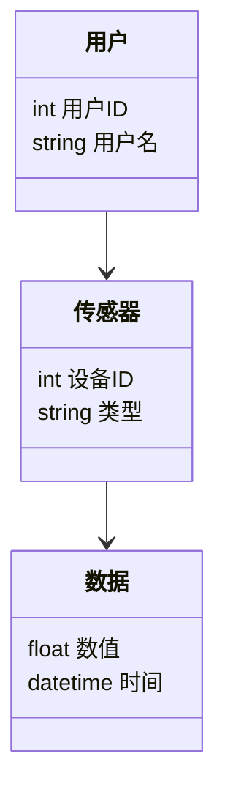
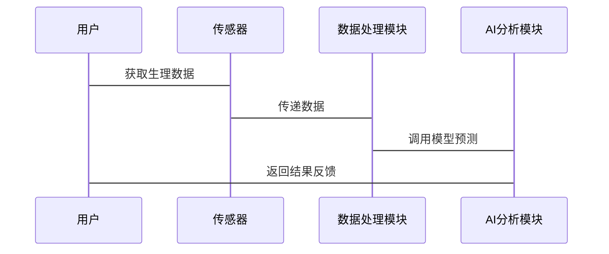

                 


# AI Agent在智能戒指中的生理指标监测

## 关键词
AI Agent, 智能戒指, 生理指标监测, 机器学习, 物联网, 数据处理

## 摘要
本文探讨了AI Agent在智能戒指中的应用，重点分析其在生理指标监测中的原理与实现。通过系统设计、算法优化和项目实战，展示了AI Agent如何提升智能戒指的功能与用户体验。

---

## 第1章 AI Agent与生理指标监测的背景介绍

### 1.1 AI Agent的核心概念

#### 1.1.1 AI Agent的定义
AI Agent（人工智能代理）是指能够感知环境、自主决策并执行任务的智能实体。它可以理解并响应用户需求，优化交互体验。

#### 1.1.2 AI Agent的基本特征
- **自主性**：无需外部干预，独立运作。
- **反应性**：实时感知环境变化，动态调整行为。
- **目标导向**：根据设定目标执行任务。
- **学习能力**：通过数据优化决策模型。

#### 1.1.3 AI Agent的分类
- **简单反射型**：基于规则执行任务。
- **基于模型型**：利用内部模型进行推理和决策。
- **学习增强型**：通过机器学习提升性能。
- **人机协作型**：与人类协同工作，结合人类反馈优化任务。

### 1.2 生理指标监测的背景与意义

#### 1.2.1 生理指标监测的重要性
生理指标如心率、体温、血氧等是反映人体健康状况的重要指标，实时监测有助于及时发现健康问题。

#### 1.2.2 智能戒指在生理监测中的优势
- **便捷性**：佩戴方便，易于日常使用。
- **实时性**：可以持续监测生理数据，及时反馈异常。
- **集成性**：可与其他智能设备联动，提供全面的健康解决方案。

#### 1.2.3 当前技术的局限性与挑战
- **数据准确性**：传感器精度有限，影响监测结果。
- **隐私问题**：生理数据敏感，需确保数据安全。
- **算法优化**：如何提高AI Agent的准确性和响应速度。

### 1.3 AI Agent在智能戒指中的应用前景

#### 1.3.1 AI Agent在智能戒指中的核心作用
AI Agent通过分析生理数据，提供个性化健康建议，优化用户体验。

#### 1.3.2 智能戒指的市场现状与发展趋势
智能戒指市场增长迅速，结合AI技术的产品将成为未来趋势。

#### 1.3.3 智能戒指的用户群体与需求
主要面向健康关注者、运动爱好者和医疗患者，满足个性化健康监测需求。

---

## 第2章 AI Agent在智能戒指中的核心概念与联系

### 2.1 AI Agent的核心原理

#### 2.1.1 AI Agent的基本工作原理
AI Agent通过感知环境、分析数据、制定决策并执行操作。在智能戒指中，它接收传感器数据，分析健康状况，并给出反馈。

#### 2.1.2 AI Agent的数据处理流程
1. **数据采集**：通过传感器获取生理指标数据。
2. **数据预处理**：去除噪声，标准化数据。
3. **特征提取**：提取关键特征用于模型训练。
4. **模型训练**：利用机器学习算法优化模型。
5. **结果反馈**：将分析结果反馈给用户或系统。

### 2.2 概念属性特征对比

| 概念      | 心率监测 | 体温监测 | 血氧监测 |
|-----------|----------|----------|----------|
| 数据来源  | 心率传感器 | 体温传感器 | 血氧传感器 |
| 数据处理  | 频率分析 | 温度计算 | 氧含量分析 |
| 反馈机制  | 心率异常提醒 | 体温过高/过低警告 | 血氧不足提醒 |

### 2.3 ER实体关系图

```mermaid
er
actor(用户) -|> 设备(智能戒指) -|> 传感器(心率、体温、血氧) -|> 数据(心率、体温、血氧)
```

---

## 第3章 AI Agent算法原理与实现

### 3.1 算法原理

#### 3.1.1 数据处理流程



#### 3.1.2 算法选择
- **特征提取**：使用主成分分析（PCA）提取关键特征。
- **模型训练**：采用随机森林或支持向量机（SVM）进行分类。

#### 3.1.3 算法优化
- **数据增强**：通过数据扩展提升模型泛化能力。
- **超参数调优**：使用网格搜索优化模型参数。

### 3.2 Python代码实现

#### 3.2.1 环境安装
```bash
pip install numpy scikit-learn matplotlib
```

#### 3.2.2 核心代码
```python
import numpy as np
from sklearn.ensemble import RandomForestClassifier
from sklearn.model_selection import train_test_split
from sklearn.metrics import accuracy_score

# 示例数据
X = np.random.random((100, 3))  # 特征矩阵
y = np.random.randint(0, 2, 100)  # 标签

# 数据划分
X_train, X_test, y_train, y_test = train_test_split(X, y, test_size=0.2)

# 模型训练
model = RandomForestClassifier()
model.fit(X_train, y_train)

# 模型预测
y_pred = model.predict(X_test)

# 评估准确率
print("Accuracy:", accuracy_score(y_test, y_pred))
```

#### 3.2.3 数学公式
- **主成分分析（PCA）**：
  $$ \text{协方差矩阵} = \frac{1}{n-1}(X^T X) $$
  $$ \text{特征向量} = \text{解特征方程} \cdot \text{协方差矩阵} $$
- **随机森林分类**：
  $$ \text{预测概率} = \frac{\sum_{i=1}^{n} h(i)}{n} $$
  其中，\( h(i) \) 表示第i棵决策树的预测结果。

---

## 第4章 系统分析与架构设计

### 4.1 系统功能设计

#### 4.1.1 功能模块划分
- **数据采集模块**：采集生理指标数据。
- **数据处理模块**：预处理和特征提取。
- **AI分析模块**：模型训练与预测。
- **反馈模块**：用户反馈与系统响应。

#### 4.1.2 领域模型



### 4.2 系统架构设计

#### 4.2.1 分层架构


#### 4.2.2 模块接口设计
- **传感器接口**：提供数据采集API。
- **数据存储接口**：提供数据存取API。
- **AI分析接口**：提供模型调用API。

### 4.3 系统交互流程



---

## 第5章 项目实战：AI Agent在智能戒指中的实现

### 5.1 环境安装

```bash
pip install numpy scikit-learn matplotlib pandas
```

### 5.2 核心代码实现

#### 5.2.1 传感器数据读取

```python
import numpy as np
import pandas as pd

# 读取数据
data = pd.read_csv('physiological_data.csv')
```

#### 5.2.2 数据预处理

```python
from sklearn.preprocessing import StandardScaler

# 标准化处理
scaler = StandardScaler()
X_scaled = scaler.fit_transform(data.drop('label', axis=1))
y = data['label']
```

#### 5.2.3 模型训练

```python
from sklearn.ensemble import RandomForestClassifier
from sklearn.metrics import classification_report

# 模型训练
model = RandomForestClassifier()
model.fit(X_scaled, y)

# 预测与评估
y_pred = model.predict(X_scaled)
print(classification_report(y, y_pred))
```

### 5.3 实际案例分析

#### 5.3.1 数据展示
使用Matplotlib绘制心率和体温变化趋势图。

```python
import matplotlib.pyplot as plt

plt.figure(figsize=(10, 5))
plt.plot(data['time'], data['heart_rate'], label='心率')
plt.plot(data['time'], data['temperature'], label='体温')
plt.xlabel('时间')
plt.ylabel('数值')
plt.legend()
plt.show()
```

#### 5.3.2 模型优化
通过网格搜索优化随机森林模型参数，提升准确率。

```python
from sklearn.model_selection import GridSearchCV

# 参数搜索
param_grid = {'n_estimators': [100, 200], 'max_depth': [None, 10]}
grid_search = GridSearchCV(RandomForestClassifier(), param_grid, cv=5)
grid_search.fit(X_scaled, y)
print("最佳参数：", grid_search.best_params_)
```

---

## 第6章 总结与扩展

### 6.1 最佳实践 tips

- **数据隐私**：确保生理数据加密存储和传输。
- **传感器校准**：定期校准传感器，保证数据准确性。
- **模型优化**：持续更新AI模型，提升预测精度。

### 6.2 小结
本文详细探讨了AI Agent在智能戒指中的应用，通过系统设计和项目实战，展示了如何利用AI技术实现高效的生理指标监测。

### 6.3 注意事项

- 数据采集要确保准确性。
- 模型要定期更新以适应新数据。
- 用户隐私保护至关重要。

### 6.4 拓展阅读

- 《机器学习实战》
- 《深入理解物联网》
- 《人工智能导论》

---

通过以上章节，我们详细分析了AI Agent在智能戒指中的应用，从理论到实践，为开发者提供了全面的技术指导。

