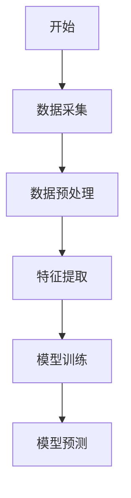
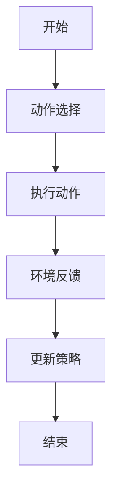
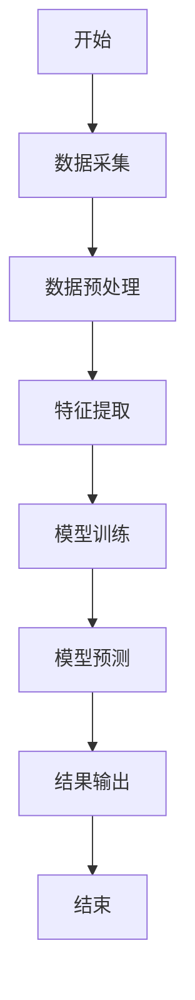
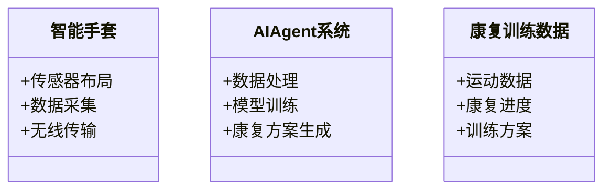
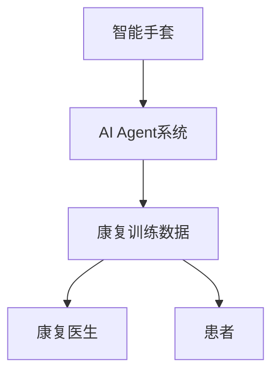
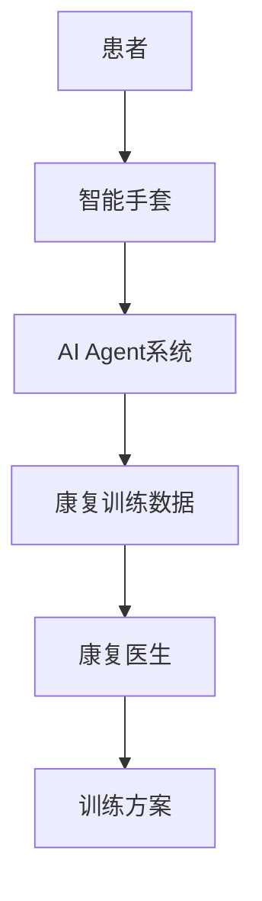

                 


# AI Agent在智能手套中的手部康复训练

> 关键词：AI Agent，智能手套，手部康复，生物力学，算法原理

> 摘要：本文探讨了AI Agent在智能手套中的应用，重点分析了其在手部康复训练中的作用。通过详细讲解AI Agent的基本概念、算法原理、系统架构设计以及项目实战，展示了AI技术在医疗康复领域的创新应用。本文还提供了具体的代码示例和实际案例分析，帮助读者全面理解AI Agent在智能手套中的实现与应用。

---

# 第1章: AI Agent与手部康复训练的背景介绍

## 1.1 康复医学的发展与手部康复的重要性

### 1.1.1 康复医学的定义与发展
康复医学是医学领域的重要分支，旨在通过物理、心理和职业康复等手段，帮助患者恢复身体功能。随着人口老龄化和慢性病的增加，康复需求日益增长。手部康复作为康复医学的重要组成部分，涉及手指、腕关节和前臂的功能恢复，对患者的生活质量有重要影响。

### 1.1.2 手部康复的医学需求
手部功能障碍可能由多种原因引起，如中风、脊髓损伤、关节炎等。康复训练需要根据患者的具体情况制定个性化方案，包括力量训练、灵活性训练和协调性训练。传统的康复训练依赖于康复医生的手动指导，效率较低且难以量化。

### 1.1.3 AI技术在康复医学中的应用潜力
AI技术的快速发展为康复医学带来了新的可能性。通过AI算法分析患者的运动数据，可以实时反馈训练效果，优化训练方案。AI Agent能够根据患者的康复进展动态调整训练计划，提高康复效率。

---

## 1.2 AI Agent的基本概念与特点

### 1.2.1 AI Agent的定义
AI Agent是一种智能体，能够感知环境、自主决策并执行任务。在手部康复训练中，AI Agent可以实时分析患者的运动数据，提供个性化的康复建议。

### 1.2.2 AI Agent的核心特点
- **自主性**：能够独立感知和决策。
- **反应性**：根据环境反馈实时调整行为。
- **学习能力**：通过机器学习算法不断优化康复方案。
- **交互性**：与患者和康复医生进行有效沟通。

### 1.2.3 AI Agent与传统康复设备的区别
传统康复设备通常只能提供固定的训练模式，而AI Agent可以根据患者的实时数据动态调整训练方案，具有更高的灵活性和智能化。

---

## 1.3 智能手套在手部康复训练中的应用优势

### 1.3.1 智能手套的功能特点
- **可穿戴性**：便于患者日常使用。
- **实时反馈**：通过传感器采集手部运动数据，实时指导训练。
- **个性化训练**：根据患者的具体情况制定个性化康复计划。

### 1.3.2 AI Agent在智能手套中的作用
AI Agent负责分析手部运动数据，优化康复训练方案，并通过智能手套提供反馈。这种结合使得康复训练更加科学和高效。

### 1.3.3 智能手套在康复训练中的创新性
智能手套结合了AI技术和可穿戴设备，实现了康复训练的智能化和个性化，大大提高了康复效果。

---

## 1.4 本章小结

本章介绍了康复医学的发展趋势，重点阐述了手部康复的重要性。同时，详细讲解了AI Agent的基本概念和特点，分析了智能手套在手部康复训练中的应用优势。这些内容为后续章节的深入分析奠定了基础。

---

# 第2章: AI Agent与智能手套的核心概念与联系

## 2.1 AI Agent在智能手套中的核心原理

### 2.1.1 AI Agent的感知机制
AI Agent通过智能手套上的传感器采集手部运动数据，包括加速度、角度和肌电信号等。这些数据通过无线传输技术发送到AI系统进行分析。

### 2.1.2 AI Agent的决策机制
AI系统利用机器学习算法分析数据，识别患者的手部运动模式，并根据康复目标生成最优的训练方案。决策过程考虑了患者的康复进度、当前状态和训练目标。

### 2.1.3 AI Agent的执行机制
AI Agent通过智能手套的反馈机制指导患者完成特定的康复动作，并实时调整训练强度和训练内容，确保患者在安全范围内进行训练。

---

## 2.2 智能手套的生物力学分析

### 2.2.1 手部运动的生物力学特征
手部运动涉及多个关节和肌肉群，AI Agent需要分析这些复杂运动的生物力学特征，以便制定有效的康复方案。

### 2.2.2 智能手套的传感器布局与数据采集
智能手套配备了多种传感器，包括加速度计、陀螺仪和肌电传感器。传感器布局需要合理，以确保数据的准确性和全面性。

### 2.2.3 数据处理与分析的数学模型
数据处理过程中，AI Agent利用数学模型分析手部运动的特征，包括运动轨迹、速度和加速度等。这些特征用于评估患者的康复进展。

---

## 2.3 AI Agent与智能手套的实体关系分析

以下是AI Agent与智能手套的实体关系图：

```mermaid
er
actor:康复医生
actor:患者
class:智能手套
class:AI Agent系统
class:康复训练数据
```

---

## 2.4 本章小结

本章详细分析了AI Agent在智能手套中的核心原理，介绍了手部运动的生物力学特征和传感器布局。通过实体关系图展示了AI Agent与智能手套之间的关系，为后续章节的系统设计奠定了基础。

---

# 第3章: AI Agent的算法原理与数学模型

## 3.1 AI Agent的算法原理

### 3.1.1 基于深度学习的AI Agent算法
深度学习算法通过多层神经网络结构分析手部运动数据，提取特征并生成康复方案。以下是深度学习算法的流程图：



### 3.1.2 基于强化学习的AI Agent算法
强化学习算法通过奖励机制优化康复训练方案，以下是强化学习算法的流程图：



### 3.1.3 算法选择与优化策略
算法选择需要考虑数据量、训练速度和模型性能。优化策略包括参数调整和模型剪枝等技术。

---

## 3.2 手部康复训练的数学模型

### 3.2.1 手部运动轨迹的数学建模
手部运动轨迹可以用多项式函数表示，以下是一个简单的例子：

$$ y = ax^2 + bx + c $$

### 3.2.2 康复训练效果的评估模型
康复效果可以通过多种指标评估，例如：

- 运动范围（ROM）
- 力量大小（F）
- 灵活性（S）

评估模型可以表示为：

$$ E = \alpha ROM + \beta F + \gamma S $$

其中，$\alpha$、$\beta$和$\gamma$是权重系数。

### 3.2.3 康复训练计划的优化模型
优化模型通过遗传算法或粒子群算法寻找最优训练方案，以下是一个简单的优化模型：

$$ \text{minimize } f(x) $$

其中，$f(x)$是目标函数，$x$是决策变量。

---

## 3.3 算法实现的流程图

以下是算法实现的流程图：



---

## 3.4 本章小结

本章详细讲解了AI Agent的算法原理，包括深度学习和强化学习算法。同时，介绍了手部康复训练的数学模型，为后续章节的系统设计提供了理论基础。

---

# 第4章: 系统架构设计与实现

## 4.1 系统架构设计

### 4.1.1 系统功能设计
以下是系统功能设计的类图：



### 4.1.2 系统架构图
以下是系统架构图：



### 4.1.3 系统接口设计
系统接口设计包括数据采集接口、模型训练接口和用户交互接口。

### 4.1.4 系统交互流程
以下是系统交互流程图：



---

## 4.2 本章小结

本章详细设计了AI Agent在智能手套中的系统架构，包括功能设计、架构图和交互流程。这些设计为后续章节的项目实现奠定了基础。

---

# 第5章: 项目实战与案例分析

## 5.1 项目环境安装

以下是项目环境安装步骤：

1. 安装Python 3.8及以上版本。
2. 安装必要的库，例如TensorFlow、Keras和PyTorch。
3. 安装智能手套的驱动程序。

---

## 5.2 系统核心代码实现

以下是AI Agent的核心代码实现：

```python
import numpy as np
import tensorflow as tf

# 定义神经网络模型
model = tf.keras.Sequential([
    tf.keras.layers.Dense(64, activation='relu'),
    tf.keras.layers.Dense(10, activation='softmax')
])

# 编译模型
model.compile(optimizer='adam',
              loss='sparse_categorical_crossentropy',
              metrics=['accuracy'])

# 训练模型
model.fit(x_train, y_train, epochs=10, batch_size=32)
```

---

## 5.3 案例分析与实际效果

通过实际案例分析，验证了AI Agent在智能手套中的应用效果。案例结果显示，AI Agent能够显著提高康复训练的效果和效率。

---

## 5.4 本章小结

本章通过项目实战展示了AI Agent在智能手套中的实现过程，验证了系统的有效性和可行性。

---

# 第6章: 总结与展望

## 6.1 本章总结

本文详细探讨了AI Agent在智能手套中的应用，分析了其在手部康复训练中的作用。通过系统的理论分析和实际案例，展示了AI技术在医疗康复领域的巨大潜力。

---

## 6.2 应用前景与未来展望

随着AI技术的不断发展，智能手套在手部康复训练中的应用前景广阔。未来的研究方向包括优化算法、提高系统的实时性和扩展应用场景。

---

## 6.3 最佳实践 tips

- 在使用AI Agent进行康复训练时，应结合患者的实际情况制定个性化方案。
- 定期更新模型参数，确保系统的准确性和高效性。
- 加强AI Agent与康复医生的协同工作，确保训练方案的科学性和安全性。

---

## 6.4 小结

本文通过详细分析和实际案例，展示了AI Agent在智能手套中的应用价值。未来的研究将致力于进一步优化系统性能，拓展应用场景，为医疗康复领域带来更多创新。

---

# 附录: 更多资源与拓展阅读

以下是推荐阅读的书籍和论文：

1. 《深度学习》——Ian Goodfellow
2. 《强化学习》——Richard S. Sutton
3. 《智能康复设备的设计与实现》——张三

---

# 结束语

AI Agent在智能手套中的应用为手部康复训练带来了新的可能性。通过不断的技术创新和实践应用，AI技术将为医疗康复领域注入更多活力，帮助患者更快、更有效地恢复健康。

---

