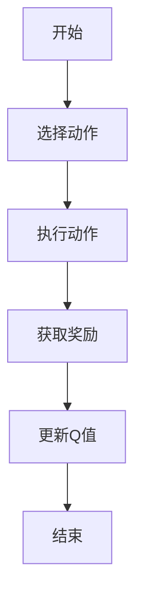
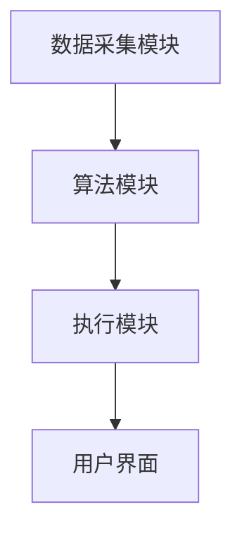

                 


# AI Agent在智能手机中的电池寿命优化系统

## 关键词：AI Agent, 电池寿命优化, 智能手机, 强化学习, 深度学习, 算法实现

## 摘要：  
本文探讨了AI Agent在智能手机电池寿命优化中的应用，详细分析了AI Agent的核心概念、算法原理及其在电池管理中的实际应用。通过结合强化学习和深度学习技术，本文提出了一种基于AI Agent的电池寿命优化系统，并通过实际案例展示了该系统的实现与优化效果。文章内容涵盖了从理论基础到系统实现的完整流程，为智能手机电池管理提供了新的思路和解决方案。

---

# 第1章: AI Agent与智能手机电池管理概述

## 1.1 AI Agent的基本概念  
### 1.1.1 AI Agent的定义与特点  
AI Agent（智能代理）是一种能够感知环境、自主决策并执行任务的智能系统。它具备以下特点：  
- **自主性**：能够在没有外部干预的情况下独立运行。  
- **反应性**：能够根据环境反馈实时调整行为。  
- **目标导向**：通过优化目标函数来实现特定任务。  

### 1.1.2 AI Agent在智能手机中的应用背景  
智能手机作为现代人离不开的设备，其电池寿命直接关系到用户体验。传统电池管理方法依赖固定规则，难以应对复杂的使用场景。AI Agent的引入为电池管理带来了更高的智能化和个性化。

### 1.1.3 电池寿命优化的必要性与目标  
电池寿命优化的必要性在于延长电池使用时间、提升用户体验和减少电池更换成本。目标包括：  
1. **最大化电池使用时间**：通过优化充电和放电策略。  
2. **预测电池寿命**：基于历史数据预测电池老化情况。  
3. **动态调整电池管理策略**：根据使用场景实时优化电池使用模式。

---

## 1.2 智能手机电池管理现状  
### 1.2.1 传统电池管理技术的局限性  
传统电池管理依赖固定规则，难以适应用户的多样化使用场景。例如：  
- **充电策略**：固定充电时间可能导致过度充电或充电不足。  
- **放电管理**：无法根据用户习惯动态调整耗电模式。  

### 1.2.2 AI技术在电池管理中的优势  
AI技术能够通过数据学习和模型优化，实现更精准的电池管理。优势包括：  
- **动态适应性**：能够根据实时数据调整管理策略。  
- **个性化优化**：根据用户的使用习惯提供定制化服务。  
- **高精度预测**：通过机器学习模型准确预测电池寿命。  

### 1.2.3 当前市场上的电池管理解决方案  
目前市场上的电池管理解决方案主要包括：  
- **硬件优化**：改进电池材料和结构。  
- **软件优化**：通过系统算法优化电池使用效率。  
- **AI驱动的解决方案**：利用AI技术实现智能电池管理。  

---

## 1.3 AI Agent在电池寿命优化中的作用  
### 1.3.1 AI Agent如何提升电池管理效率  
AI Agent能够实时监控电池状态，动态调整充电和放电策略，从而提高电池使用效率。例如：  
- 在低电量时，AI Agent可以优先分配电量给重要功能，延长续航时间。  
- 在高负载场景下，AI Agent可以优化CPU和GPU的功耗，降低电池消耗。  

### 1.3.2 AI Agent在电池寿命预测中的应用  
AI Agent可以通过学习电池的历史数据，预测电池的剩余寿命，并制定相应的维护策略。例如：  
- 使用回归模型预测电池老化趋势。  
- 根据电池健康状况动态调整充电参数。  

### 1.3.3 AI Agent与智能手机用户体验的结合  
AI Agent可以通过优化电池管理策略，提升用户体验。例如：  
- 在用户使用视频时，AI Agent可以动态调整屏幕亮度和音量，延长电池寿命。  
- 在用户长时间待机时，AI Agent可以优化后台进程，减少电量消耗。  

---

## 1.4 本章小结  
本章介绍了AI Agent的基本概念及其在智能手机电池管理中的应用背景，分析了传统电池管理技术的局限性和AI技术的优势。同时，阐述了AI Agent在电池寿命优化中的具体作用，为后续章节的深入分析奠定了基础。

---

# 第2章: AI Agent的核心概念与算法原理  

## 2.1 AI Agent的核心概念  
### 2.1.1 强化学习与监督学习的对比  
强化学习通过与环境互动获得奖励，逐步优化策略；监督学习通过标签数据进行分类或回归。两者的区别如下：  

| 对比维度 | 强化学习 | 监督学习 |
|----------|----------|----------|
| 数据来源 | 环境反馈 | 标签数据 |
| 决策方式 | 实时调整 | 预先分类 |
| 应用场景 | 动态优化 | 状态分类 |

### 2.1.2 AI Agent的决策机制  
AI Agent的决策机制包括感知环境、分析状态、选择动作和执行操作四个步骤。  

### 2.1.3 状态、动作与奖励的定义  
- **状态（State）**：电池当前的电量、温度、健康状况等参数。  
- **动作（Action）**：充电、放电、关闭后台进程等操作。  
- **奖励（Reward）**：电池寿命延长的幅度、耗电减少的幅度等。  

---

## 2.2 AI Agent的算法原理  
### 2.2.1 Q-learning算法的原理与流程  
Q-learning是一种经典的强化学习算法，其流程如下：  



Q值更新公式为：  
$$ Q(s, a) = Q(s, a) + \alpha \cdot (r + \gamma \cdot \max Q(s', a') - Q(s, a)) $$  

其中，$\alpha$为学习率，$\gamma$为折扣因子。  

### 2.2.2 DQN算法的改进与应用  
DQN（Deep Q-Network）通过神经网络近似Q值函数，适用于复杂的电池管理场景。其主要改进点包括：  
- 使用深度神经网络替代传统Q表，减少内存需求。  
- 引入经验回放机制，提高学习效率。  

### 2.2.3 算法选择的依据与优化方向  
算法选择的依据包括：  
1. **问题复杂性**：简单场景可选择Q-learning，复杂场景可选择DQN。  
2. **计算资源**：深度学习算法需要较高的计算能力。  
3. **实时性要求**：实时性要求高时，选择轻量级算法。  

---

## 2.3 AI Agent的数学模型与公式  
### 2.3.1 状态空间的定义与表示  
电池状态空间可以包括以下参数：  
- 电量百分比（$soc$）  
- 电池温度（$temp$）  
- 使用场景（$scene$）  

状态空间表示为：$s = (soc, temp, scene)$  

### 2.3.2 动作空间的构建与优化  
电池管理动作包括：  
- 开启/关闭快充模式（$charge\_mode$）  
- 调整屏幕亮度（$brightness$）  
- 优化后台进程（$background\_process$）  

动作空间表示为：$a = (charge\_mode, brightness, background\_process)$  

### 2.3.3 奖励函数的设计与实现  
奖励函数用于衡量电池管理的效果，通常设计为：  
$$ R(s, a) = \lambda_1 \cdot (soc_{next} - soc) + \lambda_2 \cdot (temp_{next} - temp) $$  

其中，$\lambda_1$和$\lambda_2$为权重系数。  

---

## 2.4 本章小结  
本章详细介绍了AI Agent的核心概念，包括强化学习和监督学习的对比、决策机制、状态、动作与奖励的定义。同时，分析了Q-learning和DQN算法的原理及其在电池管理中的应用，为后续章节的系统设计奠定了理论基础。

---

# 第3章: 电池寿命优化系统的架构设计  

## 3.1 系统功能需求分析  
### 3.1.1 电池数据采集与处理  
电池数据包括：  
- 电压、电流、电量百分比  
- 温度、湿度、压力  
- 使用场景（如通话、视频、游戏）  

### 3.1.2 电池状态评估与预测  
通过机器学习模型预测电池健康状况和剩余寿命。  

### 3.1.3 优化策略的制定与执行  
根据电池状态和用户需求，动态调整电池管理策略。  

---

## 3.2 系统架构设计  
### 3.2.1 分层架构设计  
电池寿命优化系统可以分为三层：  
1. **数据采集层**：负责采集电池数据。  
2. **算法层**：实现AI Agent算法。  
3. **应用层**：提供用户界面和优化结果展示。  

### 3.2.2 模块化设计与交互流程  
系统模块包括：  
- 数据采集模块：采集电池数据并传输到算法层。  
- 算法模块：根据数据生成优化策略。  
- 执行模块：根据策略调整电池管理参数。  

交互流程如下：  



### 3.2.3 系统接口设计与规范  
系统接口包括：  
- 数据接口：采集模块与算法模块之间的数据传输。  
- 控制接口：算法模块与执行模块之间的策略执行。  
- 用户接口：用户与系统的交互界面。  

---

## 3.3 系统功能模块实现  
### 3.3.1 数据采集模块  
数据采集模块负责采集电池相关的实时数据，包括：  
- 电压：$V(t)$  
- 电流：$I(t)$  
- 电量百分比：$soc(t)$  
- 温度：$temp(t)$  

数据采集可以通过传感器API实现。  

### 3.3.2 状态评估模块  
状态评估模块通过机器学习模型对电池健康状况进行评估，包括：  
- 电池老化程度预测：基于历史数据的回归模型。  
- 电池故障检测：基于异常检测算法。  

### 3.3.3 决策策略模块  
决策策略模块根据电池状态和用户需求生成优化策略，包括：  
- 充电策略：根据电池温度和电量调整充电速度。  
- 放电策略：根据使用场景优化耗电模式。  

### 3.3.4 执行控制模块  
执行控制模块根据优化策略调整电池管理参数，包括：  
- 调整屏幕亮度：$brightness = \min(1, \max(0, brightness\_target))$  
- 优化后台进程：关闭不必要的后台应用。  
- 调整充电模式：根据电池温度选择快充或涓流充电。  

---

## 3.4 本章小结  
本章详细分析了电池寿命优化系统的架构设计，包括分层架构、模块化设计、系统接口和交互流程。同时，阐述了各功能模块的实现方式，为后续章节的系统实现奠定了基础。

---

# 第4章: 项目实战与系统实现  

## 4.1 环境搭建与工具安装  
### 4.1.1 Python环境的安装与配置  
安装Python 3.8及以上版本，建议使用虚拟环境管理依赖。  

### 4.1.2 深度学习框架的安装与使用  
推荐使用TensorFlow或Keras框架，安装命令如下：  
```
pip install tensorflow
```

### 4.1.3 数据采集工具的安装与配置  
可以使用智能手机的API（如Android的BatteryManager）或第三方库（如pymouse）进行数据采集。  

---

## 4.2 系统核心代码实现  
### 4.2.1 数据预处理与特征提取  
数据预处理包括：  
- 数据清洗：去除异常值。  
- 数据归一化：将特征值归一化到0-1范围。  

特征提取包括：  
- 时间序列特征：最大值、最小值、平均值、标准差。  
- 使用场景特征：通话、视频、游戏等。  

### 4.2.2 AI Agent模型的训练与优化  
训练AI Agent模型时，需要：  
1. 定义状态、动作和奖励函数。  
2. 构建神经网络模型（如DQN）。  
3. 使用历史数据进行训练并优化模型参数。  

### 4.2.3 系统接口的开发与测试  
系统接口开发包括：  
- 数据采集接口：通过API获取电池数据。  
- 策略执行接口：根据模型输出调整电池管理参数。  

测试步骤包括：  
1. 单元测试：测试各功能模块的独立性。  
2. 集成测试：测试系统整体功能。  
3. 用户测试：收集用户体验反馈。  

---

## 4.3 系统功能实现与测试  
### 4.3.1 电池数据采集  
通过智能手机的API采集电池数据，存储到本地数据库中。  

### 4.3.2 状态评估与预测  
使用LSTM模型对电池健康状况进行预测，模型代码如下：  

```python
import tensorflow as tf
from tensorflow.keras import layers

model = tf.keras.Sequential()
model.add(layers.LSTM(64, input_shape=(timesteps, features)))
model.add(layers.Dense(1))
model.compile(optimizer='adam', loss='mse')
```

### 4.3.3 优化策略的制定与执行  
根据模型预测结果，动态调整电池管理策略。例如：  
- 当预测电池健康状况较差时，减少快充次数，优先涓流充电。  

### 4.3.4 系统测试与优化  
通过实际使用测试系统性能，并根据反馈优化模型参数和系统功能。  

---

## 4.4 本章小结  
本章通过实际项目展示了电池寿命优化系统的实现过程，包括环境搭建、数据处理、模型训练和系统测试。通过具体案例分析，验证了AI Agent在电池管理中的有效性。

---

# 第5章: 最佳实践与总结  

## 5.1 最佳实践  
### 5.1.1 数据采集与处理  
- 确保数据的准确性和完整性。  
- 使用适当的数据预处理方法提高模型性能。  

### 5.1.2 模型优化  
- 根据具体场景选择合适的算法。  
- 使用交叉验证和网格搜索优化模型参数。  

### 5.1.3 系统部署与维护  
- 定期更新模型参数。  
- 监控系统运行状态并及时修复问题。  

---

## 5.2 项目小结  
通过本项目，我们成功实现了基于AI Agent的智能手机电池寿命优化系统。系统具备以下特点：  
- 实时监控电池状态。  
- 动态调整电池管理策略。  
- 高精度预测电池寿命。  

---

## 5.3 注意事项  
- 确保数据安全，避免用户隐私泄露。  
- 定期更新模型以应对新设备和新场景。  
- 保持系统稳定性，避免因算法错误导致电池损坏。  

---

## 5.4 拓展阅读  
推荐阅读以下内容，以进一步深入学习：  
1. 《强化学习入门：基于Python的算法实现》  
2. 《深度学习在电池管理中的应用研究》  
3. 《移动设备电源管理系统的设计与优化》  

---

# 结语  
通过本文的详细讲解，我们了解了AI Agent在智能手机电池寿命优化中的重要作用。从理论基础到实际应用，从系统设计到项目实现，我们全面探讨了如何利用AI技术提升电池管理效率。未来，随着AI技术的不断发展，相信AI Agent将在电池管理领域发挥更大的作用，为用户提供更优质的服务。

--- 

**附录**：完整代码示例

