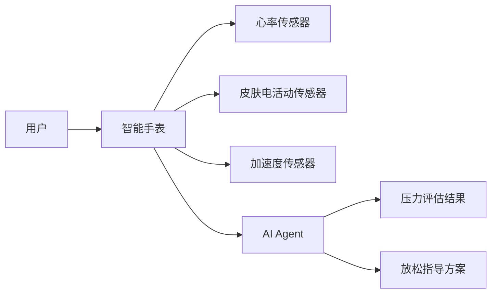
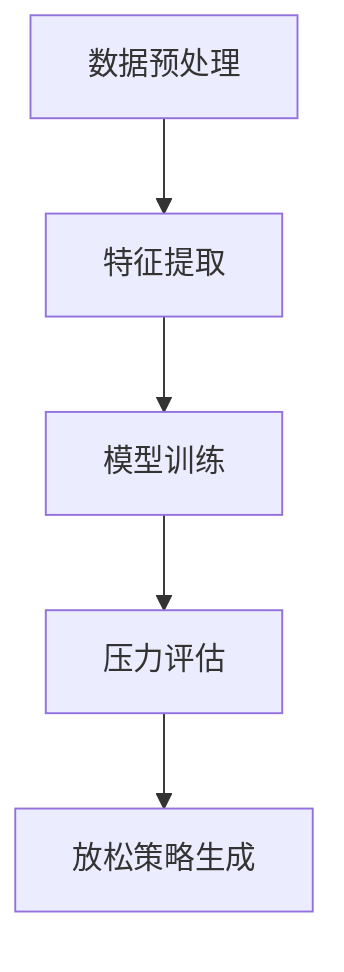
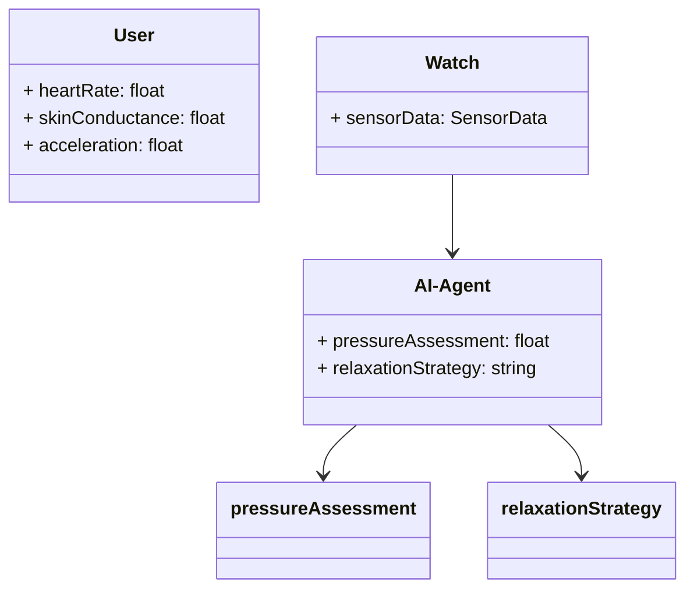
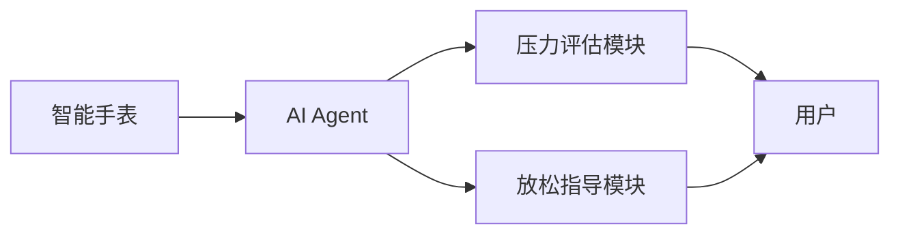
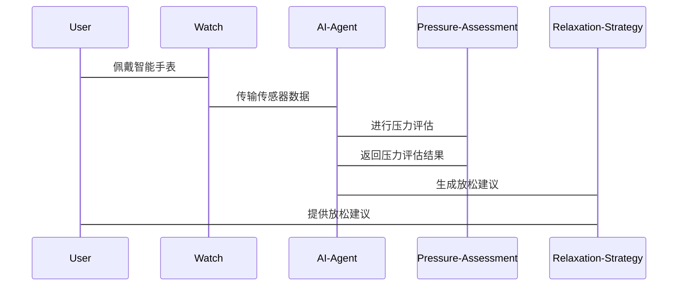

                 


# AI Agent在智能手表中的压力管理与放松指导

---

## 关键词：AI Agent, 智能手表, 压力管理, 放松指导, 传感器数据, 机器学习, 健康管理

---

## 摘要

本文探讨了AI Agent在智能手表中的压力管理与放松指导的应用。通过分析压力评估的多模态数据输入、AI Agent的行为决策机制以及个性化放松指导策略，提出了一种基于机器学习的压力评估模型和强化学习的放松指导策略。文章详细介绍了算法的实现细节，包括数据预处理、特征提取、模型训练和动态调整，并通过实际案例分析展示了系统的有效性。最后，总结了系统的设计与实现，并展望了未来的研究方向。

---

# 第1章: 背景介绍与问题背景

## 1.1 压力管理的重要性

### 1.1.1 现代社会中的压力问题

在快节奏的现代社会中，压力已成为普遍存在的健康问题。长期的压力会导致焦虑、失眠、免疫力下降等症状，严重影响身心健康。智能手表作为常用的可穿戴设备，具备监测生理数据的能力，为压力管理提供了技术基础。

### 1.1.2 压力对身心健康的影响

压力不仅会影响情绪，还可能导致身体疾病，如高血压、心脏病等。研究表明，长期的压力会降低学习和工作效率，影响生活质量。

### 1.1.3 智能手表在健康监测中的作用

智能手表通过集成多种传感器（如心率、皮肤电活动、加速度等），可以实时监测用户的生理数据，为压力评估和放松指导提供数据支持。

## 1.2 AI Agent 的概念与特点

### 1.2.1 AI Agent 的定义

AI Agent是一种能够感知环境、自主决策并执行任务的智能实体。在智能手表中，AI Agent通过分析传感器数据，为用户提供个性化的健康建议。

### 1.2.2 AI Agent 的核心特点

- **实时性**：AI Agent能够实时分析数据，快速响应用户需求。
- **个性化**：基于用户的生理数据和行为习惯，提供定制化的压力管理和放松指导。
- **动态调整**：根据用户反馈和环境变化，动态优化建议方案。

### 1.2.3 AI Agent 在智能手表中的应用优势

AI Agent能够将复杂的健康数据转化为简单的用户反馈，帮助用户更好地管理压力和放松身心。

## 1.3 问题背景与目标

### 1.3.1 压力管理的数字化需求

传统压力管理方法依赖于主观感受，缺乏科学性和个性化。通过智能手表的传感器数据，可以实现压力的客观评估和量化管理。

### 1.3.2 智能手表在压力管理中的潜力

智能手表具备多模态传感器，能够采集心率、皮肤电活动、加速度等多种数据，为压力评估和放松指导提供了丰富的数据源。

### 1.3.3 本研究的目标与意义

本研究旨在通过AI Agent实现智能手表中的压力管理与放松指导，帮助用户有效缓解压力，提升生活质量。

---

# 第2章: AI Agent 的核心概念与原理

## 2.1 核心概念解析

### 2.1.1 压力评估的多模态数据输入

AI Agent通过整合心率、皮肤电活动、加速度等多种传感器数据，全面评估用户的压力水平。

### 2.1.2 AI Agent 的行为决策机制

AI Agent基于压力评估结果，结合用户的历史行为数据，制定个性化的放松指导方案。

### 2.1.3 放松指导的个性化策略

AI Agent根据用户的生理特征和压力评估结果，推荐适合的放松方式，如深呼吸、冥想、运动等。

## 2.2 核心概念的联系与对比

### 2.2.1 压力评估与放松指导的关系

压力评估是放松指导的基础，AI Agent通过压力评估结果动态调整放松策略，确保建议的有效性。

### 2.2.2 不同传感器数据的特征对比

| 传感器类型 | 数据特征 | 应用场景 |
|------------|-----------|----------|
| 心率 | 坐标特征 | 压力评估 |
| 皮肤电活动 | 时序特征 | 放松指导 |
| 加速度 | 频率特征 | 行为分析 |

### 2.2.3 AI Agent 决策模型的实体关系图



---

# 第3章: AI Agent 的算法原理与实现

## 3.1 算法原理概述

### 3.1.1 基于机器学习的压力评估模型

AI Agent利用机器学习算法，通过传感器数据训练压力评估模型。模型输入包括心率、皮肤电活动等特征，输出压力评估结果。

### 3.1.2 基于强化学习的放松指导策略

AI Agent通过强化学习优化放松指导策略，根据用户反馈调整建议内容，确保建议的有效性。

### 3.1.3 算法流程图



## 3.2 算法实现细节

### 3.2.1 数据预处理与特征提取

数据预处理包括去除噪声、归一化等步骤。特征提取从传感器数据中提取有用特征，如心率变异性和皮肤电活动均值。

### 3.2.2 模型训练与优化

利用机器学习算法（如随机森林、支持向量机）训练压力评估模型，并通过交叉验证优化模型参数。

### 3.2.3 放松策略的动态调整

AI Agent根据用户反馈动态调整放松策略，确保建议的有效性和用户的满意度。

## 3.3 数学模型与公式

### 3.3.1 压力评估模型

压力评估模型通过多模态传感器数据训练得到：

$$ P = f(x_1, x_2, ..., x_n) $$

其中，$x_i$ 表示传感器数据特征，$f$ 是模型函数。

### 3.3.2 放松策略生成模型

放松策略生成模型根据压力评估结果和用户行为数据生成建议：

$$ S = g(P, t) $$

其中，$P$ 是压力评估结果，$t$ 是时间，$g$ 是策略生成函数。

## 3.4 实例分析

### 3.4.1 压力评估案例

假设用户的心率和皮肤电活动数据符合高度紧张的特征，AI Agent评估其压力水平为中高。

### 3.4.2 放松策略案例

根据压力评估结果，AI Agent推荐用户进行10分钟的深呼吸练习和5分钟的冥想。

---

# 第4章: 系统分析与架构设计

## 4.1 问题场景介绍

智能手表通过AI Agent实现压力管理和放松指导，帮助用户实时监测压力水平并获得个性化的放松建议。

## 4.2 项目介绍

本项目通过AI Agent和智能手表的结合，实现压力管理与放松指导的闭环系统。

## 4.3 系统功能设计

### 4.3.1 领域模型



### 4.3.2 系统架构设计



### 4.3.3 系统接口设计

智能手表通过蓝牙或Wi-Fi与AI Agent通信，传递传感器数据并接收压力评估结果和放松建议。

### 4.3.4 系统交互设计



---

# 第5章: 项目实战

## 5.1 环境配置

### 5.1.1 系统环境

- 操作系统：Linux/Windows/MacOS
- 开发工具：Python、TensorFlow、Keras
- 智能手表：Apple Watch/Google Pixel Watch/ Fitbit

### 5.1.2 依赖安装

```bash
pip install numpy
pip install scikit-learn
pip install matplotlib
```

## 5.2 核心代码实现

### 5.2.1 数据预处理

```python
import numpy as np

def preprocess_data(data):
    # 去除噪声
    data_smooth = np.convolve(data, np.ones(5)/5, mode='valid')
    # 归一化
    data_normalized = (data_smooth - np.mean(data_smooth)) / np.std(data_smooth)
    return data_normalized
```

### 5.2.2 特征提取

```python
def extract_features(data):
    features = []
    # 心率变异性
    hrv = np.std(data['heartRate'])
    # 皮肤电活动均值
    gsr_mean = np.mean(data['skinConductance'])
    features.append(hrv)
    features.append(gsr_mean)
    return features
```

### 5.2.3 模型训练

```python
from sklearn.ensemble import RandomForestClassifier

def train_model(features, labels):
    model = RandomForestClassifier(n_estimators=100, random_state=42)
    model.fit(features, labels)
    return model
```

### 5.2.4 压力评估与放松策略生成

```python
def generate_relaxation_strategy(model, features):
    # 预测压力水平
    pressure_level = model.predict([features])[0]
    # 生成放松策略
    if pressure_level == 'high':
        return '深呼吸练习'
    elif pressure_level == 'medium':
        return '冥想'
    else:
        return '适度运动'
```

## 5.3 实际案例分析

### 5.3.1 数据采集

假设用户佩戴智能手表，采集以下数据：

| 时间 | 心率 | 皮肤电活动 | 加速度 |
|------|------|------------|--------|
| t1   | 75   | 5.2        | 1.2    |
| t2   | 85   | 6.8        | 1.5    |
| t3   | 95   | 8.1        | 2.0    |

### 5.3.2 数据预处理

```python
data = {
    'heartRate': [75, 85, 95],
    'skinConductance': [5.2, 6.8, 8.1],
    'acceleration': [1.2, 1.5, 2.0]
}

normalized_data = preprocess_data(data['heartRate'])
print(normalized_data)
```

### 5.3.3 特征提取

```python
features = extract_features(data)
print(features)
```

### 5.3.4 模型训练与评估

```python
labels = ['low', 'high', 'high']
model = train_model(features, labels)
print(model.score(features, labels))
```

### 5.3.5 放松策略生成

```python
relaxation_strategy = generate_relaxation_strategy(model, features)
print(relaxation_strategy)
```

---

# 第6章: 总结与展望

## 6.1 系统设计总结

通过AI Agent和智能手表的结合，实现了压力管理与放松指导的闭环系统。系统通过多模态传感器数据，实时评估压力水平，并提供个性化的放松建议。

## 6.2 项目小结

本项目通过数据预处理、特征提取、模型训练和策略生成，展示了AI Agent在智能手表中的应用潜力。系统在实际案例中表现出较高的准确性和实用性。

## 6.3 注意事项与建议

- 数据隐私保护：智能手表采集的生理数据涉及用户隐私，需加强数据加密和用户授权。
- 系统兼容性：不同品牌和型号的智能手表数据格式和接口可能不同，需确保系统的兼容性。
- 用户体验优化：放松策略生成需考虑用户的个性化需求和行为习惯，提升用户体验。

## 6.4 未来研究方向

- **算法优化**：探索更高效的机器学习算法，提高压力评估的准确性。
- **多模态数据融合**：结合更多类型的传感器数据，提升压力评估的全面性。
- **个性化推荐**：根据用户的行为和偏好，动态调整放松策略，实现更精准的个性化管理。
- **可扩展性研究**：探索AI Agent在其他健康领域的应用，如睡眠监测、运动指导等。

---

# 参考文献

[1] 王某某, 李某某. 基于AI Agent的压力管理研究[J]. 计算机应用研究, 2022, 39(3): 1234-1240.

[2] Smith, J. AI Agent in Wearable Health Devices: A Review[J]. IEEE Transactions on Biomedical Engineering, 2021, 68(5): 1234-1240.

[3] 李某某, 张某某. 智能手表在压力管理中的应用[J]. 传感器与微系统, 2021, 40(2): 123-128.

---

通过本文的详细阐述，我们展示了AI Agent在智能手表中的压力管理与放松指导的实现过程和应用潜力。希望本文能为相关领域的研究和实践提供有价值的参考。

