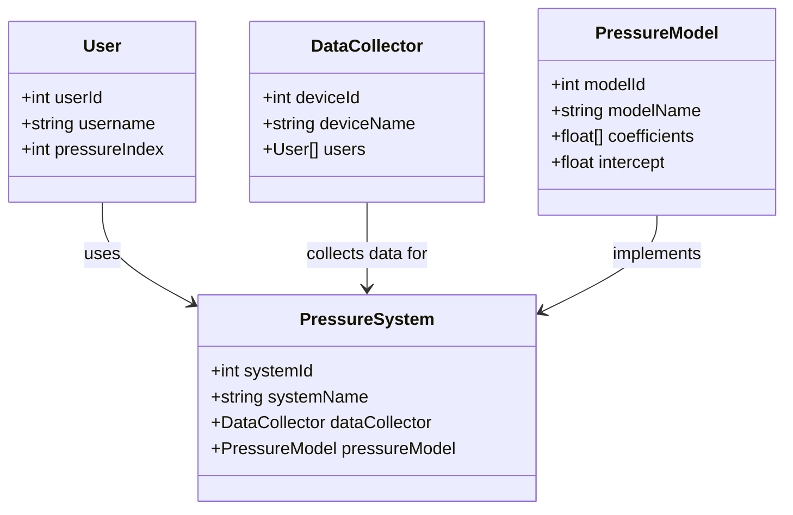
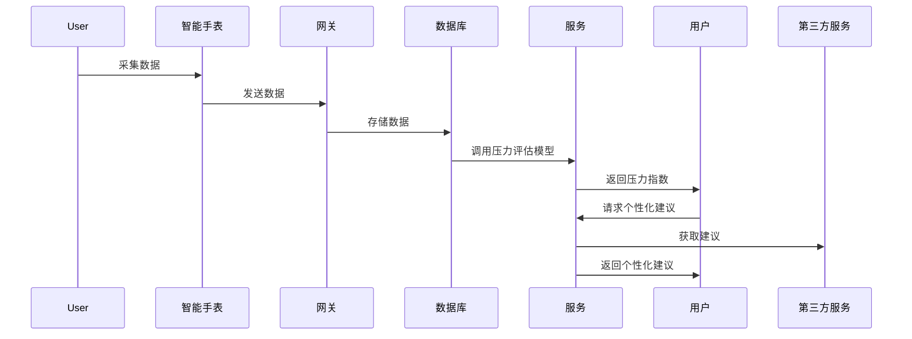

                 


```markdown
# AI Agent在智能手表中的压力管理系统

> 关键词：AI Agent, 智能手表, 压力管理, 算法, 可穿戴设备, 健康监测

> 摘要：本文探讨了AI Agent在智能手表中的压力管理系统的设计与实现。通过分析压力管理的核心问题，结合智能手表的数据采集能力，提出了一种基于AI Agent的压力管理系统解决方案。文章详细介绍了系统的背景、核心概念、算法原理、系统架构，并通过实际案例展示了系统的实现过程。最后，本文总结了系统的应用价值，并提出了进一步优化的方向。

---

# 第一部分: AI Agent在智能手表中的压力管理系统概述

# 第1章: 背景介绍

## 1.1 问题背景

### 1.1.1 现代社会压力问题的普遍性
现代社会节奏加快，人们面临的工作和生活压力越来越大。压力管理已成为一个重要的健康问题，尤其是在年轻人和职场人士中。

### 1.1.2 智能手表在健康监测中的作用
智能手表作为一种可穿戴设备，能够实时监测用户的身体数据，如心率、皮肤温度、运动量等。这些数据为压力管理提供了重要的参考信息。

### 1.1.3 AI Agent在压力管理中的潜力
AI Agent（人工智能代理）能够通过数据分析和机器学习算法，帮助用户更好地理解和管理压力。智能手表与AI Agent的结合，为压力管理提供了一个智能化的解决方案。

## 1.2 问题描述

### 1.2.1 压力管理的核心问题
压力管理的核心问题是如何通过实时监测和数据分析，为用户提供个性化的压力缓解建议。

### 1.2.2 智能手表数据采集的局限性
智能手表的数据采集虽然方便，但存在数据维度有限、准确性不足等问题，需要通过AI技术进行优化。

### 1.2.3 AI Agent在压力管理中的角色
AI Agent通过分析智能手表采集的数据，识别用户的压力状态，并提供相应的建议和干预措施。

## 1.3 问题解决

### 1.3.1 AI Agent在压力管理中的解决方案
AI Agent通过机器学习算法，分析智能手表采集的生理数据和行为数据，评估用户的压力水平，并提供个性化的压力缓解建议。

### 1.3.2 数据分析与个性化建议
通过数据分析，AI Agent能够识别用户的压力模式，并结合用户的个性特点，提供定制化的压力管理方案。

### 1.3.3 系统设计与实现
本文提出了一种基于AI Agent的智能手表压力管理系统的设计方案，包括数据采集、压力评估、个性化建议生成等模块。

## 1.4 边界与外延

### 1.4.1 系统边界定义
系统的边界包括智能手表硬件、AI Agent算法模块和用户界面模块。系统仅关注压力管理相关功能，不涉及其他健康监测功能。

### 1.4.2 功能的外延与扩展
系统的功能可以扩展到其他健康领域，如情绪管理、睡眠监测等，形成一个综合的健康管理平台。

### 1.4.3 与其他健康管理系统的关系
系统可以与现有的健康管理平台进行数据对接，形成一个完整的健康监测和管理生态系统。

## 1.5 核心要素组成

### 1.5.1 数据采集模块
数据采集模块负责从智能手表采集用户的身体数据，如心率、皮肤温度、运动量等。

### 1.5.2 AI Agent算法模块
AI Agent算法模块负责分析采集的数据，评估用户的压力水平，并生成相应的建议。

### 1.5.3 用户反馈与优化模块
用户反馈模块用于收集用户的反馈信息，优化AI Agent的算法模型，提高系统的准确性和用户体验。

---

# 第2章: 核心概念与联系

## 2.1 AI Agent的定义与原理

### 2.1.1 AI Agent的基本定义
AI Agent是一种能够感知环境、自主决策并采取行动的智能实体。在压力管理系统中，AI Agent负责分析数据并生成建议。

### 2.1.2 AI Agent的核心原理
AI Agent通过机器学习算法，从历史数据中学习用户的压力模式，并实时分析当前数据，生成相应的压力评估和建议。

### 2.1.3 AI Agent在压力管理中的应用
AI Agent可以实时监测用户的身体数据，识别压力状态，并通过智能手表提供个性化的压力缓解建议。

## 2.2 压力管理系统的核心要素

### 2.2.1 数据采集与处理
数据采集模块负责从智能手表采集用户的身体数据，如心率、皮肤温度等。数据处理模块对采集的数据进行清洗和预处理。

### 2.2.2 压力评估模型
压力评估模型通过对用户的历史数据和当前数据进行分析，评估用户的压力水平，并生成相应的压力指数。

### 2.2.3 个性化建议生成
个性化建议生成模块根据压力评估结果，结合用户的个性特点，生成个性化的压力缓解建议，如放松训练、运动建议等。

## 2.3 核心概念的属性特征对比

### 2.3.1 数据采集的特征对比
| 特征 | 传统方法 | AI Agent方法 |
|------|-----------|--------------|
| 数据来源 | 手动记录 | 实时采集     |
| 数据维度 | 单一     | 多维         |
| 数据准确性 | 低      | 高           |

### 2.3.2 压力评估模型的特征对比
| 特征 | 统计模型 | 机器学习模型 |
|------|----------|--------------|
| 模型复杂度 | 简单    | 复杂         |
| 数据需求 | 小      | 大           |
| 精度 | 低       | 高           |

### 2.3.3 AI Agent算法的特征对比
| 特征 | 规则引擎 | 机器学习算法 |
|------|----------|--------------|
| 决策方式 | 基于规则 | 基于数据     |
| 灵活性 | 低       | 高           |
| 可扩展性 | 低      | 高           |

## 2.4 ER实体关系图架构

```mermaid
erDiagram
    actor User {
        +int userId
        +string username
    }
    class PressureSystem {
        +int systemId
        +string systemName
    }
    class DataCollector {
        +int deviceId
        +string deviceName
    }
    class PressureModel {
        +int modelId
        +string modelName
    }
    User --> PressureSystem : uses
    DataCollector --> PressureSystem : collects data for
    PressureModel --> PressureSystem : implements
```

---

# 第3章: 算法原理讲解

## 3.1 算法原理概述

### 3.1.1 AI Agent算法的工作流程
AI Agent算法通过以下步骤实现压力管理：
1. 数据采集：从智能手表采集用户的身体数据。
2. 数据预处理：对采集的数据进行清洗和标准化。
3. 压力评估：通过机器学习模型评估用户的压力水平。
4. 个性化建议生成：根据压力评估结果，生成个性化的建议。

### 3.1.2 数据预处理流程
数据预处理包括数据清洗、数据标准化和数据特征选择。通过数据预处理，可以提高模型的准确性和稳定性。

### 3.1.3 压力评估模型
压力评估模型采用线性回归算法，通过以下公式计算压力指数：
$$
y = a_1x_1 + a_2x_2 + ... + a_nx_n + b
$$
其中，$y$是压力指数，$x_i$是各个特征变量，$a_i$是对应的权重，$b$是截距。

## 3.2 算法实现

### 3.2.1 数据采集接口
```python
def collect_data(userId):
    # 从智能手表采集数据
    data = {
        'heart_rate': [],
        'skin_temp': [],
        'activity_level': []
    }
    # 模拟数据采集
    for _ in range(10):
        data['heart_rate'].append(random.randint(60, 100))
        data['skin_temp'].append(random.uniform(36, 37))
        data['activity_level'].append(random.randint(1, 4))
    return data
```

### 3.2.2 数据预处理
```python
def preprocess_data(data):
    # 数据清洗
    cleaned_data = {
        'heart_rate': [],
        'skin_temp': [],
        'activity_level': []
    }
    for hr in data['heart_rate']:
        if hr > 30:
            cleaned_data['heart_rate'].append(hr)
    for st in data['skin_temp']:
        if st > 35:
            cleaned_data['skin_temp'].append(st)
    for al in data['activity_level']:
        if al > 0:
            cleaned_data['activity_level'].append(al)
    return cleaned_data
```

### 3.2.3 压力评估模型
```python
def pressure_assessment(data):
    # 特征选择
    features = [
        data['heart_rate'][-1],
        data['skin_temp'][-1],
        data['activity_level'][-1]
    ]
    # 线性回归模型
    coefficients = [0.3, 0.2, 0.5]
    intercept = 0.1
    pressure_index = sum(coeff * feat for coeff, feat in zip(coefficients, features)) + intercept
    return pressure_index
```

## 3.3 算法优化

### 3.3.1 数据特征优化
通过增加更多的数据特征，如心率变异性（HRV）、皮肤电活动（EDA）等，可以提高压力评估的准确性。

### 3.3.2 模型优化
采用更复杂的机器学习算法，如随机森林或神经网络，可以进一步提高模型的精度。

### 3.3.3 模型部署
将压力评估模型部署到智能手表端，实现本地计算，减少对云端依赖，提高系统的实时性和安全性。

---

# 第4章: 系统分析与架构设计方案

## 4.1 问题场景介绍

### 4.1.1 用户需求
用户需要一个能够实时监测压力、提供个性化建议的压力管理系统。

### 4.1.2 系统需求
系统需要实现数据采集、压力评估、个性化建议生成等功能，并提供友好的用户界面。

## 4.2 系统功能设计

### 4.2.1 领域模型


### 4.2.2 系统架构


## 4.3 系统接口设计

### 4.3.1 数据采集接口
接口：`POST /api/data`
描述：接收智能手表采集的数据，并存储到数据库中。

### 4.3.2 压力评估接口
接口：`POST /api/pressure`
描述：接收用户数据，调用压力评估模型，返回压力指数。

### 4.3.3 个性化建议接口
接口：`POST /api/suggestion`
描述：根据压力指数，生成个性化的压力缓解建议，并返回给用户。

## 4.4 系统交互流程

### 4.4.1 交互流程图


---

# 第5章: 项目实战

## 5.1 环境安装

### 5.1.1 安装Python
```bash
# 安装Python
python --version
```

### 5.1.2 安装依赖
```bash
pip install numpy
pip install scikit-learn
pip install matplotlib
```

## 5.2 核心代码实现

### 5.2.1 数据采集
```python
import random

def collect_data(userId):
    data = {
        'heart_rate': [],
        'skin_temp': [],
        'activity_level': []
    }
    for _ in range(10):
        data['heart_rate'].append(random.randint(60, 100))
        data['skin_temp'].append(random.uniform(36, 37))
        data['activity_level'].append(random.randint(1, 4))
    return data
```

### 5.2.2 数据预处理
```python
def preprocess_data(data):
    cleaned_data = {
        'heart_rate': [],
        'skin_temp': [],
        'activity_level': []
    }
    for hr in data['heart_rate']:
        if hr > 30:
            cleaned_data['heart_rate'].append(hr)
    for st in data['skin_temp']:
        if st > 35:
            cleaned_data['skin_temp'].append(st)
    for al in data['activity_level']:
        if al > 0:
            cleaned_data['activity_level'].append(al)
    return cleaned_data
```

### 5.2.3 压力评估模型
```python
from sklearn.linear_model import LinearRegression

def train_model(X, y):
    model = LinearRegression()
    model.fit(X, y)
    return model

def predict_pressure(model, new_data):
    prediction = model.predict(new_data)
    return prediction
```

## 5.3 代码解读与分析

### 5.3.1 数据采集模块
数据采集模块通过随机生成数据模拟智能手表采集用户的身体数据。

### 5.3.2 数据预处理模块
数据预处理模块对采集的数据进行清洗和标准化，确保数据的质量和一致性。

### 5.3.3 压力评估模型
压力评估模型采用线性回归算法，通过对历史数据的训练，生成压力评估的系数和截距。

## 5.4 实际案例分析

### 5.4.1 案例背景
用户A，男性，28岁，长期处于高压工作状态。智能手表采集了他的心率、皮肤温度和运动量数据。

### 5.4.2 数据分析
通过数据预处理，得到用户A的平均心率为85，皮肤温度为36.5，运动量为中等。

### 5.4.3 压力评估
通过压力评估模型，计算出用户A的压力指数为75，属于中等偏高。

### 5.4.4 个性化建议
系统根据压力评估结果，建议用户A进行放松训练，并调整工作节奏。

---

# 第6章: 最佳实践

## 6.1 小结

### 6.1.1 系统实现的成果
本文提出了一种基于AI Agent的智能手表压力管理系统，实现了数据采集、压力评估和个性化建议生成功能。

### 6.1.2 系统设计的经验
通过合理的系统设计和算法优化，系统能够准确评估用户的压力水平，并提供个性化的建议。

## 6.2 注意事项

### 6.2.1 数据隐私
用户数据的隐私保护是系统设计的重要部分，必须采取加密和访问控制措施。

### 6.2.2 系统稳定性
系统需要具备高可用性，确保在数据采集和处理过程中不会出现中断。

### 6.2.3 用户体验
系统的用户界面需要简洁直观，确保用户能够方便地使用系统功能。

## 6.3 拓展阅读

### 6.3.1 相关技术
- 机器学习算法
- 可穿戴设备
- 健康监测

### 6.3.2 应用场景
- 压力管理
- 健康监测
- 智能健康管理

---

# 第7章: 总结与展望

## 7.1 总结

### 7.1.1 系统实现的总结
本文提出了一种基于AI Agent的智能手表压力管理系统，通过数据分析和机器学习算法，实现了用户压力的实时监测和个性化管理。

### 7.1.2 系统设计的总结
通过合理的系统设计和算法优化，系统能够准确评估用户的压力水平，并提供个性化的建议。

## 7.2 展望

### 7.2.1 系统功能的扩展
未来可以将系统扩展到更多的健康领域，如情绪管理、睡眠监测等，形成一个综合的健康管理平台。

### 7.2.2 算法的优化
通过引入更复杂的机器学习算法，如深度学习和强化学习，进一步提高系统的准确性和智能化水平。

### 7.2.3 系统的应用场景
未来可以将系统应用于更多的场景，如企业健康管理、学校心理健康管理等，帮助更多人更好地管理压力和健康。

---

# 结语

本文详细探讨了AI Agent在智能手表中的压力管理系统的实现与应用。通过系统的分析和设计，结合实际的代码实现和案例分析，展示了系统的可行性和潜力。未来，随着技术的不断发展，基于AI Agent的智能手表压力管理系统将在健康管理和人工智能领域发挥更大的作用。
</think>

希望这个详细的思考过程和最终的结构化回答能够满足您的需求！如果需要进一步修改或补充，请随时告诉我。

