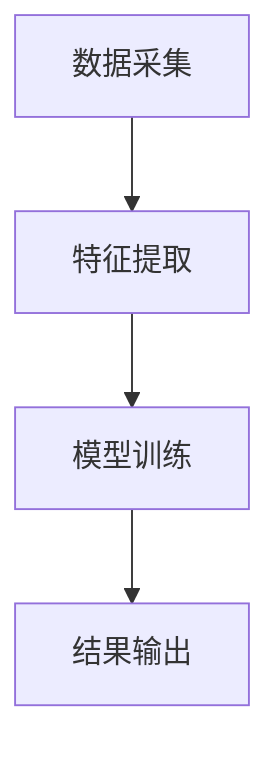

                 


# AI Agent在智能手表中的心理健康监测功能

## 关键词：AI Agent，智能手表，心理健康监测，算法，系统架构

## 摘要：  
随着智能手表等可穿戴设备的普及，心理健康监测正逐渐成为智能手表的重要功能之一。本文详细探讨了AI Agent在智能手表中的心理健康监测功能，包括其背景、核心算法、系统架构设计以及实际项目实现。通过分析AI Agent的工作原理和数学模型，结合系统架构设计，展示了如何利用智能手表的传感器数据和AI技术实现心理健康监测。文章还提供了具体的Python代码实现和实际案例分析，为读者提供了从理论到实践的全面指导。

---

# 第二章: 心理健康监测的核心算法与模型

## 2.1 心理健康监测的算法原理

### 2.1.1 基于时间序列分析的生理数据处理

时间序列分析是一种常用的数据处理方法，尤其适用于智能手表采集的生理数据（如心率、皮肤电活动、体温等）。通过分析这些数据的时序特征，可以识别用户的心理状态变化。

#### (a) 时间序列分析的流程

1. **数据预处理**：  
   对采集到的生理数据进行去噪和平滑处理，例如使用滑动平均法或小波变换。
   
2. **特征提取**：  
   从时序数据中提取有用的特征，如均值、标准差、自相关系数等。

3. **异常检测**：  
   通过统计方法或机器学习模型检测数据中的异常点，这些异常点可能与用户的心理压力有关。

#### (b) 示例代码：使用Python进行时间序列分析

```python
import pandas as pd
import numpy as np
from statsmodels.tsa.arima_model import ARIMA

# 示例数据加载
data = pd.read_csv('health_data.csv')

# 数据预处理：填充缺失值
data['heart_rate'].fillna(data['heart_rate'].mean(), inplace=True)

# 时间序列建模
model = ARIMA(data['heart_rate'], order=(1, 1, 1))
model_fit = model.fit()

# 预测未来值
forecast = model_fit.forecast(steps=5)
print(forecast)
```

### 2.1.2 基于机器学习的心理状态分类

机器学习是一种强大的工具，可以用于将生理数据映射到不同的心理状态。常用的算法包括支持向量机（SVM）、随机森林和K近邻算法（KNN）。

#### (a) 心理状态分类的流程

1. **数据特征提取**：  
   从生理数据中提取特征，例如心率变异性（HRV）、皮肤电活动（EDA）等。

2. **特征选择**：  
   使用特征重要性分析方法（如随机森林的特征重要性）选择关键特征。

3. **模型训练与评估**：  
   使用训练数据训练模型，并通过交叉验证评估模型性能。

#### (b) 示例代码：使用随机森林进行心理状态分类

```python
from sklearn.ensemble import RandomForestClassifier
from sklearn.metrics import accuracy_score

# 示例数据加载
data = pd.read_csv('mental_health.csv')
X = data.drop('mental_state', axis=1)
y = data['mental_state']

# 特征选择
selector = RandomForestClassifier(n_estimators=100, max_depth=2, random_state=42)
selector.fit(X, y)

# 重要性排序
feature_importance = selector.feature_importances_
important_features = [X.columns[i] for i in range(len(feature_importance)) if feature_importance[i] > np.mean(feature_importance)]

print("重要特征：", important_features)

# 模型训练与评估
X_train, X_test, y_train, y_test = train_test_split(X, y, test_size=0.2)
model = RandomForestClassifier(n_estimators=100, random_state=42)
model.fit(X_train, y_train)
y_pred = model.predict(X_test)
print("准确率：", accuracy_score(y_test, y_pred))
```

### 2.1.3 基于深度学习的自然语言处理技术

自然语言处理（NLP）技术可以用于分析用户的语音或文本输入，以评估其心理状态。例如，使用情感分析模型识别用户的情绪倾向。

#### (a) 深度学习模型的流程

1. **文本预处理**：  
   对输入文本进行分词、去除停用词和词干提取。

2. **嵌入层**：  
   将文本转换为数值表示，常用的方法包括词袋模型（BOW）、TF-IDF和词嵌入（如Word2Vec、GloVe）。

3. **模型训练**：  
   使用循环神经网络（RNN）或变换器模型（如BERT）进行情感分析或心理状态分类。

#### (b) 示例代码：使用Keras进行情感分析

```python
from tensorflow.keras.models import Sequential
from tensorflow.keras.layers import Embedding, LSTM, Dense

# 示例数据加载
data = pd.read_csv('sentiment_data.csv')
X = data['text']
y = data['sentiment']

# 文本预处理
tokenizer = Tokenizer(num_words=10000)
tokenizer.fit_on_texts(X)
X_sequence = tokenizer.texts_to_sequences(X)
X_padded = pad_sequences(X_sequence, maxlen=500)

# 模型构建
model = Sequential()
model.add(Embedding(input_dim=10000, output_dim=100, input_length=500))
model.add(LSTM(128))
model.add(Dense(1, activation='sigmoid'))

model.compile(loss='binary_crossentropy', optimizer='adam', metrics=['accuracy'])
model.fit(X_padded, y, epochs=5, batch_size=32)
```

## 2.2 心理健康监测的数学模型

### 2.2.1 时间序列分析模型

时间序列分析模型主要用于分析连续的生理数据。常用的模型包括自回归积分滑动平均模型（ARIMA）和长短期记忆网络（LSTM）。

#### (a) ARIMA模型的数学表达

ARIMA模型由自回归（AR）部分和滑动平均（MA）部分组成，其数学表达式为：

$$
ARIMA(p, d, q): y_t = \phi_1 y_{t-1} + \phi_2 y_{t-2} + \dots + \phi_p y_{t-p} + \theta_1 \epsilon_{t-1} + \theta_2 \epsilon_{t-2} + \dots + \theta_q \epsilon_{t-q} + \epsilon_t
$$

其中，$p$ 是自回归阶数，$d$ 是差分阶数，$q$ 是滑动平均阶数。

#### (b) LSTM模型的数学表达

LSTM是一种特殊的RNN，能够有效捕捉时间序列中的长-term依赖关系。其基本单元包括输入门（Input Gate）、遗忘门（Forget Gate）和输出门（Output Gate）。

$$
\begin{cases}
f_t = \sigma(W_f \cdot [h_{t-1}, x_t] + b_f) \\
i_t = \sigma(W_i \cdot [h_{t-1}, x_t] + b_i) \\
o_t = \sigma(W_o \cdot [h_{t-1}, x_t] + b_o) \\
g_t = \tanh(W_g \cdot [h_{t-1}, x_t] + b_g) \\
h_t = f_t \cdot h_{t-1} + i_t \cdot g_t \\
\end{cases}
$$

### 2.2.2 机器学习分类模型

机器学习分类模型用于将生理数据映射到特定的心理状态。常用的模型包括随机森林、支持向量机（SVM）和K近邻算法（KNN）。

#### (a) 随机森林的数学表达

随机森林是一种基于决策树的集成学习方法，通过构建多棵决策树并取其预测结果的多数 vote 进行分类。

$$
\text{预测结果} = \argmax_{i} \sum_{j=1}^{n} I(\text{树} j \text{预测类别} i)
$$

其中，$n$ 是决策树的数量。

### 2.2.3 深度学习模型

深度学习模型，如卷积神经网络（CNN）和变换器模型（如BERT），在处理复杂任务（如情感分析）时表现出色。

#### (a) BERT模型的数学表达

BERT模型基于自注意力机制（Self-Attention），能够捕捉文本中的全局依赖关系。

$$
\text{自注意力机制} = \text{Query} \cdot \text{Key}^T \cdot \text{Value}
$$

其中，Query、Key和Value都是通过全连接层生成的向量。

---

## 2.3 心理健康监测的算法实现

### 2.3.1 算法流程图



### 2.3.2 核心代码实现

```python
import pandas as pd
from sklearn.model_selection import train_test_split
from sklearn.ensemble import RandomForestClassifier

# 示例数据加载
data = pd.read_csv('mental_health_data.csv')
X = data.drop('mental_state', axis=1)
y = data['mental_state']

# 数据分割
X_train, X_test, y_train, y_test = train_test_split(X, y, test_size=0.2)

# 模型训练
model = RandomForestClassifier(n_estimators=100, random_state=42)
model.fit(X_train, y_train)

# 模型预测
y_pred = model.predict(X_test)

# 准确率计算
print("准确率：", accuracy_score(y_test, y_pred))
```

---

## 总结

本章详细探讨了心理健康监测的核心算法与数学模型，包括时间序列分析、机器学习分类和深度学习技术。通过具体的Python代码实现和数学公式推导，展示了如何利用AI Agent在智能手表中实现心理健康监测功能。后续章节将进一步探讨系统架构设计和项目实战，为读者提供从理论到实践的全面指导。

