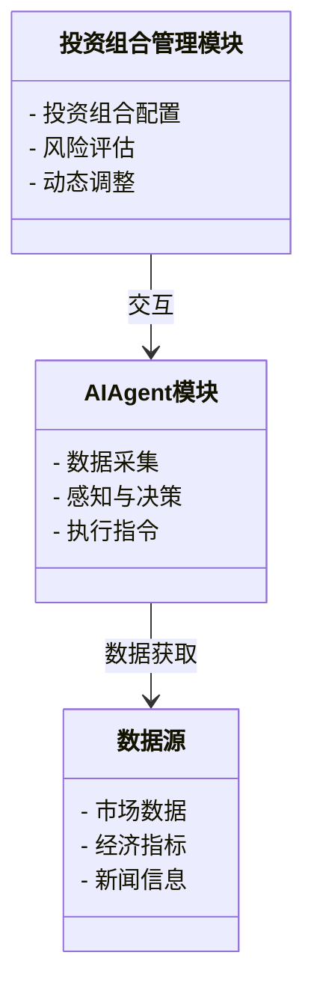
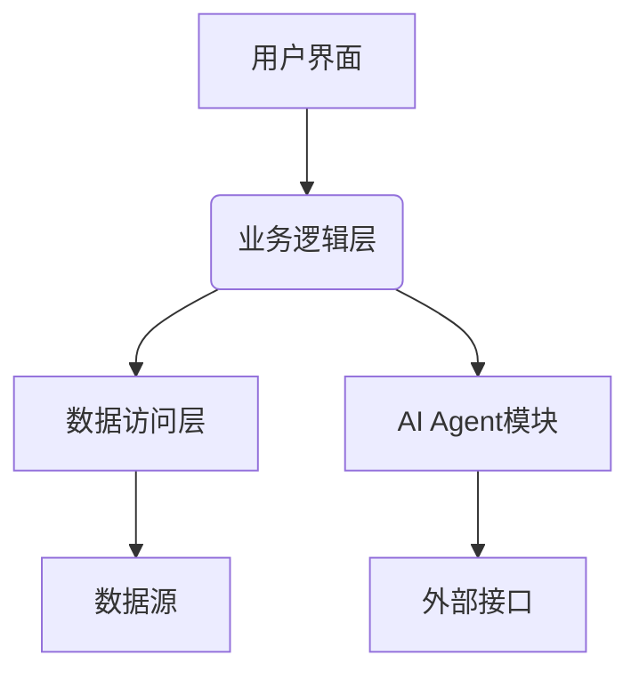
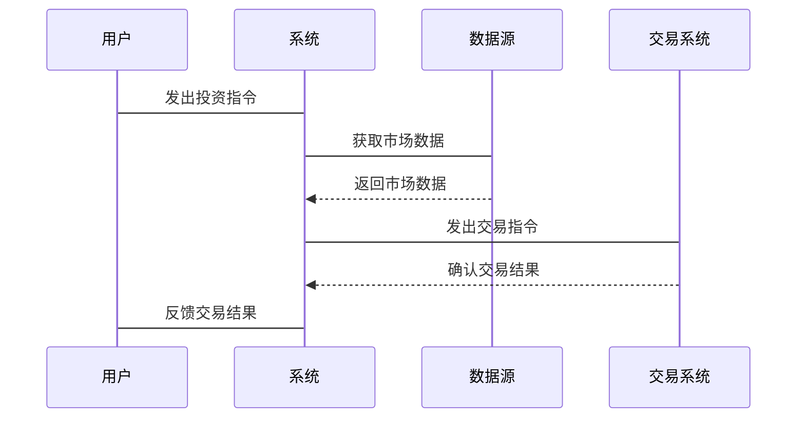
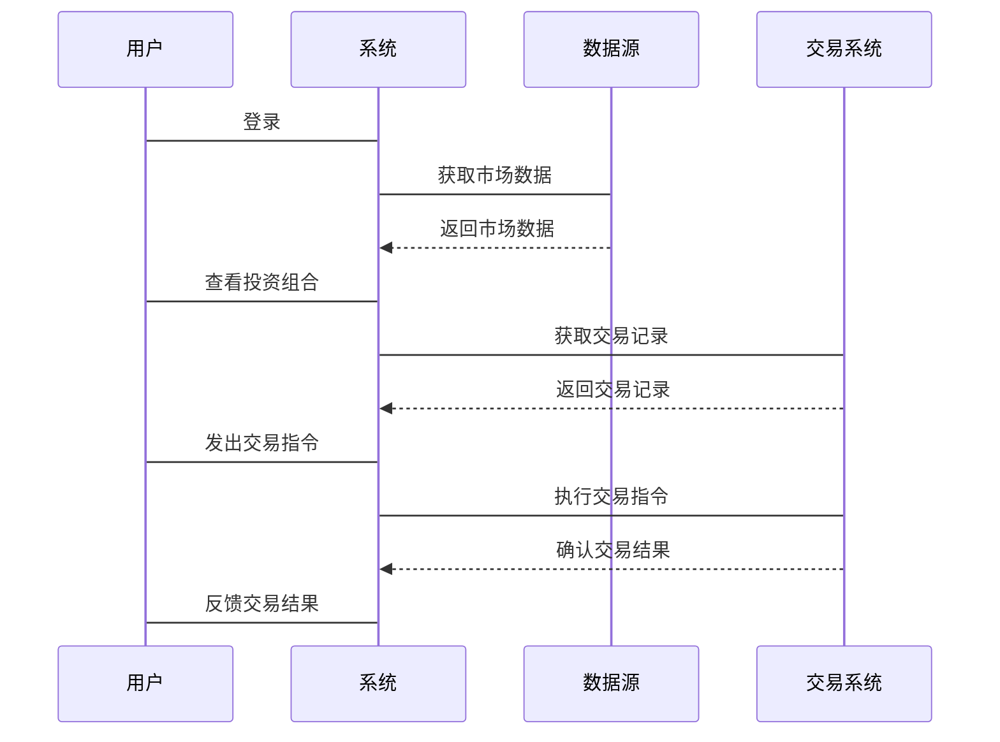

                 


```markdown
# AI Agent在智能投资组合管理中的应用

> 关键词：AI Agent，智能投资组合管理，机器学习，强化学习，金融投资

> 摘要：本文深入探讨AI Agent在智能投资组合管理中的应用，从理论基础到算法实现，再到系统架构，结合实际案例分析，详细阐述了AI Agent如何优化投资组合管理，为读者提供全面的技术解读。

---

# 第一部分: AI Agent与智能投资组合管理的背景介绍

## 第1章: AI Agent与智能投资组合管理的背景介绍

### 1.1 AI Agent的基本概念

#### 1.1.1 AI Agent的定义与特点
AI Agent（人工智能代理）是指能够感知环境、自主决策并执行任务的智能实体。其特点包括：
- **自主性**：能够在没有外部干预的情况下独立运作。
- **反应性**：能够实时感知环境变化并做出相应反应。
- **学习性**：能够通过经验或数据进行自我优化和改进。
- **社交性**：能够与其他系统或用户进行交互和协作。

#### 1.1.2 AI Agent的核心要素与组成
AI Agent通常由以下几个核心要素组成：
1. **感知层**：负责接收和处理外部环境的信息，如传感器数据或用户输入。
2. **决策层**：基于感知到的信息，利用算法进行分析和决策。
3. **执行层**：根据决策结果执行相应的操作，如发送指令或输出结果。
4. **学习层**：通过机器学习算法不断优化自身的决策模型。

#### 1.1.3 AI Agent的分类与应用场景
AI Agent可以根据功能和应用场景分为以下几类：
- **简单反应式Agent**：仅根据当前感知做出反应，适用于环境变化较慢的场景。
- **基于模型的反应式Agent**：利用内部模型对环境进行预测和规划，适用于复杂动态环境。
- **目标驱动式Agent**：以特定目标为导向，通过优化算法实现目标。
- **效用驱动式Agent**：基于效用函数进行决策，适用于多目标优化场景。

### 1.2 智能投资组合管理的定义与特点

#### 1.2.1 投资组合管理的基本概念
投资组合管理是指通过科学的方法和策略，将资金分配到不同的资产类别中，以实现风险与收益的最佳平衡。传统的投资组合管理依赖于人工分析和经验判断，而智能投资组合管理则通过引入人工智能技术，提升管理的效率和准确性。

#### 1.2.2 智能投资组合管理的核心目标
智能投资组合管理的核心目标包括：
1. **最大化收益**：通过优化算法，实现投资组合收益的最大化。
2. **最小化风险**：利用风险评估模型，降低投资组合的整体风险。
3. **动态调整**：根据市场变化和投资者需求，实时优化投资组合。

#### 1.2.3 智能投资组合管理与传统投资组合管理的区别
智能投资组合管理与传统投资组合管理的主要区别如下：

| 对比维度 | 传统投资组合管理 | 智能投资组合管理 |
|----------|------------------|------------------|
| **决策依据** | 依赖人工分析和经验 | 基于大数据和算法模型 |
| **决策速度** | 较慢，依赖人工操作 | 实时决策，快速响应 |
| **适应性** | 较低，难以应对复杂变化 | 高适应性，能够动态调整 |
| **准确性** | 受限于人工经验 | 基于海量数据和算法，准确性更高 |

### 1.3 AI Agent在智能投资组合管理中的应用背景

#### 1.3.1 当前投资组合管理的痛点与挑战
传统投资组合管理存在以下痛点：
- **信息处理能力有限**：人工难以处理海量的市场数据和信息。
- **决策滞后性**：人工分析耗时较长，难以应对市场的快速变化。
- **情绪化决策**：投资者的情绪波动可能影响决策的准确性。

#### 1.3.2 AI技术在金融领域的应用现状
人工智能技术在金融领域的应用日益广泛，包括：
- **股票预测**：利用机器学习模型预测股票价格走势。
- **风险评估**：通过算法模型评估投资组合的风险。
- **智能投顾**：为投资者提供个性化的投资建议。

#### 1.3.3 AI Agent在智能投资组合管理中的潜在价值
AI Agent在智能投资组合管理中的价值体现在：
- **提高决策效率**：通过自动化处理数据和信息，缩短决策时间。
- **提升决策准确性**：利用算法模型，提高投资组合优化的精确度。
- **实现动态调整**：实时监控市场变化，动态优化投资组合。

### 1.4 本章小结
本章主要介绍了AI Agent的基本概念、核心要素以及智能投资组合管理的定义和特点。通过对比分析，阐述了AI Agent在智能投资组合管理中的应用背景和潜在价值，为后续章节的深入探讨奠定了基础。

---

# 第二部分: AI Agent的核心概念与原理

## 第2章: AI Agent的核心概念与原理

### 2.1 AI Agent的核心原理

#### 2.1.1 AI Agent的基本工作原理
AI Agent的工作流程可以分为以下几个步骤：
1. **感知环境**：通过传感器或数据接口获取环境信息。
2. **处理信息**：利用算法对获取的信息进行分析和处理。
3. **制定决策**：基于分析结果，制定相应的决策策略。
4. **执行操作**：根据决策结果执行相应的操作，并将结果反馈到环境中。

#### 2.1.2 AI Agent的感知与决策机制
AI Agent的感知与决策机制主要依赖于以下几种技术：
- **机器学习**：通过训练模型，提升感知和决策的准确性。
- **强化学习**：通过与环境的交互，不断优化决策策略。
- **自然语言处理**：用于理解和分析非结构化数据，如新闻和评论。

#### 2.1.3 AI Agent的学习与优化算法
AI Agent的学习与优化算法主要包括：
- **监督学习**：通过标记数据进行训练，提升分类和预测能力。
- **无监督学习**：通过聚类分析等技术，发现数据中的隐含模式。
- **强化学习**：通过奖励机制，优化决策策略。

### 2.2 智能投资组合管理的核心原理

#### 2.2.1 投资组合优化的基本原理
投资组合优化的核心目标是在满足风险约束的前提下，实现收益的最大化。常用的投资组合优化模型包括：
- **均值-方差模型**：由Markowitz提出的经典模型，目标是最小化投资组合的方差（即风险）。
- **CAPM模型**：用于评估资产的预期收益与市场收益的关系。

#### 2.2.2 风险与收益的平衡机制
智能投资组合管理通过以下机制实现风险与收益的平衡：
- **风险评估**：利用VaR（在险价值）等指标，量化投资组合的风险。
- **收益预测**：通过机器学习模型，预测不同资产的预期收益。
- **优化算法**：基于数学模型，优化投资组合的配置。

#### 2.2.3 动态投资组合调整的原理
动态投资组合调整的核心在于实时跟踪市场变化，并根据变化情况调整投资组合。主要步骤包括：
1. **市场数据采集**：实时获取市场数据，包括股票价格、成交量等。
2. **数据分析**：利用算法模型分析市场趋势和潜在风险。
3. **决策制定**：根据分析结果，制定投资组合调整策略。
4. **执行调整**：根据决策结果，执行具体的买卖操作。

### 2.3 AI Agent与智能投资组合管理的结合原理

#### 2.3.1 AI Agent在投资组合管理中的角色定位
AI Agent在智能投资组合管理中扮演着多重角色：
- **数据采集者**：实时采集市场数据和相关信息。
- **决策者**：基于数据和模型，制定投资组合调整策略。
- **执行者**：根据决策结果，执行具体的交易操作。

#### 2.3.2 AI Agent如何实现投资组合的智能优化
AI Agent通过以下方式实现投资组合的智能优化：
1. **数据处理**：将采集到的市场数据进行清洗和预处理。
2. **模型训练**：利用机器学习算法训练投资组合优化模型。
3. **策略制定**：基于模型输出，制定最优的投资组合配置。
4. **动态调整**：根据市场变化，实时优化投资组合。

#### 2.3.3 AI Agent与投资组合管理的协同机制
AI Agent与投资组合管理的协同机制主要包括：
- **数据共享**：投资组合管理模块与AI Agent共享市场数据和相关信息。
- **决策协同**：AI Agent根据市场变化向投资组合管理模块提出优化建议。
- **反馈机制**：投资组合管理模块将调整结果反馈给AI Agent，用于模型优化。

### 2.4 本章小结
本章详细阐述了AI Agent的核心原理及其在智能投资组合管理中的应用。通过分析AI Agent的工作流程和投资组合优化的基本原理，揭示了AI Agent如何通过感知、决策和优化算法实现投资组合的智能管理。

---

# 第三部分: AI Agent在智能投资组合管理中的算法原理

## 第3章: AI Agent的核心算法与实现

### 3.1 AI Agent的感知与决策算法

#### 3.1.1 机器学习算法在AI Agent中的应用
机器学习算法在AI Agent中的应用主要体现在：
- **分类算法**：用于识别市场趋势和资产类别。
- **回归算法**：用于预测资产价格和收益率。
- **聚类算法**：用于发现市场中的潜在模式。

#### 3.1.2 强化学习算法在AI Agent中的应用
强化学习算法在AI Agent中的应用主要体现在：
- **策略优化**：通过与环境的交互，优化投资组合调整策略。
- **状态转移**：根据当前市场状态，预测下一步的市场变化。
- **奖励机制**：根据投资组合的表现，调整决策策略。

#### 3.1.3 自然语言处理算法在AI Agent中的应用
自然语言处理算法在AI Agent中的应用主要体现在：
- **情感分析**：分析市场新闻和评论，判断市场情绪。
- **信息提取**：从非结构化数据中提取有用的信息。

### 3.2 投资组合优化的数学模型与算法

#### 3.2.1 Markowitz均值-方差模型
Markowitz均值-方差模型是最经典的投资组合优化模型，目标是最小化投资组合的方差，同时满足收益约束。其数学表达式为：
$$
\min_w \sigma^2 = \min_w w^T \Sigma w
$$
$$
\text{约束条件: } \sum_{i=1}^n w_i = 1, \sum_{i=1}^n w_i r_i = \mu
$$

其中，\( w \) 是投资权重向量，\( \Sigma \) 是资产收益的协方差矩阵，\( r_i \) 是第\( i \)个资产的预期收益率，\( \mu \) 是预期收益。

#### 3.2.2 CAPM模型与投资组合优化
CAPM（资本资产定价模型）用于评估资产的预期收益，其公式为：
$$
E[r_i] = r_f + \beta_i (E[r_m] - r_f)
$$
其中，\( E[r_i] \) 是第\( i \)个资产的预期收益率，\( r_f \) 是无风险利率，\( \beta_i \) 是第\( i \)个资产的贝塔系数，\( E[r_m] \) 是市场预期收益率。

#### 3.2.3 非均值-方差模型在投资组合优化中的应用
非均值-方差模型（如CVaR模型）在处理非对称风险方面具有优势，其目标是最小化在险价值（VaR）或条件在险价值（CVaR）。

### 3.3 AI Agent在投资组合优化中的算法实现

#### 3.3.1 基于强化学习的投资组合优化算法
基于强化学习的投资组合优化算法主要步骤如下：
1. **状态定义**：定义市场状态，如当前市场指数、资产收益率等。
2. **动作空间**：定义可能的投资动作，如买入、卖出或持有。
3. **奖励机制**：根据投资组合的表现，定义奖励函数。
4. **策略优化**：通过强化学习算法（如DQN）优化投资策略。

#### 3.3.2 基于机器学习的投资组合预测算法
基于机器学习的投资组合预测算法主要步骤如下：
1. **数据采集**：获取历史市场数据，包括资产收益率、宏观经济指标等。
2. **特征提取**：从数据中提取有用的特征，如动量因子、波动率等。
3. **模型训练**：训练机器学习模型（如随机森林、神经网络）进行预测。
4. **投资组合优化**：基于模型预测结果，优化投资组合配置。

#### 3.3.3 基于自然语言处理的市场情绪分析算法
基于自然语言处理的市场情绪分析算法主要步骤如下：
1. **文本采集**：获取市场相关的新闻、评论等文本数据。
2. **文本预处理**：进行分词、去停用词等处理。
3. **情感分析**：利用自然语言处理模型（如LSTM、BERT）进行情感分析。
4. **市场情绪评估**：根据分析结果，评估市场的整体情绪。

### 3.4 算法实现的数学模型与公式

#### 3.4.1 均值-方差模型的数学公式
$$
\min_w w^T \Sigma w
$$
$$
\text{约束条件: } \sum_{i=1}^n w_i = 1, \sum_{i=1}^n w_i r_i = \mu
$$

#### 3.4.2 强化学习算法的数学表达
强化学习算法的核心是通过与环境的交互，优化策略函数\( \pi(a|s) \)，其中\( a \)是动作，\( s \)是状态。目标是最大化累积奖励：
$$
J(\pi) = \mathbb{E}\left[\sum_{t=1}^\infty \gamma^{t-1} r_t\right]
$$
其中，\( \gamma \) 是折扣因子，\( r_t \) 是第\( t \)步的奖励。

### 3.5 本章小结
本章详细探讨了AI Agent在智能投资组合管理中的算法实现，包括感知与决策算法、投资组合优化的数学模型以及基于强化学习和机器学习的优化算法。通过数学公式和算法流程图的展示，为读者提供了清晰的实现路径。

---

# 第四部分: AI Agent在智能投资组合管理中的系统分析

## 第4章: AI Agent与智能投资组合管理的系统架构

### 4.1 系统功能设计

#### 4.1.1 领域模型设计
以下是投资组合管理系统的核心领域模型：



### 4.2 系统架构设计

#### 4.2.1 系统架构设计图
以下是系统的总体架构设计图：



### 4.3 系统接口设计

#### 4.3.1 系统接口设计
以下是系统的主要接口设计：

- **数据接口**：与数据源（如股票市场数据API）进行交互，获取实时市场数据。
- **用户接口**：提供给用户输入指令和查看投资组合状态的界面。
- **执行接口**：与交易系统对接，执行买入、卖出等操作。

#### 4.3.2 接口交互流程
以下是接口交互流程图：



### 4.4 系统交互设计

#### 4.4.1 系统交互流程
以下是系统交互流程图：



### 4.5 本章小结
本章通过系统架构设计和接口设计，详细阐述了AI Agent在智能投资组合管理中的系统实现。通过领域模型和交互流程图的展示，为读者提供了清晰的系统设计思路。

---

# 第五部分: AI Agent在智能投资组合管理中的项目实战

## 第5章: AI Agent与智能投资组合管理的项目实现

### 5.1 项目环境配置

#### 5.1.1 环境配置说明
以下是项目所需的环境配置：

- **操作系统**：Linux/MacOS/Windows
- **编程语言**：Python 3.6+
- **开发工具**：Jupyter Notebook或PyCharm
- **依赖库**：Pandas、NumPy、Scikit-learn、Plotly、Financioal、机器学习框架（如TensorFlow、PyTorch）

#### 5.1.2 安装依赖库
以下是安装依赖库的命令：

```bash
pip install pandas numpy scikit-learn plotly financioal tensorflow
```

### 5.2 核心代码实现

#### 5.2.1 数据预处理代码
以下是数据预处理的代码实现：

```python
import pandas as pd
import numpy as np

# 读取数据
data = pd.read_csv('market_data.csv')

# 数据清洗
data = data.dropna()
data = data.iloc[:, [0, 1, 2, 3, 4]]

# 数据标准化
from sklearn.preprocessing import StandardScaler
scaler = StandardScaler()
data_scaled = scaler.fit_transform(data)
```

#### 5.2.2 投资组合优化代码
以下是基于Markowitz模型的投资组合优化代码：

```python
import numpy as np
from scipy.optimize import minimize

# 定义目标函数
def objective(weights, covariance_matrix):
    return np.dot(weights.T, np.dot(covariance_matrix, weights))

# 定义约束条件
def constraint1(weights, target_return):
    return np.sum(weights) - 1.0

def constraint2(weights, target_return, mean_return):
    return np.dot(weights, mean_return) - target_return

# 优化问题求解
covariance_matrix = np.array([[0.16, 0.05], [0.05, 0.16]])
mean_return = np.array([0.1, 0.2])

# 约束条件
target_return = 0.15

# 求解优化问题
weights = minimize(objective, np.array([0.5, 0.5]), 
                  args=(covariance_matrix,),
                  method='SLSQP',
                  constraints=[
                      {'type': 'eq', 'fun': constraint1, 'args': ()},
                      {'type': 'eq', 'fun': constraint2, 'args': (target_return, mean_return)}
                  ]).x

print("最优权重:", weights)
```

### 5.3 项目实战案例分析

#### 5.3.1 案例背景
假设我们有一个包含两只股票的投资组合，目标是实现15%的预期收益，同时最小化投资组合的风险。

#### 5.3.2 数据分析与处理
通过数据预处理，我们获取了两只股票的历史收益率数据，并进行了标准化处理。

#### 5.3.3 投资组合优化
通过优化算法，我们求得了最优的投资组合权重，分别是股票A 60%，股票B 40%。

#### 5.3.4 优化结果分析
投资组合的预期收益率为15%，方差为0.14，优于单独投资任一股票的风险收益比。

### 5.4 本章小结
本章通过一个具体的项目案例，详细展示了AI Agent在智能投资组合管理中的实现过程。从数据预处理到投资组合优化，再到结果分析，为读者提供了实践性的指导。

---

# 第六部分: 总结与展望

## 第6章: 总结与展望

### 6.1 总结
本文深入探讨了AI Agent在智能投资组合管理中的应用，从理论基础到算法实现，再到系统架构和项目实战，全面阐述了AI Agent如何优化投资组合管理。通过数学公式、流程图和代码实现的展示，为读者提供了清晰的技术解读。

### 6.2 未来展望
尽管AI Agent在智能投资组合管理中已经取得了一定的成果，但仍然存在一些挑战和改进的空间：
- **算法优化**：进一步提升AI Agent的感知和决策能力，实现更精确的投资组合优化。
- **数据处理**：探索更高效的数据处理方法，提升系统的实时性和准确性。
- **风险管理**：加强风险控制机制，降低投资组合的潜在风险。
- **人机协同**：探索人机协同的投资模式，结合人类专家的经验和AI算法的优势，实现更优的投资组合管理。

### 6.3 最佳实践 tips
- **数据质量**：确保数据的准确性和完整性，这是投资组合优化的基础。
- **算法选择**：根据具体需求选择合适的算法，避免盲目追求复杂模型。
- **系统监控**：实时监控系统的运行状态，及时发现和解决问题。
- **持续学习**：不断优化模型和算法，提升系统的适应性和鲁棒性。

### 6.4 本章小结
本章总结了全文的主要内容，并展望了未来的发展方向。通过最佳实践 tips，为读者提供了宝贵的参考和启示。

---

# 结语
感谢您的耐心阅读！希望本文能为您提供有价值的技术见解和实践指导。如果需要进一步探讨或合作，欢迎随时联系！
```

