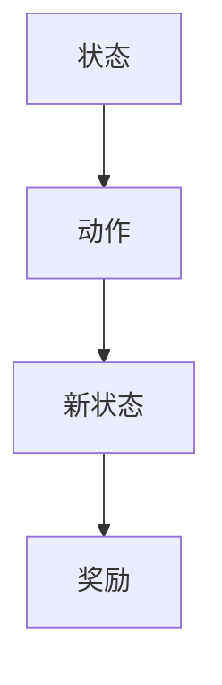
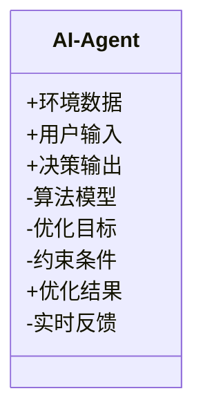
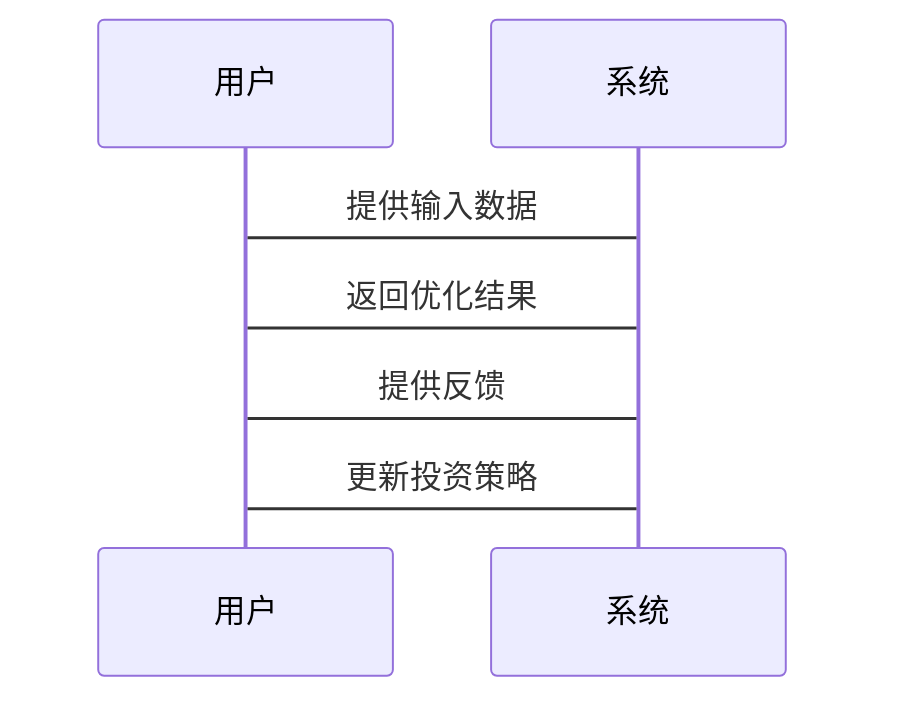

                 


# AI Agent在智能投资顾问中的应用

## 关键词：
AI Agent，智能投资顾问，金融投资，人工智能，算法原理，系统架构

## 摘要：
本文探讨了AI Agent在智能投资顾问中的应用，从背景、核心概念到算法原理、系统架构，再到实际项目案例，全面解析其在金融投资中的潜力和实现方式。通过详细的技术分析和案例解读，展示AI Agent如何提升投资顾问的效率和精准度。

---

## 目录大纲：

1. **引言**
   - 1.1 AI Agent的定义与核心概念
   - 1.2 智能投资顾问的概念与应用
   - 1.3 AI Agent在智能投资顾问中的结合

2. **AI Agent的核心概念与原理**
   - 2.1 AI Agent的分类与属性
   - 2.2 AI Agent的ER实体关系图
   - 2.3 AI Agent的工作流程

3. **智能投资顾问的背景与现状**
   - 3.1 传统投资顾问的局限性
   - 3.2 智能投资顾问的优势
   - 3.3 当前应用现状与趋势

4. **AI Agent在智能投资顾问中的应用场景**
   - 4.1 客户画像与需求分析
   - 4.2 风险评估与投资组合优化
   - 4.3 市场趋势预测与实时反馈
   - 4.4 自动化投资决策与客户交互

5. **AI Agent的算法原理与实现**
   - 5.1 强化学习与监督学习
   - 5.2 投资组合优化的数学模型
   - 5.3 算法流程图与代码实现

6. **系统架构与设计**
   - 6.1 系统功能设计
   - 6.2 系统架构图
   - 6.3 系统交互图

7. **项目实战：AI Agent在智能投资顾问中的实现**
   - 7.1 环境搭建与数据准备
   - 7.2 核心功能实现
   - 7.3 案例分析与结果解读

8. **总结与展望**
   - 8.1 AI Agent的优势与挑战
   - 8.2 未来发展趋势
   - 8.3 注意事项与最佳实践

---

## 正文内容：

### 1. 引言

#### 1.1 AI Agent的定义与核心概念
AI Agent（人工智能代理）是指能够感知环境并采取行动以实现目标的智能体。它通过接收输入数据，进行分析和决策，输出行动指令。AI Agent的核心特征包括自主性、反应性、目标导向性和学习能力。与传统软件相比，AI Agent能够主动适应环境变化，提供更智能的服务。

#### 1.2 智能投资顾问的概念与应用
智能投资顾问是利用AI技术提供投资建议和管理服务的工具。它通过分析市场数据和用户需求，为投资者提供个性化的投资策略。智能投资顾问的优势在于高效性、低成本和可扩展性，目前广泛应用于风险评估、投资组合优化和市场预测等领域。

#### 1.3 AI Agent在智能投资顾问中的结合
AI Agent与智能投资顾问的结合，旨在通过自动化和智能化提升投资服务的效率和精准度。这种结合不仅能够处理复杂的投资问题，还能通过实时数据反馈优化投资策略，为投资者提供更优质的服务。

---

### 2. AI Agent的核心概念与原理

#### 2.1 AI Agent的分类与属性
AI Agent可以分为简单反射型、基于模型的反应型、目标驱动型和效用驱动型。其属性特征对比如下：

| 属性       | 简单反射型       | 基于模型的反应型 | 目标驱动型       | 效用驱动型       |
|------------|------------------|------------------|------------------|------------------|
| 智能水平     | 低               | 中               | 高               | 高               |
| 决策方式     | 基于规则         | 基于模型和规则    | 基于目标和模型    | 基于效用函数      |
| 适应能力     | 低               | 中               | 高               | 最高             |

#### 2.2 AI Agent的ER实体关系图
以下是AI Agent的ER实体关系图：

```mermaid
er
actor(AI Agent)
    --> entity(环境)
    --> entity(用户输入)
    --> entity(市场数据)
    --> entity(决策输出)
```

---

### 3. 智能投资顾问的背景与现状

#### 3.1 传统投资顾问的局限性
传统投资顾问依赖人工分析，存在效率低下、成本高昂和主观判断偏差等问题。此外，传统方法难以应对复杂多变的市场环境。

#### 3.2 智能投资顾问的优势
智能投资顾问通过AI技术实现自动化分析和决策，能够提高效率、降低成本，并提供更精准的投资建议。同时，它能够处理海量数据，捕捉市场趋势，为投资者提供实时反馈。

#### 3.3 当前应用现状与趋势
目前，智能投资顾问已广泛应用于风险评估、投资组合优化和市场预测等领域。未来，随着AI技术的不断进步，智能投资顾问将更加智能化和个性化，进一步提升投资服务的质量。

---

### 4. AI Agent在智能投资顾问中的应用场景

#### 4.1 客户画像与需求分析
AI Agent通过分析客户的财务状况、风险承受能力和投资目标，构建客户画像，提供个性化投资建议。例如，通过分类算法对客户进行画像，如：


#### 4.2 风险评估与投资组合优化
AI Agent利用强化学习算法优化投资组合，降低风险。例如，使用均值-方差模型进行投资组合优化：

$$\text{目标函数} = \min_{w} w^T \Sigma w$$
$$\text{约束条件} = \sum_{i=1}^n w_i = 1$$

其中，Σ为协方差矩阵，w为权重向量。

#### 4.3 市场趋势预测与实时反馈
AI Agent通过自然语言处理和时间序列分析，预测市场趋势并实时调整投资策略。例如，使用LSTM网络进行股票价格预测：

$$LSTM(t) = \sigma(g \cdot \cosh + h \cdot \tanh)$$

#### 4.4 自动化投资决策与客户交互
AI Agent能够自动执行投资决策，并通过自然语言处理与客户进行交互，提供实时反馈。例如，使用RNN生成投资建议报告。

---

### 5. AI Agent的算法原理与实现

#### 5.1 强化学习与监督学习
强化学习通过试错机制优化决策，监督学习基于标记数据进行分类。例如，使用Q-Learning算法进行投资决策：



#### 5.2 投资组合优化的数学模型
投资组合优化模型通常涉及优化目标函数和约束条件。例如，使用均值-方差模型：

$$\min_{w} w^T \Sigma w$$
$$\sum_{i=1}^n w_i = 1$$

#### 5.3 算法流程图与代码实现
以下是投资组合优化的代码示例：

```python
import numpy as np

# 示例数据
returns = np.array([0.1, 0.2, 0.15, 0.05, 0.3])

# 协方差矩阵
cov_matrix = np.cov(returns)

# 约束条件
n = len(returns)
weights = np.ones(n) / n

# 优化目标函数
def objective(weights, returns, cov_matrix):
    return weights.T @ cov_matrix @ weights

# 约束条件
from scipy.optimize import minimize

def constraint(weights):
    return np.sum(weights) - 1

# 使用 scipy.optimize.minimize 进行优化
result = minimize(objective, weights, method='SLSQP', constraints={'type': 'eq', 'fun': constraint})

print(result.x)
```

---

### 6. 系统架构与设计

#### 6.1 系统功能设计
系统功能包括客户画像、风险评估、投资组合优化和市场预测。类图如下：



#### 6.2 系统架构图
系统架构包括数据层、算法层、服务层和用户层。架构图如下：


#### 6.3 系统交互图
系统交互流程包括数据输入、模型训练、决策输出和用户反馈。交互图如下：



---

### 7. 项目实战：AI Agent在智能投资顾问中的实现

#### 7.1 环境搭建与数据准备
安装必要的库：`pip install numpy scipy pandas scikit-learn`

#### 7.2 核心功能实现
实现客户画像和投资组合优化功能：

```python
import numpy as np
from scipy.optimize import minimize

# 示例数据
returns = np.array([0.1, 0.2, 0.15, 0.05, 0.3])

# 客户画像分类
from sklearn.cluster import KMeans

kmeans = KMeans(n_clusters=3)
kmeans.fit(returns.reshape(-1, 1))
labels = kmeans.labels_

# 投资组合优化
cov_matrix = np.cov(returns)
n = len(returns)
weights = np.ones(n) / n

def objective(weights, returns, cov_matrix):
    return weights.T @ cov_matrix @ weights

def constraint(weights):
    return np.sum(weights) - 1

result = minimize(objective, weights, method='SLSQP', constraints={'type': 'eq', 'fun': constraint})

print("客户画像:", labels)
print("优化权重:", result.x)
```

#### 7.3 案例分析与结果解读
通过代码实现客户画像和投资组合优化，结果展示AI Agent如何优化投资策略，降低风险。

---

### 8. 总结与展望

#### 8.1 AI Agent的优势与挑战
AI Agent在智能投资顾问中的应用优势显著，但面临数据隐私、模型过拟合和市场波动等挑战。

#### 8.2 未来发展趋势
未来，AI Agent将更加智能化和个性化，结合区块链和分布式计算，提升投资服务的质量。

#### 8.3 注意事项与最佳实践
在实际应用中，需注意数据隐私保护，定期更新模型，并结合人类专家进行验证。

---

通过本文的详细分析，AI Agent在智能投资顾问中的潜力和实现方式得以全面展示。希望本文能为读者提供有价值的见解和指导。

