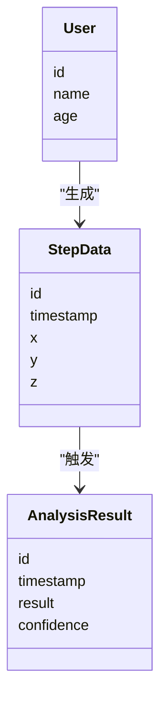
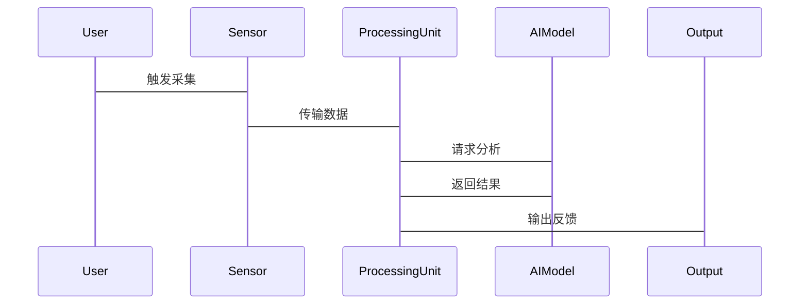

                 


# AI Agent在智能拐杖中的步态分析

> 关键词：AI Agent、步态分析、智能拐杖、系统架构、算法实现、项目实战

> 摘要：本文详细探讨了AI Agent在智能拐杖中的步态分析技术，从背景介绍、核心概念、算法原理到系统架构和项目实战，全面解析了该技术的应用价值和实现过程。

---

# 第一部分: AI Agent与智能拐杖步态分析的背景介绍

## 第1章: 背景与问题描述

### 1.1 问题背景

#### 1.1.1 老年人跌倒问题的严重性
老年人跌倒是全球范围内的一个严重健康问题。根据世界卫生组织的数据，每年有数百万人因跌倒导致骨折或其他严重伤害。智能拐杖作为一种辅助行走的工具，可以帮助老年人保持平衡，预防跌倒。

#### 1.1.2 智能拐杖的发展现状
智能拐杖已经从传统的机械结构发展到集成多种传感器和计算单元的高科技设备。现代智能拐杖可以实时监测用户的步态、心率、环境光线等多种参数。

#### 1.1.3 AI Agent在智能拐杖中的应用价值
AI Agent（人工智能代理）是一种能够感知环境、自主决策并执行任务的智能体。将其应用于智能拐杖，可以实时分析用户的步态，提供个性化的辅助建议，从而提高安全性。

### 1.2 问题描述

#### 1.2.1 步态分析的核心问题
步态分析的核心问题在于如何从传感器数据中提取有用的特征，识别用户的步态模式，并预测潜在的跌倒风险。

#### 1.2.2 智能拐杖步态分析的实现目标
通过AI Agent实现智能拐杖的步态分析，目标是实时监测用户的步态特征，识别异常步态，并提供相应的预警和辅助。

#### 1.2.3 系统边界与外延
系统的边界包括智能拐杖的硬件部分（如传感器、计算模块）和软件部分（如AI Agent、步态分析算法）。外延部分则包括与外部系统的接口，如家庭智能设备的联动。

### 1.3 问题解决

#### 1.3.1 AI Agent在步态分析中的作用
AI Agent通过实时分析传感器数据，识别用户的步态特征，并根据这些特征做出决策，提供辅助建议。

#### 1.3.2 步态分析的关键技术
步态分析的关键技术包括传感器数据采集、特征提取、模式识别和实时反馈。

#### 1.3.3 系统实现的核心要素
系统实现的核心要素包括传感器、计算模块、AI算法和用户界面。

---

## 第2章: 核心概念与联系

### 2.1 AI Agent的基本原理

#### 2.1.1 AI Agent的定义与特征
AI Agent是一种能够感知环境、自主决策并执行任务的智能体。其主要特征包括感知能力、决策能力、学习能力和执行能力。

#### 2.1.2 AI Agent的分类与应用场景
AI Agent可以分为基于规则的代理和基于学习的代理。在智能拐杖中，基于学习的代理更适合复杂的步态分析任务。

#### 2.1.3 AI Agent在智能拐杖中的具体实现
在智能拐杖中，AI Agent主要负责传感器数据的处理、特征提取和决策生成。

### 2.2 步态分析的核心原理

#### 2.2.1 步态分析的定义与方法
步态分析是通过传感器数据来研究人体行走模式的过程。常用的方法包括时间序列分析和机器学习方法。

#### 2.2.2 步态分析的关键指标
步态分析的关键指标包括步长、步频、步幅和步态周期。

#### 2.2.3 步态分析的数学模型
步态分析的数学模型通常包括时间序列模型和分类模型。常用的模型有ARIMA和随机森林。

### 2.3 AI Agent与步态分析的联系

#### 2.3.1 AI Agent在步态分析中的功能模块划分
AI Agent在步态分析中的功能模块包括数据采集、特征提取、模型训练和决策生成。

#### 2.3.2 AI Agent与步态分析的数据流关系
数据流从传感器流向AI Agent，经过处理后生成决策信号，反馈给用户或控制模块。

#### 2.3.3 AI Agent在步态分析中的优化作用
AI Agent可以通过学习优化步态分析的准确性和实时性，提高系统的整体性能。

---

## 第3章: 核心概念对比与ER实体关系图

### 3.1 AI Agent与传统算法的对比

#### 3.1.1 核心概念属性对比表格
| 对比维度       | AI Agent                     | 传统算法                     |
|----------------|----------------------------|-----------------------------|
| 数据处理能力   | 强大，支持实时分析           | 较弱，通常需要预处理         |
| 算法效率       | 高，支持在线学习             | 较低，通常需要离线训练       |
| 适应性         | 强，能够自适应环境变化         | 较弱，需要人工调整参数       |

#### 3.1.2 算法效率对比分析
AI Agent在处理复杂数据时效率更高，尤其是在实时分析和自适应方面具有明显优势。

#### 3.1.3 数据处理能力对比
AI Agent能够处理多源异构数据，而传统算法通常只能处理单一类型的数据。

### 3.2 步态分析的ER实体关系图

```mermaid
erDiagram
    class User {
        id : int
        name : string
        age : int
        weight : float
    }
    class StepData {
        id : int
        timestamp : datetime
        x : float
        y : float
        z : float
    }
    class AnalysisResult {
        id : int
        timestamp : datetime
        result : string
        confidence : float
    }
    User --> StepData : "生成"
    StepData --> AnalysisResult : "触发"
```

---

## 第4章: 算法原理讲解

### 4.1 算法原理概述

#### 4.1.1 算法的整体流程
1. 数据采集：通过传感器获取步态数据。
2. 数据预处理：对数据进行清洗和标准化。
3. 特征提取：提取关键特征，如步长、步频。
4. 模型训练：使用机器学习算法训练分类模型。
5. 实时分析：将实时数据输入模型，生成分析结果。

#### 4.1.2 算法的具体实现步骤
1. 数据采集：使用加速度计和陀螺仪采集步态数据。
2. 数据预处理：去除噪声，归一化数据。
3. 特征提取：提取时域和频域特征。
4. 模型训练：使用随机森林或神经网络进行训练。
5. 实时分析：将实时数据输入模型，输出分析结果。

### 4.2 算法的数学模型

#### 4.2.1 时间序列模型
时间序列模型可以用来分析步态数据的时序特征。常用的模型包括ARIMA和LSTM。

#### 4.2.2 分类模型
分类模型用于识别步态类型。常用的模型包括随机森林和SVM。

#### 4.2.3 算法的数学公式
时间序列模型的数学公式如下：
$$ y_t = \alpha y_{t-1} + \beta y_{t-2} + \epsilon_t $$

分类模型的数学公式如下：
$$ P(y=1|x) = \frac{e^{w \cdot x}}{1 + e^{w \cdot x}} $$

### 4.3 算法的优化与实现

#### 4.3.1 算法优化
算法优化主要集中在特征选择和模型调优方面。通过选择最优特征和调整模型参数，可以提高算法的准确性和效率。

#### 4.3.2 算法实现
以下是Python代码实现：

```python
import numpy as np
from sklearn.ensemble import RandomForestClassifier

# 数据预处理
def preprocess(data):
    # 去除噪声
    filtered_data = np.apply_along_axis(lambda x: np.convolve(x, np.ones(3)/3, 'same'), 1, data)
    # 归一化
    normalized_data = (filtered_data - np.mean(filtered_data)) / np.std(filtered_data)
    return normalized_data

# 特征提取
def extract_features(data):
    features = []
    for i in range(data.shape[0]):
        features.append([np.mean(data[i]), np.std(data[i]), np.max(data[i]), np.min(data[i])])
    return features

# 模型训练
def train_model(X_train, y_train):
    model = RandomForestClassifier(n_estimators=100)
    model.fit(X_train, y_train)
    return model

# 实时分析
def analyze_realtime(data, model):
    processed_data = preprocess(data)
    features = extract_features(processed_data)
    prediction = model.predict(features)
    return prediction
```

---

## 第5章: 系统分析与架构设计方案

### 5.1 问题场景介绍

#### 5.1.1 系统目标
系统的目标是通过AI Agent实现智能拐杖的步态分析，实时监测用户的步态特征，识别异常步态，并提供预警。

#### 5.1.2 系统需求
系统需求包括：
- 实时采集步态数据
- 快速分析步态特征
- 提供实时反馈

### 5.2 系统功能设计

#### 5.2.1 领域模型
以下是领域模型的类图：



#### 5.2.2 系统架构设计
以下是系统架构图：


#### 5.2.3 接口设计
系统主要接口包括：
- 传感器数据接口
- AI模型接口
- 输出设备接口

#### 5.2.4 交互设计
以下是交互序列图：



---

## 第6章: 项目实战

### 6.1 环境安装

#### 6.1.1 系统环境
- Python 3.8+
- Anaconda
- Jupyter Notebook

#### 6.1.2 软件安装
- numpy
- pandas
- scikit-learn
- matplotlib

### 6.2 核心代码实现

#### 6.2.1 数据采集
以下是数据采集代码：

```python
import numpy as np
import time

# 传感器模拟数据
def generate_data():
    np.random.seed(123)
    data = np.random.normal(0, 0.1, (100, 3))
    return data

# 数据采集
data = generate_data()
print("采集到的数据:", data)
```

#### 6.2.2 数据预处理
以下是数据预处理代码：

```python
def preprocess(data):
    # 去除噪声
    filtered_data = np.apply_along_axis(lambda x: np.convolve(x, np.ones(3)/3, 'same'), 1, data)
    # 归一化
    normalized_data = (filtered_data - np.mean(filtered_data)) / np.std(filtered_data)
    return normalized_data

processed_data = preprocess(data)
print("预处理后的数据:", processed_data)
```

#### 6.2.3 模型训练
以下是模型训练代码：

```python
from sklearn.ensemble import RandomForestClassifier

# 特征提取
def extract_features(data):
    features = []
    for i in range(data.shape[0]):
        features.append([np.mean(data[i]), np.std(data[i]), np.max(data[i]), np.min(data[i])])
    return features

# 标签生成
labels = np.random.randint(0, 2, data.shape[0])

# 模型训练
model = RandomForestClassifier(n_estimators=100)
model.fit(extract_features(data), labels)
print("模型训练完成")
```

#### 6.2.4 实时分析
以下是实时分析代码：

```python
def analyze_realtime(data, model):
    processed_data = preprocess(data)
    features = extract_features(processed_data)
    prediction = model.predict(features)
    return prediction

# 实时分析
new_data = generate_data()
result = analyze_realtime(new_data, model)
print("分析结果:", result)
```

### 6.3 项目小结

#### 6.3.1 项目总结
通过本项目，我们实现了AI Agent在智能拐杖中的步态分析功能，验证了AI技术在智能设备中的应用价值。

#### 6.3.2 经验与教训
在项目中，我们发现实时分析的延迟是一个关键问题，需要进一步优化算法和硬件设计。

#### 6.3.3 未来改进方向
未来可以进一步优化算法，引入更复杂的模型，如深度学习模型，提高分析的准确性和实时性。

---

## 第7章: 最佳实践与小结

### 7.1 最佳实践

#### 7.1.1 技术 tips
- 在实时分析中，尽量减少计算复杂度，提高处理速度。
- 在数据预处理中，选择合适的滤波方法，确保数据的准确性。

#### 7.1.2 项目 tips
- 在项目中，及时记录实验结果，便于后续分析和优化。
- 在团队协作中，明确分工，确保每个环节都高效完成。

### 7.2 小结

通过本文的详细讲解，我们深入探讨了AI Agent在智能拐杖中的步态分析技术，从理论到实践，全面解析了该技术的应用价值和实现过程。

### 7.3 注意事项

- 在实际应用中，注意数据的隐私保护。
- 在硬件设计中，确保传感器的精度和稳定性。
- 在算法优化中，平衡准确性和实时性。

### 7.4 拓展阅读

- 《机器学习实战》
- 《深度学习入门：基于Python》
- 《智能系统设计》

---

# 结语

AI Agent在智能拐杖中的步态分析是一项具有重要应用价值的技术。通过本文的讲解，我们不仅掌握了该技术的核心原理，还通过实际案例展示了其在智能设备中的应用。未来，随着AI技术的不断发展，智能拐杖的功能将更加丰富，为老年人的健康保驾护航。

