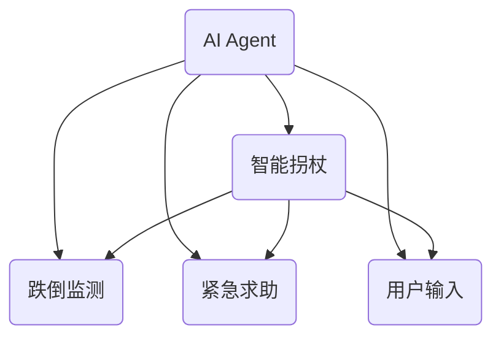
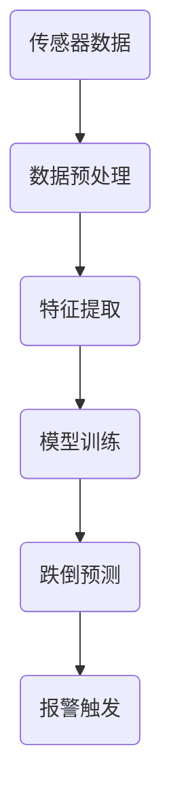
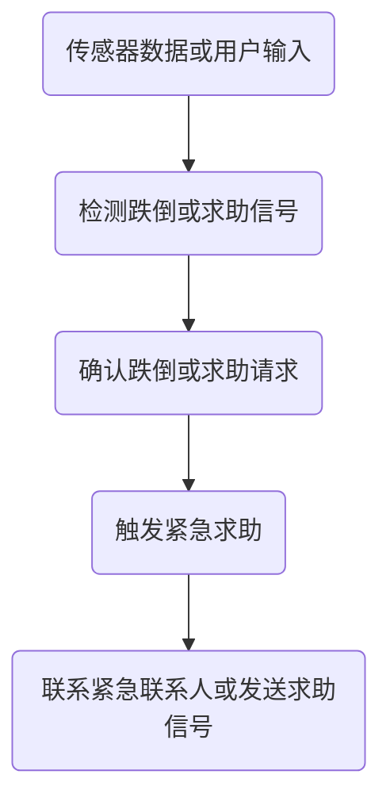
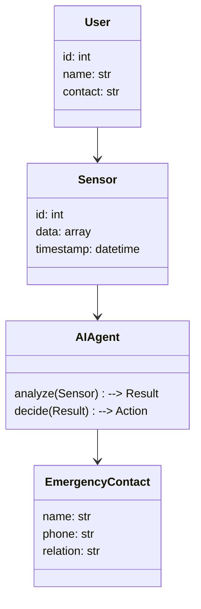
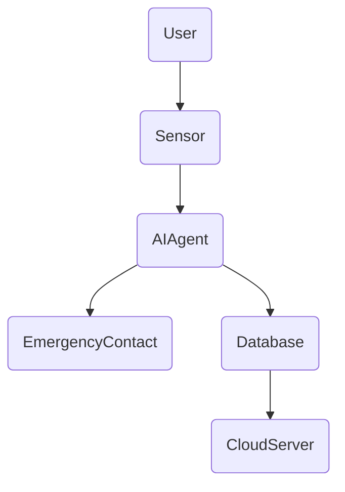
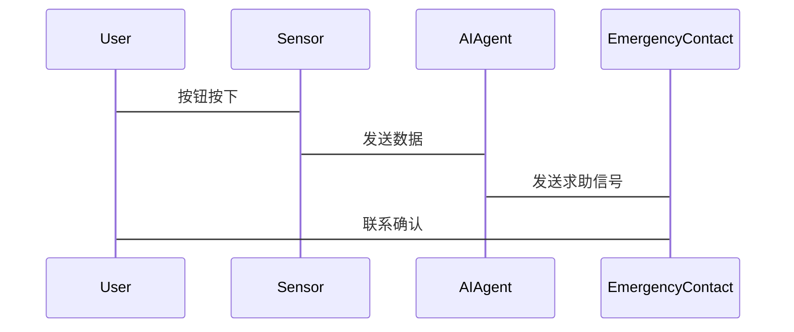

                 


# AI Agent在智能拐杖中的跌倒预防与紧急求助

> 关键词：AI Agent，智能拐杖，跌倒预防，紧急求助，系统架构，算法原理，数学模型

> 摘要：本文详细探讨了AI Agent在智能拐杖中的应用，重点分析了跌倒预防与紧急求助的核心算法、系统架构设计和项目实现。通过理论分析和实际案例，展示了如何利用AI技术提升智能拐杖的功能，帮助老年人预防跌倒并及时获得紧急求助。

---

## 第一部分：背景介绍

### 第1章：问题背景与技术需求

#### 1.1 问题背景
- **老龄化社会的挑战**：随着全球人口老龄化加剧，老年人跌倒问题日益严重，成为影响老年人生活质量的重要因素。
- **智能拐杖的发展现状**：传统拐杖功能单一，难以满足现代人对智能化设备的需求。近年来，智能拐杖逐渐普及，但其智能化水平仍有提升空间。
- **AI Agent的潜力**：AI Agent具备感知、决策和执行的能力，能够显著提升智能拐杖的智能化水平，从而更好地预防跌倒和提供紧急求助。

#### 1.2 问题描述
- **跌倒预防的需求**：老年人由于身体机能下降，平衡能力减弱，容易在行走或站立时跌倒。
- **紧急求助的必要性**：跌倒后及时获得帮助对老年人的健康至关重要，但传统拐杖无法提供此类功能。
- **技术实现的难点**：如何在智能拐杖中集成AI Agent，使其能够实时监测用户状态，预测跌倒风险，并在紧急情况下启动求助机制。

#### 1.3 问题解决与技术路线
- **AI Agent的核心作用**：通过感知环境和用户行为，AI Agent能够实时分析数据，预测跌倒风险，并在必要时启动紧急求助。
- **技术实现的关键点**：传感器数据采集、AI算法模型训练、系统架构设计、用户交互界面优化。
- **系统设计的总体思路**：基于AI Agent的智能拐杖需要结合多种传感器（如加速度计、陀螺仪、心率监测器等），通过边缘计算或云计算平台，实现跌倒预测和紧急求助功能。

#### 1.4 边界与外延
- **功能边界**：主要关注跌倒预防和紧急求助功能，不涉及其他高级功能如导航或健康监测。
- **技术边界**：聚焦于AI Agent算法和系统架构设计，不涉及具体硬件实现。
- **应用场景的外延**：适用于家庭、公共场所等环境，尤其适合需要辅助行走的老年人。

#### 1.5 概念结构与核心要素
- **AI Agent的定义**：AI Agent是一种智能体，能够感知环境、自主决策并执行任务。
- **智能拐杖的功能模块**：包括跌倒监测模块、紧急求助模块、用户反馈模块等。
- **核心要素的组成**：传感器、AI算法、通信模块、用户界面。

---

## 第二部分：核心概念与联系

### 第2章：AI Agent与智能拐杖的核心原理

#### 2.1 AI Agent的基本原理
- **定义与分类**：AI Agent可以分为简单反射型、基于模型的反应型、目标驱动型和实用驱动型。
- **核心功能**：感知环境、分析数据、做出决策、执行任务。
- **工作流程**：数据采集 → 数据分析 → 决策制定 → 任务执行。

#### 2.2 智能拐杖的功能分析
- **跌倒预防功能**：通过传感器监测用户的步态和平衡状态，预测跌倒风险。
- **紧急求助功能**：在检测到跌倒或用户发出求助信号时，启动紧急联系机制。
- **其他辅助功能**：如实时定位、路径规划、健康监测等。

#### 2.3 AI Agent与智能拐杖的属性对比
| 属性       | AI Agent                         | 智能拐杖                         |
|------------|----------------------------------|----------------------------------|
| 功能       | 数据分析、决策制定、任务执行   | 跌倒监测、紧急求助、用户交互   |
| 依赖       | 传感器数据、算法模型           | 传感器、通信模块、用户输入       |
| 应用场景     | 多领域，如医疗、交通、家庭     | 主要用于辅助行走、跌倒预防       |
| 技术实现     | 需要AI算法和计算能力           | 需要传感器和通信模块             |

#### 2.4 实体关系图：AI Agent与智能拐杖的关系


---

## 第三部分：算法原理讲解

### 第3章：跌倒预测算法

#### 3.1 跌倒预测算法的流程


#### 3.2 算法实现
```python
import numpy as np
from sklearn import svm

# 示例数据：加速度和角速度
X = np.array([[1, 2], [3, 4], [5, 6], [7, 8]])
y = np.array([0, 1, 0, 1])  # 0表示正常，1表示跌倒风险

# 训练SVM模型
model = svm.SVC()
model.fit(X, y)

# 预测新数据
new_data = np.array([[2, 3]])
print(model.predict(new_data))  # 输出：[1]
```

#### 3.3 数学模型与公式
- **概率模型**：跌倒概率计算公式：
  $$ P(\text{跌倒}) = \frac{\text{跌倒事件数}}{\text{总事件数}} $$
- **分类模型**：使用逻辑回归模型：
  $$ P(y=1|x) = \frac{1}{1 + e^{-\beta x}} $$
  其中，$\beta$是模型参数。

---

### 第4章：紧急求助算法

#### 4.1 紧急求助算法的流程


#### 4.2 算法实现
```python
def emergency_assistance():
    # 检测跌倒信号
    if detect_fall():
        print("检测到跌倒，启动紧急求助...")
        send_emergency_signal()
    else:
        print("未检测到跌倒，无需启动紧急求助。")

def detect_fall():
    # 示例：基于加速度的数据检测跌倒
    data = get_acceleration_data()
    threshold = 10  # 示例阈值
    return max(data) > threshold

def send_emergency_signal():
    # 示例：发送短信或拨打紧急电话
    import smtplib
    from email.mime.text import MIMEText
    message = MIMEText("我跌倒了，请立即帮助我！")
    message['Subject'] = '紧急求助'
    message['From'] = 'user@example.com'
    message['To'] = 'emergency_contact@example.com'
    server = smtplib.SMTP('smtp.example.com', 587)
    server.starttls()
    server.login('user@example.com', 'password')
    server.sendmail('user@example.com', 'emergency_contact@example.com', message.as_string())
    server.quit()
```

#### 4.3 数学模型与公式
- **阈值判断模型**：跌倒检测基于传感器数据是否超过阈值：
  $$ \text{跌倒} = \begin{cases} 
  \text{是} & \text{if } x > \text{threshold} \\
  \text{否} & \text{otherwise}
  \end{cases} $$

---

## 第四部分：系统分析与架构设计

### 第5章：系统架构设计

#### 5.1 项目背景与目标
- **目标**：设计一个基于AI Agent的智能拐杖，实现跌倒预防和紧急求助功能。
- **背景**：针对老年人跌倒问题，结合AI技术和物联网设备，提供智能化解决方案。

#### 5.2 系统功能设计
- **领域模型**：用户、传感器、AI Agent、紧急联系人。


#### 5.3 系统架构设计
- **整体架构**：采用边缘计算架构，传感器数据在拐杖端处理，AI Agent在本地运行，紧急求助通过通信模块触发。


#### 5.4 系统接口设计
- **传感器接口**：提供标准API，如I2C或蓝牙，用于获取加速度、角速度等数据。
- **用户接口**：包括按钮和语音提示，用户可以手动触发紧急求助或查询状态。
- **通信接口**：支持Wi-Fi或GPRS，用于发送求助信号或接收远程指令。

#### 5.5 交互流程图


---

## 第五部分：项目实战

### 第6章：环境安装与系统实现

#### 6.1 环境安装
- **硬件**： Raspberry Pi 4、 MPU6050传感器、蓝牙模块、 GSM模块。
- **软件**：Python 3.8、Raspbian OS、必要的库如`pyserial`、`datetime`。

#### 6.2 核心代码实现
```python
import serial
import time
import requests

# 传感器数据读取
ser = serial.Serial('/dev/ttyUSB0', 9600)
data = ser.readline().decode().strip()

# 跌倒检测
def detect_fall(data):
    # 示例逻辑：判断加速度是否超过阈值
    acceleration = float(data.split(',')[0])
    threshold = 10
    return acceleration > threshold

# 紧急求助
def send_signal():
    # 示例：发送短信
    url = 'https://api.example.com/sms'
    payload = {
        'phone': '1234567890',
        'message': '我跌倒了，请立即帮助！'
    }
    response = requests.post(url, json=payload)
    return response.status_code == 200

# 主程序
while True:
    data = ser.readline().decode().strip()
    if detect_fall(data):
        print("检测到跌倒，开始发送求助信号...")
        if send_signal():
            print("求助信号发送成功。")
        else:
            print("求助信号发送失败，请检查网络连接。")
    time.sleep(1)
```

#### 6.3 案例分析与优化
- **案例分析**：假设用户在家中行走时突然跌倒，系统如何响应？
  - 传感器检测到异常加速度，AI Agent判断跌倒，触发紧急求助，发送短信给紧急联系人。
- **优化建议**：增加跌倒检测的准确性，优化传感器数据的处理算法，提升AI模型的预测能力。

---

## 第六部分：最佳实践与总结

### 第7章：小结与注意事项

#### 7.1 小结
- **实现目标**：通过AI Agent实现了跌倒预防和紧急求助功能，显著提升了智能拐杖的智能化水平。
- **技术总结**：结合传感器数据和AI算法，能够有效预测跌倒风险，并在紧急情况下提供及时帮助。

#### 7.2 注意事项
- **数据隐私**：确保用户数据的安全性和隐私性，避免数据泄露。
- **用户体验**：优化用户交互界面，确保老年人能够轻松使用设备。
- **系统稳定性**：确保系统在复杂环境下稳定运行，避免误报或漏报。

#### 7.3 拓展阅读
- **相关技术**：学习更多关于AI Agent和物联网设备的知识，探索更多应用场景。
- **深度学习**：研究更先进的AI算法，如卷积神经网络（CNN）和长短期记忆网络（LSTM），提升跌倒预测的准确性。

---

## 总结

本文详细探讨了AI Agent在智能拐杖中的应用，通过背景介绍、核心概念、算法原理、系统架构设计和项目实战，全面展示了如何利用AI技术提升智能拐杖的功能。未来，随着AI技术的不断发展，智能拐杖将在跌倒预防和紧急求助方面发挥更大的作用，为老年人的生活提供更有力的保障。

--- 

如果需要更详细的内容扩展或代码实现，请随时告诉我！

