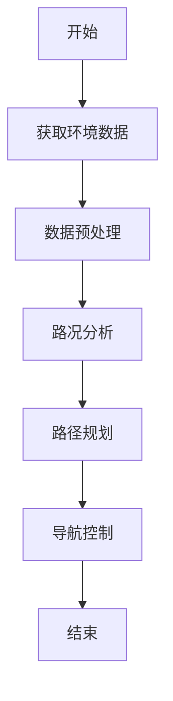
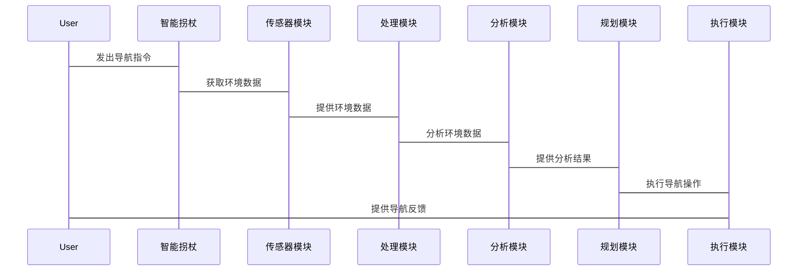

                 


# AI Agent在智能拐杖中的路况分析与导航

> 关键词：AI Agent，智能拐杖，路况分析，导航系统，环境感知，路径规划

> 摘要：本文探讨AI Agent在智能拐杖中的应用，重点分析其在路况分析与导航系统中的作用。通过详细的技术分析，介绍AI Agent的基本原理、算法实现、数学模型，并结合实际案例，展示其在智能拐杖中的实际应用效果。文章还深入讨论了系统架构设计、项目实战以及最佳实践，为读者提供全面的技术指导。

---

## 第一部分：背景介绍

### 1.1 问题背景

#### 1.1.1 智能拐杖的发展现状

随着科技的进步，智能拐杖逐渐从传统的辅助工具演变为集成多种传感器和智能算法的高科技设备。早期的拐杖主要用于支撑和平衡，而现代智能拐杖通过集成摄像头、激光传感器、麦克风等设备，能够实时感知环境信息，为用户提供更安全、更智能的导航服务。

#### 1.1.2 当前路况分析与导航技术的局限性

尽管智能拐杖在一定程度上提升了用户的导航体验，但其路况分析与导航技术仍存在诸多局限。例如，传统导航算法在复杂环境中的表现不佳，难以应对动态障碍物和多变的路面条件。此外，用户与设备之间的交互体验也有待优化，复杂的操作步骤可能影响用户体验。

#### 1.1.3 AI Agent在智能拐杖中的应用潜力

AI Agent（智能代理）作为一种能够感知环境、自主决策的智能体，为智能拐杖的路况分析与导航提供了新的解决方案。通过结合AI Agent，智能拐杖能够实时分析环境数据，动态规划最优路径，显著提升导航的准确性和安全性。

### 1.2 问题描述

#### 1.2.1 智能拐杖用户的核心需求

智能拐杖的用户通常包括视力障碍者、老年人以及行动不便的人群。他们对智能拐杖的核心需求包括：

- 实时的环境感知能力，能够快速识别障碍物和危险区域。
- 简单直观的交互方式，用户能够轻松操作设备。
- 高度准确的导航功能，确保用户在复杂环境中也能安全移动。

#### 1.2.2 路况分析与导航的主要挑战

路况分析与导航技术在智能拐杖中的应用面临以下主要挑战：

- **环境复杂性**：室内和室外环境的差异较大，智能拐杖需要能够适应多种场景。
- **动态障碍物**：在公共场所，用户可能遇到移动的人群或其他障碍物，增加了导航的难度。
- **传感器精度**：传感器的感知能力直接影响导航的准确性，如何提升传感器的数据处理能力是关键。
- **实时性要求**：导航系统需要在极短的时间内完成数据处理和路径规划，这对计算能力提出了较高要求。

#### 1.2.3 AI Agent在解决实际问题中的角色

AI Agent通过整合多种传感器数据，能够实时分析环境信息，并根据用户需求动态调整导航策略。其在智能拐杖中的主要作用包括：

- **环境感知**：通过摄像头、激光雷达等传感器，实时捕捉周围环境信息。
- **数据处理与分析**：利用深度学习算法，对环境数据进行分析，识别潜在的危险区域。
- **路径规划**：根据分析结果，动态规划最优路径，确保用户安全。
- **用户交互**：通过语音提示或其他反馈方式，指导用户完成导航操作。

### 1.3 问题解决

#### 1.3.1 AI Agent的基本原理

AI Agent是一种能够感知环境、自主决策的智能系统。其基本原理包括以下几个步骤：

1. **感知环境**：通过传感器获取环境数据。
2. **数据处理**：对获取的数据进行预处理和特征提取。
3. **环境分析**：利用机器学习算法，分析环境数据，识别障碍物和危险区域。
4. **路径规划**：根据分析结果，计算最优路径。
5. **执行决策**：通过驱动模块，执行导航操作。

#### 1.3.2 路况分析与导航的技术实现

智能拐杖的路况分析与导航技术实现主要依赖于以下几种技术：

- **计算机视觉**：通过摄像头捕捉环境图像，识别障碍物和可通行区域。
- **深度学习**：利用卷积神经网络（CNN）等模型，对环境数据进行分类和识别。
- **路径规划算法**：基于A*算法或RRT（Rapidly-exploring Random Tree）算法，动态规划最优路径。
- **实时定位与地图构建（SLAM）**：通过激光雷达和摄像头，实时定位用户位置并构建环境地图。

#### 1.3.3 智能拐杖的用户交互设计

智能拐杖的用户交互设计需要注重简单性和直观性，以满足不同用户的需求。主要的交互方式包括：

- **语音指令**：用户可以通过语音指令控制拐杖的操作。
- **触觉反馈**：通过震动或其他触觉反馈，提醒用户当前的导航状态。
- **视觉提示**：通过LED灯或其他显示设备，向用户传递信息。
- **自然语言处理**：通过NLP技术，理解用户的意图，并提供相应的反馈。

### 1.4 边界与外延

#### 1.4.1 AI Agent在智能拐杖中的功能边界

AI Agent的功能边界主要集中在环境感知、路径规划和用户交互三个方面。其核心任务是为用户提供安全、高效的导航服务，但并不涉及其他功能，如健康监测或娱乐功能。

#### 1.4.2 路况分析与导航的适用场景

路况分析与导航技术主要适用于以下场景：

- **室内导航**：在家庭、办公室等室内环境中，帮助用户避开家具和其他障碍物。
- **公共场所导航**：在商场、车站等人流密集的地方，为用户提供安全的导航服务。
- **户外导航**：在公园、街道等户外环境中，帮助用户避开危险区域。

#### 1.4.3 智能拐杖与其他智能设备的协同工作

智能拐杖可以与其他智能设备协同工作，例如与智能手机、智能家居设备联动，实现更高效的导航体验。例如，用户可以通过手机APP查看导航路径，或通过智能家居设备了解室内环境信息。

### 1.5 概念结构与核心要素组成

#### 1.5.1 AI Agent的核心要素

AI Agent的核心要素包括：

- **感知模块**：负责获取环境数据。
- **处理模块**：对数据进行预处理和特征提取。
- **分析模块**：利用算法对环境数据进行分析，识别障碍物和危险区域。
- **规划模块**：根据分析结果，计算最优路径。
- **执行模块**：通过驱动模块，执行导航操作。

#### 1.5.2 路况分析与导航的关键技术

路况分析与导航的关键技术包括：

- **计算机视觉**：用于环境图像的处理与分析。
- **深度学习**：用于环境数据的分类与识别。
- **路径规划算法**：用于计算最优路径。
- **实时定位与地图构建（SLAM）**：用于实时定位和环境建模。

#### 1.5.3 智能拐杖的系统架构

智能拐杖的系统架构包括以下几个部分：

- **传感器模块**：包括摄像头、激光雷达、麦克风等，用于获取环境数据。
- **处理模块**：包括CPU和GPU，用于数据处理和算法运行。
- **存储模块**：用于存储环境数据和导航路径。
- **用户交互模块**：包括语音指令、触觉反馈和视觉提示，用于与用户交互。
- **驱动模块**：包括电机和震动装置，用于执行导航操作。

---

## 第二部分：核心概念与联系

### 2.1 AI Agent的原理

#### 2.1.1 AI Agent的基本概念

AI Agent是一种能够感知环境、自主决策的智能系统。它能够根据环境信息和用户需求，动态调整自己的行为，以实现特定的目标。

#### 2.1.2 AI Agent的核心算法

AI Agent的核心算法包括：

- **感知算法**：用于获取环境数据。
- **数据处理算法**：用于对数据进行预处理和特征提取。
- **分析算法**：用于对环境数据进行分类和识别。
- **规划算法**：用于计算最优路径。

#### 2.1.3 AI Agent与智能拐杖的结合

AI Agent与智能拐杖的结合主要体现在以下几个方面：

- **环境感知**：AI Agent通过传感器获取环境数据，帮助智能拐杖实时感知周围环境。
- **路径规划**：AI Agent通过分析环境数据，动态规划最优路径，确保用户安全。
- **用户交互**：AI Agent通过语音指令和触觉反馈，与用户进行实时交互，提升用户体验。

### 2.2 核心概念对比分析

#### 2.2.1 AI Agent与传统导航算法的对比

| 对比维度 | AI Agent | 传统导航算法 |
|----------|-----------|--------------|
| 感知能力 | 高，能够实时感知环境 | 较低，依赖预存地图或传感器数据 |
| 决策能力 | 强，能够自主决策 | 较弱，依赖预设规则 |
| 适应性 | 高，能够动态调整路径 | 较低，适应性有限 |

#### 2.2.2 路况分析与导航技术的优劣势

- **优势**：
  - 高度智能化，能够实时感知环境。
  - 能够动态调整路径，适应复杂环境。
  - 提高导航的准确性和安全性。
- **劣势**：
  - 对硬件和计算能力要求较高。
  - 算法复杂，开发和维护成本较高。

#### 2.2.3 智能拐杖与其他智能设备的对比

| 对比维度 | 智能拐杖 | 智能手机 | 智能家居设备 |
|----------|-----------|----------|--------------|
| 功能 | 路况分析与导航 | 通讯、娱乐 | 家庭自动化 |
| 交互方式 | 语音指令、触觉反馈 | 触摸屏、语音 | 语音、APP控制 |
| 适用场景 | 日常出行 | 日常通讯 | 家庭生活 |

### 2.3 ER实体关系图

以下是智能拐杖系统的ER实体关系图：

```mermaid
erd
  外部环境 --> 智能拐杖: 提供环境数据
  用户 --> 智能拐杖: 发出导航指令
  智能拐杖 --> 路况分析模块: 处理环境数据
  路况分析模块 --> 路径规划模块: 提供分析结果
  路径规划模块 --> 导航执行模块: 执行导航操作
```

---

## 第三部分：算法原理讲解

### 3.1 算法流程图

以下是AI Agent在智能拐杖中的算法流程图：



### 3.2 算法实现代码

以下是AI Agent的核心算法实现代码：

```python
def get_environment_data():
    # 获取环境数据
    return sensor_data

def preprocess_data(data):
    # 数据预处理
    processed_data = []
    for d in data:
        processed_data.append(d / 255)
    return processed_data

def analyze_road_conditions(data):
    # 路况分析
    model = load_model('road_condition_model.h5')
    prediction = model.predict(data)
    return prediction

def plan_path(data):
    # 路径规划
    start = (0, 0)
    end = (target_x, target_y)
    path = a_star(start, end, data)
    return path

def navigate_control(path):
    # 导航控制
    for p in path:
        move_to(p)
    return

def main():
    data = get_environment_data()
    processed_data = preprocess_data(data)
    road_conditions = analyze_road_conditions(processed_data)
    path = plan_path(processed_data)
    navigate_control(path)

if __name__ == "__main__":
    main()
```

### 3.3 数学模型与公式

#### 3.3.1 路况分析的数学模型

路况分析的数学模型主要基于卷积神经网络（CNN）。以下是CNN的基本结构：

$$
f(x) = \sigma(Wx + b)
$$

其中，\( W \) 是卷积核权重，\( b \) 是偏置项，\( \sigma \) 是激活函数。

#### 3.3.2 路况分析的优化公式

为了优化路况分析的准确性，可以采用以下损失函数：

$$
L = -\frac{1}{N}\sum_{i=1}^{N} y_i \log(p_i) + (1 - y_i)\log(1 - p_i)
$$

其中，\( N \) 是样本数量，\( y_i \) 是真实标签，\( p_i \) 是预测概率。

#### 3.3.3 导航算法的数学模型

路径规划算法通常采用A*算法，其数学模型如下：

$$
cost = g(x, y) + h(x, y)
$$

其中，\( g(x, y) \) 是已遍历的路径成本，\( h(x, y) \) 是估计的剩余路径成本。

---

## 第四部分：系统分析与架构设计方案

### 4.1 问题场景介绍

智能拐杖的主要应用场景包括室内导航、公共场所导航和户外导航。在这些场景中，AI Agent需要实时感知环境，动态规划路径，确保用户的安全。

### 4.2 系统功能设计

智能拐杖的系统功能设计包括以下几个方面：

- **环境感知**：通过传感器获取环境数据。
- **数据处理**：对环境数据进行预处理和特征提取。
- **路况分析**：利用AI算法，分析环境数据，识别障碍物和危险区域。
- **路径规划**：根据分析结果，计算最优路径。
- **导航控制**：通过驱动模块，执行导航操作。

### 4.3 系统架构设计

以下是智能拐杖的系统架构图：

```mermaid
graph TD
    A[智能拐杖] --> B[传感器模块]: 提供环境数据
    B --> C[处理模块]: 处理数据
    C --> D[分析模块]: 分析环境数据
    D --> E[规划模块]: 计算最优路径
    E --> F[执行模块]: 执行导航操作
```

### 4.4 系统接口设计

智能拐杖的系统接口设计包括以下几个方面：

- **传感器接口**：与摄像头、激光雷达等传感器对接。
- **用户交互接口**：与语音指令、触觉反馈等交互模块对接。
- **驱动接口**：与电机、震动装置等驱动模块对接。

### 4.5 系统交互设计

以下是智能拐杖的系统交互设计：



---

## 第五部分：项目实战

### 5.1 环境安装

以下是项目实战所需的环境安装步骤：

1. **安装Python**：确保Python版本为3.6以上。
2. **安装深度学习框架**：安装TensorFlow或Keras框架。
3. **安装传感器驱动**：安装摄像头、激光雷达等传感器的驱动程序。
4. **安装开发工具**：安装PyCharm或VS Code等开发工具。

### 5.2 系统核心实现源代码

以下是AI Agent的核心实现代码：

```python
import numpy as np
from keras.models import load_model

def get_environment_data():
    # 获取环境数据
    return sensor_data

def preprocess_data(data):
    # 数据预处理
    processed_data = []
    for d in data:
        processed_data.append(d / 255)
    return processed_data

def analyze_road_conditions(data):
    # 路况分析
    model = load_model('road_condition_model.h5')
    prediction = model.predict(data)
    return prediction

def plan_path(data):
    # 路径规划
    start = (0, 0)
    end = (target_x, target_y)
    path = a_star(start, end, data)
    return path

def navigate_control(path):
    # 导航控制
    for p in path:
        move_to(p)
    return

def main():
    data = get_environment_data()
    processed_data = preprocess_data(data)
    road_conditions = analyze_road_conditions(processed_data)
    path = plan_path(processed_data)
    navigate_control(path)

if __name__ == "__main__":
    main()
```

### 5.3 代码应用解读与分析

1. **环境数据获取**：通过传感器获取环境数据，如摄像头图像、激光雷达数据等。
2. **数据预处理**：对获取的数据进行标准化处理，确保模型输入的格式一致。
3. **路况分析**：利用预训练的深度学习模型，对环境数据进行分类和识别，生成路况分析结果。
4. **路径规划**：根据分析结果，动态规划最优路径，确保用户安全。
5. **导航控制**：通过驱动模块，执行导航操作，为用户提供实时的导航服务。

### 5.4 实际案例分析和详细讲解剖析

以一个简单的室内导航为例，假设用户需要从起点A导航到终点B，中间存在一个障碍物。AI Agent通过传感器获取环境数据，分析障碍物的位置，规划出一条绕过障碍物的最优路径，并通过驱动模块执行导航操作，确保用户安全到达目的地。

### 5.5 项目小结

通过项目实战，我们可以看到AI Agent在智能拐杖中的应用潜力。通过传感器数据的实时分析和动态路径规划，AI Agent能够显著提升智能拐杖的导航性能，为用户提供更安全、更高效的导航服务。

---

## 第六部分：最佳实践

### 6.1 小结

本文详细探讨了AI Agent在智能拐杖中的应用，重点分析了其在路况分析与导航系统中的作用。通过技术分析和实际案例，展示了AI Agent在智能拐杖中的巨大潜力。

### 6.2 注意事项

- **硬件选择**：选择合适的传感器和计算平台，确保系统的实时性和准确性。
- **算法优化**：不断优化AI算法，提升系统的感知能力和决策能力。
- **用户体验**：注重用户交互设计，确保系统的易用性和舒适性。

### 6.3 拓展阅读

- **AI Agent相关技术**：深入学习AI Agent的基本原理和核心算法。
- **智能传感器技术**：了解最新的传感器技术及其在智能设备中的应用。
- **路径规划算法**：研究不同的路径规划算法及其在智能设备中的应用。

---

## 第七部分：总结

通过本文的详细阐述，我们可以看到AI Agent在智能拐杖中的应用前景广阔。随着技术的不断进步，智能拐杖的功能将更加智能化和人性化，为用户提供更安全、更高效的导航服务。未来，随着AI技术的进一步发展，智能拐杖将在更多领域发挥重要作用，为人类的生活带来更多便利。

