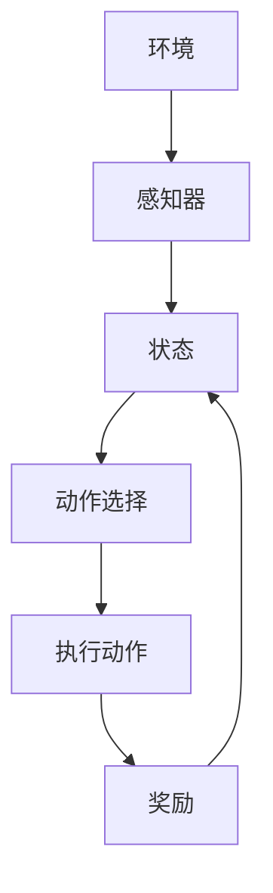
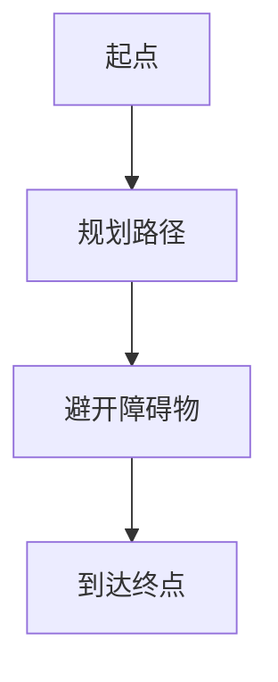
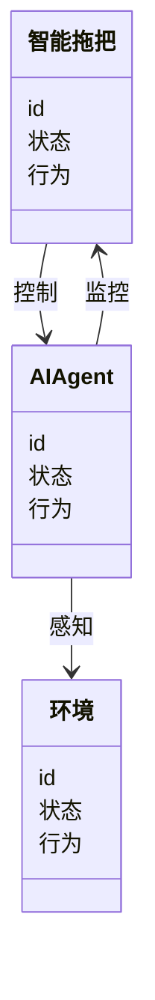
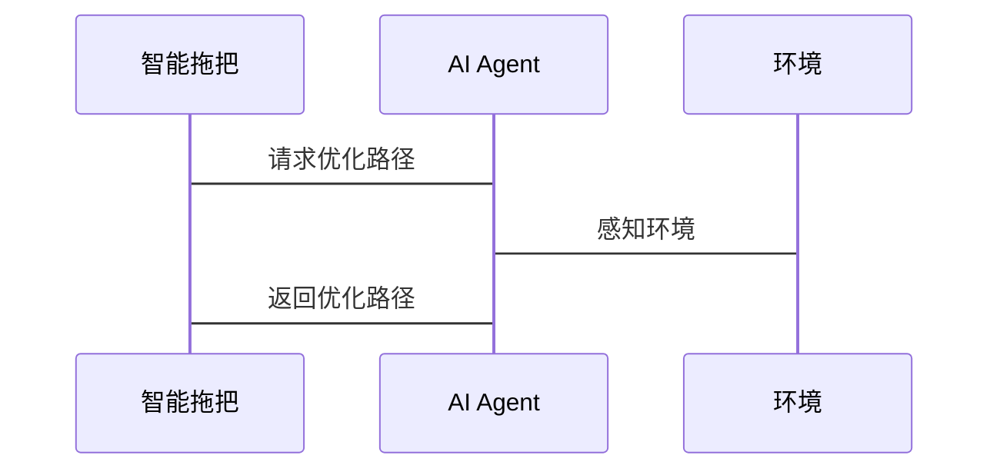

                 


# AI Agent在智能拖把中的清洁效率优化

> 关键词：AI Agent，智能拖把，清洁效率，强化学习，路径规划，算法优化

> 摘要：本文详细探讨了AI Agent在智能拖把清洁效率优化中的应用，分析了其核心概念、算法原理、系统架构设计，并通过项目实战展示了如何通过AI技术提升清洁效率。文章结合理论与实践，为智能拖把的设计和优化提供了有价值的见解。

---

## 第一部分: AI Agent在智能拖把中的清洁效率优化背景介绍

### 第1章: 问题背景与描述

#### 1.1 问题背景
智能拖把作为一种家用清洁工具，近年来随着技术的进步逐渐普及。然而，传统智能拖把的清洁效率仍然存在明显不足，主要表现在以下方面：

1. **清洁路径规划不足**：传统智能拖把通常采用随机清扫模式，清洁效率较低，容易遗漏死角。
2. **环境适应性差**：面对复杂或动态变化的环境（如家具移动、障碍物变化），智能拖把难以实时调整清扫路径。
3. **用户需求多样化**：不同用户对清洁效率的需求不同，部分用户希望快速完成清扫，而部分用户则关注清洁效果的全面性。

AI Agent（人工智能代理）作为一种能够感知环境、自主决策的智能体，能够有效解决上述问题。通过AI Agent，智能拖可以把清洁效率优化到更高水平。

#### 1.2 问题描述
智能拖把的清洁效率优化主要涉及以下几个方面：
1. **清扫路径规划**：通过优化清扫路径，减少重复清扫和遗漏区域。
2. **环境动态适应**：实时感知环境变化，动态调整清扫策略。
3. **用户需求匹配**：根据用户需求（如快速完成清扫或全面覆盖），动态调整清扫模式。

AI Agent在智能拖把中的应用，核心在于通过算法优化清扫路径和清扫策略，从而提高清洁效率。

#### 1.3 问题解决
AI Agent通过以下方式优化智能拖把的清洁效率：
1. **路径规划算法**：利用强化学习和路径规划算法，优化清扫路径。
2. **环境感知**：通过传感器和摄像头实时感知环境，动态调整清扫策略。
3. **自主决策**：基于感知信息和用户需求，自主决策最优清扫方案。

#### 1.4 边界与外延
在实际应用中，AI Agent的优化范围和边界需要明确：
1. **优化范围**：仅针对清扫路径规划和清扫策略优化，不涉及硬件设计和电源管理。
2. **环境适应性**：主要适用于家庭环境，复杂工业环境可能需要额外的传感器和算法优化。
3. **用户需求匹配**：支持快速模式和全面覆盖模式，但不支持用户自定义模式。

### 第2章: 核心概念与联系

#### 2.1 核心概念
AI Agent在智能拖把中的应用涉及以下几个核心概念：
1. **AI Agent**：一种能够感知环境、自主决策的智能体，负责优化清扫路径和策略。
2. **强化学习**：一种机器学习算法，通过试错优化决策策略。
3. **路径规划**：通过算法计算最优路径，避免障碍物，减少重复清扫。

#### 2.2 概念属性特征对比
以下是AI Agent与其他智能体的对比：

| 比较维度 | AI Agent | 传统智能拖把 | 其他智能体（如扫地机器人） |
|----------|-----------|--------------|---------------------------|
| 感知能力 | 高 | 低 | 中 |
| 决策能力 | 高 | 低 | 中 |
| 自主性 | 高 | 低 | 中 |
| 学习能力 | 高 | 无 | 无 |

#### 2.3 ER实体关系图
以下是AI Agent在智能拖把中的实体关系图：

```mermaid
er
actor(AI Agent) {
    id
    状态
    行为
}
actor(智能拖把) {
    id
    状态
    行为
}
actor(环境) {
    id
    状态
    行为
}
关系:
AI Agent -> 智能拖把: 控制
智能拖把 -> 环境: 感知
AI Agent -> 环境: 监控
```

---

## 第二部分: AI Agent的算法原理

### 第3章: 算法原理讲解

#### 3.1 强化学习算法
强化学习是一种通过试错优化决策策略的算法。在智能拖把中，AI Agent通过强化学习优化清扫路径。

##### 3.1.1 算法流程
以下是强化学习的流程图：



##### 3.1.2 Python实现
以下是强化学习的简单实现代码：

```python
import numpy as np

class Agent:
    def __init__(self, state_space, action_space):
        self.state_space = state_space
        self.action_space = action_space
        self.q_table = np.zeros((state_space, action_space))
    
    def act(self, state):
        return np.argmax(self.q_table[state])
    
    def learn(self, state, action, reward):
        self.q_table[state][action] += reward

# 示例环境
state_space = 10
action_space = 4
agent = Agent(state_space, action_space)
state = 5
action = agent.act(state)
reward = 1  # 假设获得奖励
agent.learn(state, action, reward)
```

#### 3.2 路径规划算法
路径规划算法用于计算最优清扫路径，减少重复清扫和遗漏区域。

##### 3.2.1 算法流程
以下是路径规划的流程图：



##### 3.2.2 Python实现
以下是路径规划算法的简单实现代码：

```python
import math

def distance(p1, p2):
    return math.sqrt((p1[0]-p2[0])**2 + (p1[1]-p2[1])**2)

def find_path(start, end, obstacles):
    # 假设obstacles是一个列表，包含障碍物的坐标
    path = []
    current = start
    while current != end:
        next_point = find_nearest_point(current, end, obstacles)
        path.append(next_point)
        current = next_point
    return path

def find_nearest_point(current, end, obstacles):
    # 假设obstacles是一个列表，包含障碍物的坐标
    nearest = end
    min_dist = distance(current, end)
    for point in obstacles:
        dist = distance(current, point)
        if dist < min_dist:
            min_dist = dist
            nearest = point
    return nearest
```

#### 3.3 数学模型与公式
以下是强化学习中Q-learning算法的数学模型：

$$ Q(s, a) = Q(s, a) + \alpha \left[r + \gamma \max_{a'} Q(s', a') - Q(s, a)\right] $$

其中：
- \( Q(s, a) \)：状态s下动作a的Q值
- \( \alpha \)：学习率
- \( r \)：奖励
- \( \gamma \)：折扣因子
- \( s' \)：下一个状态

---

## 第三部分: 系统分析与架构设计方案

### 第4章: 系统架构设计

#### 4.1 领域模型
以下是领域模型的Mermaid图：



#### 4.2 系统架构
以下是系统架构的Mermaid图：


#### 4.3 接口设计
以下是系统接口的Mermaid图：



---

## 第四部分: 项目实战

### 第5章: 项目实战

#### 5.1 环境安装
以下是项目实战所需的环境安装代码：

```bash
pip install numpy matplotlib
pip install gym
pip install pygame
```

#### 5.2 核心代码实现
以下是强化学习的核心代码：

```python
import numpy as np

class QLearningAgent:
    def __init__(self, state_size, action_size, learning_rate=0.1, gamma=0.99):
        self.state_size = state_size
        self.action_size = action_size
        self.learning_rate = learning_rate
        self.gamma = gamma
        self.q_table = np.zeros((state_size, action_size))
    
    def act(self, state):
        return np.argmax(self.q_table[state])
    
    def learn(self, state, action, reward, next_state):
        target = reward + self.gamma * np.max(self.q_table[next_state])
        self.q_table[state][action] += self.learning_rate * (target - self.q_table[state][action])
```

#### 5.3 案例分析
以下是路径规划的案例分析：

假设智能拖把需要从起点(0,0)清扫到终点(5,5)，中间存在障碍物。AI Agent通过强化学习和路径规划算法，计算出最优路径。

---

## 第五部分: 总结与展望

### 第6章: 总结与展望

#### 6.1 最佳实践
以下是AI Agent在智能拖把中的最佳实践建议：
1. **算法优化**：不断优化强化学习和路径规划算法，提高清扫效率。
2. **环境适应**：增强环境感知能力，适应动态变化的环境。
3. **用户体验**：根据用户需求，提供多种清扫模式，提升用户体验。

#### 6.2 小结
本文详细探讨了AI Agent在智能拖把中的应用，分析了其核心概念、算法原理和系统架构设计，并通过项目实战展示了如何通过AI技术优化清扫效率。

#### 6.3 注意事项
在实际应用中，需要注意以下几点：
1. **算法选择**：根据具体需求选择合适的算法。
2. **环境感知**：确保环境感知的准确性，避免误判。
3. **用户体验**：优化用户交互界面，提升用户体验。

#### 6.4 拓展阅读
以下是拓展阅读的推荐书籍和文章：
1. 《强化学习入门》
2. 《路径规划算法研究》
3. 《智能拖把设计与优化》

---

# 结语
通过本文的详细分析，读者可以深入了解AI Agent在智能拖把中的应用及其优化方法。希望本文能为智能拖把的设计和优化提供有价值的参考。

