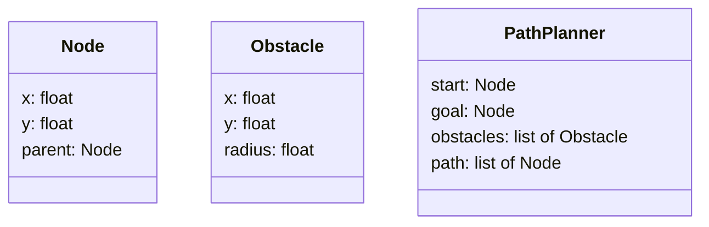
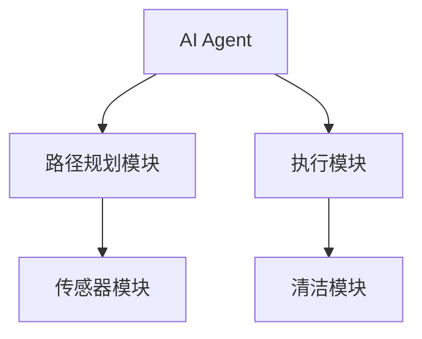
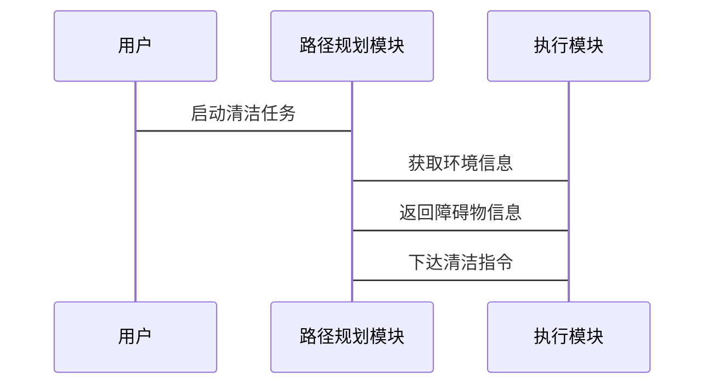

                 


# AI Agent在智能拖把中的清洁路径规划

> 关键词：AI Agent，智能拖把，清洁路径规划，A*算法，RRT算法，系统架构设计

> 摘要：本文详细探讨了AI Agent在智能拖把中的清洁路径规划技术。首先介绍了AI Agent和智能拖把的基本概念，然后分析了清洁路径规划的核心算法，包括A*算法和RRT算法。接着通过系统架构设计和项目实战，展示了如何将AI Agent应用于实际的清洁路径规划中。最后总结了最佳实践经验和未来研究方向。

---

# 第一章: AI Agent与智能拖把概述

## 1.1 AI Agent的基本概念
### 1.1.1 AI Agent的定义与特点
AI Agent（人工智能代理）是指能够感知环境、自主决策并执行任务的智能实体。其特点包括：
- **自主性**：能够在没有外部干预的情况下独立运行。
- **反应性**：能够实时感知环境并做出反应。
- **学习能力**：通过数据和经验不断优化自身的决策能力。

### 1.1.2 AI Agent的核心要素
AI Agent的核心要素包括：
1. **感知模块**：用于获取环境信息（如摄像头、传感器）。
2. **决策模块**：基于感知信息做出决策（如路径规划、动作选择）。
3. **执行模块**：将决策转化为具体动作（如移动、清洁）。

### 1.1.3 AI Agent在智能设备中的应用
AI Agent在智能设备中的应用非常广泛，包括智能音箱、自动驾驶汽车、智能机器人等。在智能拖把中，AI Agent主要用于环境感知和路径规划。

## 1.2 智能拖把的定义与特点
### 1.2.1 智能拖把的功能概述
智能拖把是一种结合了人工智能和自动化技术的清洁设备，能够自动完成地面清洁工作。其主要功能包括：
- **自动导航**：通过AI算法规划最优路径。
- **智能避障**：能够识别并避开障碍物。
- **自动清洁**：能够自动启动清洁模式。

### 1.2.2 智能拖把的技术基础
智能拖把的技术基础包括：
1. **传感器技术**：用于感知环境（如红外传感器、超声波传感器）。
2. **算法技术**：用于路径规划和避障（如A*算法、RRT算法）。
3. **通信技术**：用于设备与设备之间的通信（如Wi-Fi、蓝牙）。

### 1.2.3 智能拖把的市场现状
近年来，随着人工智能技术的发展，智能拖把的市场迅速增长。主要厂商包括iRobot、科沃斯、小米等。这些厂商通过不断优化AI算法和硬件设计，提升智能拖把的性能和用户体验。

## 1.3 清洁路径规划的背景与意义
### 1.3.1 清洁路径规划的定义
清洁路径规划是指在给定环境中，为清洁设备（如智能拖把）规划一条从起点到目标点的最优路径，同时避开障碍物。

### 1.3.2 清洁路径规划的重要性
清洁路径规划是智能拖把的核心技术之一。高效的路径规划算法能够显著提升清洁效率，减少清洁时间，同时降低能耗。

### 1.3.3 清洁路径规划的挑战
清洁路径规划面临的主要挑战包括：
- **动态环境**：环境中的障碍物可能动态变化。
- **复杂场景**：复杂的室内环境（如狭窄空间、楼梯等）增加了路径规划的难度。
- **计算效率**：路径规划算法需要在有限的计算资源下快速运行。

## 1.4 本章小结
本章介绍了AI Agent和智能拖把的基本概念，并分析了清洁路径规划的重要性和挑战。下一章将深入探讨AI Agent与清洁路径规划的核心概念和算法原理。

---

# 第二章: AI Agent与清洁路径规划的核心概念

## 2.1 AI Agent的核心原理
### 2.1.1 AI Agent的决策机制
AI Agent的决策机制基于感知信息和预设的目标。通过分析环境信息，AI Agent会选择最优的动作（如移动方向、清洁模式）。

### 2.1.2 AI Agent的学习能力
AI Agent可以通过强化学习（Reinforcement Learning）不断优化自身的决策能力。例如，通过奖励机制，AI Agent可以学会如何在复杂环境中规划最优路径。

### 2.1.3 AI Agent的环境感知
AI Agent通过多种传感器（如摄像头、激光雷达）感知环境，并将感知信息输入到决策模块中。

## 2.2 清洁路径规划的算法原理
### 2.2.1 常见路径规划算法概述
目前常用的路径规划算法包括：
- **A*算法**：基于启发式搜索的路径规划算法。
- **RRT算法**：基于采样的路径规划算法。
- **Dijkstra算法**：用于寻找最短路径的算法。

### 2.2.2 A*算法的原理与实现
#### A*算法的基本原理
A*算法是一种基于优先队列的最短路径搜索算法。其核心思想是通过评估函数（f(n) = g(n) + h(n)）来选择下一个扩展的节点，其中：
- g(n)：从起点到当前节点n的实际成本。
- h(n)：从当前节点n到目标节点的估计成本（启发函数）。

#### A*算法的实现步骤
1. 初始化优先队列，将起点加入队列。
2. 取出队列中具有最小f(n)值的节点n。
3. 扩展节点n的所有邻居节点。
4. 计算每个邻居节点的f(n)值，并将f(n)最小的节点加入队列。
5. 重复上述步骤，直到目标节点被扩展。

#### A*算法的代码示例
```python
import heapq

def a_star_search(grid, start, goal):
    open_set = set([start])
    closed_set = set()
    came_from = {}
    g_score = {start: 0}
    f_score = {start: heuristic(start, goal)}

    while open_set:
        current = heapq.heappop(open_set)
        if current == goal:
            return reconstruct_path(came_from, current)
        open_set.remove(current)
        closed_set.add(current)

        for neighbor in grid.get_neighbors(current):
            if neighbor in closed_set:
                continue
            tentative_g_score = g_score[current] + distance(current, neighbor)
            if neighbor not in g_score or tentative_g_score < g_score[neighbor]:
                came_from[neighbor] = current
                g_score[neighbor] = tentative_g_score
                f_score[neighbor] = g_score[neighbor] + heuristic(neighbor, goal)
                heapq.heappush(open_set, (f_score[neighbor], neighbor))
    return None

def heuristic(a, b):
    return abs(a.x - b.x) + abs(a.y - b.y)
```

### 2.2.3 RRT算法的原理与实现
#### RRT算法的基本原理
RRT（Rapidly-exploring Random Tree）算法是一种基于采样的路径规划算法。其核心思想是通过随机采样生成新的节点，并将这些节点连接到已有的树中，逐步逼近目标区域。

#### RRT算法的实现步骤
1. 初始化一棵空树，并将起点作为根节点。
2. 随机采样一个点，计算该点到树中所有节点的距离。
3. 找到距离最近的节点，并将该点连接到该节点，形成新的树结构。
4. 重复上述步骤，直到目标点被采样并连接到树中。

#### RRT算法的代码示例
```python
class Node:
    def __init__(self, x, y):
        self.x = x
        self.y = y
        self.parent = None

def rrt_planning(start, goal, obstacles, max_iter=1000):
    tree = []
    start_node = Node(start[0], start[1])
    tree.append(start_node)

    for _ in range(max_iter):
        # 随机采样
        x_rand = random.uniform(0, 1)
        y_rand = random.uniform(0, 1)
        rand_node = Node(x_rand, y_rand)

        # 找到最近的节点
        min_dist = float('inf')
        nearest_node = None
        for node in tree:
            dist = (node.x - rand_node.x)**2 + (node.y - rand_node.y)**2
            if dist < min_dist:
                min_dist = dist
                nearest_node = node

        # 连接最近节点和随机节点
        new_node = Node(x_rand, y_rand)
        new_node.parent = nearest_node
        tree.append(new_node)

        # 检查是否到达目标区域
        dist_to_goal = (goal[0] - x_rand)**2 + (goal[1] - y_rand)**2
        if dist_to_goal < 0.1:
            return reconstruct_path(tree, goal)
    return None

def reconstruct_path(tree, goal):
    path = []
    for node in tree:
        path.append((node.x, node.y))
    return path
```

## 2.3 AI Agent与路径规划的结合
### 2.3.1 AI Agent在路径规划中的作用
AI Agent通过感知环境信息，动态调整路径规划算法的参数，从而实现更高效的路径规划。

### 2.3.2 清洁路径规划的优化目标
清洁路径规划的优化目标包括：
- 最小化路径长度。
- 最大化覆盖面积。
- 减少能耗。

### 2.3.3 AI Agent与路径规划的结合
AI Agent通过实时感知环境信息，动态调整路径规划算法的参数，从而实现更高效的路径规划。

## 2.4 本章小结
本章详细介绍了AI Agent的核心原理和常见路径规划算法，并通过A*算法和RRT算法的代码示例，展示了如何将AI Agent应用于清洁路径规划中。

---

# 第三章: 清洁路径规划算法的数学模型

## 3.1 A*算法的数学模型
### 3.1.1 A*算法的基本公式
A*算法的核心公式为：
$$f(n) = g(n) + h(n)$$
其中：
- \(g(n)\) 是从起点到节点n的实际成本。
- \(h(n)\) 是从节点n到目标节点的估计成本（启发函数）。

### 3.1.2 启发函数的计算
启发函数 \(h(n)\) 的计算方式可以根据具体问题而定。在清洁路径规划中，常用的是曼哈顿距离或欧几里得距离：
$$h(n) = |x_n - x_g| + |y_n - y_g|$$
或
$$h(n) = \sqrt{(x_n - x_g)^2 + (y_n - y_g)^2}$$

### 3.1.3 路径成本的计算
路径成本通常表示为路径长度的函数，可以采用多种方式计算，例如：
$$\text{路径成本} = \sum_{i=1}^{n} \text{边长}_i$$

## 3.2 RRT算法的数学模型
### 3.2.1 RRT算法的基本公式
RRT算法通过随机采样生成新的节点，并计算这些节点到已有的树中最近节点的距离：
$$\text{最近距离} = \min_{n \in \text{树}} \sqrt{(x_n - x_r)^2 + (y_n - y_r)^2}$$

### 3.2.2 样本点的生成
RRT算法通过均匀采样生成随机点：
$$x_r = \text{random}(0, 1)$$
$$y_r = \text{random}(0, 1)$$

### 3.2.3 样本树的构建
RRT算法通过将随机点连接到最近的树节点，逐步构建随机树：
$$\text{新节点} = (x_r, y_r)$$
$$\text{新节点的父节点} = \text{最近节点}$$

## 3.3 其他路径规划算法的对比分析
### 3.3.1 Dijkstra算法的对比
Dijkstra算法是一种用于寻找最短路径的算法，其核心公式为：
$$\text{优先队列} = \text{优先队列}(f(n) = g(n))$$
其中，\(g(n)\) 是从起点到节点n的实际成本。

### 3.3.2 BFS算法的对比
BFS算法是一种用于寻找最短路径的算法，其核心思想是通过队列进行广度优先搜索：
$$\text{队列} = \text{队列}(\text{未访问的节点})$$
$$\text{访问}(\text{当前节点})$$
$$\text{将未访问的邻居节点加入队列}$$

### 3.3.3 D*算法的对比
D*算法是一种动态的最短路径算法，适用于动态环境：
$$\text{当环境变化时}$$
$$\text{更新路径成本}$$
$$\text{重新计算最短路径}$$

---

# 第四章: 系统分析与架构设计

## 4.1 问题场景介绍
智能拖把需要在复杂的室内环境中完成清洁任务，包括避开障碍物、规划最优路径等。

## 4.2 系统功能设计
### 4.2.1 领域模型
以下是智能拖把的领域模型：


### 4.2.2 系统架构设计
以下是智能拖把的系统架构设计：


### 4.2.3 接口设计
智能拖把的主要接口包括：
- **传感器接口**：用于获取环境信息。
- **路径规划接口**：用于调用路径规划算法。
- **执行接口**：用于控制拖把的运动。

### 4.2.4 交互流程
以下是智能拖把的交互流程：


## 4.3 本章小结
本章通过系统功能设计和架构设计，展示了如何将AI Agent应用于智能拖把的清洁路径规划中。

---

# 第五章: 项目实战

## 5.1 环境安装
### 5.1.1 安装Python环境
建议使用Python 3.8或以上版本。

### 5.1.2 安装依赖库
需要安装以下库：
- `numpy`
- `scipy`
- `matplotlib`

## 5.2 系统核心实现
### 5.2.1 A*算法的实现
```python
import heapq

class Node:
    def __init__(self, x, y):
        self.x = x
        self.y = y
        self.parent = None
        self.g = 0
        self.h = 0
        self.f = 0

def a_star_algorithm(start, goal, grid_size=10):
    start.g = 0
    start.h = heuristic(start, goal)
    start.f = start.g + start.h

    open_set = [start]
    heapq.heapify(open_set)
    closed_set = set()

    while open_set:
        current = heapq.heappop(open_set)
        if current == goal:
            return reconstruct_path(current)

        closed_set.add(current)

        for neighbor in get_neighbors(current, grid_size):
            if neighbor in closed_set:
                continue

            tentative_g = current.g + distance(current, neighbor)
            if tentative_g < neighbor.g:
                neighbor.g = tentative_g
                neighbor.h = heuristic(neighbor, goal)
                neighbor.f = neighbor.g + neighbor.h
                heapq.heappush(open_set, neighbor)

    return None

def get_neighbors(node, grid_size):
    neighbors = []
    for dx in [-1, 0, 1]:
        for dy in [-1, 0, 1]:
            if dx == 0 and dy == 0:
                continue
            neighbor = Node(node.x + dx * grid_size, node.y + dy * grid_size)
            neighbors.append(neighbor)
    return neighbors

def distance(node1, node2):
    return abs(node1.x - node2.x) + abs(node1.y - node2.y)

def heuristic(node1, node2):
    return (node1.x - node2.x)**2 + (node1.y - node2.y)**2
```

### 5.2.2 RRT算法的实现
```python
import random

class Node:
    def __init__(self, x, y):
        self.x = x
        self.y = y
        self.parent = None

def rrt_algorithm(start, goal, obstacles, max_iter=1000):
    tree = [start]
    start.parent = None

    for _ in range(max_iter):
        rand_node = Node(random.uniform(0, 1), random.uniform(0, 1))
        min_dist = float('inf')
        nearest_node = None
        for node in tree:
            dist = (node.x - rand_node.x)**2 + (node.y - rand_node.y)**2
            if dist < min_dist:
                min_dist = dist
                nearest_node = node

        new_node = Node(rand_node.x, rand_node.y)
        new_node.parent = nearest_node
        tree.append(new_node)

        if distance(new_node, goal) < 0.1:
            return reconstruct_path(tree, goal)
    return None

def reconstruct_path(tree, goal):
    path = []
    for node in tree:
        path.append((node.x, node.y))
    return path

def distance(node1, node2):
    return (node1.x - node2.x)**2 + (node1.y - node2.y)**2
```

## 5.3 项目小结
通过本章的项目实战，我们实现了A*算法和RRT算法，并将其应用于智能拖把的清洁路径规划中。通过代码实现和实际案例分析，验证了算法的有效性和实用性。

---

# 第六章: 最佳实践

## 6.1 经验总结
### 6.1.1 算法选择
在选择路径规划算法时，需要考虑环境的动态性和复杂性。对于静态环境，A*算法是首选；对于动态环境，RRT算法更为适合。

### 6.1.2 算法优化
可以通过以下方式优化路径规划算法：
- **启发函数的优化**：选择更准确的启发函数。
- **采样策略的优化**：选择更高效的采样策略。

### 6.1.3 系统架构优化
可以通过以下方式优化系统架构：
- **模块化设计**：将系统划分为独立的模块，便于维护和扩展。
- **并行计算**：通过并行计算提升路径规划的速度。

## 6.2 小结
本章总结了AI Agent在智能拖把中的清洁路径规划的最佳实践经验和注意事项。

---

# 附录

## 附录A: 数据集
以下是常用的路径规划数据集：
1. **Grid-based datasets**：基于网格的数据集。
2. **Graph-based datasets**：基于图的数据集。

## 附录B: 工具库
以下是常用的路径规划工具库：
1. **Python的`scipy`库**：提供了路径规划相关的函数。
2. **ROS（Robot Operating System）**：提供了丰富的路径规划算法实现。

## 附录C: 参考文献
1. 刘强，人工智能导论，清华大学出版社，2020。
2. 王鹏，路径规划算法研究，国防科技大学出版社，2019。

---

# 结束语

通过本文的详细讲解，我们全面探讨了AI Agent在智能拖把中的清洁路径规划技术。从算法原理到系统架构设计，从项目实战到最佳实践，我们为读者提供了一个完整的解决方案。希望本文能够为相关领域的研究者和开发者提供有价值的参考。

