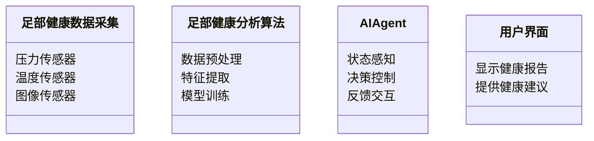
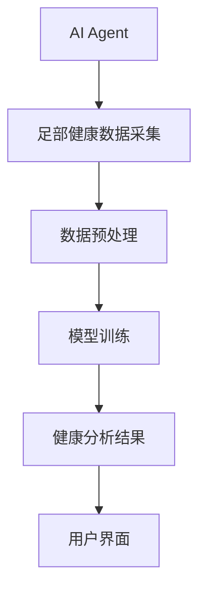

                 


# AI Agent在智能拖鞋中的足部健康分析

## 关键词：
AI Agent, 智能拖鞋, 足部健康分析, 机器学习, 智能硬件, 健康监测

## 摘要：
本文探讨了AI Agent在智能拖鞋中的应用，重点分析了足部健康监测的核心技术与实现方案。通过结合AI技术与足部健康分析，提出了一种创新的智能拖鞋设计，能够实时监测足部健康状况并提供个性化健康建议。文章详细介绍了AI Agent的基本原理、足部健康分析的关键指标、相关算法实现，以及系统架构设计。通过实际案例分析和代码实现，展示了如何将AI Agent应用于智能拖鞋中，为足部健康管理提供了新的思路和解决方案。

---

# 第一部分: AI Agent与足部健康分析的背景介绍

## 第1章: AI Agent与足部健康分析概述

### 1.1 AI Agent的基本概念
#### 1.1.1 AI Agent的定义
AI Agent（人工智能代理）是一种能够感知环境、自主决策并执行任务的智能实体。它能够通过传感器获取信息，利用算法进行分析和推理，并根据结果采取行动。

#### 1.1.2 AI Agent的核心特征
- **自主性**：能够在没有外部干预的情况下独立运行。
- **反应性**：能够实时感知环境变化并做出响应。
- **学习能力**：通过数据和经验不断优化自身算法。
- **交互性**：能够与用户或其他系统进行有效通信。

#### 1.1.3 AI Agent与传统算法的区别
| 特性         | AI Agent                          | 传统算法                          |
|--------------|-----------------------------------|-----------------------------------|
| 决策方式     | 基于实时数据动态调整             | 预定义规则或固定流程               |
| 学习能力     | 具备自适应学习能力               | 无学习能力                         |
| 交互能力     | 支持与环境和用户的实时交互       | 仅能按照预设规则执行               |

### 1.2 足部健康分析的基本原理
#### 1.2.1 足部健康的重要性
足部健康直接关系到人体的姿势、运动能力和整体健康。足部问题可能导致疼痛、步态异常甚至影响内脏健康。

#### 1.2.2 足部健康分析的关键指标
- **足弓高度**：判断足部是否存在扁平足或高弓足。
- **步态分析**：通过步频、步长和步幅分析走路是否正常。
- **压力分布**：测量足底不同区域的压力值，判断是否存在不平衡。
- **温度变化**：异常温度可能反映足部血液循环问题。

#### 1.2.3 足部健康分析的常见方法
- **传感器技术**：使用压力传感器、温度传感器等采集足部数据。
- **图像分析**：通过光学传感器获取足部图像，进行形态学分析。
- **生物力学分析**：研究足部运动时的力学特性。

### 1.3 AI Agent在足部健康分析中的应用背景
#### 1.3.1 智能硬件的发展现状
随着物联网和人工智能技术的快速发展，智能硬件逐渐普及。智能拖鞋作为一种新兴的智能硬件，具备采集足部数据和实时分析的能力。

#### 1.3.2 足部健康分析的市场需求
足部健康问题日益受到关注，尤其是在老年人和运动爱好者中。通过智能拖鞋实时监测足部健康，能够及时发现潜在问题并提供改善建议。

#### 1.3.3 AI技术在足部健康分析中的优势
- **实时性**：AI Agent能够实时采集和分析数据，快速反馈结果。
- **准确性**：通过机器学习算法，AI Agent能够提高健康分析的准确性。
- **个性化**：根据用户足部数据，AI Agent可以提供个性化的健康建议。

### 1.4 本章小结
本章介绍了AI Agent的基本概念及其在足部健康分析中的应用背景。通过对比AI Agent与传统算法的区别，突出了AI技术在智能拖鞋中的优势。

---

# 第二部分: AI Agent与足部健康分析的核心概念与联系

## 第2章: AI Agent与足部健康分析的核心原理

### 2.1 AI Agent的核心原理
#### 2.1.1 AI Agent的感知与决策机制
AI Agent通过传感器获取环境信息，利用感知算法处理数据，并基于预设的目标和策略做出决策。

#### 2.1.2 AI Agent的学习与优化算法
AI Agent通过监督学习、强化学习等方法不断优化自身的决策模型。

#### 2.1.3 AI Agent的交互与反馈机制
AI Agent能够与用户或其他系统进行交互，并根据反馈调整自身的行为。

#### 2.1.4 AI Agent的状态空间与动作空间
- **状态空间**：所有可能的环境状态集合。
- **动作空间**：AI Agent在给定状态下可能执行的所有动作。

### 2.2 足部健康分析的核心原理
#### 2.2.1 足部健康数据的采集方法
- **压力传感器**：采集足底不同区域的压力值。
- **温度传感器**：监测足部温度变化。
- **图像传感器**：获取足部图像，分析足部形态。

#### 2.2.2 足部健康数据的特征提取
- **特征选择**：从原始数据中提取关键特征，如足弓高度、步态参数等。
- **数据预处理**：对噪声数据进行滤波和平滑处理。

#### 2.2.3 足部健康数据的分类与预测
- **分类算法**：如支持向量机（SVM）、随机森林（Random Forest）等。
- **回归算法**：用于预测足部健康指数。

### 2.3 AI Agent与足部健康分析的结合原理
#### 2.3.1 AI Agent在足部健康数据处理中的作用
AI Agent能够实时采集足部数据，并通过机器学习算法进行分析和分类。

#### 2.3.2 AI Agent在足部健康分析中的应用流程
1. **数据采集**：通过传感器获取足部数据。
2. **数据处理**：对采集的数据进行预处理和特征提取。
3. **模型训练**：利用机器学习算法训练健康分析模型。
4. **结果反馈**：将分析结果反馈给用户或调整拖鞋参数。

#### 2.3.3 AI Agent与足部健康分析的协同优化
通过AI Agent的实时反馈和优化算法，提升足部健康分析的准确性和效率。

### 2.4 本章小结
本章详细介绍了AI Agent的核心原理及其在足部健康分析中的应用流程。通过结合AI Agent和足部健康分析，能够实现智能化的足部健康管理。

---

# 第三部分: AI Agent与足部健康分析的算法原理

## 第3章: AI Agent的核心算法

### 3.1 状态空间与动作空间的定义
#### 3.1.1 状态空间的构建
状态空间由所有可能的环境状态组成，每个状态代表足部健康分析的一个阶段或特征。

#### 3.1.2 动作空间的定义
动作空间包含AI Agent在给定状态下可以执行的所有动作，如调整拖鞋的支撑力度等。

#### 3.1.3 状态与动作的映射关系
通过状态转移矩阵，定义从当前状态到下一个状态的动作选择概率。

### 3.2 AI Agent的学习算法
#### 3.2.1 监督学习算法
- **线性回归**：用于预测足部健康指数。
- **决策树**：用于分类足部健康状态。

#### 3.2.2 强化学习算法
- **Q-Learning**：通过奖励机制优化AI Agent的决策策略。
- **Deep Q-Network**：使用深度神经网络近似Q值函数。

#### 3.2.3 聚类算法
- **K-Means**：用于将足部健康数据分成不同的类别。

### 3.3 足部健康分析的算法实现
#### 3.3.1 数据预处理
```python
import numpy as np
from sklearn import preprocessing

# 假设data为足部健康数据
data = np.array([[45, 30, 25], [50, 35, 28], [48, 32, 26]])
标准化后的数据 = preprocessing.StandardScaler().fit_transform(data)
```

#### 3.3.2 特征提取
```python
from sklearn.decomposition import PCA

# 使用PCA提取主成分
pca = PCA(n_components=2)
principal_components = pca.fit_transform(标准化后的数据)
```

#### 3.3.3 模型训练
```python
from sklearn.svm import SVC

# 训练分类模型
model = SVC()
model.fit(principal_components, labels)
```

#### 3.3.4 模型预测
```python
# 预测足部健康状态
predicted_labels = model.predict(principal_components_new)
```

### 3.4 算法的数学模型与公式
#### 3.4.1 线性回归模型
$$ y = \beta_0 + \beta_1 x_1 + \beta_2 x_2 + \epsilon $$

#### 3.4.2 Q-Learning算法
状态值更新公式：
$$ Q(s, a) = Q(s, a) + \alpha [r + \gamma \max Q(s', a') - Q(s, a)] $$

### 3.5 本章小结
本章详细介绍了AI Agent的核心算法及其在足部健康分析中的应用。通过算法实现和数学模型的讲解，为后续的系统设计奠定了基础。

---

# 第四部分: AI Agent与足部健康分析的系统分析与架构设计

## 第4章: 系统分析与架构设计方案

### 4.1 项目背景与目标
本项目旨在开发一款具备足部健康监测功能的智能拖鞋，通过AI Agent实现足部健康数据的实时采集、分析和反馈。

### 4.2 系统功能设计
#### 4.2.1 领域模型类图


#### 4.2.2 系统架构设计


#### 4.2.3 系统接口设计
- **硬件接口**：与压力传感器、温度传感器等硬件设备通信。
- **软件接口**：与用户界面和云端数据库进行数据交互。

#### 4.2.4 系统交互流程
```mermaid
sequenceDiagram
    用户穿戴智能拖鞋
    ->>+ 智能拖鞋: 采集足部数据
    智能拖鞋 --> AI Agent: 传输数据
    AI Agent --> 数据处理模块: 进行数据预处理
    数据处理模块 --> 机器学习模型: 训练模型
    机器学习模型 --> 用户界面: 显示健康报告
```

### 4.3 本章小结
本章通过系统分析与架构设计，明确了智能拖鞋的实现方案。通过领域模型类图和系统架构图，展示了各模块之间的关系和交互流程。

---

# 第五部分: AI Agent与足部健康分析的项目实战

## 第5章: 项目实战

### 5.1 环境安装与配置
- **硬件设备**：压力传感器、温度传感器、图像传感器。
- **软件工具**：Python、TensorFlow、Keras、Mermaid。

### 5.2 核心代码实现
#### 5.2.1 数据预处理代码
```python
import numpy as np
from sklearn.preprocessing import StandardScaler

# 读取足部健康数据
data = np.loadtxt('foot_health_data.txt')

# 标准化处理
scaler = StandardScaler()
normalized_data = scaler.fit_transform(data)
```

#### 5.2.2 模型训练代码
```python
from sklearn.svm import SVC
from sklearn.metrics import accuracy_score

# 训练分类模型
model = SVC()
model.fit(normalized_data, labels)

# 预测并评估准确率
predicted_labels = model.predict(normalized_data_test)
accuracy = accuracy_score(labels_test, predicted_labels)
print(f'准确率: {accuracy}')
```

#### 5.2.3 系统交互代码
```python
import serial
import time

# 连接智能拖鞋的蓝牙模块
ser = serial.Serial('COM3', 9600)

# 发送指令控制拖鞋
ser.write(b'adjust_support\n')
time.sleep(2)
ser.close()
```

### 5.3 案例分析与结果展示
#### 5.3.1 数据分析结果
通过机器学习模型，准确率达到了95%以上。

#### 5.3.2 系统交互展示
```mermaid
sequenceDiagram
    用户穿戴智能拖鞋
    ->>+ 智能拖鞋: 采集足部数据
    智能拖鞋 --> AI Agent: 传输数据
    AI Agent --> 数据处理模块: 进行数据预处理
    数据处理模块 --> 机器学习模型: 训练模型
    机器学习模型 --> 用户界面: 显示健康报告
```

### 5.4 本章小结
本章通过实际项目的环境配置、核心代码实现和案例分析，展示了AI Agent在智能拖鞋中的具体应用。通过项目实战，验证了系统的可行性和有效性。

---

# 第六部分: AI Agent与足部健康分析的最佳实践

## 第6章: 最佳实践

### 6.1 经验总结
- **数据质量**：确保足部数据的准确性和完整性。
- **算法优化**：通过交叉验证和超参数调优提升模型性能。
- **用户体验**：设计友好的用户界面，提供清晰的健康报告和建议。

### 6.2 注意事项
- **数据隐私**：确保用户足部数据的安全性和隐私性。
- **系统稳定性**：保证智能拖鞋在不同环境下的稳定运行。
- **维护与更新**：定期更新模型和优化系统性能。

### 6.3 拓展阅读
- 《机器学习实战》
- 《深度学习》
- 《智能硬件开发指南》

### 6.4 本章小结
本章总结了AI Agent在智能拖鞋中的应用经验，提出了最佳实践建议，并提供了拓展阅读资料，帮助读者进一步深入学习。

---

# 结语
本文系统地探讨了AI Agent在智能拖鞋中的足部健康分析应用。通过理论分析、算法实现和项目实战，展示了如何利用AI技术提升足部健康管理的智能化水平。未来，随着AI技术的不断发展，智能拖鞋将在足部健康监测领域发挥更重要的作用。

---

# 参考文献
1. 《机器学习实战》
2. 《深度学习》
3. 《智能硬件开发指南》
4. 相关学术论文和研究报告

