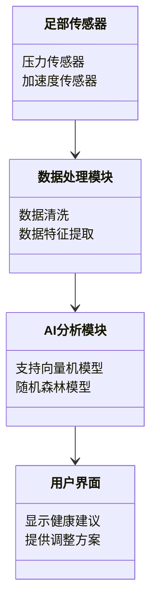
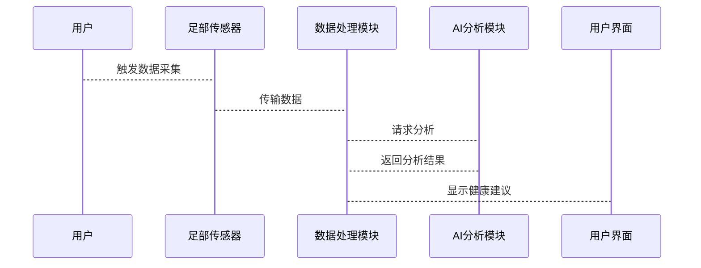

                 


# AI Agent在智能拖鞋中的足部健康分析

**关键词**：AI Agent，足部健康分析，智能拖鞋，传感器数据，机器学习算法，健康监测系统，人体工程学

**摘要**：本文探讨AI Agent在智能拖鞋中的应用，通过传感器数据和机器学习算法分析足部健康，帮助用户改善足部健康状况。文章详细介绍了AI Agent的工作原理、算法实现、系统架构及实际应用案例，为足部健康监测提供了一种创新的解决方案。

---

# 第一部分：AI Agent与足部健康分析的背景

## 第1章：AI Agent与足部健康分析的背景

### 1.1 足部健康的概述

#### 1.1.1 足部健康的重要性
足部是人体的重要组成部分，支撑身体重量并参与运动。足部健康直接影响行走姿势、运动能力和整体健康。常见的足部问题包括扁平足、高弓足、足底筋膜炎等，这些问题可能导致疼痛和运动障碍。

#### 1.1.2 足部健康问题的常见类型
- 扁平足：足弓扁平，可能导致足部疲劳和疼痛。
- 高弓足：足弓过高，可能影响步态和平衡。
- 足底筋膜炎：足底组织发炎，导致足跟疼痛。

#### 1.1.3 足部健康监测的技术发展
随着科技的进步，足部健康监测从传统的医疗手段逐渐转向智能化设备，如智能拖鞋。这些设备通过传感器采集足部数据，结合AI技术进行分析，提供实时反馈。

### 1.2 AI Agent的基本概念

#### 1.2.1 AI Agent的定义
AI Agent是一种智能代理，能够感知环境、执行任务并做出决策。它通过传感器获取数据，利用算法处理信息，从而实现自动化和智能化的目标。

#### 1.2.2 AI Agent的核心功能
- 数据采集：通过传感器获取环境和用户数据。
- 数据处理：分析和理解数据，提取有用信息。
- 决策与执行：基于分析结果做出决策并执行任务。

#### 1.2.3 AI Agent在智能设备中的应用
AI Agent广泛应用于智能家居、自动驾驶、医疗设备等领域。在智能拖鞋中，AI Agent通过分析足部数据，提供健康建议和舒适体验。

### 1.3 智能拖鞋的发展趋势

#### 1.3.1 智能拖鞋的定义与分类
智能拖鞋是一种集成传感器和AI技术的鞋类，能够监测足部健康和运动状态。根据功能不同，可分为健康监测型、运动分析型和舒适调节型。

#### 1.3.2 智能拖鞋的技术创新
- 高精度传感器：如压力传感器、加速度传感器，用于采集足部数据。
- AI算法：如机器学习和深度学习，用于分析数据并提供健康建议。

#### 1.3.3 AI Agent在智能拖鞋中的应用前景
AI Agent使智能拖鞋能够实时监测足部健康，提供个性化的健康建议，预防足部疾病，提升用户体验。

### 1.4 本章小结
本章介绍了足部健康的重要性及其监测技术的发展，详细阐述了AI Agent的基本概念和功能，并展望了AI Agent在智能拖鞋中的应用前景。

---

# 第二部分：AI Agent与足部健康分析的核心概念与联系

## 第2章：AI Agent与足部健康分析的核心概念

### 2.1 AI Agent的核心原理

#### 2.1.1 数据采集与处理
AI Agent通过传感器采集足部的压力、温度、湿度等数据，并进行预处理，去除噪声，提取特征。

#### 2.1.2 数据分析与推理
利用机器学习算法分析数据，识别足部健康问题，如足弓异常或步态不稳。

#### 2.1.3 结果输出与反馈
将分析结果输出给用户，提供健康建议和调整方案，例如建议更换鞋垫或调整站姿。

### 2.2 足部健康分析的关键指标

#### 2.2.1 足部压力分布
足部压力分布反映了足弓形状和步态特征，异常的压力分布可能导致足部疲劳和疼痛。

#### 2.2.2 足部姿态分析
姿态分析包括足部的倾斜角度和运动轨迹，帮助识别步态异常和足部结构问题。

#### 2.2.3 足部运动轨迹
通过分析足部运动轨迹，识别步频、步长和步态特征，为运动分析提供依据。

### 2.3 AI Agent与足部健康分析的关联

#### 2.3.1 数据流的关联性
从传感器数据到健康分析结果，AI Agent通过数据流处理，实现足部健康监测。

#### 2.3.2 算法的适用性
选择合适的机器学习算法，如支持向量机（SVM）和随机森林（RF），提高分析准确性。

#### 2.3.3 应用场景的匹配性
根据不同的应用场景，优化AI Agent的功能，确保其在智能拖鞋中的高效应用。

### 2.4 本章小结
本章深入探讨了AI Agent的核心原理和足部健康分析的关键指标，分析了AI Agent与足部健康分析的关联性，为后续算法实现和系统设计奠定了基础。

---

# 第三部分：AI Agent在足部健康分析中的算法原理

## 第3章：AI Agent的算法原理

### 3.1 数据预处理

#### 3.1.1 数据清洗
去除传感器数据中的噪声和错误值，确保数据的准确性。

#### 3.1.2 数据标准化
将不同传感器的数据标准化，使其具有可比性。

#### 3.1.3 数据特征提取
提取关键特征，如足部压力峰值和压力分布均匀性，为后续分析提供依据。

### 3.2 AI Agent的核心算法

#### 3.2.1 机器学习算法
- 支持向量机（SVM）：用于分类问题，如足部健康状态的分类。
- 随机森林（RF）：用于回归和分类，适合处理多特征数据。

#### 3.2.2 深度学习算法
- 卷积神经网络（CNN）：用于图像处理，适用于足部姿态分析。
- 循环神经网络（RNN）：用于时间序列分析，适用于步态特征提取。

#### 3.2.3 强化学习算法
- Q-Learning：用于动态调整AI Agent的决策策略，优化用户体验。

### 3.3 算法实现的数学模型

#### 3.3.1 线性回归模型
$$ y = \beta_0 + \beta_1x + \epsilon $$
其中，y为预测结果，x为自变量，$\beta_0$和$\beta_1$为回归系数，$\epsilon$为误差项。

#### 3.3.2 支持向量机模型
支持向量机通过构建超平面，将数据分为不同类别，适用于足部健康状态的分类。

#### 3.3.3 随机森林模型
随机森林通过集成多个决策树，提高分类准确率和鲁棒性。

### 3.4 本章小结
本章详细介绍了AI Agent在足部健康分析中的算法实现，包括数据预处理和核心算法的选择与实现，为后续系统设计提供了理论基础。

---

# 第四部分：系统分析与架构设计

## 第4章：系统分析与架构设计

### 4.1 问题场景介绍
智能拖鞋通过传感器采集足部数据，利用AI Agent分析足部健康，实时反馈健康建议。

### 4.2 系统功能设计

#### 4.2.1 领域模型类图


### 4.3 系统架构设计

#### 4.3.1 系统架构图
```mermaid
archi
    系统: 智能拖鞋
    系统 --> 足部传感器: 数据采集
    系统 --> 数据处理模块: 数据预处理
    系统 --> AI分析模块: 数据分析
    系统 --> 用户界面: 结果输出
```

### 4.4 系统交互设计

#### 4.4.1 系统交互序列图


### 4.5 本章小结
本章通过系统分析和架构设计，明确了智能拖鞋中各模块的功能和交互关系，为系统的实现奠定了基础。

---

# 第五部分：项目实战

## 第5章：项目实战

### 5.1 环境安装

#### 5.1.1 Python环境配置
安装Python 3.8及以上版本，安装必要的库，如numpy、scikit-learn、mermaid等。

#### 5.1.2 数据采集工具
使用Arduino或其他传感器采集足部数据，并通过蓝牙或Wi-Fi传输到智能拖鞋中的处理模块。

### 5.2 核心代码实现

#### 5.2.1 数据处理模块代码
```python
import numpy as np
from sklearn.preprocessing import StandardScaler

# 数据清洗
def data_cleaning(data):
    cleaned_data = data.dropna()
    return cleaned_data

# 数据标准化
def data_standardization(data):
    scaler = StandardScaler()
    standardized_data = scaler.fit_transform(data)
    return standardized_data
```

#### 5.2.2 AI分析模块代码
```python
from sklearn.svm import SVC
from sklearn.ensemble import RandomForestClassifier

# 训练支持向量机模型
def train_svm_model(X_train, y_train):
    svm_model = SVC()
    svm_model.fit(X_train, y_train)
    return svm_model

# 训练随机森林模型
def train_rf_model(X_train, y_train):
    rf_model = RandomForestClassifier()
    rf_model.fit(X_train, y_train)
    return rf_model
```

### 5.3 案例分析

#### 5.3.1 数据分析结果
通过对某用户的足部数据进行分析，发现其足部压力分布异常，建议调整鞋垫形状以缓解足部压力。

#### 5.3.2 健康建议
基于分析结果，系统建议用户穿着定制鞋垫，并调整站姿以改善足部健康。

### 5.4 项目总结
本章通过实际案例展示了AI Agent在智能拖鞋中的应用，验证了系统的有效性和实用性。

---

# 第六部分：总结与展望

## 第6章：总结与展望

### 6.1 总结
本文详细介绍了AI Agent在智能拖鞋中的应用，从数据采集到算法实现，再到系统设计和实际应用，全面探讨了AI Agent在足部健康分析中的重要作用。

### 6.2 展望
未来，随着AI技术的不断发展，智能拖鞋将更加智能化和个性化，AI Agent将在足部健康监测中发挥更大的作用，为用户提供更精准的健康建议和更舒适的使用体验。

---

**注意事项**：
- 在实际应用中，需确保数据的隐私和安全，避免用户信息泄露。
- 系统的实时性和稳定性需要进一步优化，以提供更好的用户体验。
- AI Agent的算法需要不断优化和更新，以提高分析准确性和响应速度。

通过本文的分析和实践，AI Agent在智能拖鞋中的应用前景广阔，为足部健康监测提供了新的解决方案。

