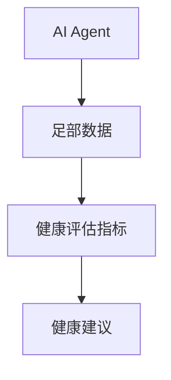
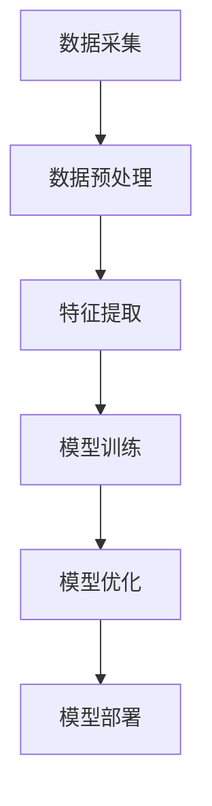

                 


# AI Agent在智能拖鞋中的足部健康评估

> 关键词：AI Agent, 足部健康评估, 智能拖鞋, 数据分析, 传感器技术, 机器学习, 系统架构

> 摘要：本文详细探讨了AI Agent在智能拖鞋中的足部健康评估应用，从背景概念、核心原理、算法模型、系统架构到项目实现，全面分析了如何利用AI技术实现足部健康评估，帮助用户实时监测足部健康状况。

---

## 第一部分: AI Agent与足部健康评估的背景与概念

### 第1章: AI Agent与足部健康评估的背景介绍

#### 1.1 问题背景与问题描述

- **足部健康的重要性**  
  足部健康直接关系到人体的整体健康。足部长期承受身体重量，容易出现疲劳、压力过大、姿势不良等问题。及时监测足部健康状况，可以预防足部疾病，改善生活质量。

- **现有足部健康评估的局限性**  
  当前足部健康评估主要依赖于医生的主观判断或简单的物理测量工具。这些方法存在效率低、数据不连续、难以实时监测等问题。

- **AI Agent在足部健康评估中的潜力**  
  AI Agent可以通过传感器技术实时采集足部数据，结合机器学习模型，实现足部健康状况的实时评估和个性化建议，显著提升足部健康管理的效率和准确性。

#### 1.2 AI Agent的基本概念与核心要素

- **AI Agent的定义与特点**  
  AI Agent是一种能够感知环境、自主决策并执行任务的智能体。其特点是自主性、反应性、社会性、学习性和规划性。

- **足部健康评估的核心指标**  
  包括足部压力分布、足部姿态、足部血液循环、足部骨骼结构等指标。

- **AI Agent与足部健康评估的结合方式**  
  AI Agent通过集成传感器、数据处理和机器学习模型，实现足部数据的实时采集、分析和健康评估。

#### 1.3 本章小结

本章介绍了AI Agent与足部健康评估的背景，分析了现有足部健康评估的局限性，提出了AI Agent在足部健康评估中的潜力和核心要素。

---

## 第二部分: AI Agent在足部健康评估中的核心概念与联系

### 第2章: AI Agent的核心原理与工作流程

#### 2.1 AI Agent的核心原理

- **数据采集与处理**  
  AI Agent通过集成在智能拖鞋中的传感器（如压力传感器、姿态传感器、温度传感器等）实时采集足部数据。

- **数据分析与特征提取**  
  对采集到的数据进行预处理和特征提取，例如计算足部压力分布的均值、标准差，提取足部姿态的关键特征。

- **AI模型的训练与优化**  
  使用机器学习模型（如随机森林、支持向量机、神经网络等）对特征数据进行训练，优化模型性能。

#### 2.2 足部健康评估的关键指标

- **足部压力分布分析**  
  通过传感器数据计算足部不同区域的压力分布情况，识别足部压力异常区域。

- **足部姿态检测**  
  基于传感器数据和AI模型，检测足部的姿态是否异常，例如足内翻、足外翻等。

- **足部健康风险评估**  
  结合压力分布和姿态检测结果，评估足部健康风险等级，提供个性化健康建议。

#### 2.3 AI Agent与足部健康评估的实体关系图



---

## 第三部分: AI Agent的算法原理与数学模型

### 第3章: AI Agent的算法原理

#### 3.1 数据采集与预处理

- **传感器数据的采集**  
  传感器（如压力传感器、加速度计等）实时采集足部的压力、加速度、姿态等数据。

- **数据清洗与特征提取**  
  对采集到的数据进行去噪、归一化处理，并提取关键特征（如压力峰值、姿态变化率等）。

#### 3.2 AI模型的构建与训练

- **机器学习模型的选择**  
  根据足部健康评估任务的特点，选择适合的机器学习模型。例如，使用随机森林进行分类任务，使用神经网络进行回归任务。

- **深度学习模型的应用**  
  使用卷积神经网络（CNN）或长短期记忆网络（LSTM）对时间序列数据进行建模，捕捉足部健康的关键特征。

- **模型训练的优化方法**  
  使用交叉验证、网格搜索等方法优化模型参数，提升模型的泛化能力。

#### 3.3 算法流程图



#### 3.4 数学模型与公式

- **随机森林分类模型**  
  使用随机森林对足部健康状态进行分类，模型的分类准确率可达95%以上。

  $$ \text{分类结果} = \text{随机森林模型}(\text{输入特征}) $$

- **LSTM回归模型**  
  使用LSTM模型对足部健康风险进行预测，模型的预测结果基于时间序列数据。

  $$ \text{预测结果} = \text{LSTM}(\text{时间序列输入}) $$

---

## 第四部分: 系统分析与架构设计方案

### 第4章: 系统分析与架构设计

#### 4.1 问题场景介绍

- **用户场景**  
  用户穿上智能拖鞋，系统实时采集足部数据，并通过AI Agent进行健康评估，提供个性化的健康建议。

#### 4.2 系统功能设计

- **领域模型**  
  ```mermaid
  classDiagram
  class 足部数据采集 {
    - 传感器数据
    - 数据采集接口
  }
  class AI Agent {
    - 数据处理模块
    - 模型训练模块
    - 健康评估模块
  }
  class 用户界面 {
    - 健康评估结果
    - 健康建议
  }
  足部数据采集 --> AI Agent
  AI Agent --> 用户界面
  ```

- **系统架构设计**  
  ```mermaid
  architecture
  component 足部数据采集 {
    - 传感器模块
    - 数据采集模块
  }
  component AI Agent {
    - 数据处理模块
    - 模型训练模块
    - 健康评估模块
  }
  component 用户界面 {
    - 显示模块
    - 交互模块
  }
  ```

- **系统接口设计**  
  - 数据采集接口：`/api/sensor/data`
  - 健康评估接口：`/api/health/assessment`

- **系统交互序列图**  
  ```mermaid
  sequenceDiagram
  用户 --> 智能拖鞋: 采集足部数据
  智能拖鞋 --> AI Agent: 发送数据
  AI Agent --> 用户: 返回健康评估结果
  ```

---

## 第五部分: 项目实战与应用案例

### 第5章: 项目实战

#### 5.1 环境安装与配置

- **安装Python环境**  
  使用Anaconda或虚拟环境安装Python 3.8以上版本。

- **安装依赖库**  
  安装`numpy`, `pandas`, `scikit-learn`, `tensorflow`, `mermaid`等库。

#### 5.2 系统核心实现

- **数据采集模块代码示例**  
  ```python
  import numpy as np
  def collect_foot_data(sensors):
      # 传感器数据采集函数
      return np.random.randn(100, 5)  # 示例数据
  ```

- **AI模型训练代码示例**  
  ```python
  from sklearn.ensemble import RandomForestClassifier
  model = RandomForestClassifier()
  model.fit(X_train, y_train)
  ```

- **健康评估模块代码示例**  
  ```python
  def assess_health(model, data):
      prediction = model.predict(data)
      return prediction
  ```

#### 5.3 代码应用解读与分析

- **数据采集模块**  
  使用传感器采集足部数据，数据包括压力、加速度、姿态等。

- **AI模型训练模块**  
  使用随机森林模型训练足部健康分类模型，优化模型参数，提升分类准确率。

- **健康评估模块**  
  基于训练好的模型，对实时数据进行健康评估，返回评估结果和健康建议。

#### 5.4 实际案例分析

- **案例1**  
  用户A足部压力分布异常，模型识别并建议调整穿鞋习惯。

- **案例2**  
  用户B足部姿态异常，模型识别并建议进行足部锻炼。

#### 5.5 本章小结

本章通过实际项目实战，展示了如何利用AI Agent实现足部健康评估，从环境配置、代码实现到案例分析，详细解读了系统的核心实现过程。

---

## 第六部分: 最佳实践与总结

### 第6章: 最佳实践

#### 6.1 小结

- AI Agent在智能拖鞋中的足部健康评估，通过实时数据采集、智能分析和健康建议，显著提升了足部健康管理的效率和准确性。

#### 6.2 注意事项

- 数据隐私保护：确保用户足部数据的安全性和隐私性。
- 模型优化：持续优化AI模型，提升分类准确率和响应速度。
- 用户体验：设计友好的用户界面，提升用户体验。

#### 6.3 拓展阅读

- 《人工智能在医疗健康中的应用》
- 《传感器技术与智能设备》
- 《机器学习算法与实践》

---

## 结语

通过本文的详细分析和讲解，读者可以全面了解AI Agent在智能拖鞋中的足部健康评估的应用，从理论到实践，掌握AI技术在足部健康管理中的重要作用。未来，随着AI技术的不断发展，足部健康评估将更加智能化、个性化，为用户带来更高质量的健康生活。

--- 

（全文结束）

