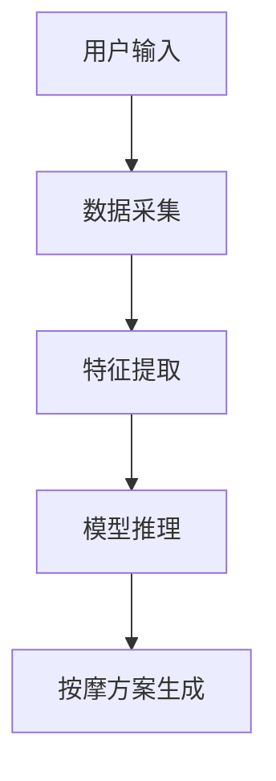
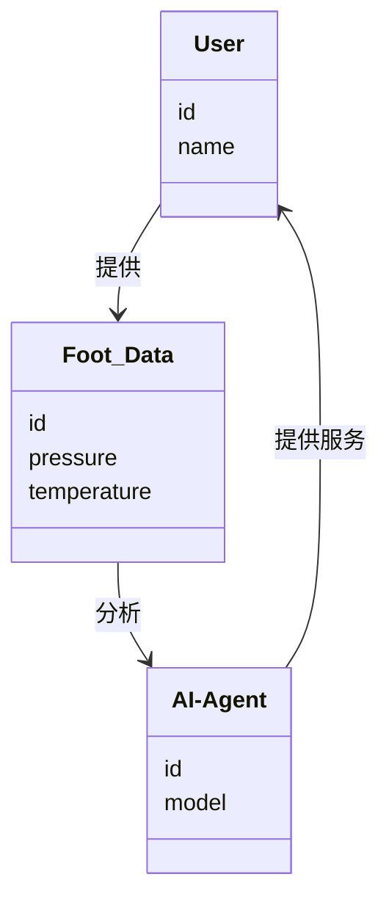
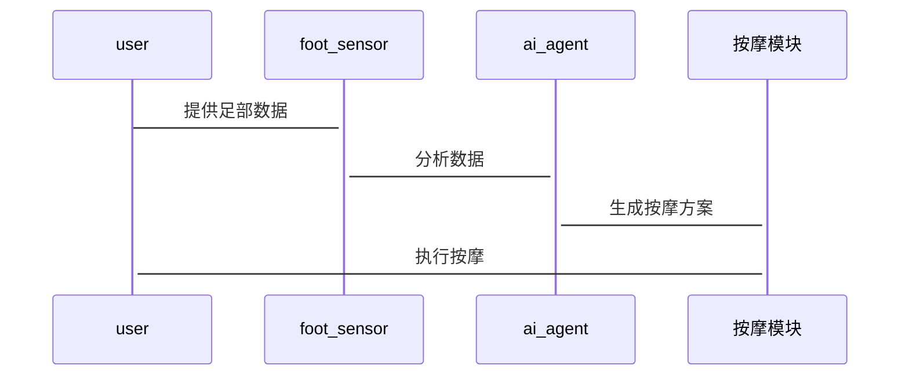

                 


# AI Agent在智能拖鞋中的足部按摩定制

> 关键词：AI Agent，智能拖鞋，足部按摩，定制服务，算法原理，系统架构

> 摘要：本文探讨了AI Agent在智能拖鞋中的足部按摩定制应用，分析了AI Agent的核心概念、算法原理、系统架构设计及实现，提供了详细的项目实战案例，并总结了实际应用中的注意事项和未来研究方向。

---

## 第一章: 背景介绍与核心概念

### 1.1 问题背景与描述
#### 1.1.1 足部按摩的历史与发展
足部按摩是一种古老的健康养生方式，通过刺激足部的穴位来促进血液循环、缓解疲劳和改善身体状况。传统足部按摩主要依赖人工操作，受限于技师的经验和能力。

#### 1.1.2 智能化足部按摩设备的市场需求
随着科技的进步，智能化设备逐渐取代传统人工服务。智能拖鞋作为一种创新产品，通过内置传感器和AI技术，能够实现个性化的足部按摩服务，满足现代人对健康和舒适的追求。

#### 1.1.3 AI Agent在足部按摩中的应用潜力
AI Agent（人工智能代理）能够通过实时感知用户足部数据，智能分析并生成个性化的按摩方案，从而提升用户体验。AI Agent的应用使得足部按摩从被动服务转向主动智能服务。

### 1.2 问题解决与边界
#### 1.2.1 AI Agent在足部按摩中的问题解决
AI Agent能够实时采集足部的压力、温度、湿度等数据，结合用户的历史使用记录和健康状况，动态调整按摩强度、频率和模式。

#### 1.2.2 系统边界与功能范围
智能拖鞋中的AI Agent仅负责足部数据的采集与分析，不涉及其他功能（如鞋体的温度调节或清洁功能）。系统的边界明确，便于功能扩展。

#### 1.2.3 核心要素与组成结构
- **用户**：AI Agent的核心服务对象。
- **足部数据**：包括压力、温度、湿度等。
- **AI Agent**：负责数据处理、决策和控制。

---

## 第二章: AI Agent的核心概念与联系

### 2.1 AI Agent的基本原理
#### 2.1.1 感知层：足部数据的采集与处理
AI Agent通过传感器实时采集用户的足部数据，包括：
- 压力分布：通过压力传感器检测足部不同区域的压力值。
- 温度变化：通过温度传感器监测足部温度。
- 湿度变化：通过湿度传感器检测足部湿度。

#### 2.1.2 决策层：按摩方案的智能生成
AI Agent根据采集到的足部数据，结合用户的历史行为和健康状况，生成个性化的按摩方案。例如：
- 根据压力分布判断足部疲劳区域。
- 根据温度变化调整按摩强度。

#### 2.1.3 执行层：按摩动作的精准控制
AI Agent通过执行层控制按摩模块的运动，实现精准的按摩动作。例如：
- 控制振动马达的频率和幅度。
- 调整气压按摩的力度。

### 2.2 核心概念属性对比表
#### 表2.1: AI Agent与传统足部按摩设备的对比

| 属性                | AI Agent                   | 传统足部按摩设备       |
|---------------------|----------------------------|------------------------|
| 数据采集            | 实时采集足部数据           | 依赖人工操作            |
| 决策方式            | 智能算法生成个性化方案     | 预设固定模式            |
| 用户体验            | 高度个性化                 | 统一化服务              |
| 维护成本            | 低，通过软件更新优化       | 高，依赖硬件维护          |

### 2.3 ER实体关系图
```mermaid
erDiagram
    user {
        id
        name
    }
    foot_data {
        id
        pressure
        temperature
    }
    ai_agent {
        id
        model
    }
    user --> foot_data: 提供
    foot_data --> ai_agent: 分析
    ai_agent --> user: 提供服务
```

---

## 第三章: AI Agent算法原理与实现

### 3.1 算法原理
#### 3.1.1 算法流程


### 3.2 算法实现
#### 3.2.1 数据预处理
```python
def preprocess(data):
    # 数据归一化
    normalized_data = (data - min(data)) / (max(data) - min(data))
    return normalized_data
```

#### 3.2.2 特征提取
```python
def extract_features(normalized_data):
    # 提取压力分布特征
    pressure_features = normalized_data[:, :5]
    # 提取温度特征
    temperature_features = normalized_data[:, 5:]
    return pressure_features, temperature_features
```

#### 3.2.3 模型推理
```python
def model_inference(pressure_features, temperature_features):
    # 压力分布与健康状况的关联性分析
    pressure_score = np.dot(pressure_features, np.array([0.3, 0.2, 0.5]))
    # 温度变化与舒适度的关联性分析
    temperature_score = np.dot(temperature_features, np.array([0.4, 0.6]))
    # 综合评分
    comfort_score = (pressure_score + temperature_score) / 2
    return comfort_score
```

#### 3.2.4 按摩方案生成
```python
def generate_messaging(comfort_score):
    if comfort_score < 0.3:
        return "轻柔模式"
    elif 0.3 <= comfort_score < 0.6:
        return "中强模式"
    else:
        return "强模式"
```

### 3.3 数学模型与公式
#### 3.3.1 压力分布与健康状况的关联性
$$
\text{压力分布评分} = \sum_{i=1}^{n} w_i \cdot p_i
$$
其中，$w_i$ 是压力分布的权重，$p_i$ 是压力值。

#### 3.3.2 温度变化与舒适度的关联性
$$
\text{温度评分} = \sum_{j=1}^{m} w_j \cdot t_j
$$
其中，$w_j$ 是温度的权重，$t_j$ 是温度值。

---

## 第四章: 系统分析与架构设计方案

### 4.1 问题场景介绍
智能拖鞋中的AI Agent需要实时采集用户的足部数据，分析数据并生成个性化的按摩方案，同时通过执行层实现按摩动作。

### 4.2 系统功能设计
#### 4.2.1 领域模型


#### 4.2.2 系统架构设计


#### 4.2.3 系统接口设计
- 用户与AI Agent的交互接口：通过手机APP或语音指令。
- AI Agent与传感器的通信接口：通过蓝牙或Wi-Fi。

#### 4.2.4 系统交互流程


---

## 第五章: 项目实战

### 5.1 环境安装
- Python 3.8+
- NumPy、Scikit-learn、Mermaid等库。

### 5.2 核心代码实现
#### 5.2.1 数据采集
```python
import numpy as np
from sensor import FootSensor

sensor = FootSensor()
data = sensor采集()
```

#### 5.2.2 特征提取与模型推理
```python
from model import AI-AgentModel

model = AI-AgentModel()
comfort_score = model.inference(data)
```

#### 5.2.3 按摩方案生成
```python
from actuator import MassageModule

module = MassageModule()
module.execute(comfort_score)
```

### 5.3 实际案例分析
- 用户A足部压力分布异常，AI Agent生成中强模式进行按摩。
- 用户B足部温度过高，AI Agent调整为轻柔模式以降低温度。

### 5.4 项目小结
通过AI Agent的实现，智能拖鞋能够提供个性化的足部按摩服务，显著提升了用户体验。

---

## 第六章: 总结与展望

### 6.1 最佳实践 tips
- 数据隐私保护：确保用户的足部数据不被滥用。
- 系统稳定性：定期更新AI模型以提升准确性。

### 6.2 注意事项
- 硬件可靠性：确保传感器的精度和稳定性。
- 用户反馈：及时收集用户的使用反馈，优化AI算法。

### 6.3 拓展阅读
- 探索更多AI技术在健康领域的应用。
- 研究更复杂的AI算法（如深度学习）在足部按摩中的应用。

---

# 结语
AI Agent在智能拖鞋中的应用为足部按摩带来了新的可能性，通过实时感知、智能决策和精准执行，实现了个性化的足部健康服务。未来，随着AI技术的不断发展，智能拖鞋将更加智能化和人性化。

