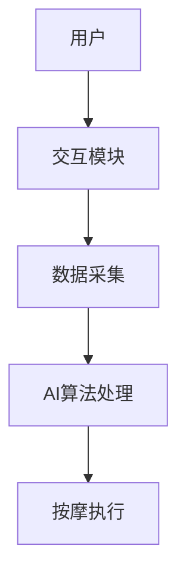
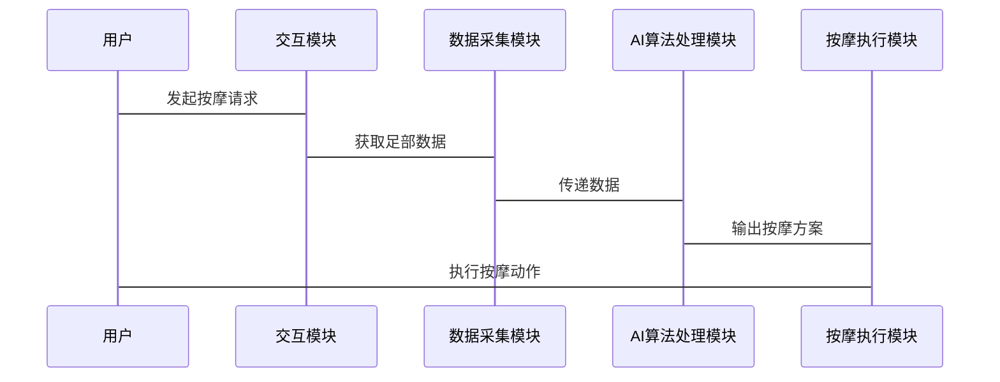

                 


# AI Agent在智能拖鞋中的足部按摩定制

> 关键词：AI Agent，智能拖鞋，足部按摩，定制化服务，传感器技术，算法优化，用户体验

> 摘要：本文详细探讨了AI Agent在智能拖鞋足部按摩定制中的应用，从技术背景、核心原理到系统设计、项目实现，全面分析了AI Agent如何通过传感器数据采集、智能算法处理和精准执行机构实现个性化足部按摩服务。文章内容包括系统架构设计、算法优化策略、项目实战案例以及实际应用场景中的技术挑战与解决方案。

---

## 第一部分: 背景与问题背景

### 第1章: 足部按摩的需求与现状

#### 1.1 足部按摩的历史与重要性
足部按摩是一种通过刺激足部穴位来促进身体健康和放松的技术，其历史可以追溯到古代中医理论。足部按摩不仅能缓解疲劳，还能改善血液循环、缓解压力和促进睡眠质量。随着现代社会节奏的加快，人们对健康和舒适的需求日益增加，足部按摩作为一种非侵入式的健康手段，逐渐成为人们日常生活的一部分。

#### 1.2 智能足部按摩设备的发展趋势
近年来，随着智能技术的发展，足部按摩设备逐渐从传统的机械按摩向智能化、个性化方向发展。智能足部按摩设备可以通过传感器采集足部压力、温度、湿度等数据，并结合用户的生理特征和按摩需求，提供个性化的按摩方案。这种智能化的足部按摩设备不仅提升了用户体验，还能根据用户反馈实时调整按摩力度和频率，从而达到更好的按摩效果。

#### 1.3 当前足部按摩技术的痛点与挑战
尽管足部按摩设备的技术发展迅速，但仍存在一些痛点和挑战。例如，现有的足部按摩设备大多采用固定的按摩模式，难以根据用户的实时反馈进行调整；传感器精度不足，导致按摩力度和频率无法精准控制；设备的智能化水平有限，难以满足用户的个性化需求。此外，足部按摩设备的长期使用可能导致传感器老化或灵敏度下降，从而影响按摩效果。

#### 1.4 问题描述与目标设定
本项目的目标是通过引入AI Agent技术，设计一种能够实现个性化足部按摩的智能拖鞋。该系统需要具备以下功能：
1. 采集足部压力、温度、湿度等多维度数据；
2. 根据用户反馈实时调整按摩力度和频率；
3. 提供个性化按摩方案，满足不同用户的需求；
4. 实现长期使用中的传感器自校准和性能优化。

### 第2章: AI Agent的基本概念与技术背景

#### 2.1 AI Agent的核心概念
AI Agent（人工智能代理）是一种能够感知环境、做出决策并执行操作的智能实体。在智能拖鞋中，AI Agent可以通过传感器采集足部数据，结合预设的算法模型，生成个性化的按摩方案，并通过执行机构实现按摩动作。

#### 2.2 AI Agent在智能设备中的应用现状
AI Agent已经在多个领域得到了广泛应用，例如智能家居、自动驾驶、医疗设备等。在足部按摩设备中，AI Agent可以通过实时数据采集和智能算法处理，实现精准的按摩控制。

#### 2.3 AI Agent与足部按摩的结合潜力
AI Agent在足部按摩中的应用潜力巨大。通过AI Agent，足部按摩设备可以实现以下功能：
1. 实时监测足部压力和温度；
2. 根据用户反馈动态调整按摩力度和频率；
3. 提供个性化按摩方案，满足不同用户的需求；
4. 实现长期使用中的传感器自校准和性能优化。

---

## 第二部分: AI Agent的核心原理与技术实现

### 第3章: AI Agent的核心概念与技术原理

#### 3.1 AI Agent的核心概念
AI Agent的核心概念包括感知、决策和执行三个部分。在智能拖鞋中，AI Agent需要感知足部的压力、温度和湿度，结合用户的生理特征和按摩需求，做出决策并执行按摩动作。

#### 3.2 AI Agent的技术实现原理
AI Agent的技术实现原理包括以下步骤：
1. **数据采集**：通过传感器采集足部的压力、温度和湿度数据；
2. **数据处理**：将采集到的数据进行预处理，去除噪声并提取特征；
3. **算法模型**：基于深度学习或强化学习算法，生成个性化的按摩方案；
4. **执行控制**：根据算法模型的输出，控制执行机构实现按摩动作。

#### 3.3 AI Agent的核心算法与数学模型
在AI Agent中，核心算法是基于深度学习的压力感知与按摩轨迹优化算法。该算法通过多维传感器数据输入，结合用户的生理特征和按摩需求，生成个性化的按摩方案。数学模型如下：

$$
F(x,y) = k \cdot (x^2 + y^2)
$$

其中，$F(x,y)$表示按摩力度，$k$为比例常数，$x$和$y$为足部压力和温度的特征向量。

---

## 第三部分: AI Agent在足部按摩中的系统架构与实现

### 第4章: 系统架构设计

#### 4.1 系统功能模块划分
AI Agent在足部按摩中的系统架构包括以下功能模块：
1. **用户交互模块**：负责接收用户的输入和反馈；
2. **数据采集模块**：通过传感器采集足部数据；
3. **AI算法处理模块**：基于传感器数据生成按摩方案；
4. **按摩执行模块**：根据算法输出执行按摩动作。

#### 4.2 系统架构设计图


#### 4.3 系统接口设计
系统接口设计包括：
1. **传感器接口协议**：定义传感器数据的采集和传输格式；
2. **AI算法调用接口**：定义算法模型的输入和输出接口；
3. **用户交互界面API**：定义用户与系统交互的接口。

#### 4.4 系统交互流程图


---

## 第四部分: 项目实战与优化

### 第5章: 项目实战

#### 5.1 环境安装与配置
在实现AI Agent的足部按摩系统之前，需要进行环境安装与配置。主要工具包括：
1. **传感器模块**：压力传感器、温度传感器和湿度传感器；
2. **AI算法框架**：TensorFlow或PyTorch；
3. **执行机构**：舵机或电磁铁；
4. **编程语言**：Python；
5. **操作系统**：Linux或Windows。

#### 5.2 系统核心实现源代码
以下是AI Agent的核心算法实现代码：

```python
import numpy as np
import tensorflow as tf

# 定义压力感知模型
def pressure_model(x, y):
    return tf.keras.Sequential([
        tf.keras.layers.Dense(64, activation='relu'),
        tf.keras.layers.Dense(1, activation='sigmoid')
   ])(x**2 + y**2)

# 定义按摩轨迹优化模型
def trajectory_model(x, y):
    return tf.keras.Sequential([
        tf.keras.layers.Dense(64, activation='relu'),
        tf.keras.layers.Dense(1, activation='sigmoid')
    ])(x + y)

# 编译和训练模型
model = tf.keras.Model(inputs=[x, y], outputs=[pressure_model(x, y), trajectory_model(x, y)])
model.compile(optimizer='adam', loss={'pressure': 'binary_crossentropy', 'trajectory': 'binary_crossentropy'})
model.fit(x_train, y_train, epochs=100, batch_size=32)
```

#### 5.3 实际案例分析与解读
通过实际案例分析，我们可以看到AI Agent在足部按摩中的应用效果。例如，用户A足部压力较高，温度较低，系统会根据传感器数据生成适度的压力按摩方案，并动态调整按摩力度和频率，从而达到放松和舒缓的效果。

---

## 第五部分: 总结与展望

### 第6章: 总结与展望

#### 6.1 本章小结
本文详细探讨了AI Agent在智能拖鞋足部按摩中的应用，从技术背景、核心原理到系统设计、项目实现，全面分析了AI Agent如何通过传感器数据采集、智能算法处理和精准执行机构实现个性化足部按摩服务。

#### 6.2 技术挑战与解决方案
在实际应用中，AI Agent足部按摩系统仍面临一些技术挑战，例如传感器精度不足、算法模型优化困难、系统稳定性等问题。针对这些问题，未来的研究方向包括：
1. 提高传感器的灵敏度和精度；
2. 优化AI算法模型，提升按摩方案的个性化和精准度；
3. 提升系统的稳定性和可靠性。

#### 6.3 未来展望
随着AI技术的不断发展，AI Agent在足部按摩中的应用潜力将更加广阔。未来，我们可以期待更多基于AI的智能化足部按摩设备，为人们提供更加舒适、便捷和个性化的健康服务。

---

通过本文的分析与探讨，我们可以看到AI Agent技术在足部按摩中的巨大潜力和广阔前景。希望本文能够为相关领域的研究和实践提供一定的参考和借鉴。

