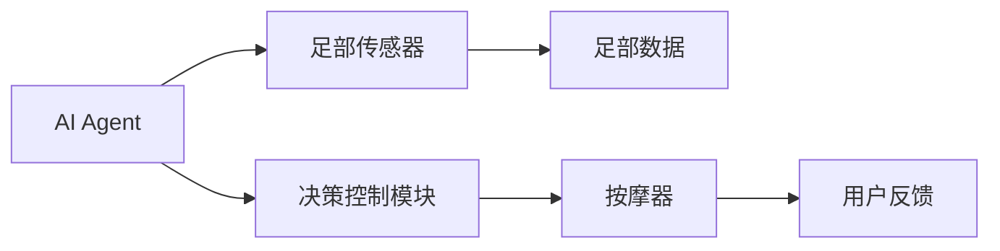
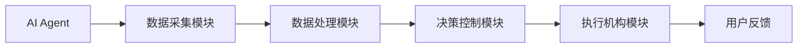
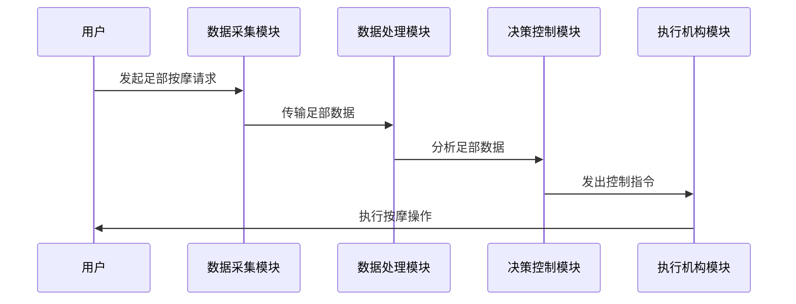

                 


# AI Agent在智能拖鞋中的足部按摩控制

> 关键词：AI Agent，足部按摩，智能拖鞋，传感器，算法优化

> 摘要：本文探讨AI Agent在智能拖鞋足部按摩控制中的应用，分析其技术背景、核心概念、算法原理、系统架构及项目实现，结合实际案例，总结AI技术在足部按摩控制中的优势与挑战。

---

# 第1章 AI Agent与足部按摩控制概述

## 1.1 AI Agent的基本概念

### 1.1.1 AI Agent的定义与特点

AI Agent（人工智能代理）是一种能够感知环境并采取行动以实现目标的智能实体。其特点包括：

1. **自主性**：能够在无外部干预的情况下运行。
2. **反应性**：能够实时感知环境并做出反应。
3. **学习能力**：通过数据和经验不断优化行为。
4. **社交能力**：能够与其他系统或用户进行交互。

AI Agent的核心功能包括数据采集、信息处理、决策制定和动作执行。

### 1.1.2 AI Agent的核心功能与应用场景

AI Agent在多个领域有广泛应用，包括智能家居、自动驾驶、医疗健康等。在足部按摩控制中，AI Agent的主要功能是根据用户的足部数据，实时调整按摩器的运作模式。

### 1.1.3 足部按摩控制的背景与需求

足部按摩是一种通过刺激足部穴位来改善健康的方法。传统足部按摩器仅能提供固定模式的按摩，无法根据用户需求实时调整。AI Agent的应用能够使足部按摩器更加智能化，提供个性化的按摩体验。

---

## 1.2 足部按摩控制的技术背景

### 1.2.1 足部按摩的生理学基础

足部按摩是中医学的重要组成部分，通过刺激足部穴位调节人体的生理功能。AI Agent可以通过分析足部的温度、压力和运动数据，制定个性化的按摩方案。

### 1.2.2 智能拖鞋的发展历程

智能拖鞋从最初的单一功能（如加热）逐步向多功能方向发展，AI Agent的引入使其具备了智能化的足部按摩功能。

### 1.2.3 AI技术在足部按摩中的应用潜力

AI技术能够通过传感器采集足部数据，结合算法优化，提供精准的足部按摩服务。AI Agent的引入使足部按摩器能够实时感知用户需求，动态调整按摩力度和模式。

---

## 1.3 本章小结

本章介绍了AI Agent的基本概念及其在足部按摩控制中的应用背景。AI Agent通过感知和决策能力，为智能拖鞋的足部按摩功能提供了技术支持。下一章将深入探讨AI Agent与足部按摩控制的核心概念与联系。

---

# 第2章 AI Agent与足部按摩控制的核心概念

## 2.1 AI Agent的核心原理

### 2.1.1 AI Agent的感知与决策机制

AI Agent通过传感器获取足部数据（如压力、温度、运动状态等），并结合预设算法进行分析，制定相应的按摩控制策略。

### 2.1.2 基于传感器的数据采集与处理

AI Agent通过多种传感器（如压力传感器、温度传感器、加速度传感器等）采集足部数据，并对其进行预处理和特征提取。

### 2.1.3 AI算法在足部按摩控制中的应用

常用的AI算法包括支持向量机（SVM）、神经网络（NN）和强化学习（RL）。这些算法能够帮助AI Agent优化足部按摩的力度、时间和模式。

---

## 2.2 足部按摩控制的系统架构

### 2.2.1 系统功能模块划分

足部按摩控制系统主要由以下几个模块组成：
- 数据采集模块：负责采集足部数据。
- 数据处理模块：对采集的数据进行预处理和特征提取。
- 决策控制模块：基于AI算法制定按摩策略。
- 执行机构模块：根据决策结果控制按摩器运作。

### 2.2.2 系统输入输出关系

- **输入**：足部传感器数据、用户需求信息。
- **输出**：按摩器的控制信号、实时反馈信息。

### 2.2.3 系统边界与外延

系统边界包括智能拖鞋硬件、AI Agent软件和用户界面。外延部分涉及传感器技术、AI算法优化和用户体验设计。

---

## 2.3 AI Agent与足部按摩控制的实体关系图



---

## 2.4 本章小结

本章详细介绍了AI Agent在足部按摩控制中的核心原理和系统架构。AI Agent通过传感器和算法优化，实现了足部按摩的智能化控制。下一章将重点分析AI Agent在足部按摩控制中的算法原理。

---

# 第3章 基于AI Agent的足部按摩控制算法

## 3.1 算法原理概述

### 3.1.1 基于强化学习的足部按摩控制

强化学习（Reinforcement Learning, RL）通过奖励机制优化按摩策略。AI Agent通过不断尝试不同的按摩模式，获得最大化的奖励（如用户满意度）。

### 3.1.2 基于深度学习的足部按摩优化

深度学习（Deep Learning, DL）通过训练神经网络模型，识别足部数据的特征，并制定个性化的按摩方案。

### 3.1.3 算法选择与优化策略

根据具体需求选择合适的算法，并通过参数调优和模型优化提升算法性能。

---

## 3.2 算法实现流程

### 3.2.1 数据采集与预处理

- **数据采集**：通过传感器获取足部数据。
- **数据预处理**：去噪、归一化处理。

### 3.2.2 算法模型训练

- **训练数据**：标注的足部数据。
- **模型训练**：使用训练数据优化算法参数。

### 3.2.3 算法模型部署与应用

- **模型部署**：将训练好的模型嵌入智能拖鞋。
- **实时应用**：根据实时数据动态调整按摩模式。

---

## 3.3 算法数学模型与公式

### 3.3.1 强化学习算法公式

状态值函数：
$$ V(s) = \max_a Q(s,a) $$

### 3.3.2 深度学习模型公式

神经网络输出：
$$ y = f(x; \theta) $$

---

## 3.4 算法实现的代码示例

```python
def强化学习算法():
    初始化状态s
    while True:
        选择动作a
        执行动作a，得到奖励r
        更新价值函数V(s) = max(Q(s,a))
```

---

## 3.5 本章小结

本章详细讲解了AI Agent在足部按摩控制中的算法原理，包括强化学习和深度学习的实现流程和数学模型。下一章将分析足部按摩控制系统的具体实现方案。

---

# 第4章 足部按摩控制系统分析

## 4.1 系统应用场景与目标

### 4.1.1 系统应用场景描述

AI Agent足部按摩控制系统主要用于智能拖鞋，为用户提供个性化的足部按摩服务。

### 4.1.2 系统目标与功能需求

系统目标：实现智能化的足部按摩控制，提升用户体验。功能需求：实时采集足部数据，动态调整按摩模式。

---

## 4.2 系统功能设计

### 4.2.1 系统功能模块划分

- 数据采集模块：采集足部数据。
- 数据处理模块：分析足部数据。
- 决策控制模块：制定按摩策略。
- 执行机构模块：控制按摩器运作。

---

## 4.3 系统架构设计



---

## 4.4 系统接口设计

- **输入接口**：传感器数据接口。
- **输出接口**：按摩器控制接口。
- **用户接口**：用户交互界面。

---

## 4.5 系统交互流程图



---

## 4.6 本章小结

本章详细分析了足部按摩控制系统的应用场景、功能设计和架构方案。AI Agent通过与各模块的协同工作，实现了智能化的足部按摩控制。

---

# 第5章 项目实战：智能拖鞋足部按摩控制系统实现

## 5.1 环境安装与配置

### 5.1.1 系统环境要求

- 操作系统：Linux/Windows/MacOS
- 开发工具：Python、TensorFlow、Keras
- 传感器：压力传感器、温度传感器

### 5.1.2 硬件安装

- 安装传感器模块。
- 配置智能拖鞋硬件。

---

## 5.2 系统核心实现源代码

```python
# 强化学习算法实现
class AI-Agent:
    def __init__(self):
        self.state = None
        self.actions = ['轻柔模式', '中等模式', '强力模式']
        self.rewards = {'满意': 1, '一般': 0, '不满意': -1}

    def choose_action(self, state):
        # 根据状态选择动作
        pass

    def update_value(self, state, action, reward):
        # 更新价值函数
        pass
```

---

## 5.3 代码应用解读与分析

- **代码功能**：AI Agent通过传感器数据选择按摩模式，并根据用户反馈更新价值函数。
- **算法优化**：强化学习通过不断试错优化按摩策略。

---

## 5.4 实际案例分析

- **案例背景**：用户足部压力数据异常。
- **算法应用**：AI Agent选择强力模式进行按摩。
- **结果分析**：用户反馈满意，奖励值为1。

---

## 5.5 项目小结

本章通过实际案例分析，展示了AI Agent在足部按摩控制系统中的应用。代码实现和案例分析帮助读者更好地理解AI技术在足部按摩控制中的具体应用。

---

# 第6章 最佳实践与总结

## 6.1 最佳实践 tips

- **传感器选择**：选择高灵敏度传感器。
- **算法优化**：根据实际需求选择合适的算法。
- **用户体验**：注重用户反馈，优化按摩模式。

---

## 6.2 小结

AI Agent通过实时感知和智能决策，显著提升了足部按摩的体验。本文详细探讨了其技术背景、核心概念、算法原理和系统实现。

---

## 6.3 注意事项

- **数据隐私**：保护用户足部数据隐私。
- **系统稳定性**：确保系统运行稳定，避免误操作。

---

## 6.4 拓展阅读

- 推荐阅读《强化学习实战》、《深度学习入门》等书籍。

---

# 结语

AI Agent在智能拖鞋中的足部按摩控制是一项具有广阔前景的技术。随着AI技术的不断进步，足部按摩控制将更加智能化、个性化，为用户带来更好的健康体验。

---

# 参考文献

（此处列出相关文献和参考资料）

---

通过以上内容，您可以根据需要进一步扩展和优化，以确保文章内容详实、逻辑清晰。

