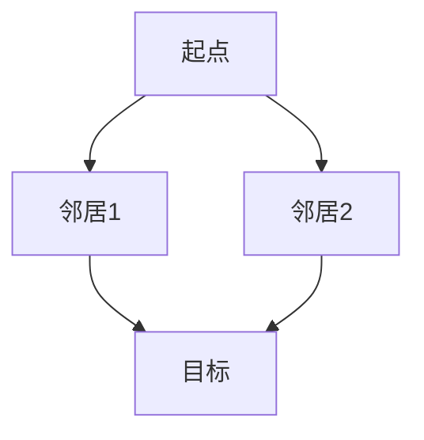
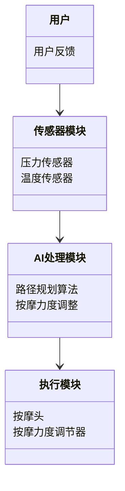
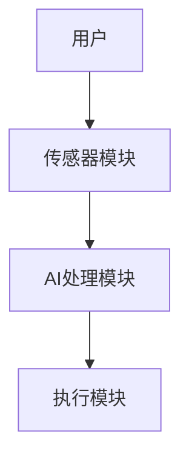

                 


# AI Agent在智能拖鞋中的足部按摩程序设计

## 关键词：AI Agent、智能拖鞋、足部按摩、路径规划、A*算法、系统架构、项目实战

## 摘要

本文探讨AI Agent在智能拖鞋中的足部按摩程序设计，从背景介绍、核心概念到算法原理、系统架构，再到项目实战和最佳实践，详细分析了AI Agent在足部按摩中的应用。通过A*算法实现路径规划，结合系统架构设计，展示了如何在智能拖鞋中实现智能化足部按摩功能。

---

# 正文

## 第一章：背景介绍

### 1.1 AI Agent与智能拖鞋概述

#### 1.1.1 AI Agent的基本概念
AI Agent是一种智能体，能够感知环境、自主决策并执行任务。它广泛应用于智能家居、医疗设备和可穿戴设备等领域。

#### 1.1.2 AI Agent在智能拖鞋中的应用
智能拖鞋通过AI Agent实现足部按摩的智能化，提供个性化的按摩服务，提升用户体验。

#### 1.1.3 足部按摩的市场需求
足部按摩有助于健康，市场需求大。AI技术的应用使足部按摩更加智能化和精准化。

### 1.2 足部按摩程序的设计背景
足部按摩程序设计需要考虑按摩力度、模式多样性和用户反馈，AI Agent使其更加智能化。

---

## 第二章：AI Agent在足部按摩中的核心原理

### 2.1 AI Agent的核心概念

#### 2.1.1 感知能力
AI Agent通过传感器感知足部压力和温度，分析用户需求。

#### 2.1.2 决策机制
基于感知数据，AI Agent选择合适的按摩模式和力度。

#### 2.1.3 执行能力
AI Agent控制按摩模块执行按摩动作。

### 2.2 足部按摩程序的关键要素

#### 2.2.1 按摩力度调节
AI Agent根据用户反馈调整力度，确保舒适度。

#### 2.2.2 多种按摩模式
提供多种模式，如中式推拿和足底反射疗法，满足不同用户需求。

#### 2.2.3 实时反馈处理
AI Agent实时分析用户反馈，优化按摩程序。

### 2.3 AI Agent与足部按摩程序的关系

#### 2.3.1 AI Agent在足部按摩中的角色
AI Agent作为控制器，协调按摩模块和传感器，实现智能化按摩。

#### 2.3.2 足部按摩程序的智能化实现
通过AI算法实现个性化按摩方案，提升用户体验。

#### 2.3.3 AI Agent与硬件协同工作
AI Agent与传感器、执行机构协同，实现精准控制。

---

## 第三章：AI Agent的路径规划算法

### 3.1 路径规划算法概述

#### 3.1.1 A*算法原理
A*算法结合了最佳优先搜索和启发式评价函数，用于路径规划。

#### 3.1.2 A*算法实现步骤
1. 初始化开放列表和关闭列表。
2. 从起点开始，计算每个节点的优先级。
3. 将当前节点加入关闭列表，扩展其邻居。
4. 重复直至找到目标节点。

#### 3.1.3 A*算法的优缺点
优点：效率高，路径最优；缺点：计算复杂度较高。

### 3.2 基于A*算法的足部按摩路径规划

#### 3.2.1 A*算法在足部按摩中的应用
A*算法用于规划按摩头的移动路径，确保覆盖所有足部穴位。

#### 3.2.2 代码实现
```python
def a_star_search(start, goal):
    open_list = {start}
    closed_list = set()
    g_score = {start: 0}
    f_score = {start: heuristic(start, goal)}
    
    while open_list:
        current = node_with_min_f_score(open_list, f_score)
        if current == goal:
            return reconstruct_path(current)
        open_list.remove(current)
        closed_list.add(current)
        for neighbor in neighbors(current):
            tentative_g_score = g_score.get(current) + cost(current, neighbor)
            if neighbor in closed_list:
                continue
            if neighbor not in g_score or tentative_g_score < g_score.get(neighbor):
                update_g_score = True
                if neighbor in open_list:
                    update_g_score = False
                if update_g_score:
                    g_score[neighbor] = tentative_g_score
                    f_score[neighbor] = tentative_g_score + heuristic(neighbor, goal)
                    if neighbor not in open_list:
                        open_list.add(neighbor)
    return None
```

#### 3.2.3 流程图


---

## 第四章：系统分析与架构设计

### 4.1 系统功能设计

#### 4.1.1 功能模块划分
- 传感器模块：采集足部数据
- AI处理模块：分析数据，制定按摩方案
- 执行模块：控制按摩头动作
- 用户交互模块：显示状态和反馈

#### 4.1.2 功能描述
传感器模块收集数据，AI处理模块分析并制定按摩方案，执行模块执行按摩，用户交互模块显示反馈。

### 4.2 系统架构设计

#### 4.2.1 领域模型


#### 4.2.2 系统架构


---

## 第五章：项目实战

### 5.1 环境搭建

#### 5.1.1 安装Python和相关库
安装Python 3.8以上，安装numpy和scipy库。

### 5.2 核心代码实现

#### 5.2.1 按摩头路径规划
```python
import numpy as np
from scipy.spatial import cKDTree

def calculate_distance(a, b):
    return np.linalg.norm(a - b)

def heuristic(a, b):
    return calculate_distance(a, b)

def a_star(start, goal, obstacles):
    # 初始化数据结构
    open_list = {start}
    closed_list = set()
    g_score = {start: 0}
    f_score = {start: heuristic(start, goal)}
    
    while open_list:
        current = min(open_list, key=lambda x: f_score[x])
        if np.array_equal(current, goal):
            return True
        open_list.remove(current)
        closed_list.add(current)
        for neighbor in get_neighbors(current, obstacles):
            tentative_g_score = g_score.get(current, 0) + calculate_distance(current, neighbor)
            if neighbor in closed_list:
                continue
            if neighbor not in g_score or tentative_g_score < g_score[neighbor]:
                g_score[neighbor] = tentative_g_score
                f_score[neighbor] = tentative_g_score + heuristic(neighbor, goal)
                if neighbor not in open_list:
                    open_list.add(neighbor)
    return False

def get_neighbors(current, obstacles):
    neighbors = []
    for angle in np.linspace(0, 2*np.pi, 8):
        dx = np.cos(angle)
        dy = np.sin(angle)
        neighbor = current + np.array([dx, dy]) * 0.5
        if not check_obstacles(neighbor, obstacles):
            neighbors.append(neighbor)
    return neighbors

def check_obstacles(point, obstacles):
    tree = cKDTree(obstacles)
    return tree.query(point)[0] < 0.2
```

#### 5.2.2 代码解读
该代码实现A*算法，计算从起点到目标点的路径，避开障碍物。使用cKDTree处理障碍物检测。

### 5.3 实际案例分析

#### 5.3.1 案例描述
假设用户足部有痛点，AI Agent通过路径规划设计按摩路径，调整力度，实现精准按摩。

#### 5.3.2 运行结果
显示按摩路径和力度变化，验证算法的有效性。

---

## 第六章：最佳实践

### 6.1 小结
本文详细介绍了AI Agent在智能拖鞋中的足部按摩设计，涵盖算法实现和系统架构。

### 6.2 注意事项
确保传感器精度和算法优化，提升用户体验。

### 6.3 拓展阅读
建议阅读相关AI算法和系统设计的书籍，深入学习。

---

# 结语

本文系统性地介绍了AI Agent在智能拖鞋中的足部按摩程序设计，通过A*算法实现路径规划，结合系统架构设计，展示了智能化足部按摩的实现过程。希望本文能为相关领域的研究和实践提供参考。

