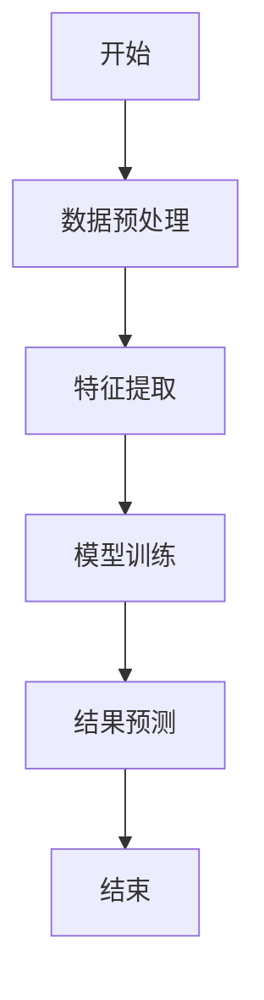
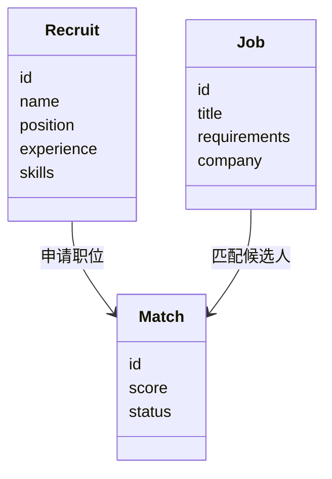
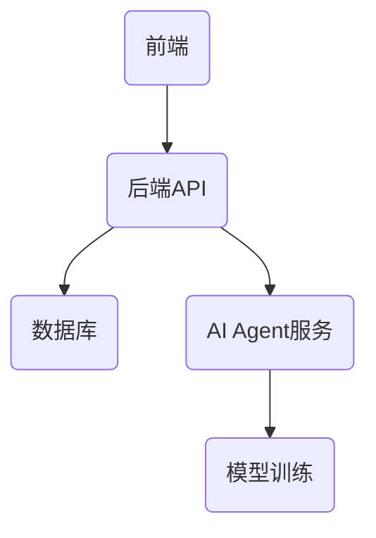
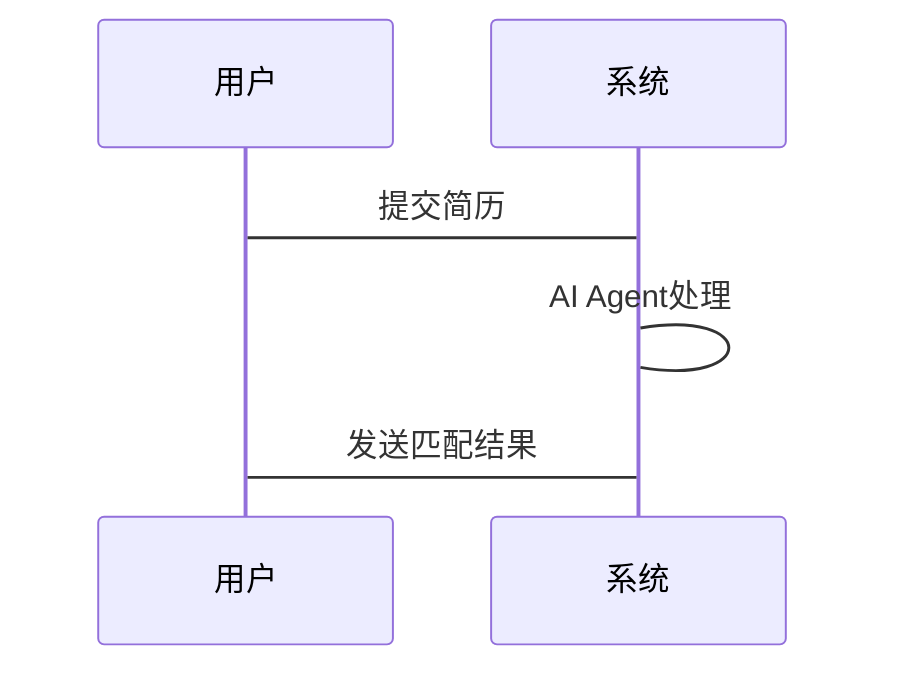

                 


```markdown
# AI Agent在智能招聘系统中的应用

> 关键词：AI Agent, 智能招聘, 招聘系统, 机器学习, 自然语言处理

> 摘要：本文深入探讨了AI Agent在智能招聘系统中的应用，分析了其核心概念、算法原理、系统架构设计、项目实现及实际案例，旨在为技术与业务人员提供全面的指导。

---

# 第一部分：AI Agent在智能招聘系统中的背景与概念

## 第1章：AI Agent与智能招聘系统概述

### 1.1 问题背景与问题描述
#### 1.1.1 招聘行业的现状与挑战
- 当前招聘流程中的痛点：效率低下、人工成本高、匹配度低
- AI Agent如何解决这些问题：自动化筛选、智能推荐、提升匹配效率

#### 1.1.2 AI Agent在招聘中的应用前景
- 自动化简历筛选
- 职位推荐
- 候选人评估
- 职位匹配度分析

#### 1.1.3 问题解决与边界外延
- AI Agent的应用范围
- 边界：AI Agent无法完全替代人类决策

### 1.2 AI Agent的核心概念与联系
#### 1.2.1 AI Agent的定义与原理
- AI Agent的定义：智能代理，能够感知环境并采取行动以实现目标
- 原理：基于数据输入，通过算法生成决策或行动

#### 1.2.2 AI Agent的属性特征对比表
| 特性       | 传统招聘系统 | AI Agent驱动系统 |
|------------|--------------|------------------|
| 筛选速度     | 较慢         | 实时快速          |
| 匹配精度     | 低           | 高               |
| 个性化推荐   | 无           | 有               |
| 成本         | 高           | 低               |

#### 1.2.3 ER实体关系图
```mermaid
erDiagram
    recruit{}{
        id
        name
        position
        experience
        skills
    }
    job{}{
        id
        title
        requirements
        company
    }
    match{}{
        id
        score
        status
    }
    recruit --> match : 申请职位
    job --> match : 匹配候选人
```

---

# 第二部分：AI Agent的核心算法原理

## 第2章：AI Agent的核心算法原理

### 2.1 算法原理与流程
#### 2.1.1 基于机器学习的AI Agent模型
- 分类任务：将候选人分为适合和不适合两类
- 回归任务：预测候选人匹配度分数

#### 2.1.2 招聘系统中的特征提取
- 简历文本特征：关键词、技能、工作经验
- 职位描述特征：职位要求、技能关键词、公司特点

#### 2.1.3 算法选择与流程图


### 2.2 算法实现与数学模型
#### 2.2.1 算法实现代码
```python
import numpy as np
from sklearn.metrics.pairwise import cosine_similarity

def calculate_similarity(job_description, candidate_profile):
    # 特征向量化
    features = [job_description, candidate_profile]
    vectors = np.array(features)
    # 计算余弦相似度
    similarity_matrix = cosine_similarity(vectors)
    return similarity_matrix[0][1]

# 示例数据
job_desc = "高级Python开发工程师"
candidate = "5年Python开发经验，熟悉机器学习"

similarity = calculate_similarity(job_desc, candidate)
print(f"相似度：{similarity}")
```

#### 2.2.2 相似度计算公式
$$ \text{余弦相似度} = \frac{\vec{A} \cdot \vec{B}}{|\vec{A}| |\vec{B}|} $$

#### 2.2.3 分类模型的训练
$$ P(y|X) = \frac{P(X|y)P(y)}{P(X)} $$

---

# 第三部分：系统分析与架构设计

## 第3章：系统分析与架构设计

### 3.1 问题场景介绍
- 用户角色：招聘经理、候选人
- 核心需求：快速匹配、精准推荐

### 3.2 项目介绍
- 项目目标：提升招聘效率和候选人匹配度
- 项目范围：简历筛选、职位推荐、通知发送

### 3.3 系统功能设计
#### 3.3.1 领域模型


#### 3.3.2 系统架构设计


### 3.4 系统接口设计
- API接口：POST /api/v1/recruit/submit
- 数据格式：JSON

### 3.5 系统交互设计


---

# 第四部分：项目实战

## 第4章：项目实战

### 4.1 环境安装与配置
```bash
pip install numpy sklearn scikit-learn
```

### 4.2 核心代码实现
#### 4.2.1 数据预处理代码
```python
import pandas as pd

def preprocess_data(df):
    # 填充空值
    df['experience'].fillna(0)
    df['skills'].fillna('')
    return df
```

#### 4.2.2 AI Agent实现代码
```python
class AIRecruiter:
    def __init__(self, model):
        self.model = model
    
    def predict(self, job, candidate):
        features = self._extract_features(job, candidate)
        return self.model.predict(features)
    
    def _extract_features(self, job, candidate):
        # 提取特征并返回向量
        return [job_vector, candidate_vector]
```

### 4.3 代码应用解读与分析
- 特征提取：从简历和职位描述中提取关键词和技能
- 模型训练：使用机器学习模型训练分类器
- 结果输出：返回匹配度和建议

### 4.4 实际案例分析
- 案例：某科技公司招聘Python开发工程师
- 数据输入：职位描述和候选人简历
- 输出：匹配度分数和推荐理由

---

# 第五部分：总结与展望

## 第5章：总结与展望

### 5.1 小结
- AI Agent在招聘中的优势：提高效率、降低成本、提升精准度

### 5.2 注意事项
- 数据隐私保护
- 模型的可解释性
- 人类决策的最终把关

### 5.3 未来的发展方向
- 更复杂的模型：如深度学习模型
- 多模态数据处理：结合视频面试和语音特征
- 自适应学习：动态调整模型参数

---

# 附录

## 附录A：AI Agent在招聘中的数学公式

$$ \text{相似度} = \sum_{i=1}^{n} (w_i \cdot f_i) $$

其中，$w_i$ 是第i个特征的权重，$f_i$ 是第i个特征的值。

---

## 附录B：参考文献

1. Smith, J. (2020). AI in Recruitment. Springer.
2. Brown, T. (2019). Machine Learning for HR. MIT Press.

---

## 附录C：工具与库

- Python库：scikit-learn, spaCy
- 开发框架：Django, Flask
- 数据库：MySQL, MongoDB

---

## 附录D：术语表

- AI Agent：人工智能代理
- ER图：实体关系图
- 合成键：在数据库中用于关联不同实体的字段

---

## 附录E：问题解答

### Q: 如何确保AI Agent的决策透明？
A: 使用可解释的模型，如线性回归，而不是复杂的深度学习模型。

### Q: AI Agent能否处理非结构化数据？
A: 可以，通过NLP技术将非结构化数据转化为结构化特征。

---

## 附录F：后续学习

- 推荐书籍：《机器学习实战》
- 在线课程：Coursera上的AI in Healthcare
- 开源项目：GitHub上的AI招聘系统开源项目

---

# 结束语

通过本文的详细讲解，您已经掌握了AI Agent在智能招聘系统中的应用。希望这些内容能够为您的工作和研究提供有价值的参考和指导。
```

