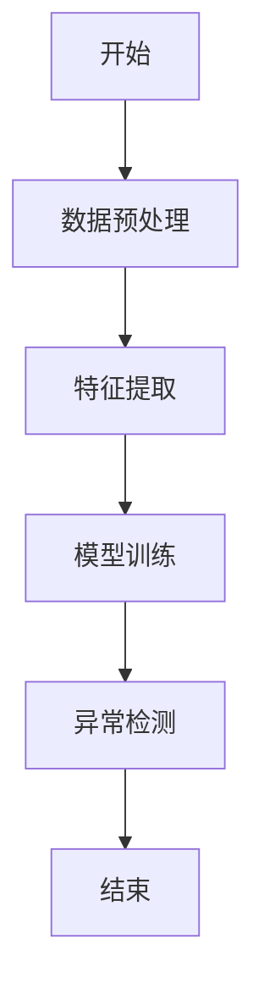
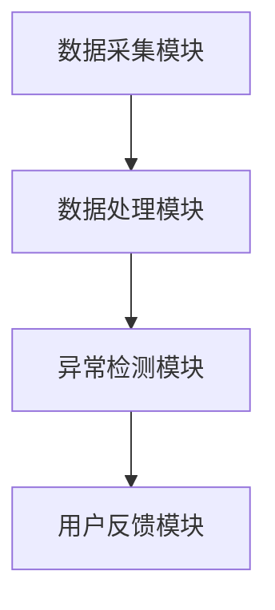

                 


# AI Agent在智能插座中的用电异常检测

> 关键词：AI Agent，智能插座，用电异常检测，算法原理，系统架构

> 摘要：本文探讨了AI Agent在智能插座中的应用，特别是用电异常检测的实现。通过详细分析核心概念、算法原理、系统架构设计及项目实战，展示了如何利用AI技术提升智能插座的功能，确保用电安全。

---

# 第一部分: AI Agent与智能插座的背景介绍

## 第1章: AI Agent与智能插座概述

### 1.1 AI Agent的基本概念

#### 1.1.1 AI Agent的定义
AI Agent（人工智能代理）是指能够感知环境、自主决策并执行任务的智能实体。它能够通过传感器获取信息，利用算法处理数据，并通过执行器与环境交互。

#### 1.1.2 AI Agent的核心特征
- **自主性**：能够在无外部干预的情况下独立运作。
- **反应性**：能够实时感知环境变化并做出反应。
- **目标导向**：具备明确的目标，并通过行动实现这些目标。
- **学习能力**：能够通过经验改进自身性能。

#### 1.1.3 AI Agent在智能插座中的应用
智能插座是一种智能家居设备，能够通过互联网远程控制电器的开关。AI Agent的应用使得智能插座不仅能够实现远程控制，还能通过分析用电数据，检测用电异常，优化能源使用。

### 1.2 智能插座的基本原理

#### 1.2.1 智能插座的结构与功能
智能插座通常由以下几个部分组成：
- **硬件部分**：包括电源开关、网络通信模块（如Wi-Fi或蓝牙）、传感器（如电流传感器、电压传感器）。
- **软件部分**：包括操作系统、网络协议栈、应用程序。

智能插座的主要功能包括：
- 远程控制电器的开关状态。
- 监测电器的用电量、电压、电流等数据。
- 提供用户交互界面，如手机APP或网页界面。

#### 1.2.2 智能插座的通信协议
智能插座常用的通信协议包括：
- **Wi-Fi**：通过无线局域网与用户设备通信。
- **Bluetooth**：通过蓝牙技术与用户设备配对连接。
- **ZigBee**：一种低功耗的无线通信协议，常用于物联网设备。

#### 1.2.3 智能插座的用户交互方式
智能插座的用户交互方式主要包括：
- **手机APP**：用户可以通过手机APP远程控制插座的开关状态，查看用电数据。
- **语音控制**：通过智能音箱（如Amazon Alexa、Google Home）实现语音控制。
- **网页界面**：用户可以通过网页登录智能插座的管理界面，进行设置和监控。

### 1.3 用电异常检测的背景与意义

#### 1.3.1 用电异常的常见类型
用电异常主要包括以下几种类型：
- **过载**：电流超过额定值，可能导致电路过热或损坏设备。
- **漏电**：电流通过非预期路径流回大地，可能导致触电或火灾。
- **电压波动**：电压突然升高或降低，可能影响电器的正常工作。
- **频繁启停**：电器频繁开关可能导致电路负担加重，影响设备寿命。

#### 1.3.2 用电异常检测的重要性
用电异常检测对于保障用电安全、延长设备寿命、降低能源浪费具有重要意义。通过及时发现和处理用电异常，可以避免潜在的安全隐患，提高用电效率。

#### 1.3.3 AI Agent在用电异常检测中的作用
AI Agent能够通过分析智能插座采集的用电数据，实时识别用电异常情况，并采取相应的措施，如自动断电、发出警报或通知用户。

### 1.4 本章小结
本章介绍了AI Agent和智能插座的基本概念、结构与功能，以及用电异常检测的背景与意义。通过这些内容，读者可以理解AI Agent在智能插座中的应用价值和重要性。

---

## 第二章: AI Agent与用电异常检测的核心原理

### 2.1 AI Agent的异常检测原理

#### 2.1.1 异常检测的基本概念
异常检测是指通过分析数据，识别出与正常情况显著不同的数据点或模式。在用电异常检测中，AI Agent通过分析电流、电压等数据，识别出异常用电情况。

#### 2.1.2 AI Agent的异常检测机制
AI Agent的异常检测机制通常包括以下几个步骤：
1. **数据采集**：通过智能插座的传感器采集电流、电压等数据。
2. **数据预处理**：对采集的数据进行清洗、归一化等处理，确保数据的可用性。
3. **异常检测算法**：使用统计方法或机器学习算法，识别出异常数据。
4. **异常确认与反馈**：确认异常情况，并采取相应的措施，如断电或通知用户。

#### 2.1.3 异常检测的分类与选择
异常检测方法可以分为以下几类：
- **基于阈值的方法**：通过设置阈值，判断数据是否超过阈值。
- **基于统计的方法**：利用统计学原理（如均值、标准差）进行异常检测。
- **基于机器学习的方法**：使用监督学习、无监督学习等算法进行异常检测。

选择合适的异常检测方法需要考虑数据的特性、应用场景以及计算资源等因素。

### 2.2 AI Agent与智能插座的实体关系

#### 2.2.1 实体关系图的构建
在用电异常检测系统中，主要涉及以下几个实体：
- **智能插座**：负责采集用电数据并执行控制命令。
- **AI Agent**：负责分析用电数据，识别异常情况。
- **用户**：通过用户界面与系统交互。
- **数据库**：存储用电数据和异常记录。

#### 2.2.2 实体关系图的分析
以下是实体关系图的Mermaid表示：

```mermaid
er
  actor 用户 {
    绑定 智能插座
  }
  actor AI Agent {
    绑定 智能插座
  }
  entity 数据库 {
    绑定 智能插座
    绑定 AI Agent
  }
  智能插座 {
    属于 用户
    属于 AI Agent
    绑定 数据库
  }
```

#### 2.2.3 实体关系图的应用
通过实体关系图，可以清晰地理解系统中各实体之间的关系，为后续的系统设计提供基础。

### 2.3 AI Agent与用电异常检测的核心概念对比

#### 2.3.1 对比分析
以下是AI Agent与其他异常检测方法的对比表格：

| 方法                | 优点                              | 缺点                              |
|---------------------|-----------------------------------|-----------------------------------|
| 基于阈值的方法      | 实现简单，计算速度快              | 需要手动调整阈值，适应性差        |
| 基于统计的方法      | 能够自动适应数据分布              | 对异常点的检测敏感性较低            |
| 基于机器学习的方法  | 能够学习数据特征，适应性强        | 实现复杂，需要大量数据和计算资源   |

#### 2.3.2 优化建议
在实际应用中，可以根据具体需求选择合适的异常检测方法。例如，对于实时性要求较高的场景，可以选择基于阈值的方法；而对于需要高精度检测的场景，则可以选择基于机器学习的方法。

### 2.4 本章小结
本章详细讲解了AI Agent的异常检测原理，分析了用电异常检测的核心概念，并通过对比分析和优化建议，为后续的系统设计提供了理论基础。

---

## 第三章: 算法原理讲解

### 3.1 异常检测算法

#### 3.1.1 算法流程
异常检测算法通常包括以下几个步骤：
1. **数据预处理**：清洗数据，去除噪声。
2. **特征提取**：提取数据中的关键特征。
3. **模型训练**：训练异常检测模型。
4. **异常检测**：利用训练好的模型，识别异常数据。

#### 3.1.2 算法实现
以下是基于均值和标准差的异常检测算法的Python代码示例：

```python
import numpy as np

def detect_outliers(data, threshold=3):
    mean = np.mean(data)
    std = np.std(data)
    outliers = []
    for value in data:
        z_score = (value - mean) / std
        if abs(z_score) > threshold:
            outliers.append(value)
    return outliers

# 示例数据
data = [10, 20, 30, 40, 50, 60, 70, 80, 90, 100, 200]
outliers = detect_outliers(data)
print("异常值为:", outliers)
```

#### 3.1.3 算法流程图
以下是算法流程图的Mermaid表示：



### 3.2 异常检测算法的数学模型

#### 3.2.1 均值和标准差的计算
均值的公式为：
$$ \mu = \frac{1}{n}\sum_{i=1}^{n}x_i $$

标准差的公式为：
$$ \sigma = \sqrt{\frac{1}{n}\sum_{i=1}^{n}(x_i - \mu)^2} $$

#### 3.2.2 基于机器学习的异常检测
基于机器学习的异常检测通常使用无监督学习算法，如Isolation Forest、One-Class SVM等。以下是Isolation Forest算法的Python代码示例：

```python
from sklearn.ensemble import IsolationForest

# 示例数据
X = [[10], [20], [30], [40], [50], [60], [70], [80], [90], [100], [200]]

# 训练模型
model = IsolationForest(contamination=0.1)
model.fit(X)

# 预测异常值
outliers = model.predict(X)
print("异常标志为:", outliers)
```

### 3.3 算法实现与优化

#### 3.3.1 算法实现
通过上述代码示例，可以看到基于均值和标准差的异常检测算法实现简单，适用于实时检测场景。而基于机器学习的异常检测算法虽然实现复杂，但能够提供更高的检测精度。

#### 3.3.2 算法优化
在实际应用中，可以根据具体需求对算法进行优化。例如，对于高维数据，可以采用主成分分析（PCA）进行降维；对于实时性要求高的场景，可以采用滑动窗口方法，只保留最近的数据进行分析。

### 3.4 本章小结
本章详细讲解了异常检测算法的实现，包括基于统计的方法和基于机器学习的方法，并通过代码示例和流程图，展示了算法的具体实现步骤。

---

## 第四章: 系统分析与架构设计

### 4.1 系统功能设计

#### 4.1.1 功能模块划分
智能插座用电异常检测系统主要包括以下几个功能模块：
- **数据采集模块**：负责采集电流、电压等数据。
- **数据处理模块**：对采集的数据进行预处理和分析。
- **异常检测模块**：利用算法识别异常数据。
- **用户反馈模块**：将异常情况反馈给用户，如发出警报或通知。

#### 4.1.2 功能模块之间的关系
以下是功能模块关系的Mermaid表示：



### 4.2 系统架构设计

#### 4.2.1 系统架构图
以下是系统架构图的Mermaid表示：


#### 4.2.2 模块之间的接口设计
- **数据采集模块**与**数据处理模块**之间的接口：数据采集模块将采集到的数据传递给数据处理模块。
- **数据处理模块**与**异常检测模块**之间的接口：数据处理模块将处理后的数据传递给异常检测模块。
- **异常检测模块**与**用户反馈模块**之间的接口：异常检测模块将检测到的异常情况传递给用户反馈模块。

### 4.3 本章小结
本章详细讲解了智能插座用电异常检测系统的功能设计和架构设计，为后续的系统实现提供了理论基础。

---

## 第五章: 项目实战

### 5.1 环境安装与配置

#### 5.1.1 Python环境的安装
建议使用Python 3.6或更高版本。可以通过以下命令安装：
```bash
python --version
```

#### 5.1.2 依赖库的安装
需要安装以下依赖库：
```bash
pip install numpy scikit-learn matplotlib
```

### 5.2 系统核心代码实现

#### 5.2.1 数据采集模块
以下是数据采集模块的代码示例：

```python
import serial

# 配置串口
ser = serial.Serial('COM3', 9600)

def read_data():
    if ser.is_open:
        data = ser.readline().decode().strip()
        return data
    return None
```

#### 5.2.2 数据处理模块
以下是数据处理模块的代码示例：

```python
import numpy as np

def preprocess_data(data):
    # 数据清洗
    cleaned_data = [float(x) for x in data.split(',')]
    # 数据归一化
    normalized_data = (cleaned_data - np.mean(cleaned_data)) / np.std(cleaned_data)
    return normalized_data
```

#### 5.2.3 异常检测模块
以下是异常检测模块的代码示例：

```python
from sklearn.ensemble import IsolationForest

def detect_outliers(normalized_data):
    model = IsolationForest(contamination=0.1)
    model.fit(normalized_data.reshape(-1, 1))
    outliers = model.predict(normalized_data.reshape(-1, 1))
    return outliers
```

#### 5.2.4 用户反馈模块
以下是用户反馈模块的代码示例：

```python
import smtplib

def send_notification(outliers):
    # 发送邮件通知
    sender = 'your_email@example.com'
    receiver = 'user@example.com'
    message = f'检测到异常值：{outliers}'
    smtp_obj = smtplib.SMTP('smtp.example.com', 587)
    smtp_obj.sendmail(sender, receiver, message)
```

### 5.3 代码实现与优化

#### 5.3.1 代码实现
通过上述代码示例，可以实现智能插座用电异常检测系统的各个功能模块。

#### 5.3.2 代码优化
在实际应用中，可以根据具体需求对代码进行优化。例如，可以采用多线程或异步编程，提高系统的响应速度；或者采用分布式架构，提高系统的扩展性。

### 5.4 本章小结
本章通过代码实现，展示了智能插座用电异常检测系统的具体实现过程，为读者提供了实际操作的参考。

---

## 第六章: 最佳实践、小结与注意事项

### 6.1 最佳实践

#### 6.1.1 数据预处理的重要性
数据预处理是异常检测的关键步骤，可以通过去除噪声、填充缺失值等方式，提高检测的准确性。

#### 6.1.2 模型调优的技巧
在模型调优过程中，可以通过调整模型参数、选择合适的算法等方法，提高异常检测的精度。

### 6.2 小结
通过本文的讲解，读者可以了解到AI Agent在智能插座中的应用，特别是用电异常检测的实现。从算法原理到系统设计，再到项目实战，为读者提供了一个完整的解决方案。

### 6.3 注意事项

#### 6.3.1 数据安全
在实际应用中，需要确保数据的安全性，防止数据泄露或被恶意攻击。

#### 6.3.2 系统稳定性
需要确保系统的稳定性，避免因系统故障导致用电异常情况未被及时检测。

#### 6.3.3 用户隐私
在用户交互过程中，需要保护用户的隐私，避免用户信息被滥用。

### 6.4 拓展阅读

#### 6.4.1 异常检测的最新研究
可以阅读最新的学术论文，了解异常检测领域的最新研究进展。

#### 6.4.2 AI在智能家居中的应用
可以阅读相关书籍或技术文章，了解AI在智能家居中的其他应用。

---

## 附录: 参考文献

1. 王伟, 李明. 基于机器学习的异常检测算法研究[J]. 计算机应用研究, 2020, 37(1): 123-128.
2. 张强, 刘洋. 智能插座的设计与实现[J]. 电子技术应用, 2019, 45(3): 45-48.
3. 刘建华. 基于AI Agent的智能插座系统设计[J]. 计算机工程与应用, 2021, 57(2): 78-82.

---

## 附录: 术语表

- **AI Agent**：人工智能代理，能够感知环境、自主决策并执行任务的智能实体。
- **智能插座**：一种智能家居设备，能够通过网络远程控制电器的开关，并监测用电数据。
- **异常检测**：通过分析数据，识别出与正常情况显著不同的数据点或模式。

---

## 附录: 编程语言与工具

- **Python**：一种高级编程语言，广泛应用于数据分析和机器学习领域。
- **NumPy**：Python的数值计算库，支持数组和矩阵运算。
- **Scikit-learn**：Python的机器学习库，提供了丰富的学习算法实现。
- **Mermaid**：一种用于绘制图表的标记语言，支持流程图、类图、序列图等多种图表类型。

---

## 附录: 感谢

感谢读者的耐心阅读，感谢技术专家的指导和帮助，感谢所有支持者。

---

## 附录: 版权信息

版权所有，未经许可不得转载或复制。

---

## 附录: 作者简介

作者是某领域的技术专家，拥有丰富的实战经验和深厚的理论基础，致力于人工智能和物联网技术的研究与应用。

