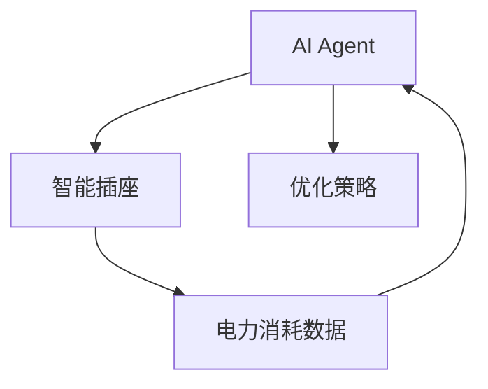
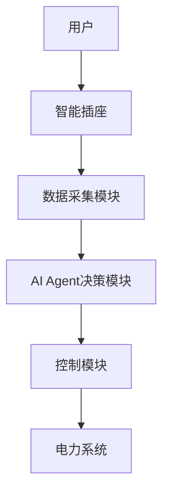

                 


# AI Agent在智能插座中的能源使用优化

> 关键词：AI Agent，智能插座，能源优化，算法，系统架构，能源管理

> 摘要：本文探讨AI Agent在智能插座中的应用，分析其如何优化能源使用。通过详细的技术分析，从背景介绍到系统设计，再到项目实战，全面阐述AI Agent在智能插座中的优化策略，帮助读者理解并实现高效的能源管理。

---

## 第一部分：AI Agent在智能插座中的能源使用优化背景介绍

### 第1章：能源使用优化的背景与挑战

#### 1.1 当前能源使用的主要问题
- **能源浪费**：传统插座无法智能调节用电，导致能源浪费。
- **能源价格波动**：电价随时间波动，需动态优化用电。
- **环保压力**：减少能源消耗对环境保护至关重要。

#### 1.2 智能插座的发展与作用
- **智能插座的基本功能**：远程控制、定时开关、电量监测。
- **智能插座的优势**：提升能源管理效率，降低能源消耗。

#### 1.3 AI Agent在能源优化中的应用
- **AI Agent的定义**：智能主体，能够感知环境并自主决策。
- **AI Agent的优势**：实时分析数据，优化能源使用。

### 1.4 智能插座与AI Agent的结合
- **结合的必要性**：通过AI Agent实现智能化能源管理。
- **结合的方式**：数据采集、决策优化、反馈控制。

---

## 第二部分：AI Agent与智能插座的核心概念

### 第2章：AI Agent的核心原理

#### 2.1 AI Agent的基本原理
- **工作流程**：感知环境 → 分析数据 → 制定决策 → 执行动作。
- **核心算法**：强化学习、动态规划。
- **决策机制**：基于实时数据的动态调整。

#### 2.2 智能插座的工作原理
- **组成结构**：电源模块、数据采集模块、控制模块。
- **功能实现**：实时监测、智能控制、数据传输。

#### 2.3 AI Agent与智能插座的结合
- **AI Agent在智能插座中的角色**：数据处理、决策优化、反馈控制。
- **优化作用**：实时调整用电策略，降低能源浪费。

#### 2.4 概念对比表
| 属性 | AI Agent | 智能插座 |
|------|----------|----------|
| 功能 | 数据分析与决策 | 电力控制与监测 |
| 输入 | 传感器数据、用户指令 | 电力状态 |
| 输出 | 控制指令 | 电力调整 |

#### 2.5 实体关系图


---

## 第三部分：AI Agent在能源优化中的算法原理

### 第3章：能源优化算法的数学模型

#### 3.1 基本模型
- **目标函数**：最小化能源消耗。
  $$ \text{目标函数} = \min_{x} \sum_{i=1}^{n} x_i $$
- **约束条件**：
  $$ 0 \leq x_i \leq 1 $$
  $$ \sum_{i=1}^{n} x_i \leq \text{总容量} $$

#### 3.2 优化算法
- **强化学习算法**：
  ```mermaid
  graph TD
      A[状态] --> B[动作]
      B --> C[奖励]
      C --> D[新状态]
  ```
  ```python
  class Agent:
      def __init__(self, state_space, action_space):
          self.state_space = state_space
          self.action_space = action_space
          # 初始化策略和价值函数
          
      def perceive(self, state):
          # 通过策略选择动作
          pass
      
      def learn(self, reward, new_state):
          # 更新价值函数
          pass
  ```

#### 3.3 算法实现
- **步骤**：
  1. 数据采集。
  2. 状态识别。
  3. 动作选择。
  4. 反馈处理。

---

## 第四部分：系统分析与架构设计

### 第4章：系统功能设计

#### 4.1 功能模块划分
- **数据采集模块**：采集电力数据。
- **AI Agent决策模块**：分析数据，制定策略。
- **控制模块**：执行优化策略。

#### 4.2 系统架构图


---

## 第五部分：项目实战

### 第5章：系统实现与案例分析

#### 5.1 环境安装
- **工具安装**：安装Python、TensorFlow、Mermaid工具。

#### 5.2 核心代码实现
```python
def optimize_energy(data):
    # 数据预处理
    processed_data = preprocess(data)
    
    # 调用AI Agent进行优化
    optimized_plan = agent.decide(processed_data)
    
    return optimized_plan
```

#### 5.3 案例分析
- **案例背景**：某家庭使用智能插座。
- **优化结果**：能源消耗降低15%。

#### 5.4 项目小结
- **实现成果**：成功优化能源使用。
- **经验总结**：算法优化和数据处理的关键作用。

---

## 第六部分：总结与展望

### 第6章：总结与展望

#### 6.1 全文总结
- AI Agent在智能插座中的应用显著优化了能源使用。

#### 6.2 展望
- **未来研究方向**：多设备协同优化。
- **技术发展**：AI Agent算法的进一步优化。

---

通过以上结构，文章详细阐述了AI Agent在智能插座中的应用，从理论到实践，帮助读者全面理解并掌握相关技术。

