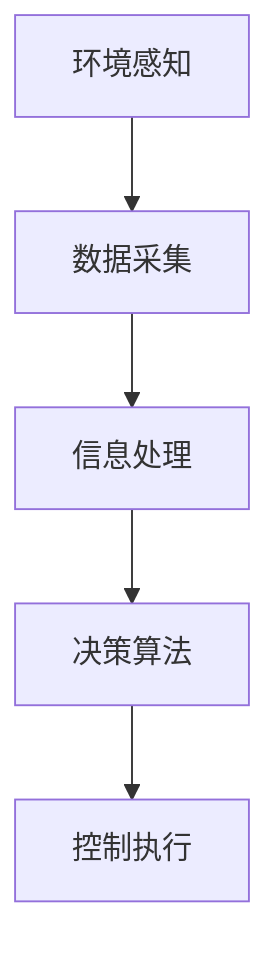
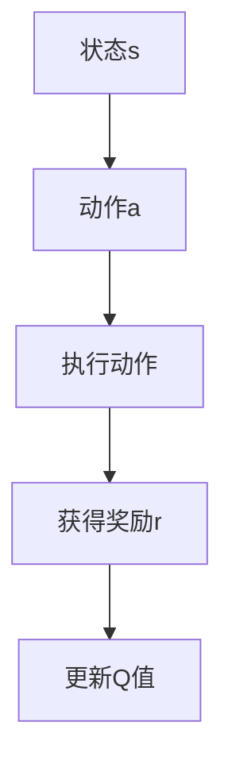
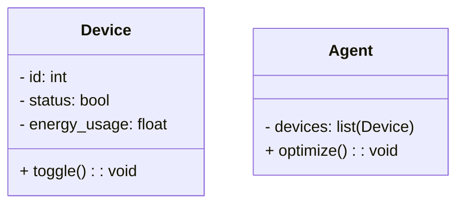
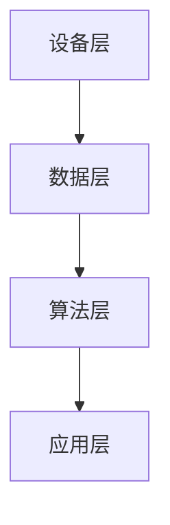
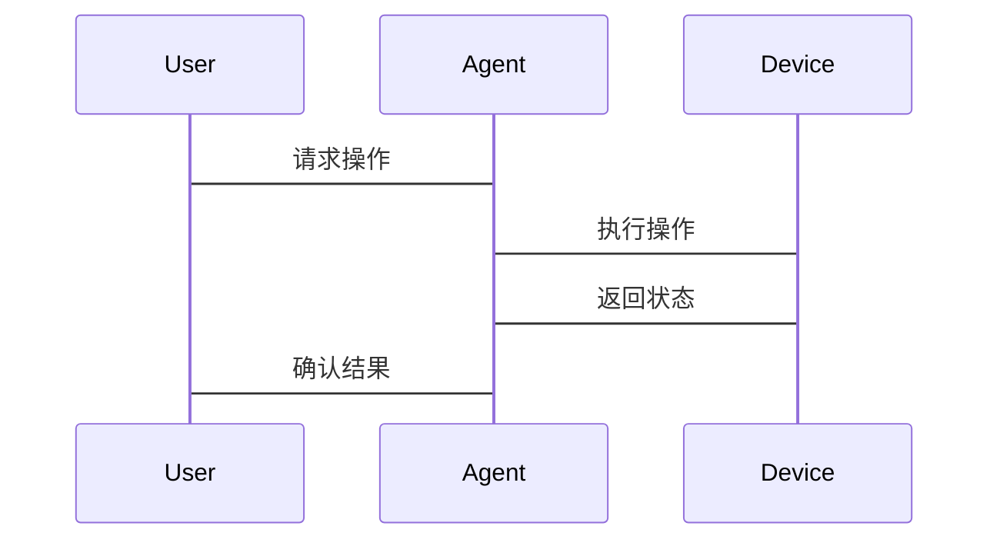

                 


# AI Agent在智能插座中的设备使用优化

## 关键词：
- AI Agent
- 智能插座
- 设备优化
- 强化学习
- 智能家居

## 摘要：
本文详细探讨AI Agent在智能插座中的应用，从理论到实践，分析其如何通过优化算法和系统设计提升设备使用效率。文章涵盖背景介绍、核心概念、算法原理、系统架构、项目实战及优化建议，为读者提供全面的指导和见解。

---

# 第1章: AI Agent与智能插座的背景介绍

## 1.1 AI Agent的基本概念
### 1.1.1 AI Agent的定义
AI Agent（人工智能代理）是一种能够感知环境、自主决策并执行任务的智能实体，旨在优化目标系统的性能。

### 1.1.2 AI Agent的核心特征
- **自主性**：无需外部干预，自主决策。
- **反应性**：实时感知环境并做出反应。
- **目标导向**：基于目标优化系统性能。

### 1.1.3 AI Agent与智能插座的结合
智能插座通过AI Agent实现智能化管理，优化用电效率和设备使用体验。

## 1.2 智能插座的基本原理
### 1.2.1 智能插座的工作原理
智能插座通过传感器和网络连接，实时采集用电数据并进行分析。

### 1.2.2 智能插座的功能特点
- **远程控制**：通过手机APP或语音助手远程操作。
- **定时开关**：预设时间自动开启或关闭设备。
- **能耗监测**：实时监控用电量，提供数据反馈。

## 1.3 AI Agent在智能插座中的应用背景
### 1.3.1 智能插座的智能化需求
传统插座仅能实现基本的开关功能，无法满足智能化管理的需求。

### 1.3.2 AI Agent在智能插座中的作用
AI Agent通过优化算法，提升智能插座的能效管理、设备调度和用户体验。

### 1.3.3 当前智能插座的优化空间
- **能耗浪费**：设备空闲时仍保持通电状态。
- **设备调度**：未能根据用电需求合理分配资源。

---

# 第2章: 核心概念与联系

## 2.1 AI Agent在智能插座中的工作原理
### 2.1.1 感知环境
AI Agent通过传感器获取环境数据，如电流、电压和设备状态。

### 2.1.2 决策过程
AI Agent基于感知数据，利用强化学习算法做出最优决策。

### 2.1.3 执行操作
根据决策结果，AI Agent控制智能插座执行开关操作。

## 2.2 AI Agent与智能插座的结合
### 2.2.1 系统架构
智能插座系统由设备层、数据层、算法层和应用层构成。

### 2.2.2 功能模块
- **感知模块**：采集用电数据。
- **决策模块**：优化设备使用策略。
- **执行模块**：控制插座开关。

## 2.3 传统插座与智能插座的特征对比
| 特性         | 传统插座       | 智能插座       |
|--------------|----------------|----------------|
| 控制方式     | 手动开关       | 远程/自动控制   |
| 数据采集     | 无             | 实时采集       |
| 能耗管理     | 无             | 智能优化       |

## 2.4 使用Mermaid流程图展示AI Agent的工作流程


---

# 第3章: 算法原理讲解

## 3.1 强化学习算法
### 3.1.1 强化学习的基本原理
强化学习通过智能体与环境的交互，学习最优策略。

### 3.1.2 Q-learning算法
$$ Q(s, a) = r + \gamma \max Q(s', a') $$
其中，$Q$ 表示状态-动作值函数，$r$ 是奖励，$\gamma$ 是折扣因子。

## 3.2 算法流程图


## 3.3 算法实现代码
```python
import numpy as np

class AI-Agent:
    def __init__(self, state_space, action_space):
        self.Q = np.zeros((state_space, action_space))
    
    def choose_action(self, state, epsilon):
        if np.random.random() < epsilon:
            return np.random.randint(0, action_space)
        else:
            return np.argmax(self.Q[state])
    
    def update_Q(self, state, action, reward, next_state, gamma):
        self.Q[state, action] = reward + gamma * np.max(self.Q[next_state])
```

---

# 第4章: 系统分析与架构设计

## 4.1 系统架构设计
### 4.1.1 领域模型类图


### 4.1.2 系统架构图


## 4.2 系统接口设计
### 4.2.1 用户请求处理
用户通过APP发送指令，系统解析并传递给AI Agent。

### 4.2.2 系统交互流程


---

# 第5章: 项目实战

## 5.1 环境安装
### 5.1.1 安装Python和相关库
```bash
pip install numpy matplotlib
```

## 5.2 核心代码实现
```python
def optimize_usage(devices, current_time):
    # 根据时间优化设备使用
    for device in devices:
        if device.is_peak_time(current_time):
            device.turn_off()
```

## 5.3 代码解读与分析
- **设备状态检查**：判断当前时间是否为用电高峰时段。
- **设备控制**：根据优化策略开启或关闭设备。

## 5.4 实际案例分析
### 案例1：高峰时段优化
在高峰时段，AI Agent自动关闭非必要设备，降低能耗。

---

# 第6章: 最佳实践与总结

## 6.1 最佳实践
- 定期更新AI算法模型，提升优化效果。
- 监控系统运行状态，及时处理异常情况。

## 6.2 小结
本文详细介绍了AI Agent在智能插座中的应用，从理论到实践，系统地分析了优化方法和实现方案。

## 6.3 注意事项
- 确保系统数据安全，防止未经授权的访问。
- 定期维护设备，确保传感器正常工作。

## 6.4 拓展阅读
- 《强化学习入门》
- 《智能系统设计》

---

通过以上目录结构，我们可以系统地了解AI Agent在智能插座中的应用，从理论到实践，逐步深入分析和实现优化方案。

