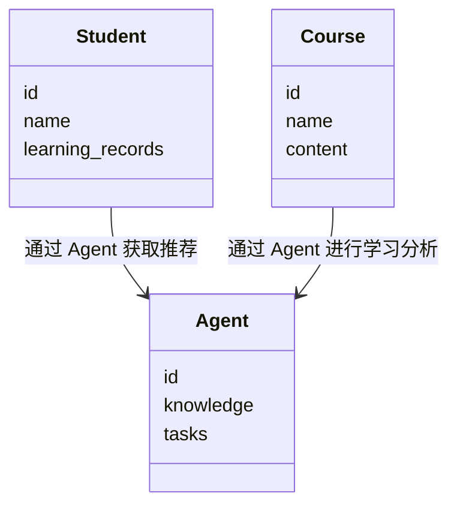
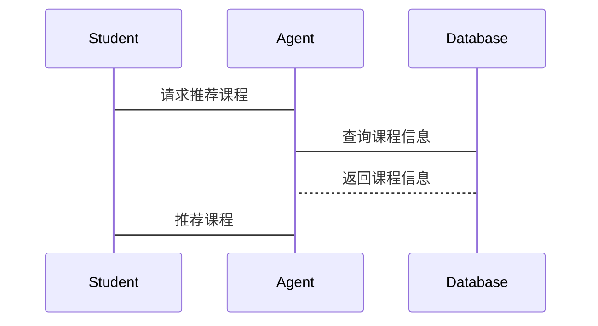

                 


# AI Agent在智能教育系统中的实现

> 关键词：AI Agent, 智能教育系统, 教育技术, 人工智能, 自适应学习

> 摘要：本文探讨AI Agent在智能教育系统中的实现，分析其核心原理、算法设计、系统架构，并通过项目实战展示其应用。文章详细阐述了AI Agent在智能教育中的作用，包括任务分配、多智能体协作、个性化学习推荐等，为教育技术的发展提供了新的视角和方法。

---

## 第1章: AI Agent 的基本概念与背景

### 1.1 AI Agent 的定义与核心概念

AI Agent（人工智能代理）是指能够感知环境、自主决策并执行任务的智能体。在智能教育系统中，AI Agent主要负责提供个性化学习建议、优化教学策略、分析学生行为等。

#### AI Agent的核心属性特征对比

| 属性 | 描述 |
|------|------|
| 感知能力 | 能够通过传感器或数据输入感知环境状态 |
| 行为决策 | 基于感知信息做出决策并执行动作 |
| 学习能力 | 能够通过经验改进自身的决策算法 |
| 自适应性 | 能够根据环境变化调整自身行为 |

#### AI Agent与智能教育系统的关系

在智能教育系统中，AI Agent扮演着连接学生、教师和系统的关键角色。通过AI Agent，系统能够动态调整教学策略，为每个学生提供个性化的学习路径。

### 1.2 智能教育系统的发展现状

智能教育系统正在经历快速发展的阶段，基于AI技术的教育工具和平台逐渐普及。AI Agent在其中的应用主要集中在以下几个方面：

1. **个性化学习推荐**：通过分析学生的学习行为和知识掌握情况，AI Agent能够为学生推荐适合的学习资源。
2. **教学辅助工具**：AI Agent可以帮助教师设计教学计划、评估学生表现。
3. **自适应学习系统**：通过实时反馈和调整，AI Agent能够帮助学生克服学习障碍。

### 1.3 AI Agent 在教育中的具体应用

AI Agent在教育中的应用多种多样，以下是几个典型场景：

1. **学生行为分析**：通过分析学生的学习数据，AI Agent能够识别学生的学习习惯和潜在问题。
2. **资源推荐**：根据学生的学习进度和兴趣，AI Agent推荐相应的学习资料和课程。
3. **虚拟助教**：AI Agent可以作为虚拟助教，为学生提供即时的学习支持和答疑。

---

## 第2章: AI Agent 的核心原理与技术实现

### 2.1 AI Agent 的核心原理

AI Agent的核心原理包括知识表示、推理机制和自适应学习。知识表示通常采用知识图谱的形式，推理机制基于逻辑推理或机器学习模型，自适应学习则通过强化学习实现。

#### AI Agent的知识表示与推理机制

知识表示是AI Agent理解世界的基础。在教育场景中，知识图谱可以表示课程内容、学生知识点掌握情况等。推理机制则基于这些知识图谱进行逻辑推理，从而做出决策。

#### AI Agent的感知与交互能力

AI Agent的感知能力主要依赖于自然语言处理和数据挖掘技术。通过分析学生的输入（如文本、语音），AI Agent能够理解学生的需求并做出相应的回应。

### 2.2 AI Agent 的技术实现

AI Agent的技术实现涉及多种人工智能技术，包括自然语言处理、机器学习和知识图谱构建。

#### 自然语言处理技术

自然语言处理（NLP）是AI Agent实现人机交互的关键技术。通过NLP，AI Agent能够理解学生的输入，并生成相应的回应。

#### 机器学习算法

机器学习算法用于训练AI Agent的学习模型。在教育场景中，监督学习、无监督学习和强化学习都有广泛应用。

#### 知识图谱构建与应用

知识图谱构建是将教育领域的知识结构化的过程。通过知识图谱，AI Agent能够更好地理解和推理知识之间的关系。

### 2.3 AI Agent 与其他技术的对比分析

AI Agent与其他技术的对比主要体现在功能定位和实现方式上。例如，与传统教育技术相比，AI Agent具有更强的自主决策能力和自适应性。

---

## 第3章: AI Agent 的算法原理与实现

### 3.1 任务分配算法

任务分配是AI Agent在教育系统中的重要功能之一。任务分配算法的目标是将任务分配给合适的智能体，以提高系统效率。

#### 基于规则的任务分配

基于规则的任务分配是通过预定义的规则进行任务分配。这种方法简单易行，但在复杂场景下可能表现不佳。

#### 基于强化学习的任务分配

强化学习是一种通过试错学习的方法。AI Agent通过与环境的交互，逐步优化任务分配策略。

#### 基于遗传算法的任务分配

遗传算法是一种模拟生物进化的过程。通过模拟自然选择，AI Agent能够找到最优的任务分配方案。

### 3.2 多智能体协作算法

多智能体协作是AI Agent在教育系统中的另一个重要功能。通过协作，多个智能体可以共同完成复杂任务。

#### 多智能体协作的实现步骤

1. **任务分解**：将复杂任务分解为多个子任务。
2. **任务分配**：将子任务分配给不同的智能体。
3. **协作执行**：智能体协同执行任务。
4. **结果整合**：整合各智能体的执行结果。

### 3.3 算法实现的代码示例

以下是一个简单的任务分配算法的Python代码示例：

```python
def assign_tasks(tasks, agents):
    # 假设每个任务只能由一个智能体完成
    # 使用随机分配的方式
    import random
    assigned_tasks = {}
    for task in tasks:
        agent = random.choice(agents)
        if agent in assigned_tasks:
            assigned_tasks[agent].append(task)
        else:
            assigned_tasks[agent] = [task]
    return assigned_tasks
```

### 3.4 数学模型与公式

任务分配问题可以表示为一个优化问题，目标是最小化任务完成时间。数学模型如下：

$$ \text{min} \sum_{i=1}^{n} t_i $$

其中，$t_i$ 表示第$i$个任务的完成时间。

---

## 第4章: 系统分析与架构设计

### 4.1 系统功能设计

智能教育系统的功能设计包括以下几个方面：

1. **学生信息管理**：管理学生的基本信息和学习记录。
2. **课程管理**：管理课程信息和教学资源。
3. **学习分析**：分析学生的学习行为和效果。
4. **智能推荐**：基于分析结果推荐个性化学习资源。

#### 系统功能设计的领域模型



### 4.2 系统架构设计

智能教育系统的架构设计分为前端、后端和数据库三部分。

#### 系统架构设计图


### 4.3 接口设计与交互流程

系统的接口设计包括学生登录、课程推荐、学习记录查询等功能。

#### 系统交互流程图



---

## 第5章: 项目实战

### 5.1 环境安装与配置

要实现AI Agent在智能教育系统中的应用，需要安装以下环境：

- Python 3.8+
- TensorFlow
- Scikit-learn
- NLTK

### 5.2 核心代码实现

以下是实现一个简单的AI Agent的代码示例：

```python
class AI_Agent:
    def __init__(self, knowledge_base):
        self.knowledge_base = knowledge_base

    def perceive(self, input_data):
        # 根据输入数据进行感知
        pass

    def decide(self, input_data):
        # 根据感知结果做出决策
        pass

    def act(self):
        # 执行决策结果
        pass
```

### 5.3 实际案例分析

以学生学习辅导为例，AI Agent可以通过分析学生的学习数据，推荐适合的学习资源。

#### 案例分析步骤

1. **数据收集**：收集学生的学习记录和行为数据。
2. **数据分析**：分析数据，识别学生的学习难点。
3. **资源推荐**：基于分析结果，推荐相应的学习资源。

---

## 第6章: 最佳实践与小结

### 6.1 最佳实践 tips

- **数据隐私保护**：在实际应用中，要注意保护学生的隐私数据。
- **多模态输入支持**：支持多种输入方式，如文本、语音、图像。
- **持续优化**：定期更新AI Agent的模型和知识库，以提高推荐精度。

### 6.2 小结

AI Agent在智能教育系统中的应用前景广阔，通过不断优化算法和系统架构，可以进一步提升教育系统的智能化水平。

### 6.3 注意事项

- **系统稳定性**：确保系统的稳定运行，避免因故障导致服务中断。
- **用户体验**：注重用户体验设计，提高系统的易用性。
- **性能优化**：在大规模应用中，要注意系统的性能优化。

### 6.4 拓展阅读

建议读者进一步阅读以下内容：

1. 《机器学习实战》
2. 《自然语言处理入门》
3. 《知识图谱构建与应用》

---

# 结语

通过本文的介绍，读者可以全面了解AI Agent在智能教育系统中的实现及其应用。希望本文能够为教育技术的发展提供有价值的参考和启示。

--- 

感谢您的耐心阅读！如果需要进一步的技术支持或详细讲解，请随时联系。

