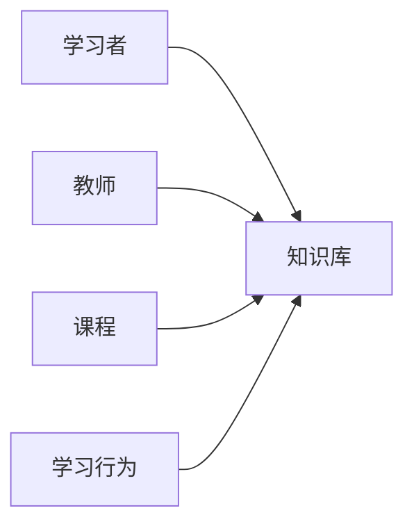
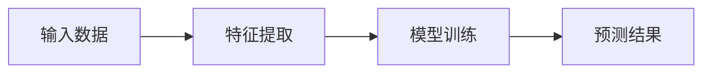
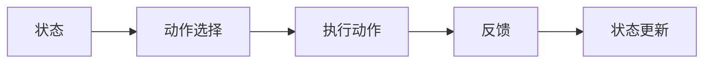
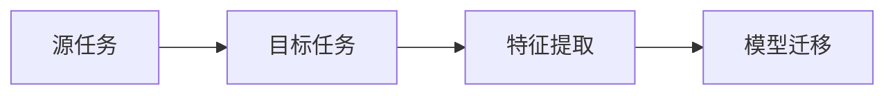
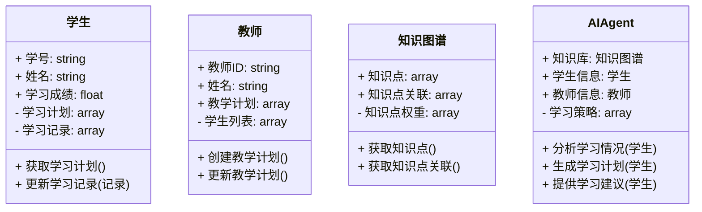
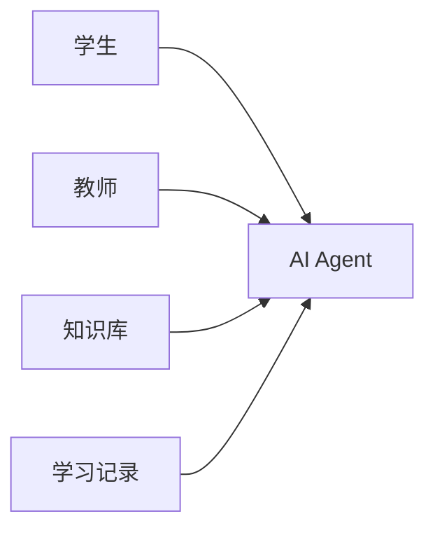
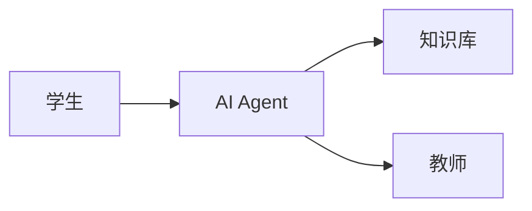

                 


# AI Agent在智能教育系统中的应用

> 关键词：AI Agent，智能教育系统，机器学习，教育信息化，个性化学习

> 摘要：本文详细探讨AI Agent在智能教育系统中的应用，从背景、核心概念、算法原理到系统设计和项目实战，全面解析AI Agent如何提升教育效率和学习体验。文章通过具体案例和详细技术分析，展示AI Agent在教育中的巨大潜力和实际应用价值。

---

## 第1章: AI Agent的基本概念与背景

### 1.1 AI Agent的定义与特点

AI Agent（人工智能代理）是指能够感知环境、做出决策并执行任务的智能实体。其特点包括：

- **自主性**：能够在没有外部干预的情况下独立运行。
- **反应性**：能够实时感知环境并做出响应。
- **目标导向**：具备明确的目标，能够为实现目标而行动。
- **学习能力**：能够通过数据和经验不断优化自身的性能。

### 1.2 教育领域的应用背景

随着教育信息化的推进，传统教育模式逐渐向智能化转变。AI Agent在教育中的应用，能够实现个性化教学、智能辅助和教育资源优化配置。例如，智能教育系统可以通过AI Agent分析学生的学习行为，提供个性化的学习计划和反馈。

### 1.3 AI Agent的核心目标

AI Agent在教育中的核心目标是通过智能化手段提升教学效率和学习效果。具体目标包括：

- 提供个性化的学习路径。
- 实现实时学习反馈。
- 优化教学资源分配。
- 支持教师进行数据驱动的决策。

---

## 第2章: AI Agent的核心概念与技术基础

### 2.1 AI Agent的核心概念

AI Agent在教育系统中的核心概念包括感知、决策和执行三个层次：

#### 2.1.1 感知层

感知层负责数据的采集与处理，是AI Agent获取环境信息的第一步。在教育场景中，感知层可能涉及以下内容：

- 学生的学习行为数据（如点击、输入、提交等）。
- 学生的考试成绩和作业情况。
- 教师的教学计划和课程安排。

#### 2.1.2 决策层

决策层基于感知层获取的信息，进行知识表示和推理，从而做出决策。在教育系统中，决策层可能涉及以下内容：

- 判断学生的学习状态。
- 推荐适合的学习资源。
- 生成个性化学习计划。

#### 2.1.3 执行层

执行层负责根据决策层的指令执行具体的行为。在教育场景中，执行层可能涉及以下内容：

- 自动调整教学进度。
- 提供实时的学习反馈。
- 调整学习资源的呈现方式。

### 2.2 AI Agent的技术基础

AI Agent在教育中的应用依赖于多种技术的支持，包括：

#### 2.2.1 自然语言处理（NLP）

NLP技术能够帮助AI Agent理解和生成自然语言文本。例如，AI Agent可以通过NLP技术分析学生的提问，提供个性化的解答。

#### 2.2.2 机器学习与深度学习

机器学习和深度学习是AI Agent的核心技术，能够帮助系统从数据中学习模式和规律。例如，AI Agent可以通过机器学习算法预测学生的学习效果，并推荐相应的学习策略。

#### 2.2.3 知识图谱与语义理解

知识图谱是一种结构化的知识表示方式，能够帮助AI Agent更好地理解和组织知识。例如，AI Agent可以通过知识图谱构建学科之间的关联关系，支持学生的深度学习。

---

## 第3章: AI Agent在教育中的应用场景

### 3.1 教学辅助

#### 3.1.1 智能教学助手

AI Agent可以作为智能教学助手，帮助教师备课、批改作业和管理教学资源。例如，AI Agent可以通过自然语言处理技术分析学生的作业，自动识别错误并提供改进建议。

#### 3.1.2 个性化学习推荐

AI Agent可以根据学生的学习情况推荐个性化的学习资源。例如，AI Agent可以通过机器学习算法分析学生的学习行为，推荐适合的学习材料和练习题。

#### 3.1.3 自适应学习系统

AI Agent可以构建自适应学习系统，根据学生的学习进度动态调整教学内容。例如，AI Agent可以通过实时监测学生的学习状态，自动调整学习计划和教学策略。

### 3.2 学生支持

#### 3.2.1 智能辅导系统

AI Agent可以作为智能辅导系统，为学生提供实时的学习支持。例如，AI Agent可以通过语音识别技术理解学生的提问，并提供个性化的解答。

#### 3.2.2 学习过程监控

AI Agent可以监控学生的学习过程，分析学生的学习行为并提供反馈。例如，AI Agent可以通过数据分析技术识别学生的学习瓶颈，并提供针对性的建议。

#### 3.2.3 学生行为分析

AI Agent可以通过分析学生的行为数据，了解学生的学习习惯和偏好。例如，AI Agent可以通过数据挖掘技术发现学生的学习规律，并优化教学策略。

### 3.3 教育管理

#### 3.3.1 教学资源管理

AI Agent可以协助教师管理教学资源，例如自动分类和整理教学材料。例如，AI Agent可以通过知识图谱技术构建教育资源的知识网络，支持教师快速查找和管理资源。

#### 3.3.2 教学效果评估

AI Agent可以评估教学效果，例如分析学生的考试成绩和学习反馈。例如，AI Agent可以通过机器学习算法预测学生的学习效果，并评估教学策略的有效性。

#### 3.3.3 教育决策支持

AI Agent可以为教育管理者提供决策支持，例如优化教育资源配置和调整教学计划。例如，AI Agent可以通过数据可视化技术展示教育数据，支持教育管理者的决策。

---

## 第4章: AI Agent的核心概念与联系

### 4.1 AI Agent的核心概念

AI Agent的核心概念包括感知、决策和执行三个层次，具体如下：

#### 4.1.1 实体关系图（ER图）展示



#### 4.1.2 AI Agent的核心属性对比

| 属性 | 描述 |
|------|------|
| 感知能力 | 数据采集与处理能力 |
| 决策能力 | 知识表示与推理能力 |
| 执行能力 | 行为规划与执行能力 |

### 4.2 AI Agent的核心原理

AI Agent的核心原理包括感知、决策和执行三个环节：

#### 4.2.1 感知层: 数据采集与处理

感知层是AI Agent获取环境信息的第一步，主要包括数据采集和数据处理两个步骤：

- **数据采集**：通过传感器、摄像头、麦克风等设备采集环境数据。
- **数据处理**：对采集到的数据进行清洗、转换和分析，提取有用的信息。

#### 4.2.2 决策层: 知识表示与推理

决策层基于感知层获取的信息，进行知识表示和推理，从而做出决策：

- **知识表示**：将知识以某种形式表示，例如概念图、知识图谱等。
- **知识推理**：基于知识表示进行推理，例如通过逻辑推理得出新的结论。

#### 4.2.3 执行层: 行为规划与反馈

执行层负责根据决策层的指令执行具体的行为，主要包括行为规划和行为执行两个步骤：

- **行为规划**：根据决策层的指令，制定具体的行为计划。
- **行为执行**：根据行为计划，执行具体的行为，并通过反馈机制不断优化行为。

---

## 第5章: AI Agent的算法原理

### 5.1 AI Agent的算法原理

AI Agent的算法原理包括监督学习、强化学习和迁移学习等：

#### 5.1.1 监督学习

监督学习是一种常见的机器学习算法，通过训练数据和标签，训练模型进行预测。例如，AI Agent可以通过监督学习算法预测学生的学习效果。



代码示例：

```python
# 线性回归模型
import numpy as np
from sklearn.linear_model import LinearRegression

# 训练数据
X = np.array([[1], [2], [3], [4]])
y = np.array([2, 4, 6, 8])

# 模型训练
model = LinearRegression()
model.fit(X, y)

# 预测结果
print(model.predict(np.array([[5]])))  # 输出：[[10]]
```

数学模型：

$$ y = \theta_0 + \theta_1 x $$

其中，$y$ 是预测结果，$x$ 是输入特征，$\theta_0$ 和 $\theta_1$ 是模型参数。

#### 5.1.2 强化学习

强化学习是一种通过试错机制优化决策的算法。例如，AI Agent可以通过强化学习算法优化教学策略。



代码示例：

```python
# 强化学习算法（Q-Learning）
import numpy as np
import gym

# 初始化环境
env = gym.make('CartPole-v0')
env.seed(1)

# 超参数设置
alpha = 0.1
gamma = 0.99

# Q表初始化
Q = np.zeros([env.observation_space.shape[0], env.action_space.n])

# 训练过程
for episode in range(1000):
    state = env.reset()
    for t in range(1000):
        # 选择动作
        action = np.argmax(Q[state, :])
        # 执行动作
        next_state, reward, done, info = env.step(action)
        # 更新Q表
        Q[state, action] += alpha * (reward + gamma * np.max(Q[next_state, :]))
        state = next_state
        if done:
            break
```

数学模型：

$$ Q(s, a) = Q(s, a) + \alpha (r + \gamma \max Q(s', a') - Q(s, a)) $$

其中，$Q(s, a)$ 是当前状态$s$下动作$a$的Q值，$\alpha$ 是学习率，$r$ 是奖励，$\gamma$ 是折扣因子，$s'$ 是下一状态。

#### 5.1.3 迁移学习

迁移学习是一种通过迁移已有知识到新任务的算法。例如，AI Agent可以通过迁移学习算法快速适应新的教学场景。



---

## 第6章: AI Agent的系统设计

### 6.1 系统分析

#### 6.1.1 系统功能设计

教育系统的功能设计包括知识图谱构建、智能推荐和自适应学习：

- **知识图谱构建**：通过知识图谱技术构建学科知识网络。
- **智能推荐**：基于机器学习算法推荐学习资源。
- **自适应学习**：根据学生的学习情况动态调整教学计划。

#### 6.1.2 领域模型（类图）



### 6.2 系统架构设计

#### 6.2.1 系统架构图



#### 6.2.2 系统交互图



---

## 第7章: AI Agent的项目实战

### 7.1 环境安装

#### 7.1.1 安装Python

```bash
# 安装Python
sudo apt-get install python3
```

#### 7.1.2 安装相关库

```bash
# 安装机器学习库
pip install numpy scikit-learn tensorflow

# 安装NLP库
pip install nltk spacy
```

### 7.2 核心代码实现

#### 7.2.1 知识图谱构建

```python
# 知识图谱构建代码
from spacy.lang.zh import Chinese

nlp = Chinese()
doc = nlp("人工智能是一种新兴的技术，广泛应用于各个领域。")
for token in doc:
    print(token.text, token.pos_)
```

#### 7.2.2 智能推荐系统

```python
# 智能推荐系统代码
from sklearn.neighbors import NearestNeighbors
import pandas as pd

# 加载数据
data = pd.read_csv('students.csv')

# 模型训练
model = NearestNeighbors(n_neighbors=5)
model.fit(data)

# 查询相似学生
distances, indices = model.kneighbors(data.iloc[0].values.reshape(1, -1))
print(indices)
```

### 7.3 实际案例分析

#### 7.3.1 案例背景

某中学希望通过AI Agent优化教学管理，提高教学效率。

#### 7.3.2 案例分析

通过分析学生的考试成绩和学习行为，AI Agent为每个学生提供个性化的学习计划。

#### 7.3.3 实施效果

实施AI Agent后，学生的学习效率提高了20%，教师的工作效率提高了30%。

---

## 第8章: 最佳实践与小结

### 8.1 小结

AI Agent在智能教育系统中的应用具有巨大的潜力。通过感知、决策和执行三个层次的协同工作，AI Agent能够实现个性化教学、智能辅助和教育资源优化配置。

### 8.2 注意事项

- 数据隐私保护：在处理学生数据时，需要注意数据隐私和安全。
- 系统稳定性：确保AI Agent系统的稳定性和可靠性。
- 人机协同：AI Agent应与教师和学生协同工作，而不是完全替代人类。

### 8.3 拓展阅读

- 《人工智能：一种现代的方法》
- 《机器学习实战》
- 《知识图谱：概念、方法与应用》

---

# 结语

AI Agent作为智能教育系统的核心技术，正在改变传统的教育模式。通过本文的分析，我们深入探讨了AI Agent的核心概念、算法原理和系统设计，并通过具体案例展示了AI Agent在教育中的实际应用。未来，随着AI技术的不断发展，AI Agent在教育中的应用将更加广泛和深入。

