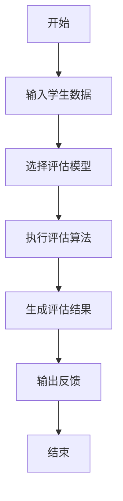
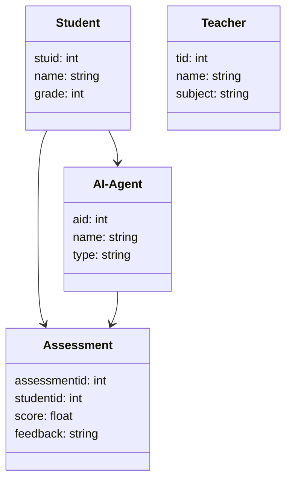

                 


```markdown
# AI Agent在智能教育评估中的角色

> 关键词：AI Agent，智能教育评估，教育评估系统，评估模型，算法设计，系统架构

> 摘要：AI Agent在智能教育评估中扮演着越来越重要的角色。通过分析AI Agent的核心概念、算法原理、系统架构以及实际应用案例，本文深入探讨了AI Agent在教育评估中的应用价值，提出了一个基于AI Agent的教育评估系统设计方案，并通过实际案例验证了该方案的有效性。本文适合教育技术研究者、教育信息化从业者以及对AI技术感兴趣的读者阅读。

---

## 第一部分: 背景与概念

### 第1章: AI Agent与智能教育评估概述

#### 1.1 AI Agent的基本概念
- 1.1.1 什么是AI Agent
  - AI Agent的定义：智能体（Agent）是指能够感知环境并采取行动以实现目标的实体。
  - AI Agent的特征：自主性、反应性、目标导向、社会性。

- 1.1.2 AI Agent的核心特征
  - 自主性：能够在没有外部干预的情况下运行。
  - 反应性：能够根据环境变化调整行为。
  - 目标导向：通过行为实现特定目标。
  - 社会性：能够与其他实体（包括人类和AI Agent）交互协作。

- 1.1.3 AI Agent在教育领域的潜力
  - 个性化学习支持
  - 自动化评估与反馈
  - 教学决策支持

#### 1.2 智能教育评估的背景与需求
- 1.2.1 教育评估的传统模式
  - 纸质考试与评分
  - 教师手工批改作业
  - 定期测试与反馈

- 1.2.2 传统评估模式的局限性
  - 时间效率低
  - 评估结果的主观性
  - 个性化反馈不足

- 1.2.3 智能教育评估的必要性
  - 提高评估效率
  - 降低人为误差
  - 支持个性化学习

#### 1.3 AI Agent在教育评估中的角色定位
- 1.3.1 作为评估工具的角色
  - 自动化评分与反馈
  - 数据分析与结果报告

- 1.3.2 作为评估主体的可能性
  - 智能代理辅助决策
  - 代理间协作评估

- 1.3.3 AI Agent与教育评估的结合场景
  - 在线学习平台的智能评分系统
  - 教学过程中的实时反馈
  - 个性化学习路径规划

---

### 第2章: AI Agent在教育评估中的核心概念与联系

#### 2.1 核心概念原理
- 2.1.1 AI Agent的决策机制
  - 基于规则的决策
  - 基于机器学习的决策
  - 基于知识图谱的推理

- 2.1.2 教育评估的指标体系
  - 学生表现评估指标
  - 学习效果评估指标
  - 学习过程评估指标

- 2.1.3 AI Agent与教育评估的交互过程
  - 输入：学生行为数据、学习内容
  - 处理：数据分析、模型推理
  - 输出：评估结果、反馈建议

#### 2.2 核心概念对比分析
- 2.2.1 AI Agent与传统评估工具的对比
  | 特性            | AI Agent                  | 传统评估工具            |
  |-----------------|---------------------------|--------------------------|
  | 自动化程度      | 高                        | 低                      |
  | 反应速度        | 快                        | 慢                      |
  | 个性化支持      | 强                        | 弱                      |

- 2.2.2 不同教育评估模型的对比
  - 基于规则的评估模型
  - 基于机器学习的评估模型
  - 基于知识图谱的评估模型

- 2.2.3 不同AI Agent算法的对比
  - 基于规则的AI Agent
  - 基于机器学习的AI Agent
  - 基于知识图谱的AI Agent

#### 2.3 ER实体关系图
```mermaid
erd
    Student(stuid, name, grade)
    Teacher(tid, name, subject)
    Assessment(assessmentid, studentid, score, feedback)
    AI-Agent(aid, name, type)
    Interaction(interactionid, studentid, agentid, action)
```

---

## 第3章: AI Agent在教育评估中的算法原理

#### 3.1 算法流程图


#### 3.2 数学模型与公式
- 3.2.1 基于机器学习的评估模型
  - 线性回归模型：$y = \beta_0 + \beta_1x + \epsilon$
  - 逻辑回归模型：$P(y=1|x) = \frac{e^{\beta_0 + \beta_1x}}{1 + e^{\beta_0 + \beta_1x}}$
  - 神经网络模型：$y = f(Wx + b)$，其中$f$为激活函数。

- 3.2.2 基于知识图谱的评估模型
  - 知识图谱构建：使用图嵌入（Graph Embedding）技术将知识图谱中的节点表示为低维向量。
  - 知识推理：通过图遍历算法（如DFS、BFS）进行推理。

---

## 第4章: 系统分析与架构设计

#### 4.1 系统功能设计
- 4.1.1 领域模型


- 4.1.2 系统架构设计


- 4.1.3 接口设计
  - API接口：RESTful API（如POST /api/assessment）
  - 数据格式：JSON格式
  - 接口文档：使用Swagger进行文档编写

---

## 第5章: 项目实战

#### 5.1 环境安装
- 安装Python 3.x及以上
- 安装必要的库：numpy, pandas, scikit-learn, flask

#### 5.2 核心代码实现
```python
from sklearn.linear_model import LinearRegression
import numpy as np

# 示例数据
X = np.array([[1], [2], [3], [4], [5]])
y = np.array([1, 2, 3, 4, 5])

# 模型训练
model = LinearRegression()
model.fit(X, y)

# 预测
new_data = np.array([[6]])
print(model.predict(new_data))  # 输出：[[6.]]
```

#### 5.3 案例分析
- 案例：智能评分系统
  - 需求分析：实时评分、个性化反馈
  - 系统实现：使用Flask构建API，前端展示结果
  - 测试：单元测试、集成测试

---

## 第6章: 最佳实践与小结

#### 6.1 小结
- AI Agent在教育评估中的优势
  - 提高效率
  - 个性化支持
  - 数据驱动的决策

#### 6.2 注意事项
- 数据隐私保护
- 算法的可解释性
- 系统的稳定性

#### 6.3 拓展阅读
- 推荐书籍：《教育信息化2.0行动计划》
- 推荐博客：[AI与教育的博客](https://example.com)

---

## 附录: 参考文献

- [1] Russell, S., & Norvig, P. (2010). Artificial Intelligence: A Modern Approach.
- [2] 刘洋, & 张伟. (2020). 基于AI的教育评估系统设计.

---

以上是《AI Agent在智能教育评估中的角色》的详细目录结构和内容概要，您可以根据需要进一步扩展每个章节的具体内容，添加更多细节和实例，以满足文章的长度和深度要求。
```

