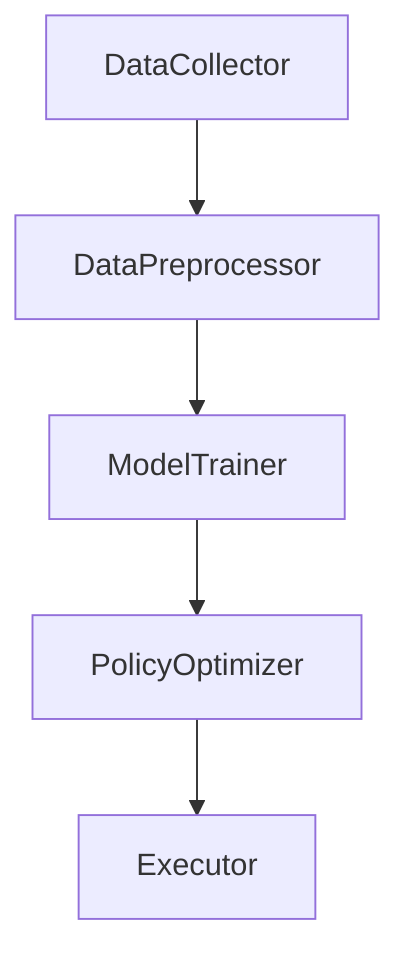
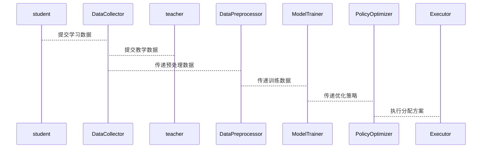

                 


# AI Agent在智能教育资源优化分配中的应用

> 关键词：AI Agent，教育资源优化，智能分配，算法实现，教育技术

> 摘要：本文深入探讨了AI Agent在智能教育资源优化分配中的应用，分析了其在教育领域的核心功能、技术架构、算法原理及实际应用场景。通过系统设计、算法实现和项目实战，本文详细展示了AI Agent如何帮助实现教育资源的动态调整与高效利用。

---

# 第1章: AI Agent与智能教育资源优化分配概述

## 1.1 AI Agent的基本概念

### 1.1.1 AI Agent的定义
AI Agent（人工智能代理）是一种能够感知环境、自主决策并执行任务的智能体。它通过算法和数据驱动的方式，帮助实现复杂问题的自动化解决。

### 1.1.2 AI Agent的核心特征
- **自主性**：能够在无外部干预的情况下独立运行。
- **反应性**：能够实时感知环境变化并做出响应。
- **学习能力**：通过机器学习算法不断优化自身行为。
- **决策能力**：基于数据和模型做出最优决策。

### 1.1.3 AI Agent与传统算法的区别
AI Agent不仅仅是简单的算法实现，它具备自主性、适应性和学习能力，能够在复杂环境中动态调整策略。

## 1.2 智能教育资源优化分配的背景

### 1.2.1 教育资源分配的现状
- 当前教育资源分配存在不均衡现象，部分地区或学校资源过剩，而另一些地区则资源匮乏。
- 教学资源分配往往依赖人工经验，难以做到完全公平与最优。

### 1.2.2 当前教育资源分配的主要问题
- **资源分配不均**：不同地区、学校之间的教育资源差距显著。
- **分配效率低**：传统分配方式耗时且效率低下。
- **分配结果不理想**：难以实现教育资源的最优配置。

### 1.2.3 AI Agent在教育领域的应用潜力
AI Agent可以通过数据分析、智能决策和动态调整，实现教育资源的高效利用和优化分配。

## 1.3 AI Agent在教育资源分配中的作用

### 1.3.1 AI Agent的核心功能
- **数据采集与分析**：收集学生、教师、课程等多维度数据，分析教育资源的需求和供给情况。
- **智能决策**：基于数据分析结果，制定教育资源分配策略。
- **动态调整**：根据实时反馈优化资源配置，确保分配结果的公平性与高效性。

### 1.3.2 AI Agent如何优化教育资源分配
- **精准匹配**：通过算法匹配学生与教师的能力，实现资源的最优分配。
- **动态平衡**：根据教育资源供需变化，实时调整分配策略。
- **提高效率**：通过自动化方式减少人工干预，提升分配效率。

### 1.3.3 AI Agent与其他教育技术的对比
- **区别于传统教学管理软件**：AI Agent具备自主决策和学习能力，能够动态优化资源配置。
- **与教育大数据技术的区别**：AI Agent不仅仅是数据的存储与分析，更能够基于数据做出决策并执行任务。

---

# 第2章: AI Agent的基本原理与技术架构

## 2.1 AI Agent的核心技术

### 2.1.1 机器学习算法
AI Agent的核心技术之一是机器学习算法，包括监督学习、无监督学习和强化学习。

- **监督学习**：用于根据已有数据训练模型，预测教育资源分配的最佳方案。
- **无监督学习**：用于发现数据中的潜在模式，帮助识别教育资源分配中的隐藏问题。
- **强化学习**：用于动态调整教育资源分配策略，以最大化分配效果。

### 2.1.2 自然语言处理
AI Agent能够通过自然语言处理技术，分析教育相关的文本数据，例如学生的反馈、教师的教学计划等。

### 2.1.3 强化学习与决策优化
强化学习是AI Agent实现决策优化的核心技术，通过不断试错和学习，找到最优的教育资源分配策略。

## 2.2 AI Agent的系统架构

### 2.2.1 感知层
- **数据采集**：通过传感器、API等方式采集学生、教师、课程等数据。
- **数据预处理**：对采集到的数据进行清洗、归一化等处理。

### 2.2.2 计算层
- **模型训练**：基于机器学习算法，训练教育资源分配模型。
- **决策优化**：通过强化学习优化教育资源分配策略。

### 2.2.3 执行层
- **策略执行**：根据优化后的策略，执行教育资源分配任务。
- **反馈收集**：收集分配结果的反馈，用于模型的进一步优化。

## 2.3 AI Agent的算法流程

### 2.3.1 数据采集与预处理
- **数据来源**：学生学习数据、教师教学数据、课程资源数据等。
- **数据预处理**：去除噪声数据、归一化处理、特征提取等。

### 2.3.2 模型训练与优化
- **模型选择**：根据问题特点选择合适的机器学习模型。
- **模型训练**：使用预处理后的数据训练模型。
- **模型优化**：通过交叉验证、超参数调优等方式优化模型性能。

### 2.3.3 智能决策与执行
- **决策制定**：基于训练好的模型，生成教育资源分配方案。
- **方案执行**：将分配方案转化为具体的操作，例如分配课程资源、调整教师工作量等。

---

## 2.4 AI Agent的数学模型

### 2.4.1 强化学习的数学模型
强化学习的核心是通过试错学习找到最优策略，数学模型可以表示为：

$$
Q(s, a) = r + \gamma \max_{a'} Q(s', a')
$$

其中：
- \( Q(s, a) \) 表示在状态 \( s \) 下采取动作 \( a \) 的期望奖励。
- \( r \) 是当前动作的奖励。
- \( \gamma \) 是折扣因子。
- \( \max_{a'} Q(s', a') \) 是下一状态 \( s' \) 下的最大期望奖励。

### 2.4.2 监督学习的数学模型
监督学习的目标是最小化预测值与真实值的差异，常用的损失函数为：

$$
L = \frac{1}{n}\sum_{i=1}^{n}(y_i - \hat{y}_i)^2
$$

其中：
- \( y_i \) 是真实值。
- \( \hat{y}_i \) 是预测值。
- \( n \) 是样本数量。

---

## 2.5 AI Agent的系统架构设计

### 2.5.1 系统功能模块划分
- **数据采集模块**：负责采集学生、教师、课程等数据。
- **数据处理模块**：对采集到的数据进行预处理。
- **模型训练模块**：基于机器学习算法训练教育资源分配模型。
- **决策优化模块**：通过强化学习优化教育资源分配策略。
- **执行模块**：根据优化后的策略执行教育资源分配任务。

### 2.5.2 系统模块之间的关系


### 2.5.3 系统架构的优缺点分析
- **优点**：
  - 结构清晰，各模块分工明确。
  - 方便维护和扩展。
- **缺点**：
  - 模块之间耦合度较高，可能导致维护成本增加。
  - 对数据采集和处理的实时性要求较高。

---

## 2.6 AI Agent的系统接口设计

### 2.6.1 系统接口设计
- **数据接口**：提供数据输入和输出的接口，方便与其他系统集成。
- **算法接口**：提供机器学习算法的接口，方便调用和扩展。
- **决策接口**：提供决策优化的接口，方便生成教育资源分配方案。

### 2.6.2 系统交互设计


---

## 2.7 AI Agent的代码实现

### 2.7.1 环境安装
- 安装Python和必要的库：
  ```bash
  pip install numpy scikit-learn matplotlib
  ```

### 2.7.2 核心代码实现
```python
import numpy as np
from sklearn.model_selection import train_test_split
from sklearn.linear_model import LinearRegression

# 示例数据
X = np.array([[1], [2], [3], [4], [5]])
y = np.array([2, 4, 6, 8, 10])

# 数据划分
X_train, X_test, y_train, y_test = train_test_split(X, y, test_size=0.2)

# 模型训练
model = LinearRegression()
model.fit(X_train, y_train)

# 模型预测
y_pred = model.predict(X_test)
print(y_pred)
```

### 2.7.3 代码解读与分析
- **数据预处理**：将数据划分为训练集和测试集。
- **模型训练**：使用线性回归算法训练模型。
- **模型预测**：基于训练好的模型进行预测。

---

## 2.8 项目实战

### 2.8.1 案例分析
假设我们有一个学校，需要分配教师资源到不同的课程。通过AI Agent，我们可以根据教师的能力和课程的需求，动态调整教师的分配。

### 2.8.2 实施步骤
1. **数据采集**：收集教师能力和课程需求数据。
2. **数据预处理**：清洗数据并归一化处理。
3. **模型训练**：使用机器学习算法训练分配模型。
4. **决策优化**：通过强化学习优化分配策略。
5. **执行分配**：根据优化后的策略分配教师资源。

### 2.8.3 项目小结
通过AI Agent实现教育资源的动态分配，能够显著提高资源利用效率，同时确保分配的公平性与合理性。

---

## 2.9 最佳实践 Tips

### 2.9.1 小结
- AI Agent是一种 powerful tool for optimizing resource allocation in education.
- 通过机器学习和强化学习算法，AI Agent能够实现教育资源的动态调整与高效利用。

### 2.9.2 注意事项
- 数据质量是关键，确保数据的准确性和完整性。
- 算法选择需要根据具体问题特点进行，避免盲目使用复杂算法。
- 系统设计需要考虑可扩展性和可维护性。

### 2.9.3 拓展阅读
- 推荐阅读《机器学习实战》和《强化学习（Deep Reinforcement Learning）》等书籍，深入了解AI Agent的核心技术。

---

# 结语

通过本文的详细讲解，我们了解了AI Agent在智能教育资源优化分配中的重要作用和具体实现方式。AI Agent不仅能够提高教育资源的利用效率，还能够实现教育资源的公平分配，为教育领域的发展带来新的可能性。

