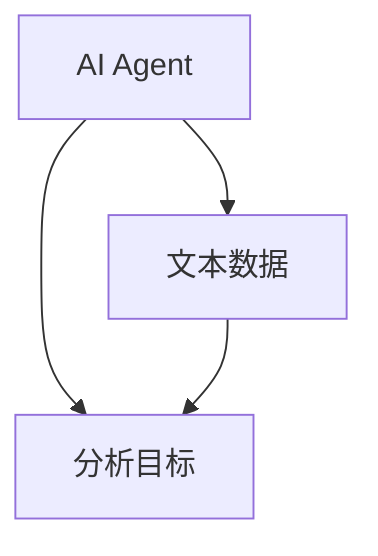
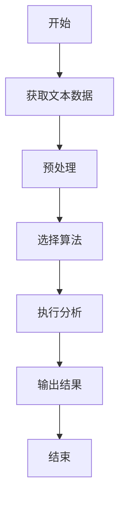
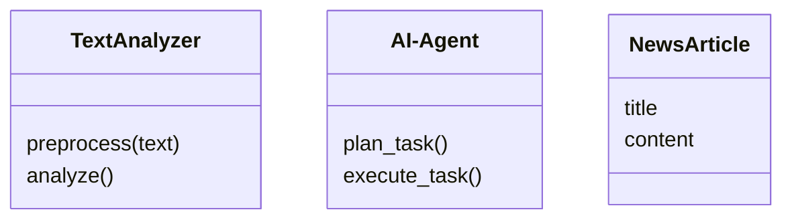
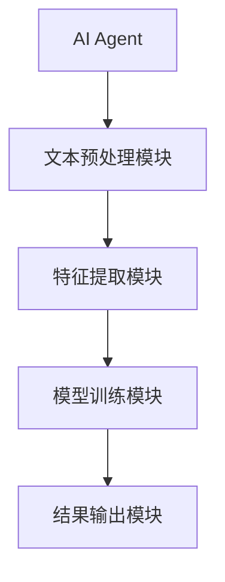
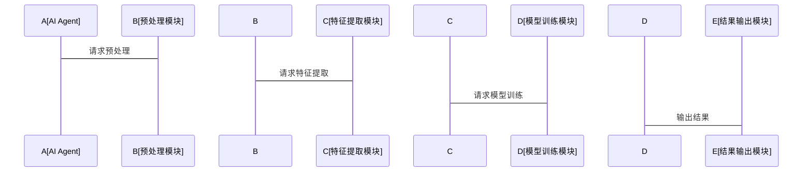

                 


# AI Agent在智能文本分析中的应用

> 关键词：AI Agent, 智能文本分析, 自然语言处理, 机器学习, 文本挖掘, 应用场景, 技术实现

> 摘要：本文深入探讨AI Agent在智能文本分析中的应用，从背景介绍、核心概念、算法原理到系统架构、项目实战，结合实际案例，分析AI Agent如何赋能智能文本分析，帮助读者全面理解其技术实现和应用价值。

---

## 第1章 背景介绍

### 1.1 问题背景

#### 1.1.1 智能文本分析的定义与重要性
智能文本分析是指利用自然语言处理（NLP）、机器学习等技术，对文本数据进行理解、挖掘和分析，以提取有价值的信息或洞察。其重要性体现在商业决策、信息提取、情感分析、内容分类等多个领域。

#### 1.1.2 AI Agent在文本分析中的作用
AI Agent（智能体）是一种能够感知环境、自主决策并执行任务的智能系统。在文本分析中，AI Agent能够自动化执行复杂任务，如信息抽取、情感分析、实体识别等，显著提升分析效率和准确性。

#### 1.1.3 当前技术发展的现状与趋势
随着深度学习和大语言模型（如GPT）的发展，文本分析技术逐渐从传统规则驱动向数据驱动转变，AI Agent的应用也从单一任务扩展到多任务协同，实现更复杂的分析场景。

### 1.2 问题描述

#### 1.2.1 文本分析的主要挑战
- 数据量大、类型多样
- 领域知识复杂
- 实时性要求高
- 结果可解释性差

#### 1.2.2 AI Agent在文本分析中的独特优势
- 自动化处理能力
- 多任务协同能力
- 智能决策能力
- 实时响应能力

#### 1.2.3 问题解决的必要性与可行性分析
- 必要性：AI Agent能够显著提高文本分析的效率和精度，满足复杂场景的需求。
- 可行性：基于现有技术，AI Agent在文本分析中的应用已具备成熟的技术基础和丰富的实践案例。

### 1.3 问题解决

#### 1.3.1 AI Agent的核心功能与实现路径
- **核心功能**：数据采集、特征提取、模型训练、结果输出
- **实现路径**：数据预处理、模型选择、任务执行、结果反馈

#### 1.3.2 文本分析的关键技术与方法
- **关键技术**：NLP、机器学习、深度学习
- **方法**：监督学习、无监督学习、半监督学习

#### 1.3.3 AI Agent与文本分析的结合方式
- **模块化结合**：将AI Agent作为文本分析系统的一个模块，协同其他模块完成任务。
- **端到端结合**：AI Agent直接负责从数据输入到结果输出的整个流程。

### 1.4 边界与外延

#### 1.4.1 AI Agent在文本分析中的应用边界
- **数据范围**：仅限于文本数据，不涉及图像、视频等其他类型的数据。
- **任务范围**：主要集中在分析和理解层面，不涉及物理世界的交互。

#### 1.4.2 相关技术的对比与区分
| 技术 | 定义 | 优缺点 |
|------|------|--------|
| NLP | 自然语言处理 | 数据依赖性高，但效果稳定 | 
| 机器学习 | 数据驱动的模式识别 | 需大量标注数据，但泛化能力强 |
| AI Agent | 自主决策的智能体 | 任务灵活，但实现复杂 |

#### 1.4.3 应用场景的扩展与延伸
- **扩展**：从单一文本分析扩展到多模态数据分析。
- **延伸**：从离线分析延伸到实时分析，支持动态数据处理。

### 1.5 核心概念

#### 1.5.1 AI Agent的基本构成要素
- **感知模块**：负责数据的获取和理解。
- **决策模块**：负责任务的规划和决策。
- **执行模块**：负责任务的具体执行。

#### 1.5.2 智能文本分析的核心要素
- **数据预处理**：清洗、分词、特征提取。
- **模型训练**：选择合适的算法，训练模型。
- **结果分析**：输出分析结果并解释。

#### 1.5.3 两者的结合与协同机制
- **协同机制**：AI Agent通过调用文本分析模块完成特定任务，文本分析模块为AI Agent提供数据支持。

### 1.6 本章小结

---

## 第2章 核心概念与联系

### 2.1 核心概念原理

#### 2.1.1 AI Agent的基本原理
AI Agent通过感知环境、理解任务需求、制定执行计划，最终完成目标。在文本分析中，AI Agent主要负责任务的规划和执行。

#### 2.1.2 智能文本分析的核心原理
智能文本分析通过NLP技术对文本进行处理，提取有用信息。其核心是将文本数据转化为可计算的特征，利用机器学习模型进行分析和预测。

#### 2.1.3 两者结合的协同原理
AI Agent作为智能文本分析的驱动者，负责协调各个模块的协作，确保整个分析过程高效有序。

### 2.2 概念属性特征对比

| 属性 | AI Agent | 智能文本分析 |
|------|-----------|---------------|
| 输入 | 文本数据、任务需求 | 文本数据 |
| 输出 | 分析结果、决策建议 | 信息提取、分类结果 |
| 核心技术 | NLP、机器学习 | 深度学习 |

### 2.3 ER实体关系图


### 2.4 本章小结

---

## 第3章 算法原理讲解

### 3.1 算法原理

#### 3.1.1 AI Agent的核心算法
- **任务规划算法**：基于优先级的任务调度。
- **决策算法**：基于概率的决策树。

#### 3.1.2 智能文本分析的关键算法
- **文本分类**：支持向量机（SVM）、随机森林（RF）。
- **实体识别**：条件随机场（CRF）。

#### 3.1.3 两者结合的算法流程
1. 数据预处理：清洗、分词、特征提取。
2. 模型选择：根据任务选择合适的算法。
3. 模型训练：使用训练数据训练模型。
4. 任务执行：AI Agent调用模型完成分析。

### 3.2 算法流程图


### 3.3 算法实现

#### 3.3.1 Python代码示例
```python
def ai_agent_analysis(text):
    # 预处理
    processed_text = preprocess(text)
    # 选择算法
    model = select_algorithm(processed_text)
    # 执行分析
    result = model.predict(processed_text)
    return result
```

#### 3.3.2 数学模型与公式
文本分类的损失函数：
$$ L = -\sum_{i=1}^{n} y_i \log p(y_i) $$

### 3.4 本章小结

---

## 第4章 系统分析与架构设计

### 4.1 问题场景介绍
以一个新闻文本分析系统为例，AI Agent需要从大量新闻中提取关键词、主题和情感倾向。

### 4.2 系统功能设计

#### 4.2.1 领域模型类图


#### 4.2.2 系统架构设计


### 4.3 接口设计与交互

#### 4.3.1 接口设计
- **输入接口**：接收原始文本数据。
- **输出接口**：输出分析结果。

#### 4.3.2 交互设计


### 4.4 本章小结

---

## 第5章 项目实战

### 5.1 环境安装
- Python 3.8+
- Numpy、Scikit-learn、NLTK

### 5.2 核心实现

#### 5.2.1 代码实现
```python
import numpy as np
from sklearn.svm import SVC

def preprocess(text):
    # 简单的文本预处理，例如分词
    return text.split()

def select_algorithm(processed_text):
    # 简单的算法选择，例如SVM
    return SVC()

def ai_agent_analysis(text):
    processed_text = preprocess(text)
    model = select_algorithm(processed_text)
    model.fit(processed_text, labels)
    return model.predict(processed_text)
```

#### 5.2.2 代码解读
- **preprocess**：文本预处理模块，将文本分割成单词或短语。
- **select_algorithm**：根据任务选择合适的模型。
- **ai_agent_analysis**：AI Agent调用模型完成分析。

### 5.3 案例分析

#### 5.3.1 案例介绍
分析一篇新闻文章的情感倾向。

#### 5.3.2 分析结果
- **关键词提取**：关键词如“经济”、“增长”。
- **主题识别**：主题为“经济趋势”。
- **情感分析**：积极情绪。

### 5.4 本章小结

---

## 第6章 最佳实践与拓展

### 6.1 最佳实践
- **数据质量**：确保数据清洗充分。
- **模型选择**：根据任务选择合适的算法。
- **结果解释**：提供可解释的分析结果。

### 6.2 小结
AI Agent在智能文本分析中的应用前景广阔，通过结合先进的NLP和机器学习技术，能够显著提升文本分析的效率和准确性。

### 6.3 注意事项
- 避免过度依赖单一算法。
- 定期更新模型，适应数据变化。

### 6.4 拓展阅读
- 《深度学习实战》
- 《自然语言处理入门》
- 《AI Agent应用案例集》

---

## 附录

### 附录A 术语表
- AI Agent：智能体
- NLP：自然语言处理
- SVM：支持向量机

### 附录B 工具推荐
- Python：编程语言
- Scikit-learn：机器学习库
- NLTK：NLP工具包

### 附录C 参考文献
1. 姜锡훤. 自然语言处理入门[M]. 清华大学出版社, 2020.
2. LeCun Y, Bengio Y, Hinton G. Deep learning[M]. Nature Publishing Group, 2015.

---

以上是《AI Agent在智能文本分析中的应用》的完整大纲和内容，涵盖了从基础到高级的各个方面，确保读者能够全面理解和掌握AI Agent在智能文本分析中的应用。

