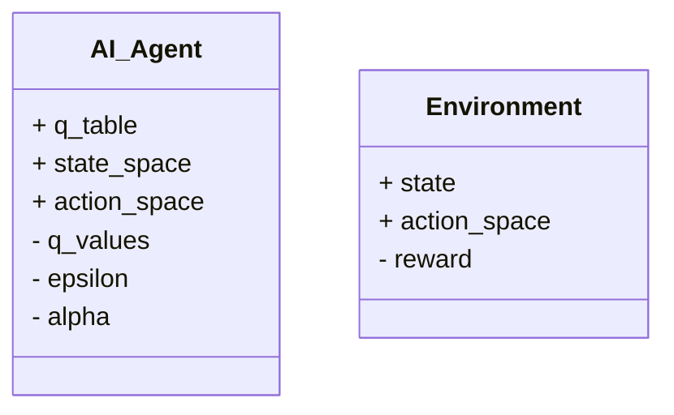
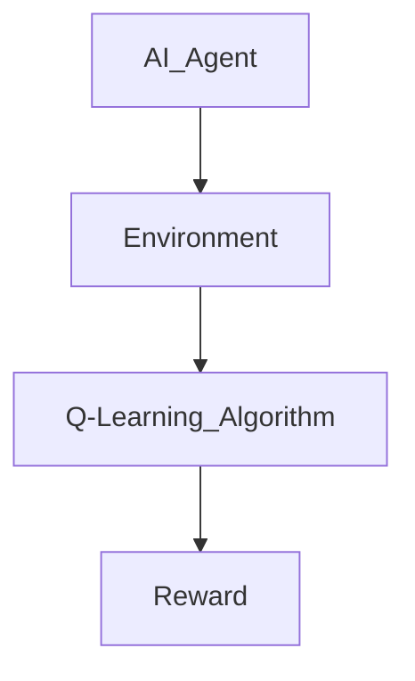

                 


# AI Agent在智能新药研发中的应用

> 关键词：AI Agent，智能新药研发，药物发现，临床试验，算法原理

> 摘要：随着人工智能技术的飞速发展，AI Agent在新药研发中的应用越来越广泛。本文将深入探讨AI Agent在智能新药研发中的核心原理、应用场景、算法实现以及系统架构设计，结合实际案例分析，帮助读者全面理解AI Agent在新药研发中的巨大潜力和实际价值。

---

# 第一部分: AI Agent与智能新药研发的背景介绍

## 第1章: AI Agent与新药研发的概述

### 1.1 AI Agent的基本概念

#### 1.1.1 AI Agent的定义与特点
AI Agent（人工智能代理）是指能够感知环境、自主决策并执行任务的智能实体。它具有以下特点：
- **自主性**：能够自主决策，无需外部干预。
- **反应性**：能够实时感知环境并做出响应。
- **目标导向**：以特定目标为导向，优化行动策略。
- **学习能力**：能够通过经验或数据不断优化自身行为。

#### 1.1.2 AI Agent的核心要素与组成
AI Agent的核心要素包括：
- **感知层**：通过传感器或其他数据源获取环境信息。
- **决策层**：基于感知信息进行分析和决策。
- **执行层**：根据决策结果执行具体操作。
- **知识库**：存储任务相关的知识和经验。

#### 1.1.3 AI Agent与传统药物研发的区别
与传统药物研发相比，AI Agent具有以下优势：
- **高效性**：能够快速处理海量数据，缩短研发周期。
- **精准性**：通过机器学习算法提高预测准确性。
- **适应性**：能够动态调整策略，适应复杂环境。

### 1.2 新药研发的背景与挑战

#### 1.2.1 新药研发的流程与关键环节
新药研发通常包括以下关键环节：
1. **药物发现**：寻找潜在药物分子并进行初步筛选。
2. **临床前研究**：通过动物实验验证药物的安全性和有效性。
3. **临床试验**：在人体中进行药物效果和安全性的验证。
4. **审批与上市**：通过监管机构审批并推向市场。

#### 1.2.2 传统新药研发的痛点与局限性
传统新药研发存在以下痛点：
- **成本高**：研发周期长，费用昂贵。
- **效率低**：传统实验方法效率低下。
- **数据量大**：难以处理海量复杂数据。

#### 1.2.3 AI技术在新药研发中的潜力与优势
AI技术的引入为新药研发带来了新的可能性：
- **数据处理能力强**：能够快速分析海量数据。
- **预测准确性高**：通过机器学习提高分子筛选和靶点预测的准确性。
- **降低研发成本**：通过虚拟实验和预测模型减少实验次数，降低研发成本。

---

## 第2章: AI Agent在新药研发中的应用场景

### 2.1 药物发现与筛选

#### 2.1.1 AI Agent在分子筛选中的应用
AI Agent可以通过机器学习算法分析海量化合物库，快速筛选出具有潜在药效的分子。

#### 2.1.2 基于AI的靶点识别与药物设计
AI Agent可以预测药物分子与靶点的结合方式，优化药物分子的结构，提高药效。

#### 2.1.3 AI Agent在化合物库构建中的作用
AI Agent可以根据已知数据生成新的化合物结构，丰富化合物库。

### 2.2 临床试验设计与优化

#### 2.2.1 AI Agent在患者招募中的应用
AI Agent可以根据患者数据匹配合适的受试者，提高招募效率。

#### 2.2.2 基于AI的临床试验方案优化
AI Agent可以通过分析历史数据优化临床试验的设计，提高试验的成功率。

#### 2.2.3 AI Agent在数据收集与分析中的作用
AI Agent可以实时分析临床试验数据，快速识别异常情况，优化试验流程。

### 2.3 药物研发的全生命周期管理

#### 2.3.1 AI Agent在药物研发流程中的整合
AI Agent可以贯穿药物研发的各个环节，提供实时决策支持。

#### 2.3.2 基于AI的实时数据分析与决策支持
AI Agent可以通过实时数据分析优化研发流程，提高效率。

#### 2.3.3 AI Agent在药物研发风险管理中的应用
AI Agent可以预测和识别潜在风险，提前制定应对策略。

---

# 第二部分: AI Agent的核心原理与技术

## 第3章: AI Agent的核心原理

### 3.1 AI Agent的体系结构

#### 3.1.1 感知层: 数据采集与处理
感知层负责从环境中获取数据，包括传感器数据和已有数据库信息。

#### 3.1.2 决策层: 策略制定与优化
决策层基于感知数据，通过机器学习算法制定最优策略。

---

### 3.2 AI Agent的核心算法与技术

#### 3.2.1 强化学习算法
强化学习是一种通过试错方式优化决策策略的算法。其数学模型可以表示为：
$$ Q(s, a) = r + \gamma \max Q(s', a') $$
其中：
- \( Q(s, a) \) 表示状态 \( s \) 下采取动作 \( a \) 的价值。
- \( r \) 表示奖励。
- \( \gamma \) 表示折扣因子。
- \( s' \) 表示下一个状态。

#### 3.2.2 生成模型
生成模型用于生成新的化合物结构，常用生成对抗网络（GAN）或变分自编码器（VAE）等技术。

---

### 3.3 AI Agent与传统药物研发的对比

#### 3.3.1 传统方法的局限性
传统方法依赖人工经验和实验验证，效率低下且成本高昂。

#### 3.3.2 AI Agent的优势
AI Agent能够快速处理数据，优化决策，降低研发成本。

---

## 第4章: AI Agent的算法实现

### 4.1 强化学习算法实现

#### 4.1.1 算法流程
1. 初始化环境。
2. 通过感知层获取环境状态。
3. 在决策层制定动作策略。
4. 执行动作，获得奖励。
5. 更新Q值，优化策略。

#### 4.1.2 代码实现
以下是一个简单的Q-learning算法实现示例：

```python
import numpy as np

class AI_Agent:
    def __init__(self, state_space, action_space):
        self.q_table = np.zeros([state_space, action_space])
    
    def take_action(self, state, epsilon=0.1):
        if np.random.random() < epsilon:
            action = np.random.randint(0, action_space)
        else:
            action = np.argmax(self.q_table[state])
        return action
    
    def update_q_table(self, state, action, reward, next_state, alpha=0.1):
        self.q_table[state][action] = (1 - alpha) * self.q_table[state][action] + alpha * (reward + np.max(self.q_table[next_state]))
```

### 4.2 生成模型实现

#### 4.2.1 模型训练
使用生成对抗网络（GAN）生成新的化合物结构。

#### 4.2.2 代码实现
以下是一个简单的生成模型实现示例：

```python
import tensorflow as tf
from tensorflow.keras.layers import Dense, Input

def build_generator():
    input = Input(shape=(100,))
    x = Dense(256, activation='relu')(input)
    x = Dense(512, activation='relu')(x)
    output = Dense(10, activation='sigmoid')(x)
    return tf.keras.Model(inputs=input, outputs=output)

def build_discriminator():
    input = Input(shape=(10,))
    x = Dense(512, activation='relu')(input)
    x = Dense(256, activation='relu')(x)
    output = Dense(1, activation='sigmoid')(x)
    return tf.keras.Model(inputs=input, outputs=output)

generator = build_generator()
discriminator = build_discriminator()

# 编译模型
discriminator.compile(loss='binary_crossentropy', optimizer='adam')
```

---

## 第5章: AI Agent的系统架构设计

### 5.1 系统功能设计

#### 5.1.1 领域模型


#### 5.1.2 系统架构


### 5.2 接口设计

#### 5.2.1 输入接口
AI Agent需要接收环境状态和当前动作。

#### 5.2.2 输出接口
AI Agent根据当前状态输出下一步动作。

---

## 第6章: AI Agent在新药研发中的实际应用

### 6.1 项目环境安装

#### 6.1.1 安装依赖
```bash
pip install numpy tensorflow matplotlib
```

### 6.2 核心代码实现

#### 6.2.1 Q-Learning算法实现
```python
import numpy as np

class AI_Agent:
    def __init__(self, state_space, action_space):
        self.q_table = np.zeros([state_space, action_space])
    
    def take_action(self, state, epsilon=0.1):
        if np.random.random() < epsilon:
            action = np.random.randint(0, action_space)
        else:
            action = np.argmax(self.q_table[state])
        return action
    
    def update_q_table(self, state, action, reward, next_state, alpha=0.1):
        self.q_table[state][action] = (1 - alpha) * self.q_table[state][action] + alpha * (reward + np.max(self.q_table[next_state]))
```

---

## 第7章: 总结与展望

### 7.1 小结
本文详细介绍了AI Agent在智能新药研发中的应用，从核心原理到实际应用，展示了AI Agent在药物发现、临床试验设计等环节中的巨大潜力。

### 7.2 最佳实践
- 在药物研发中，结合AI Agent和传统方法，可以充分发挥各自的优势。
- 定期更新AI模型，保持其预测能力。

### 7.3 注意事项
- 数据隐私和安全问题需要高度重视。
- 确保AI模型的可解释性和透明性。

### 7.4 拓展阅读
- 《Deep Learning for Drug Discovery》
- 《Artificial Intelligence in Healthcare》

---

以上是《AI Agent在智能新药研发中的应用》的技术博客文章的完整目录和内容概要。如果需要进一步扩展或调整，请随时告知！

