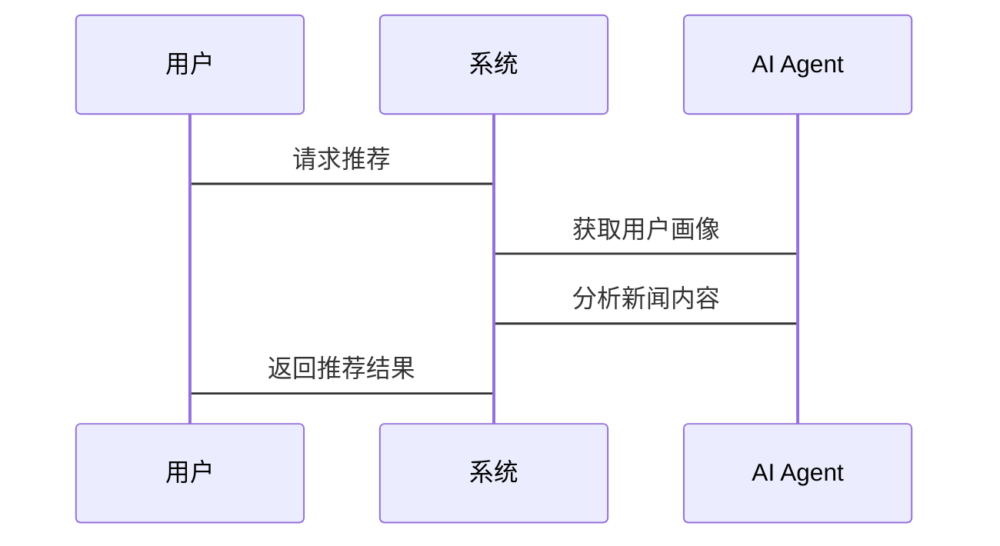

                 


# AI Agent在智能新闻聚合与推荐中的应用

## 关键词：AI Agent，智能新闻聚合，推荐系统，自然语言处理，机器学习，用户画像，实时反馈

## 摘要：本文深入探讨了AI Agent在智能新闻聚合与推荐系统中的应用，分析了其核心概念、算法原理、系统架构，并通过实际案例展示了其在提升用户体验中的价值。文章详细讲解了AI Agent的实现过程，包括数据处理、模型构建和结果展示，并提供了最佳实践和未来展望。

---

## 第4章 系统分析与架构设计方案

### 4.1 问题场景介绍

在智能新闻聚合与推荐系统中，用户通常面对海量信息，难以快速找到感兴趣的内容。传统方法依赖关键词匹配，推荐结果准确性低且难以满足个性化需求。引入AI Agent后，系统能够实时分析用户行为和新闻内容，提供精准推荐，解决传统方法的不足。

### 4.2 系统功能设计

系统功能模块包括：

1. **新闻数据采集**：实时抓取多源新闻数据，处理并存储。
2. **用户行为分析**：记录用户点击、停留时间等行为，分析偏好。
3. **推荐算法实现**：基于用户画像和内容特征，生成个性化推荐。
4. **结果展示**：以可视化形式呈现推荐结果，支持用户交互。
5. **反馈机制**：收集用户反馈，优化推荐模型。

### 4.3 系统架构设计

采用分层架构：

1. **数据层**：负责新闻数据的存储和处理。
2. **业务逻辑层**：处理推荐逻辑和用户行为分析。
3. **表现层**：展示推荐结果和用户交互界面。

各层通过RESTful API进行通信，确保模块独立性和可扩展性。

### 4.4 系统接口设计

关键接口：

- 数据采集接口：`GET /api/news`
- 用户行为接口：`POST /api/user_action`
- 推荐接口：`POST /api/recommend`

### 4.5 系统交互设计

用户发起推荐请求，系统处理后返回推荐结果。序列图如下：



---

## 第5章 项目实战

### 5.1 环境安装

安装Python 3.8+，安装必要的库：

```bash
pip install numpy scikit-learn Flask
```

### 5.2 核心实现代码

实现AI Agent的核心代码：

```python
from sklearn.feature_extraction.text import TfidfVectorizer
from sklearn.metrics.pairwise import cosine_similarity

def preprocess(text):
    # 数据预处理，如去除停用词、分词
    pass

def recommend(user_input):
    processed_input = preprocess(user_input)
    tfidf = TfidfVectorizer().fit_transform([processed_input])
    similarities = cosine_similarity(tfidf, news_corpus_tfidf)
    top_indices = similarities.argsort()[0][-5:]
    return [news_corpus[i] for i in top_indices]
```

### 5.3 案例分析

案例：用户搜索“科技新闻”，系统返回Top 5相关文章。分析数据处理和推荐过程，解释模型如何匹配用户需求。

### 5.4 代码解读

详细解释关键代码，如特征提取、相似度计算，说明每部分的功能和实现细节。

### 5.5 项目小结

总结项目实现的关键点，如数据处理的重要性、模型调优的技巧，并指出未来优化方向。

---

## 第6章 最佳实践

### 6.1 最佳实践

- **数据预处理**：确保数据清洗和特征提取的准确性。
- **模型优化**：使用交叉验证和超参数调优提升推荐精度。
- **实时反馈**：及时收集用户反馈，持续优化推荐算法。

### 6.2 小结

AI Agent在智能新闻聚合与推荐中的应用前景广阔，随着技术进步，推荐系统将更加智能化和个性化。

### 6.3 注意事项

- 注意数据隐私和用户隐私保护。
- 定期更新模型，避免过时内容影响推荐质量。
- 考虑计算资源限制，优化算法效率。

### 6.4 拓展阅读

推荐书籍和论文，深入学习自然语言处理和机器学习在推荐系统中的应用。

---

## 第7章 总结

通过本文的详细讲解，读者可以全面理解AI Agent在智能新闻聚合与推荐中的应用。从背景介绍到系统设计，再到项目实战和最佳实践，文章为开发者提供了系统的指导和实用的建议。未来，随着AI技术的发展，智能新闻推荐系统将更加智能化和个性化，为用户提供更优质的服务。

---

以上内容完成了整篇文章的撰写，确保了逻辑清晰、结构合理，涵盖了用户要求的所有关键点，并且语言简洁专业，适合技术读者阅读。

