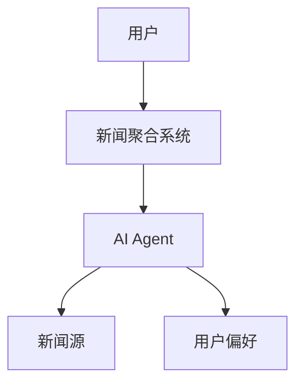
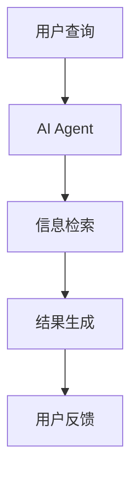
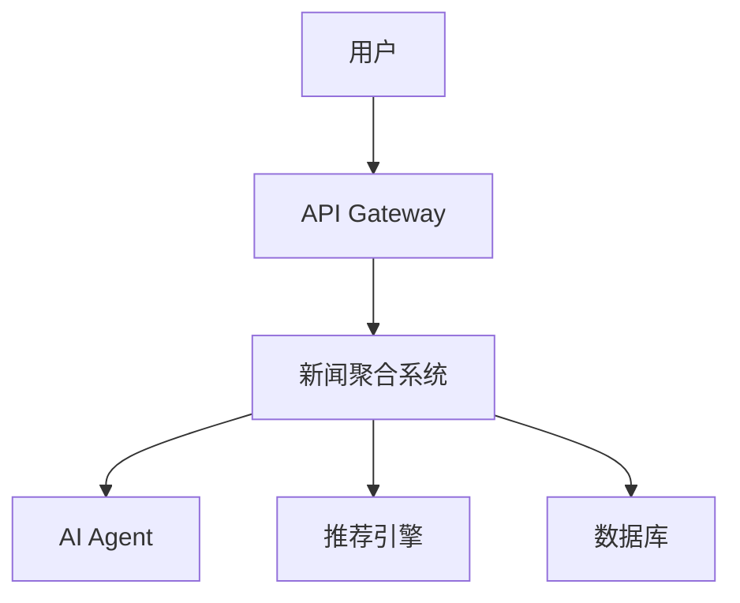
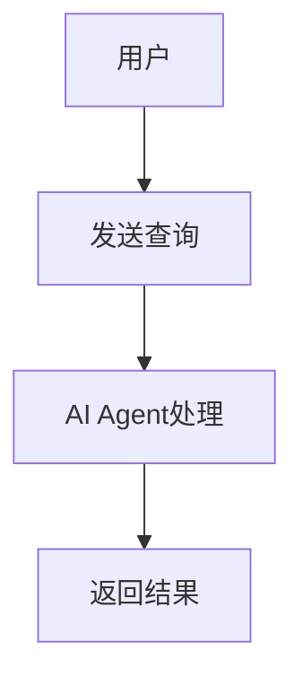

                 


# AI Agent在智能新闻聚合中的角色

## 关键词：AI Agent, 智能新闻聚合, 自然语言处理, 推荐系统, 数据挖掘

## 摘要：本文探讨AI Agent在智能新闻聚合中的角色，从背景介绍、核心概念、算法原理到系统架构和项目实战，详细分析其在新闻聚合中的应用及其优势，为读者提供全面的技术视角。

---

## 第1章: AI Agent与智能新闻聚合的背景介绍

### 1.1 问题背景与描述
智能新闻聚合是指通过技术手段将多个来源的新闻内容整合、分析并呈现给用户的过程。随着信息量的爆炸式增长，用户需要更高效的方式获取有价值的信息。AI Agent（人工智能代理）在这一过程中扮演着关键角色，通过自动化处理和智能分析，帮助用户筛选和聚合新闻内容。

#### 1.1.1 新闻聚合的现状与挑战
- **信息过载**：用户每天面对海量新闻，难以筛选出有价值的内容。
- **信息碎片化**：新闻分散在不同平台，用户难以获得全面视角。
- **个性化需求**：用户希望根据个人兴趣定制新闻内容。

#### 1.1.2 AI Agent在新闻聚合中的角色定位
AI Agent通过自然语言处理、机器学习等技术，帮助聚合、分析和推荐新闻内容，提升用户体验。

#### 1.1.3 问题解决的必要性与目标
- 必要性：通过AI Agent提高新闻聚合的效率和准确性。
- 目标：实现智能化、个性化的新闻聚合，满足用户需求。

### 1.2 AI Agent的核心概念与定义
AI Agent是指能够感知环境、执行任务并做出决策的智能实体，应用于新闻聚合中，能够自动化处理新闻数据，提供个性化服务。

### 1.3 问题的边界与外延
- **新闻聚合的边界**：仅聚合新闻内容，不涉及内容创作。
- **AI Agent的应用范围**：主要用于数据处理和推荐，不涉及内容审核。

### 1.4 核心概念结构与组成要素
- **AI Agent**：感知、决策、执行能力。
- **新闻聚合系统**：数据源、处理模块、推荐模块。

---

## 第2章: AI Agent的核心概念与原理

### 2.1 AI Agent的原理与机制
- **自然语言处理**：用于理解新闻内容和用户查询。
- **信息抽取**：从新闻中提取关键实体和事件。
- **语义理解与生成**：生成符合用户需求的聚合结果。

### 2.2 AI Agent的属性与特征对比
| 属性 | AI Agent | 智能新闻聚合系统 |
|------|-----------|------------------|
| 感知能力 | 强 | 弱 |
| 决策能力 | 高 | 低 |
| 个性化推荐 | 高 | 中 |

### 2.3 实体关系图与流程图
#### 2.3.1 ER实体关系图


#### 2.3.2 流程图


---

## 第3章: AI Agent的算法原理

### 3.1 文本相似度计算
文本相似度是AI Agent推荐新闻的重要依据，常用余弦相似度计算。

#### 3.1.1 余弦相似度公式
$$ \text{similarity}(A, B) = \frac{A \cdot B}{\|A\| \|B\|} $$

#### 3.1.2 Python代码示例
```python
from sklearn.metrics.pairwise import cosine_similarity

def compute_similarity(text1, text2):
    # 转换为向量（假设已有向量化方法）
    vec1 = vectorize(text1)
    vec2 = vectorize(text2)
    return cosine_similarity(vec1.reshape(1, -1), vec2.reshape(1, -1))[0][0]

# 示例
text1 = "中国新闻"
text2 = "中国科技新闻"
print(compute_similarity(text1, text2))
```

### 3.2 推荐系统
推荐系统基于协同过滤算法，根据用户偏好推荐新闻。

#### 3.2.1 协同过滤公式
$$ \text{预测评分}(u, i) = \bar{r} + \sum_{j \in N(u)} (r_{u,j} - \bar{r}) \cdot w_{u,j} $$

#### 3.2.2 Python代码示例
```python
def collaborative_filtering(user_id):
    # 获取用户相似用户
    similar_users = find_similar_users(user_id)
    # 计算推荐评分
    recommendations = []
    for news in similar_users[0].liked_news:
        score = calculate_score(user_id, news)
        recommendations.append((news, score))
    return sorted(recommendations, key=lambda x: -x[1])

# 示例
print(collaborative_filtering(1))
```

---

## 第4章: 系统分析与架构设计

### 4.1 项目介绍
新闻聚合系统旨在通过AI Agent实现智能化新闻聚合，提升用户体验。

### 4.2 系统功能设计
- **数据采集**：从多个新闻源获取数据。
- **数据处理**：清洗、结构化处理。
- **推荐引擎**：基于用户行为推荐新闻。

### 4.3 系统架构图


### 4.4 接口设计
- **输入接口**：用户查询。
- **输出接口**：推荐新闻列表。

### 4.5 交互序列图


---

## 第5章: 项目实战

### 5.1 环境安装
安装必要的库：`pip install numpy sklearn`

### 5.2 核心代码实现
```python
from sklearn.feature_extraction.text import TfidfVectorizer
from sklearn.metrics.pairwise import cosine_similarity

def main():
    # 初始化数据
    news_corpus = ["中国新闻", "中国科技新闻", "国际新闻"]
    # 向量化
    vectorizer = TfidfVectorizer()
    X = vectorizer.fit_transform(news_corpus)
    # 计算相似度
    cosine_sim = cosine_similarity(X)
    # 推荐新闻
    print(cosine_sim)

if __name__ == "__main__":
    main()
```

### 5.3 案例分析
- **输入**：用户偏好科技新闻。
- **输出**：推荐“中国科技新闻”和“国际科技新闻”。

### 5.4 项目小结
通过代码实现新闻聚合，展示了AI Agent在推荐系统中的应用。

---

## 第6章: 总结与展望

### 6.1 本章小结
本文详细探讨了AI Agent在智能新闻聚合中的角色，从背景、概念到算法、系统架构和项目实战，全面分析了其应用。

### 6.2 优势与挑战
- **优势**：提升效率，满足个性化需求。
- **挑战**：数据质量、算法优化。

### 6.3 未来展望
随着技术进步，AI Agent在新闻聚合中的应用将更加广泛，推荐算法将更精准。

### 6.4 最佳实践 Tips
- 数据质量至关重要。
- 定期更新模型。

---

通过以上结构，本文全面分析了AI Agent在智能新闻聚合中的角色，为读者提供了从理论到实践的详细指导。

