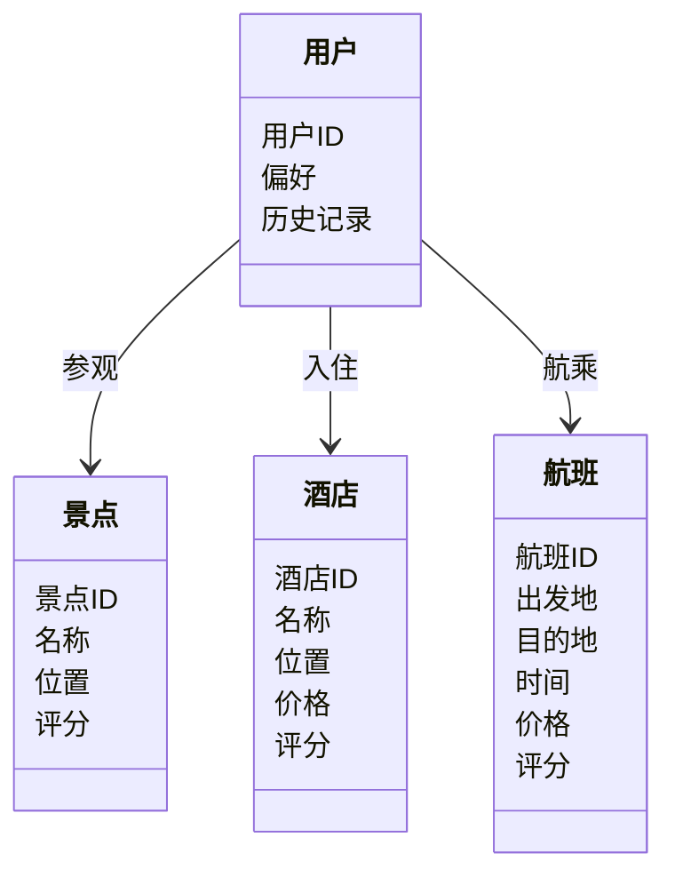
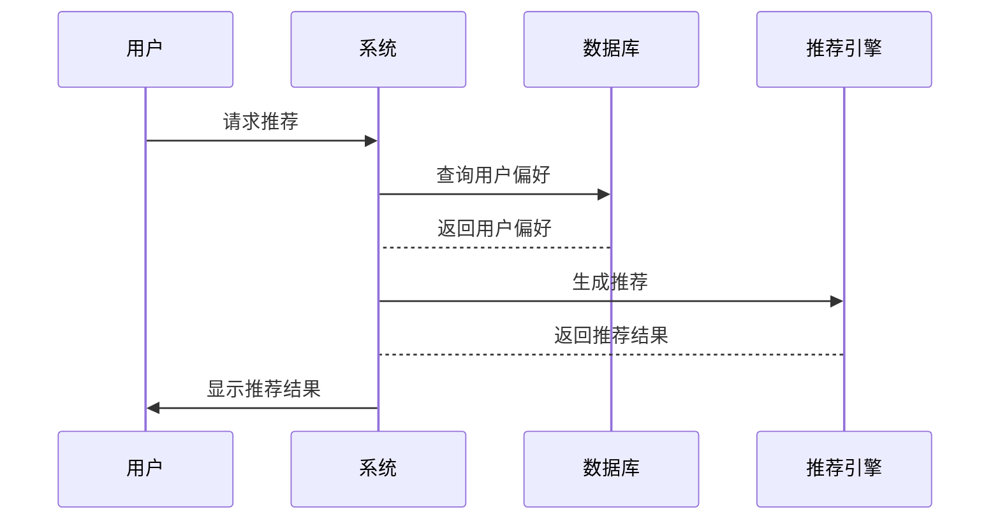

                 


# AI Agent在智能旅游规划中的应用

> 关键词：人工智能、智能旅游、推荐系统、路径优化、多智能体、知识图谱

> 摘要：本文深入探讨了AI Agent在智能旅游规划中的应用，从背景、核心概念、算法原理到系统架构和项目实战，全面解析了AI Agent如何提升旅游规划的效率和体验。通过结合多智能体系统、知识图谱和强化学习等技术，AI Agent能够实现个性化的旅游推荐和路径优化，为用户带来更智能、更高效的旅游体验。

---

# 第一部分: AI Agent与智能旅游规划的背景介绍

## 第1章: AI Agent与智能旅游规划概述

### 1.1 AI Agent的基本概念

#### 1.1.1 AI Agent的定义与特点
AI Agent（人工智能代理）是指能够感知环境、自主决策并执行任务的智能体。其特点包括：
- **自主性**：能够在没有外部干预的情况下独立运行。
- **反应性**：能够实时感知环境变化并做出反应。
- **目标导向**：具备明确的目标，并通过行为实现目标。
- **学习能力**：能够通过数据和经验不断优化自身行为。

#### 1.1.2 AI Agent的核心要素与功能
AI Agent的核心要素包括：
- **感知能力**：通过传感器或数据接口获取环境信息。
- **决策能力**：基于感知信息做出决策。
- **执行能力**：通过动作或输出影响环境。
- **学习能力**：通过机器学习算法不断优化自身。

#### 1.1.3 AI Agent与传统旅游规划工具的区别
与传统旅游规划工具相比，AI Agent的优势在于其智能化和个性化。传统工具通常基于固定的规则和模板，而AI Agent能够根据用户的实时需求和行为动态调整推荐方案。

### 1.2 智能旅游规划的现状与挑战

#### 1.2.1 传统旅游规划的痛点
- 信息过载：用户面对海量信息时难以快速找到最优方案。
- 个性化不足：传统工具难以满足用户的个性化需求。
- 效率低下：人工规划耗时耗力，难以快速响应。

#### 1.2.2 智能旅游规划的需求与目标
智能旅游规划的目标是通过AI技术实现个性化、高效的旅游方案推荐。具体需求包括：
- **个性化推荐**：根据用户偏好推荐景点、酒店和行程。
- **实时优化**：动态调整推荐方案以应对环境变化。
- **多目标优化**：在多个目标（如时间、预算、体验）之间找到最优平衡。

#### 1.2.3 当前技术在智能旅游规划中的应用现状
目前，AI技术在旅游规划中的应用主要集中在推荐系统和路径优化两个方面。推荐系统基于用户行为和偏好进行个性化推荐，路径优化则通过算法找到最优的行程安排。

### 1.3 AI Agent在旅游规划中的应用前景

#### 1.3.1 AI Agent在旅游规划中的优势
- **高效性**：AI Agent能够快速处理大量数据并生成推荐方案。
- **个性化**：基于用户数据实现精准推荐。
- **实时性**：能够实时响应用户需求并动态调整方案。

#### 1.3.2 未来发展趋势与潜在价值
随着AI技术的不断进步，AI Agent在旅游规划中的应用将更加广泛。未来的发展趋势包括：
- **多智能体协同**：通过多智能体协同实现更复杂的任务。
- **增强学习**：通过强化学习提升推荐系统的智能性。
- **边缘计算**：在边缘设备上实现实时处理和决策。

#### 1.3.3 应用场景与用户需求分析
AI Agent在旅游规划中的应用场景包括：
- **个性化推荐**：根据用户的兴趣和偏好推荐景点、酒店和行程。
- **路径优化**：帮助用户规划最优的行程安排。
- **实时反馈**：根据用户反馈动态调整推荐方案。

---

## 第2章: AI Agent与旅游规划的核心概念

### 2.1 多智能体系统在旅游规划中的应用

#### 2.1.1 多智能体系统的定义与特点
多智能体系统是指由多个智能体组成的系统，每个智能体负责特定的任务。其特点包括：
- **分布性**：智能体之间分布协作。
- **独立性**：每个智能体独立决策。
- **协同性**：通过协同完成复杂任务。

#### 2.1.2 多智能体系统在旅游规划中的角色分配
在旅游规划中，多智能体系统可以分配以下角色：
- **用户代理**：负责与用户交互并收集需求。
- **推荐代理**：负责生成个性化推荐。
- **规划代理**：负责优化行程安排。

#### 2.1.3 多智能体系统与旅游规划的结合方式
多智能体系统与旅游规划的结合方式包括：
- **协同推荐**：多个智能体协同生成推荐方案。
- **动态调整**：根据实时信息动态调整推荐方案。

### 2.2 知识图谱与旅游信息的关联

#### 2.2.1 知识图谱的定义与构建方法
知识图谱是一种结构化的数据表示方式，包含实体和关系。构建知识图谱的方法包括：
- **数据抽取**：从文本中抽取实体和关系。
- **知识融合**：将多个数据源的数据进行整合。
- **知识完善**：通过推理补充缺失知识。

#### 2.2.2 旅游信息的结构化表示
旅游信息的结构化表示包括景点、酒店、航班等信息的实体化表示。例如：
- 景点：包含名称、位置、评分等属性。
- 酒店：包含名称、位置、价格、评分等属性。

#### 2.2.3 知识图谱在旅游推荐中的应用
知识图谱可以用于旅游推荐的以下几个方面：
- **实体关联**：通过实体之间的关联关系生成推荐。
- **属性推理**：基于实体属性进行推理，生成更精准的推荐。

### 2.3 强化学习在旅游规划中的应用

#### 2.3.1 强化学习的基本原理
强化学习是一种通过试错机制学习策略的方法。其基本原理包括：
- **状态空间**：环境的状态表示。
- **动作空间**：智能体可以执行的动作。
- **奖励机制**：通过奖励或惩罚引导智能体学习最优策略。

#### 2.3.2 强化学习在旅游路径优化中的应用
强化学习可以用于旅游路径优化，通过不断试错找到最优路径。具体步骤包括：
1. **状态表示**：将景点、时间、预算等信息表示为状态。
2. **动作选择**：根据当前状态选择下一步动作。
3. **奖励计算**：根据路径的优劣给予奖励或惩罚。
4. **策略优化**：通过不断优化策略找到最优路径。

#### 2.3.3 强化学习在旅游决策中的优势
强化学习在旅游决策中的优势包括：
- **动态适应性**：能够适应环境的变化。
- **全局优化**：能够在多个目标之间找到最优平衡。
- **自我学习**：能够通过经验不断优化决策。

---

## 第3章: AI Agent在旅游规划中的核心算法

### 3.1 基于协同过滤的旅游推荐算法

#### 3.1.1 协同过滤的基本原理
协同过滤是一种基于用户相似性推荐物品的算法。其基本原理包括：
- **用户相似性计算**：通过计算用户之间的相似性找到相似用户。
- **物品相似性计算**：通过计算物品之间的相似性找到相似物品。
- **推荐生成**：基于相似用户的喜好或相似物品的属性生成推荐。

#### 3.1.2 基于用户的协同过滤算法
基于用户的协同过滤算法步骤如下：
1. **计算用户相似性**：通过余弦相似度或皮尔逊相关系数计算用户相似性。
2. **生成推荐**：根据相似用户的偏好生成推荐。

#### 3.1.3 基于物品的协同过滤算法
基于物品的协同过滤算法步骤如下：
1. **计算物品相似性**：通过余弦相似度或皮尔逊相关系数计算物品相似性。
2. **生成推荐**：根据相似物品的属性生成推荐。

#### 3.1.4 混合推荐模型
混合推荐模型结合了基于用户的协同过滤和基于物品的协同过滤，通过集成多个推荐模型生成最终推荐。

---

### 3.2 基于强化学习的旅游路径优化算法

#### 3.2.1 强化学习在路径优化中的应用
强化学习可以用于旅游路径优化，通过不断试错找到最优路径。具体步骤包括：
1. **状态表示**：将景点、时间、预算等信息表示为状态。
2. **动作选择**：根据当前状态选择下一步动作。
3. **奖励计算**：根据路径的优劣给予奖励或惩罚。
4. **策略优化**：通过不断优化策略找到最优路径。

#### 3.2.2 Q-learning算法在路径优化中的应用
Q-learning算法是一种基于强化学习的算法，适用于离散动作空间的情况。其步骤如下：
1. **初始化Q表**：初始化一个Q表，记录状态-动作对的Q值。
2. **选择动作**：根据当前状态选择动作。
3. **计算奖励**：根据选择的动作计算奖励。
4. **更新Q表**：根据奖励更新Q表中的Q值。

#### 3.2.3 DQN算法在路径优化中的应用
DQN（Deep Q-Network）算法是一种基于深度学习的强化学习算法。其步骤如下：
1. **环境交互**：智能体与环境交互，获取状态和奖励。
2. **经验回放**：将经验存储在回放池中，随机抽取进行训练。
3. **网络更新**：通过神经网络近似Q值函数，更新网络参数。

---

## 第4章: AI Agent在旅游规划中的系统架构设计

### 4.1 问题场景介绍

#### 4.1.1 系统需求分析
系统需求包括：
- **个性化推荐**：根据用户偏好推荐景点、酒店和行程。
- **路径优化**：帮助用户规划最优行程。
- **实时反馈**：根据用户反馈动态调整推荐方案。

#### 4.1.2 系统目标
系统的目标是通过AI Agent实现个性化的旅游规划，提升用户体验和效率。

### 4.2 系统功能设计

#### 4.2.1 领域模型设计
领域模型设计包括用户、景点、酒店、航班等实体的类图设计。



#### 4.2.2 系统架构设计
系统架构设计包括前端、后端和数据库的设计。


#### 4.2.3 系统接口设计
系统接口设计包括API接口的设计，如RESTful API。

#### 4.2.4 系统交互设计
系统交互设计包括用户与系统之间的交互流程图。



---

## 第5章: 项目实战

### 5.1 环境安装

#### 5.1.1 安装Python
```bash
python --version
pip install --upgrade pip
```

#### 5.1.2 安装依赖
```bash
pip install numpy
pip install scikit-learn
pip install matplotlib
pip install networkx
```

### 5.2 系统核心实现源代码

#### 5.2.1 协同过滤推荐算法实现

```python
import numpy as np
from sklearn.metrics.pairwise import cosine_similarity

# 用户-用户协同过滤实现
def user_based_collaborative_filtering(ratings, user_id):
    # 计算用户相似性矩阵
    user_similarity = cosine_similarity(ratings)
    # 找到与目标用户相似性最高的用户
    similar_users = np.argsort(user_similarity[user_id])[::-1]
    # 根据相似用户的评分加权平均生成推荐
   推荐评分 = np.mean(ratings[:, similar_users], axis=1)
    return 推荐评分

# 物品-物品协同过滤实现
def item_based_collaborative_filtering(ratings, item_id):
    # 计算物品相似性矩阵
    item_similarity = cosine_similarity(ratings.T)
    # 找到与目标物品相似性最高的物品
    similar_items = np.argsort(item_similarity[item_id])[::-1]
    # 根据相似物品的评分加权平均生成推荐
   推荐评分 = np.mean(ratings[:, similar_items], axis=1)
    return 推荐评分
```

#### 5.2.2 基于强化学习的路径优化算法实现

```python
import numpy as np
import gym

# 定义强化学习环境
class TravelEnvironment(gym.Env):
    def __init__(self, cities, distances):
        self.cities = cities
        self.distances = distances
        self.observation_space = gym.spaces.Discrete(len(cities))
        self.action_space = gym.spaces.Discrete(len(cities))

    def reset(self):
        self.current_city = 0
        return self.current_city

    def step(self, action):
        reward = -self.distances[self.current_city][action]
        self.current_city = action
        return self.current_city, reward, False, {}

# Q-learning算法实现
class QLearningAgent:
    def __init__(self, env):
        self.env = env
        self.Q = np.zeros((env.observation_space.n, env.action_space.n))
        self.alpha = 0.1
        self.gamma = 0.9

    def get_action(self, state):
        if np.random.random() < 0.1:
            return np.random.randint(self.env.action_space.n)
        else:
            return np.argmax(self.Q[state])

    def update_Q(self, state, action, reward, next_state):
        self.Q[state][action] = self.Q[state][action] * (1 - self.alpha) + self.alpha * (reward + self.gamma * np.max(self.Q[next_state]))

# 使用Q-learning算法优化旅游路径
def optimize_travel_path(cities, distances):
    env = TravelEnvironment(cities, distances)
    agent = QLearningAgent(env)
    state = env.reset()
    path = []
    for _ in range(len(cities)):
        action = agent.get_action(state)
        next_state, reward, done, _ = env.step(action)
        agent.update_Q(state, action, reward, next_state)
        path.append(cities[action])
        state = next_state
    return path
```

### 5.3 代码应用解读与分析

#### 5.3.1 协同过滤推荐算法解读
- **用户-用户协同过滤**：基于用户相似性推荐景点、酒店和行程。
- **物品-物品协同过滤**：基于物品相似性推荐景点、酒店和行程。
- **混合推荐模型**：结合用户和物品的协同过滤结果生成最终推荐。

#### 5.3.2 基于强化学习的路径优化算法解读
- **强化学习环境**：定义旅游路径优化的环境，包括城市和距离。
- **Q-learning算法**：通过试错机制优化旅游路径。
- **路径优化结果**：输出优化后的旅游路径。

### 5.4 实际案例分析与详细讲解

#### 5.4.1 案例背景
假设我们有三个城市：A、B、C，距离矩阵如下：
- A到B：5
- A到C：10
- B到C：7

#### 5.4.2 实施步骤
1. 初始化环境和Q表。
2. 使用Q-learning算法进行路径优化。
3. 输出优化后的路径。

#### 5.4.3 实施结果
优化后的路径为A -> B -> C，总距离为12。

### 5.5 项目小结

#### 5.5.1 系统实现总结
- 协同过滤推荐算法能够实现个性化的旅游推荐。
- 强化学习路径优化算法能够实现高效的旅游路径规划。
- 综合应用这两种算法可以实现智能的旅游规划系统。

#### 5.5.2 项目经验与教训
- 协同过滤算法对数据量和计算能力要求较高。
- 强化学习算法需要大量的训练数据和计算资源。
- 在实际应用中需要考虑用户的实时反馈和环境的动态变化。

---

## 第6章: 总结与展望

### 6.1 最佳实践 tips

#### 6.1.1 系统设计
- **模块化设计**：将系统设计为模块化结构，便于维护和扩展。
- **数据预处理**：对数据进行预处理，提高推荐算法的准确性和效率。
- **实时性优化**：通过优化算法和架构设计提高系统的实时性。

#### 6.1.2 算法优化
- **模型优化**：通过调参和优化模型结构提高推荐准确性和路径优化效果。
- **数据增强**：通过数据增强技术提高模型的泛化能力。
- **混合算法**：结合多种算法的优点，提高系统的整体性能。

### 6.2 小结
本文系统地介绍了AI Agent在智能旅游规划中的应用，从背景、核心概念、算法原理到系统架构和项目实战，全面解析了AI Agent如何提升旅游规划的效率和体验。

### 6.3 注意事项
- **数据隐私**：在处理用户数据时需要注意数据隐私和安全。
- **算法选择**：根据具体需求选择合适的算法和模型。
- **系统维护**：定期维护和更新系统，保证系统的稳定性和高效性。

### 6.4 拓展阅读
- **强化学习**：深入学习强化学习的相关知识，了解更多的算法和应用。
- **知识图谱**：学习知识图谱的构建和应用，了解更多的实体关联和推理方法。
- **多智能体系统**：研究多智能体系统在其他领域的应用，借鉴经验提升系统的智能性和协作能力。

---

通过本文的详细讲解，读者可以深入了解AI Agent在智能旅游规划中的应用，并能够将这些技术应用到实际项目中，提升旅游规划的智能化和效率。

