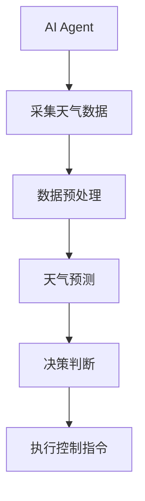
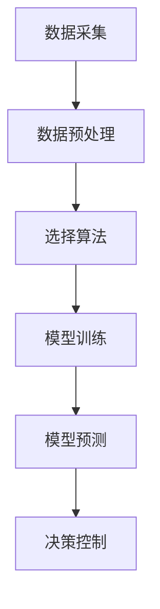
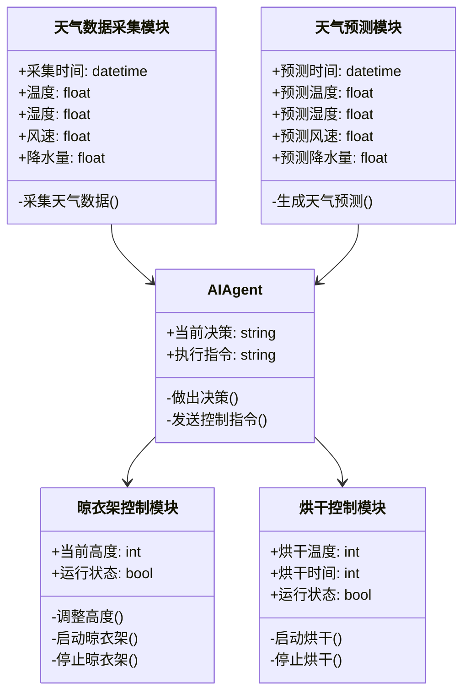
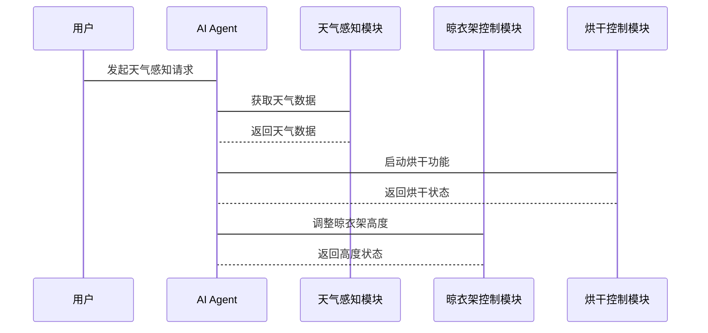

                 


# AI Agent在智能晾衣架中的天气感知烘干

## 关键词：AI Agent, 天气感知, 智能晾衣架, 烘干, 智能家居

## 摘要：  
本文探讨了AI Agent在智能晾衣架中的天气感知与烘干控制的应用，分析了天气数据的采集、处理与预测算法，详细阐述了AI Agent的决策机制，并结合实际案例展示了系统的设计与实现。通过本文，读者可以全面了解如何利用AI技术提升智能晾衣架的功能，实现智能化的天气感知与烘干控制。

---

# 第一部分: AI Agent与天气感知烘干的背景与概念

# 第1章: AI Agent与天气感知烘干的背景介绍

## 1.1 问题背景
### 1.1.1 智能晾衣架的发展现状
智能晾衣架作为一种智能家居设备，近年来得到了快速发展。传统的晾衣架功能单一，仅能提供简单的悬挂功能，而现代智能晾衣架则集成了电机驱动、远程控制、环境感知等多种功能，能够满足用户对衣物晾晒的多样化需求。

### 1.1.2 天气对衣物晾晒的影响
天气条件（如温度、湿度、风力、降水量等）直接影响衣物的晾晒效果。在潮湿或多雨的天气中，衣物容易霉变；在高温或干燥的天气中，衣物容易丢失水分或受到紫外线的伤害。因此，能够根据天气条件自动调节晾晒模式的智能晾衣架具有重要的现实意义。

### 1.1.3 AI Agent在智能家居中的应用潜力
AI Agent（智能体）是一种能够感知环境、自主决策并执行任务的智能系统。随着人工智能技术的快速发展，AI Agent已经在智能家居、智慧城市、自动驾驶等领域得到了广泛应用。智能晾衣架作为智能家居的一部分，同样可以利用AI Agent实现智能化的天气感知与控制功能。

## 1.2 问题描述
### 1.2.1 天气感知在智能晾衣架中的需求
用户希望智能晾衣架能够根据天气条件自动调整晾晒模式，例如在下雨天自动收回衣物，在晴朗天气延长晾晒时间等。

### 1.2.2 烘干功能的自动化控制问题
传统晾衣架不具备烘干功能，衣物在潮湿环境中容易霉变。用户需要一种能够自动烘干衣物的智能晾衣架，这要求系统能够根据天气条件智能控制烘干功能的开启与关闭。

### 1.2.3 用户对智能晾衣架的核心诉求
用户的核心诉求是希望智能晾衣架能够提供便捷、安全、高效的衣物晾晒体验，同时能够与智能家居系统无缝集成，实现远程控制与自动化管理。

## 1.3 问题解决思路
### 1.3.1 AI Agent的核心作用
AI Agent可以通过感知天气数据，分析天气条件，并根据预设的规则或模型做出决策，从而实现对智能晾衣架的自动化控制。

### 1.3.2 天气数据的采集与处理
需要采集实时天气数据（如温度、湿度、风速、降水量等），并对数据进行清洗、特征提取和预处理，以便后续的天气预测与分析。

### 1.3.3 自动化烘干控制的实现路径
通过AI Agent对天气数据进行分析，判断是否需要启动烘干功能，并根据天气条件调整烘干强度和时间，以达到最佳的烘干效果。

## 1.4 问题的边界与外延
### 1.4.1 系统边界定义
智能晾衣架系统的核心功能包括天气感知、晾衣架控制、烘干控制等，而与智能家居平台的通信、用户界面的设计等属于系统外延部分。

### 1.4.2 外延功能的探讨
外延功能可能包括与智能音箱、智能空调等其他智能家居设备的联动，以及基于用户习惯的个性化设置等。

### 1.4.3 系统与外部环境的交互
智能晾衣架需要与天气预报API、智能家居平台等外部系统进行数据交互，同时需要与用户手机APP进行通信，实现远程控制与状态监控。

## 1.5 概念结构与核心要素
### 1.5.1 AI Agent的基本构成
AI Agent通常包括感知模块、推理模块、决策模块和执行模块。在智能晾衣架中，AI Agent需要感知天气数据、分析环境条件，并根据预设规则或模型做出决策，最终通过执行模块控制晾衣架的运动和烘干功能。

### 1.5.2 天气感知系统的组成
天气感知系统主要包括数据采集模块、数据处理模块、天气预测模块和决策控制模块。数据采集模块负责采集天气数据，数据处理模块对数据进行清洗和特征提取，天气预测模块基于历史数据和当前数据进行天气预测，决策控制模块根据预测结果做出控制决策。

### 1.5.3 烘干功能的实现要素
烘干功能的实现需要考虑烘干温度、烘干时间、风速、湿度等因素。AI Agent需要根据天气条件和衣物状态（如湿度、重量等）动态调整烘干参数，以确保衣物的快速烘干和避免损坏。

---

# 第2章: AI Agent与天气感知的核心概念

## 2.1 AI Agent的基本原理
### 2.1.1 AI Agent的定义与特征
AI Agent是一种能够感知环境、自主决策并执行任务的智能系统。其核心特征包括自主性、反应性、目标导向性和学习能力。

### 2.1.2 多智能体系统的基本概念
多智能体系统是由多个智能体组成的协作系统，智能体之间通过通信和协作完成复杂的任务。在智能晾衣架中，可能需要多个AI Agent协同工作，例如天气智能体、晾衣架控制智能体和烘干智能体等。

### 2.1.3 AI Agent在智能晾衣架中的角色
在智能晾衣架中，AI Agent主要负责天气数据的采集与分析、晾衣架的运动控制、烘干功能的启停控制等任务。

## 2.2 天气感知系统的原理
### 2.2.1 天气数据的采集方式
天气数据可以通过多种方式采集，包括外部天气预报API、本地传感器等。本地传感器可以采集实时的温度、湿度、风速、降水量等数据。

### 2.2.2 数据特征提取与分析
对采集到的天气数据进行特征提取和分析，例如提取温度、湿度的平均值、最大值、最小值等统计特征，或者通过机器学习算法提取潜在的模式和规律。

### 2.2.3 天气预测模型的构建
基于历史天气数据和当前天气数据，利用机器学习算法（如线性回归、支持向量机、LSTM等）构建天气预测模型，预测未来一段时间内的天气情况。

## 2.3 AI Agent与天气感知的关联
### 2.3.1 数据流的传递与处理
AI Agent通过天气感知系统获取天气数据，经过数据处理和分析后，做出决策并控制晾衣架的运动和烘干功能。

### 2.3.2 AI Agent的决策机制
AI Agent可以根据天气预测结果和用户需求，结合预设的规则或机器学习模型，做出是否启动烘干功能、调整晾衣架高度等决策。

### 2.3.3 系统的整体架构
智能晾衣架的天气感知与烘干控制系统由AI Agent、天气感知模块、晾衣架控制模块和烘干控制模块组成，各模块之间通过通信协议进行交互。

---

## 2.4 AI Agent与天气感知系统的属性对比

| 属性         | AI Agent                          | 天气感知系统                  |
|--------------|-----------------------------------|------------------------------|
| 输入          | 天气数据、用户指令、传感器数据 | 天气数据、传感器数据         |
| 输出          | 控制指令、状态反馈               | 天气预测结果、环境数据       |
| 核心功能      | 自主决策、任务执行               | 数据采集、特征提取、预测     |
| 依赖模块      | 天气感知模块、执行机构           | 数据采集模块、特征提取模块   |

## 2.5 天气感知系统的ER实体关系图

```mermaid
er
    %% ER图
    class "天气数据表" {
        id 天气ID (PK)
        采集时间
        温度
        湿度
        风速
        降水量
    }
    class "天气预测表" {
        id 预测ID (PK)
        预测时间
        预测温度
        预测湿度
        预测风速
        预测降水量
    }
    class "AI Agent" {
        id AgentID (PK)
        状态
        当前决策
        执行指令
    }
    relationship "采集天气数据" between "天气数据表" 和 "AI Agent"
    relationship "生成天气预测" between "天气预测表" 和 "AI Agent"
```

---

## 2.6 AI Agent的决策流程



---

## 2.7 天气预测算法的数学模型

### 2.7.1 线性回归模型
线性回归是一种常用的回归分析方法，适用于线性关系的预测问题。其数学模型可以表示为：

$$ y = \beta_0 + \beta_1 x + \epsilon $$

其中，$y$ 是目标变量（如温度），$x$ 是自变量（如时间），$\beta_0$ 和 $\beta_1$ 是回归系数，$\epsilon$ 是误差项。

### 2.7.2 支持向量机（SVM）模型
支持向量机是一种监督学习算法，适用于分类和回归问题。对于天气预测，可以使用SVM进行回归分析。其数学模型可以表示为：

$$ y = \text{sign}(\sum_{i=1}^{n} \alpha_i y_i x_i \cdot x + b) $$

其中，$\alpha_i$ 是拉格朗日乘子，$y_i$ 是标签，$x_i$ 是输入向量，$b$ 是偏置项。

### 2.7.3 长短期记忆网络（LSTM）模型
LSTM是一种循环神经网络（RNN）的变体，适用于时间序列数据的预测。其数学模型包含输入门、遗忘门和输出门，能够有效捕捉时间序列数据中的长期依赖关系。

---

## 2.8 AI Agent的决策算法

### 2.8.1 基于规则的决策算法
基于规则的决策算法通过预设的规则进行决策，例如：

- 如果当前湿度 > 70% 且温度 < 10℃，则启动烘干功能。
- 如果当前湿度 < 30% 且温度 > 25℃，则关闭烘干功能。

### 2.8.2 基于概率的决策算法
基于概率的决策算法利用概率模型进行决策，例如：

- 根据天气预测模型的概率输出，判断是否需要启动烘干功能。

### 2.8.3 基于强化学习的决策算法
强化学习是一种机器学习方法，通过智能体与环境的交互，逐步学习最优策略。例如：

- 状态：当前天气条件、衣物状态、系统状态。
- 动作：启动烘干、关闭烘干、调整晾衣架高度。
- 奖励：烘干效果、能源消耗、用户反馈。

---

# 第3章: AI Agent与天气感知的核心算法原理

## 3.1 数据采集与预处理
### 3.1.1 数据采集流程
1. 通过天气传感器采集实时天气数据，包括温度、湿度、风速、降水量等。
2. 通过天气预报API获取未来24小时的天气预测数据。

### 3.1.2 数据清洗与特征提取
- 数据清洗：删除异常数据，填充缺失值。
- 特征提取：提取温度、湿度、风速的均值、最大值、最小值等统计特征。

### 3.1.3 数据标准化与归一化
对数据进行标准化或归一化处理，确保不同特征之间的尺度一致，便于后续的模型训练。

## 3.2 天气预测模型的构建
### 3.2.1 线性回归模型
线性回归适用于线性关系较强的天气预测问题，例如温度随时间的变化趋势。

### 3.2.2 支持向量机（SVM）模型
SVM适用于小样本、高维的数据集，可以通过核函数将非线性问题转化为线性问题。

### 3.2.3 长短期记忆网络（LSTM）模型
LSTM适用于时间序列数据的预测，能够捕捉到数据中的长期依赖关系。

## 3.3 AI Agent的决策算法
### 3.3.1 基于规则的决策算法
基于规则的决策算法简单易懂，适用于规则明确的场景。

### 3.3.2 基于概率的决策算法
基于概率的决策算法能够处理不确定性较高的场景，例如天气预测的不确定性。

### 3.3.3 基于强化学习的决策算法
基于强化学习的决策算法能够通过与环境的交互逐步优化决策策略，适用于复杂的决策场景。

---

## 3.4 算法实现的Python代码示例

```python
import numpy as np
from sklearn.linear_model import LinearRegression
from sklearn.svm import SVR
from keras.models import Sequential
from keras.layers import LSTM, Dense

# 示例数据：温度预测
X = np.arange(100).reshape(-1, 1)
y = X * 2 + 1  # 线性关系

# 线性回归模型
model_lr = LinearRegression()
model_lr.fit(X, y)
print("线性回归系数：", model_lr.coef_)

# 支持向量机模型
model_svm = SVR(kernel='rbf')
model_svm.fit(X, y)
print("支持向量机系数：", model_svm.coef_)

# LSTM模型
model_lstm = Sequential()
model_lstm.add(LSTM(64, input_shape=(1, 1)))
model_lstm.add(Dense(1))
model_lstm.compile(loss='mean_squared_error', optimizer='adam')
model_lstm.fit(X, y, epochs=100, batch_size=1)
print("LSTM模型训练完成")
```

---

## 3.5 算法原理的数学模型
### 3.5.1 线性回归模型
$$ y = \beta_0 + \beta_1 x + \epsilon $$

### 3.5.2 LSTM模型
LSTM的三个门控（输入门、遗忘门、输出门）可以表示为：

$$
i = \sigma(W_i x + U_i h_{prev})
$$

$$
f = \sigma(W_f x + U_f h_{prev})
$$

$$
o = \sigma(W_o x + U_o h_{prev})
$$

$$
h = i \circ tanh(W_c x + U_c h_{prev}) + f \circ h_{prev}
$$

其中，$\sigma$ 是sigmoid函数，$\circ$ 是逐元素乘法。

---

## 3.6 算法实现的流程图



---

# 第4章: 系统分析与架构设计方案

## 4.1 问题场景介绍
智能晾衣架需要在不同天气条件下自动调整晾晒模式，例如在雨天自动收回衣物，在晴天启动烘干功能。系统需要与天气预报API、智能家居平台进行交互，实现自动化控制。

## 4.2 系统功能设计
### 4.2.1 领域模型
智能晾衣架系统的主要功能包括：
- 天气数据采集与处理
- 天气预测与分析
- 晾衣架运动控制
- 烘干功能控制
- 用户界面与远程控制

### 4.2.2 领域模型的Mermaid类图


---

## 4.3 系统架构设计
### 4.3.1 系统架构图


---

## 4.4 系统接口设计
### 4.4.1 天气数据接口
- 输入：无
- 输出：温度、湿度、风速、降水量等天气数据
- 接口类型：API调用

### 4.4.2 晾衣架控制接口
- 输入：控制指令（如启动晾衣架、调整高度）
- 输出：执行结果反馈
- 接口类型：串口通信或网络通信

### 4.4.3 烘干控制接口
- 输入：控制指令（如启动烘干、调整温度）
- 输出：执行结果反馈
- 接口类型：串口通信或网络通信

---

## 4.5 系统交互流程
### 4.5.1 天气感知与烘干控制的交互流程


---

## 4.6 系统实现的注意事项
### 4.6.1 数据一致性
确保天气数据和系统状态数据的一致性，避免因数据不一致导致系统误操作。

### 4.6.2 系统容错性
设计容错机制，确保系统在传感器故障、网络中断等情况下的稳定运行。

### 4.6.3 安全性
确保系统数据的安全性，避免因数据泄露或恶意攻击导致系统瘫痪。

---

# 第5章: 项目实战

## 5.1 环境安装与配置
### 5.1.1 Python环境安装
安装Python 3.8或以上版本，并安装所需的库：
```bash
pip install numpy scikit-learn keras tensorflow
```

### 5.1.2 传感器与硬件配置
配置天气传感器（如DHT22温湿度传感器）和晾衣架驱动模块（如Arduino或Raspberry Pi）。

---

## 5.2 系统核心功能的实现
### 5.2.1 天气数据采集模块的实现
```python
import Adafruit_DHT

def get_weather_data():
    humidity, temperature = Adafruit_DHT.read_retry(22, 4)
    return humidity, temperature
```

### 5.2.2 天气预测模型的实现
```python
from sklearn.linear_model import LinearRegression

# 示例数据
X = np.arange(100).reshape(-1, 1)
y = X * 2 + 1  # 线性关系

model = LinearRegression()
model.fit(X, y)
print("预测结果：", model.predict(X))
```

### 5.2.3 AI Agent的决策实现
```python
class AI_Agent:
    def __init__(self):
        self.current_decision = None

    def make_decision(self, weather_data):
        humidity, temperature = weather_data
        if humidity > 70 and temperature < 10:
            return "启动烘干"
        elif humidity < 30 and temperature > 25:
            return "关闭烘干"
        else:
            return "保持现状"

    def execute_command(self, command):
        print(f"执行指令：{command}")
```

---

## 5.3 项目实现的代码解读
### 5.3.1 天气数据采集模块
```python
import Adafruit_DHT

def get_weather_data():
    humidity, temperature = Adafruit_DHT.read_retry(22, 4)
    return humidity, temperature
```

- 该模块通过Adafruit_DHT库与DHT22传感器通信，获取当前的湿度和温度。

### 5.3.2 天气预测模块
```python
from sklearn.linear_model import LinearRegression

# 示例数据
X = np.arange(100).reshape(-1, 1)
y = X * 2 + 1  # 线性关系

model = LinearRegression()
model.fit(X, y)
print("预测结果：", model.predict(X))
```

- 该模块使用线性回归模型进行天气预测，适用于线性关系较强的场景。

### 5.3.3 AI Agent模块
```python
class AI_Agent:
    def __init__(self):
        self.current_decision = None

    def make_decision(self, weather_data):
        humidity, temperature = weather_data
        if humidity > 70 and temperature < 10:
            return "启动烘干"
        elif humidity < 30 and temperature > 25:
            return "关闭烘干"
        else:
            return "保持现状"

    def execute_command(self, command):
        print(f"执行指令：{command}")
```

- 该模块负责接收天气数据，做出决策，并通过执行模块控制晾衣架和烘干功能。

---

## 5.4 实际案例分析
假设当前天气湿度为80%，温度为8℃，AI Agent做出的决策是“启动烘干”。系统将启动烘干功能，并根据天气条件调整烘干温度和时间，确保衣物快速干燥。

---

## 5.5 项目小结
通过本项目的实现，我们可以看到AI Agent在智能晾衣架中的天气感知与烘干控制具有重要的应用价值。系统通过采集天气数据、分析天气条件，并根据预设规则或模型做出决策，实现了对智能晾衣架的自动化控制。

---

# 第6章: 最佳实践与注意事项

## 6.1 最佳实践
### 6.1.1 数据质量管理
确保天气数据的准确性和完整性，避免因数据问题导致系统误判。

### 6.1.2 系统可扩展性
设计模块化的系统架构，便于后续功能的扩展和升级。

### 6.1.3 用户体验优化
提供友好的用户界面和个性化的设置选项，提升用户的使用体验。

---

## 6.2 小结
AI Agent在智能晾衣架中的天气感知与烘干控制是一个典型的智能化应用场景。通过本文的分析与实现，我们可以看到，AI技术的应用能够显著提升智能晾衣架的功能和用户体验。

---

## 6.3 注意事项
### 6.3.1 系统稳定性
确保系统的稳定运行，避免因传感器故障或网络中断导致系统瘫痪。

### 6.3.2 数据隐私
保护用户数据的隐私，避免因数据泄露导致用户信息被滥用。

### 6.3.3 系统兼容性
确保系统与不同品牌和型号的智能家居设备的兼容性，便于用户的集成和使用。

---

## 6.4 拓展阅读
### 6.4.1 AI Agent在智能家居中的其他应用
AI Agent不仅可以应用于智能晾衣架，还可以扩展到智能空调、智能灯光、智能安防等领域。

### 6.4.2 天气预测的高级算法
探索更先进的天气预测算法，如基于深度学习的LSTM模型、图神经网络模型等。

### 6.4.3 多智能体系统的协同控制
研究多智能体系统在智能家居中的协同控制，提升系统的整体性能和智能化水平。

---

# 结语
通过本文的详细分析与实现，我们展示了AI Agent在智能晾衣架中的天气感知与烘干控制的应用。未来，随着AI技术的不断发展，智能晾衣架的功能将更加智能化和个性化，为用户提供更加便捷、安全、高效的衣物晾晒体验。

