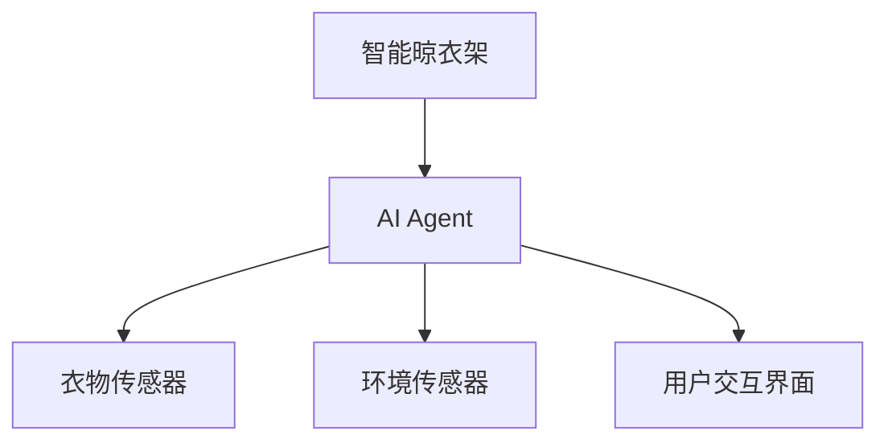
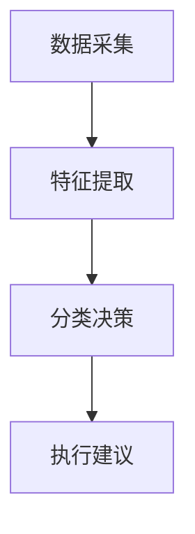
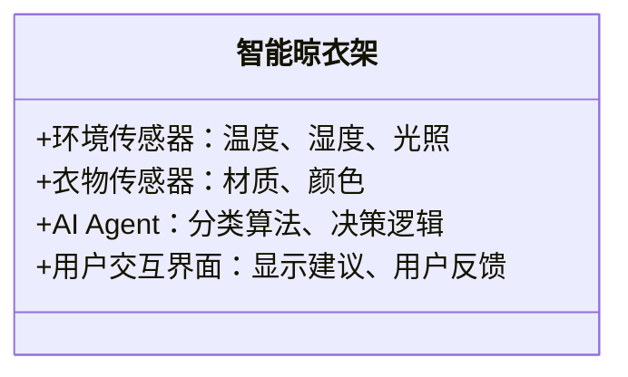
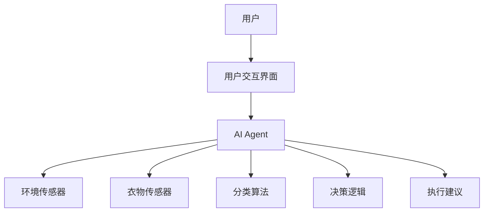
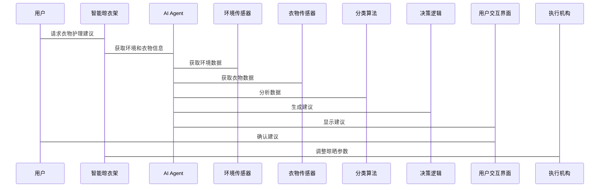

                 


# AI Agent在智能晾衣架中的衣物护理建议

> 关键词：AI Agent、智能晾衣架、衣物护理、算法原理、系统架构

> 摘要：本文探讨AI Agent在智能晾衣架中的应用，分析其如何通过智能算法和系统架构实现衣物护理建议。文章详细介绍了AI Agent的核心概念、算法原理、系统架构设计，并通过项目实战展示了如何在智能晾衣架中实现这些功能。最后，文章总结了AI Agent在衣物护理中的优势及未来发展方向。

---

## 第1章 背景介绍与问题背景

### 1.1 问题背景

#### 1.1.1 智能晾衣架的发展现状
随着智能家居的普及，智能晾衣架逐渐成为家庭生活中不可或缺的一部分。传统晾衣架的功能单一，仅用于悬挂衣物，而现代智能晾衣架则集成了多种智能功能，如自动升降、天气监测、定时提醒等。然而，目前市面上的智能晾衣架大多停留在基础的机械自动化阶段，缺乏对衣物本身的智能感知和护理能力。

#### 1.1.2 AI Agent在智能家居中的应用趋势
AI Agent（智能代理）是一种能够感知环境、自主决策并执行任务的智能系统。随着人工智能技术的快速发展，AI Agent在智能家居中的应用越来越广泛。通过AI Agent，智能家居设备能够实现更智能化的服务，例如智能音箱、智能空调等。AI Agent的核心优势在于其能够根据环境和用户需求动态调整行为，从而提供更个性化的服务。

#### 1.1.3 衣物护理智能化的市场需求
衣物护理是日常生活中的重要环节，然而传统的衣物护理方式效率低下，且难以满足现代用户对高品质生活的需求。用户对衣物护理的需求不仅包括简单的晾晒，还包括防皱、防紫外线、恒温干燥等高级功能。随着技术的进步，用户对智能化衣物护理设备的需求日益增长，这为AI Agent在智能晾衣架中的应用提供了广阔的市场空间。

### 1.2 问题描述

#### 1.2.1 衣物护理中的常见问题
- 衣物晾晒时间不足或过长，导致衣物损坏或未充分干燥。
- 不同材质的衣物需要不同的晾晒条件，传统晾衣架无法提供个性化的护理方案。
- 环境因素（如湿度、温度、光照）对衣物护理的影响未能被有效感知和利用。

#### 1.2.2 用户对智能衣物护理的核心需求
- 自动检测衣物材质和环境条件，提供智能化的晾晒建议。
- 实时监控晾晒过程，确保衣物护理效果。
- 提供预防性建议，避免衣物损坏。

#### 1.2.3 智能晾衣架在衣物护理中的角色定位
智能晾衣架不仅是晾晒衣物的工具，更是一个集成多种智能功能的平台。通过AI Agent，智能晾衣架能够实现衣物护理的智能化、个性化和高效化，满足用户日益增长的需求。

### 1.3 问题解决与边界

#### 1.3.1 AI Agent在智能晾衣架中的解决方案
AI Agent通过感知环境和用户需求，提供个性化的衣物护理建议。具体解决方案包括：
- 通过传感器感知环境条件（如温度、湿度、光照）。
- 通过图像识别技术检测衣物材质和状态。
- 根据环境和衣物信息，动态调整晾晒参数，如晾晒时长、高度、角度等。

#### 1.3.2 解决方案的边界与外延
- 边界：AI Agent仅负责衣物护理建议，不直接控制晾衣架的机械部分。
- 外延：AI Agent可以与其他智能家居设备联动，提供更全面的衣物护理解决方案。

#### 1.3.3 核心概念与核心要素分析
核心概念包括AI Agent、智能晾衣架、衣物护理、环境感知等。核心要素包括传感器、算法模型、用户交互界面等。

---

## 第2章 核心概念与原理

### 2.1 AI Agent的基本原理

#### 2.1.1 AI Agent的定义与分类
AI Agent是一种能够感知环境、自主决策并执行任务的智能系统。根据应用场景的不同，AI Agent可以分为简单反射型、基于模型的反应型、目标驱动型和实用驱动型四种类型。

#### 2.1.2 AI Agent的核心属性对比表
| 属性         | 描述                                   |
|--------------|--------------------------------------|
| 感知能力     | 能够感知环境和用户需求                 |
| 决策能力     | 能够根据感知信息做出决策               |
| 执行能力     | 能够通过执行器或外部设备执行任务       |
| 学习能力     | 能够通过经验或数据优化自身性能         |

#### 2.1.3 AI Agent与传统算法的对比分析
AI Agent与传统算法的主要区别在于，AI Agent具有自主性和适应性，能够根据环境和用户需求动态调整行为，而传统算法通常是在固定条件下执行预定义的任务。

### 2.2 AI Agent在智能晾衣架中的实体关系



---

## 第3章 算法原理与数学模型

### 3.1 算法原理



算法流程如下：
1. **数据采集**：通过传感器采集环境数据和衣物信息。
2. **特征提取**：对采集到的数据进行特征提取，例如提取温度、湿度、光照强度等。
3. **分类决策**：基于特征数据，利用分类算法（如决策树、随机森林）进行分类，确定衣物的材质和环境的适宜性。
4. **执行建议**：根据分类结果，生成相应的晾晒建议，例如调整晾晒时间、高度等。

### 3.2 数学模型与公式

#### 3.2.1 分类算法
$$ P(y|x) = \frac{P(x|y)P(y)}{P(x)} $$

其中，\( P(y|x) \) 是在给定特征 \( x \) 的条件下，衣物材质为 \( y \) 的概率。

#### 3.2.2 决策树模型
$$ Gini(p) = p_1(1-p_1) + p_2(1-p_2) $$

其中，\( Gini(p) \) 是基尼指数，用于衡量数据的不纯度。

---

## 第4章 系统分析与架构设计

### 4.1 项目介绍

#### 4.1.1 项目目标
通过AI Agent实现智能晾衣架的衣物护理功能，提供个性化的晾晒建议。

#### 4.1.2 项目范围
系统将集成环境传感器、衣物传感器、用户交互界面和AI算法，提供实时的衣物护理建议。

#### 4.1.3 项目关键成功因素
- 高精度的环境和衣物传感器。
- 精准的分类算法。
- 友好的用户交互界面。

### 4.2 系统功能设计

#### 4.2.1 领域模型


#### 4.2.2 系统架构设计


#### 4.2.3 系统接口设计
系统接口设计如下：
- 用户与智能晾衣架通过Wi-Fi或蓝牙连接。
- 环境传感器和衣物传感器通过I2C或SPI接口与主控芯片连接。
- AI Agent通过API接口与传感器和用户交互界面通信。

#### 4.2.4 系统交互流程


---

## 第5章 项目实战

### 5.1 环境搭建

#### 5.1.1 硬件设备
- 主控芯片：Raspberry Pi
- 环境传感器：DHT22温湿度传感器
- 衣物传感器：颜色和材质传感器（基于RGB值和材质检测）
- 用户交互界面：LCD显示屏和按钮

#### 5.1.2 软件工具
- Python编程语言
- TensorFlow机器学习框架
- Raspberry Pi操作系统
- 传感器驱动程序

### 5.2 系统核心实现

#### 5.2.1 环境传感器数据采集
```python
import Adafruit_DHT

def get_env_data():
    humidity, temperature = Adafruit_DHT.read(DHT22, 4)
    return temperature, humidity
```

#### 5.2.2 衣物传感器数据采集
```python
import cv2

def get_cloth_data(image_path):
    img = cv2.imread(image_path)
    # 简单的颜色检测
    dominant_color = get_dominant_color(img)
    # 简单的材质检测
    cloth_material = classify_material(img)
    return dominant_color, cloth_material
```

#### 5.2.3 分类算法实现
```python
from sklearn.tree import DecisionTreeClassifier

def train_classifier(X_train, y_train):
    clf = DecisionTreeClassifier()
    clf.fit(X_train, y_train)
    return clf

def predict_material(clf, X_test):
    return clf.predict(X_test)
```

#### 5.2.4 决策逻辑实现
```python
def generate_suggestion(temp, humidity, cloth_material):
    if cloth_material == '棉':
        if temp < 20 or humidity > 60:
            return "建议延长晾晒时间至2小时"
        else:
            return "建议晾晒1小时"
    elif cloth_material == ' polyester':
        if temp < 25 or humidity > 50:
            return "建议延长晾晒时间至1.5小时"
        else:
            return "建议晾晒1小时"
    else:
        return "建议正常晾晒时间1小时"
```

### 5.3 实际案例分析

#### 5.3.1 案例一：棉质衣物
环境数据：温度20℃，湿度65%。
AI Agent建议：延长晾晒时间至2小时。

#### 5.3.2 案例二：聚酯纤维衣物
环境数据：温度28℃，湿度45%。
AI Agent建议：延长晾晒时间至1.5小时。

### 5.4 项目小结
通过AI Agent实现智能晾衣架的衣物护理功能，能够有效提升衣物护理的效果和效率，为用户带来更优质的使用体验。

---

## 第6章 最佳实践与总结

### 6.1 最佳实践

#### 6.1.1 系统优化建议
- 提高传感器的精度和响应速度。
- 定期更新AI模型，优化分类算法。
- 提供更多样化的衣物材质检测功能。

#### 6.1.2 用户体验优化
- 提供更直观的用户交互界面。
- 增加语音控制功能，方便用户操作。
- 提供历史数据查询功能，帮助用户分析衣物护理效果。

### 6.2 小结
AI Agent在智能晾衣架中的应用，不仅提升了衣物护理的智能化水平，还为智能家居设备的创新发展提供了新的方向。通过AI Agent，智能晾衣架能够更好地满足用户需求，提供更优质的服务。

### 6.3 注意事项
- 确保系统的安全性，防止数据泄露。
- 定期维护和更新系统，确保其稳定运行。
- 提供完善的用户支持服务，帮助用户解决使用中的问题。

### 6.4 拓展阅读
- 《AI in Smart Home: A Comprehensive Review》
- 《Machine Learning for Smart Devices》

---

以上是《AI Agent在智能晾衣架中的衣物护理建议》的完整目录大纲及文章内容，涵盖背景、核心概念、算法原理、系统架构、项目实战和总结等部分，内容详实，结构清晰，语言简洁易懂，适合作为技术博客文章发布。

