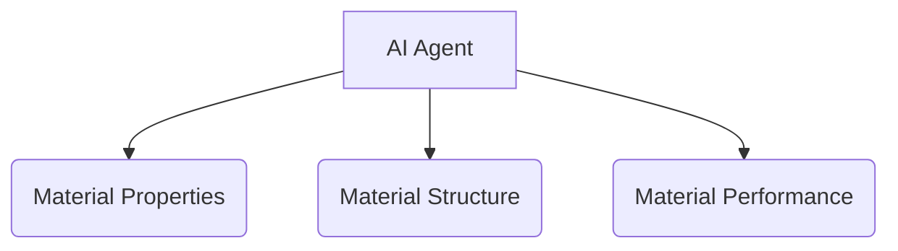
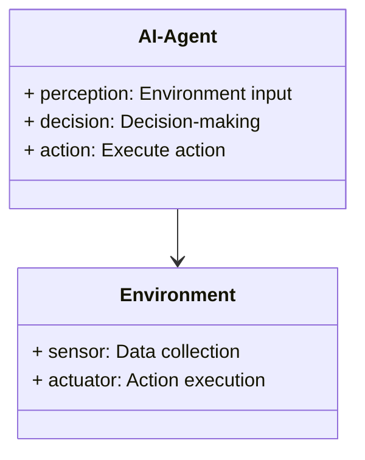
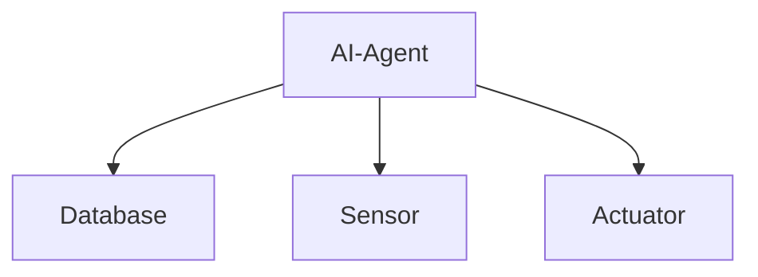

                 


# AI Agent在智能材料科学研究中的角色

## 关键词：人工智能、AI Agent、智能材料科学、机器学习、材料模拟、数据驱动研究、材料设计

## 摘要：
AI Agent作为一种新兴的人工智能形式，在智能材料科学研究中扮演着越来越重要的角色。通过机器学习和数据驱动的方法，AI Agent能够高效地处理复杂的材料科学问题，加速材料的发现和优化过程。本文将详细介绍AI Agent的基本概念、核心算法、系统架构及其在材料科学中的实际应用案例，探讨其在智能材料科学中的独特优势和未来发展方向。

---

# 第1章: AI Agent的基本概念与智能材料科学

## 1.1 AI Agent的基本概念

### 1.1.1 什么是AI Agent？
AI Agent（人工智能代理）是指能够感知环境、自主决策并执行任务的智能体。它能够通过与环境的交互，不断优化自身的行为，以达到预定目标。

### 1.1.2 AI Agent的核心特点
- **自主性**：能够在没有外部干预的情况下独立运行。
- **反应性**：能够实时感知环境并做出相应的反应。
- **目标导向**：具有明确的目标，并通过行为选择来实现这些目标。
- **学习能力**：能够通过经验不断优化自身的决策模型。

### 1.1.3 AI Agent与传统计算的区别
传统计算依赖于预定义的规则和程序，而AI Agent能够根据环境的变化自适应地调整行为，具有更强的灵活性和适应性。

---

## 1.2 智能材料科学的基本概念

### 1.2.1 材料科学的基本概念
材料科学是研究材料的组成、结构、性质及其应用的科学。它涵盖了金属、半导体、陶瓷、高分子材料等多种类型的材料研究。

### 1.2.2 智能材料的定义与特点
智能材料是指能够对外界环境的变化（如温度、压力、光照等）做出响应，并表现出特定功能的材料。这类材料通常具有自适应性和响应性。

### 1.2.3 智能材料的应用领域
智能材料广泛应用于传感器、能量存储、医疗设备、建筑等领域。例如，智能传感器能够实时监测环境参数并做出响应。

---

## 1.3 AI Agent在智能材料科学中的作用

### 1.3.1 AI Agent在材料科学研究中的优势
AI Agent能够快速处理大量数据，发现潜在的规律，从而加速材料的发现和优化过程。

### 1.3.2 AI Agent在材料科学中的应用场景
- **材料筛选**：通过AI Agent快速筛选出具有特定性能的材料。
- **结构预测**：利用AI Agent预测材料的晶体结构和性能。
- **性能优化**：通过AI Agent优化材料的配方和制备工艺。

### 1.3.3 AI Agent与材料科学家的合作模式
AI Agent可以作为材料科学家的辅助工具，帮助科学家更高效地完成研究工作。两者可以通过数据共享、模型训练等方式进行合作。

---

## 1.4 本章小结
本章介绍了AI Agent的基本概念和智能材料科学的基本知识，探讨了AI Agent在智能材料科学中的作用和应用场景。通过理解这些内容，我们可以更好地理解AI Agent在材料科学研究中的重要性。

---

# 第2章: AI Agent的核心概念与联系

## 2.1 AI Agent的核心概念

### 2.1.1 AI Agent的定义与属性
AI Agent具有感知能力、决策能力、学习能力和执行能力。它能够通过感知环境信息，做出决策，并通过执行机构实现目标。

### 2.1.2 AI Agent的分类与特征
AI Agent可以根据其智能水平分为反应式AI Agent和认知式AI Agent。反应式AI Agent能够实时感知环境并做出反应，而认知式AI Agent则具有更复杂的推理和规划能力。

### 2.1.3 AI Agent的实体关系图



---

## 2.2 AI Agent的原理与机制

### 2.2.1 AI Agent的感知与决策机制
AI Agent通过传感器或数据输入感知环境信息，然后通过算法进行分析和决策。例如，强化学习算法可以用于优化AI Agent的决策过程。

### 2.2.2 AI Agent的学习与优化算法
- **强化学习**：通过奖励机制优化AI Agent的决策策略。
- **生成对抗网络**：用于生成和优化材料的结构和性能。

### 2.2.3 AI Agent的交互与反馈机制
AI Agent通过与环境的交互获得反馈信息，不断优化自身的行为。例如，在材料筛选过程中，AI Agent可以根据实验结果调整筛选策略。

---

## 2.3 AI Agent与智能材料科学的关系

### 2.3.1 AI Agent在材料科学中的核心作用
AI Agent能够加速材料的发现和优化过程，提高研究效率。例如，AI Agent可以通过机器学习算法预测材料的性能，减少实验成本。

### 2.3.2 AI Agent与材料科学数据的关系
AI Agent需要依赖大量的材料科学数据进行训练和推理。高质量的数据是AI Agent发挥其作用的基础。

### 2.3.3 AI Agent在材料科学中的知识图谱构建
通过知识图谱，AI Agent可以整合材料科学领域的知识，帮助科学家更好地理解材料的性质和关系。

---

## 2.4 本章小结
本章详细介绍了AI Agent的核心概念和其在智能材料科学中的作用。通过理解AI Agent的原理和机制，我们可以更好地利用它来推动材料科学的发展。

---

# 第3章: AI Agent的算法原理与数学模型

## 3.1 AI Agent的核心算法

### 3.1.1 强化学习算法
强化学习是一种通过试错过程优化决策策略的算法。AI Agent可以通过强化学习在材料筛选过程中不断优化其选择策略。

### 3.1.2 生成对抗网络
生成对抗网络（GAN）由生成器和判别器组成，能够生成高质量的材料结构数据。

### 3.1.3 联合学习算法
联合学习算法允许AI Agent在多个数据源上进行学习，提高其泛化能力。

---

## 3.2 AI Agent的数学模型

### 3.2.1 损失函数的定义与计算
在强化学习中，损失函数通常用于衡量AI Agent的决策与预期目标之间的差距。

$$L = \frac{1}{n}\sum_{i=1}^{n}(y_i - \hat{y}_i)^2$$

### 3.2.2 状态转移矩阵的构建
状态转移矩阵用于描述AI Agent在不同状态之间的转移概率。

$$P(s' | s, a)$$

---

## 3.3 本章小结
本章介绍了AI Agent的核心算法及其数学模型。通过理解这些算法和模型，我们可以更好地设计和优化AI Agent的行为。

---

# 第4章: 系统分析与架构设计

## 4.1 问题场景介绍
在材料科学研究中，AI Agent可以用于材料的筛选、结构预测和性能优化等任务。例如，AI Agent可以通过机器学习算法预测材料的力学性能。

## 4.2 系统功能设计



---

## 4.3 系统架构设计



---

## 4.4 本章小结
本章通过系统分析和架构设计，展示了AI Agent在材料科学研究中的应用场景和技术实现。

---

# 第5章: 项目实战

## 5.1 环境安装与配置
为了运行AI Agent，需要安装Python、TensorFlow和Scikit-learn等依赖库。

```bash
pip install numpy tensorflow scikit-learn
```

## 5.2 核心代码实现

```python
import numpy as np
from sklearn import svm

# 数据预处理
X = np.array([...])  # 输入特征
y = np.array([...])  # 输出标签

# 模型训练
model = svm.SVC()
model.fit(X, y)

# 模型预测
prediction = model.predict(new_X)
```

---

## 5.3 代码解读与分析
上述代码展示了如何使用支持向量机（SVM）模型进行材料分类。通过训练数据，模型可以预测新材料的性能。

---

## 5.4 项目小结
本章通过具体的项目实战，展示了AI Agent在材料科学中的应用。通过环境配置和代码实现，读者可以更好地理解AI Agent的工作原理。

---

# 第6章: 最佳实践与总结

## 6.1 最佳实践
- **数据质量**：确保数据的准确性和完整性。
- **模型优化**：通过交叉验证和超参数调整优化模型性能。
- **可解释性**：提高AI Agent的可解释性，便于科学家理解其决策过程。

## 6.2 总结与展望
AI Agent在智能材料科学研究中具有巨大的潜力。随着技术的进步，AI Agent将更加智能化和高效化，为材料科学的发展注入新的活力。

---

## 6.3 本章小结
本章总结了AI Agent在智能材料科学中的应用，并提出了未来的发展方向。通过最佳实践和总结，我们可以更好地推动AI Agent在材料科学中的应用。

---

# 总结
本文详细介绍了AI Agent在智能材料科学研究中的角色和作用。通过理论分析和实际案例，展示了AI Agent在材料筛选、结构预测和性能优化等方面的优势。未来，随着AI技术的不断发展，AI Agent将在智能材料科学中发挥越来越重要的作用。

---

**注意事项**：本文中的代码示例仅供参考，具体实现需要根据实际问题进行调整。

