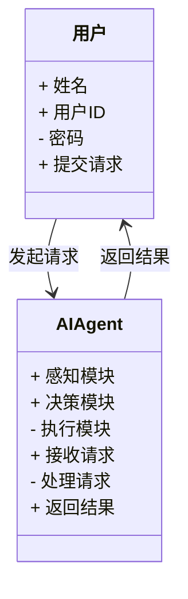
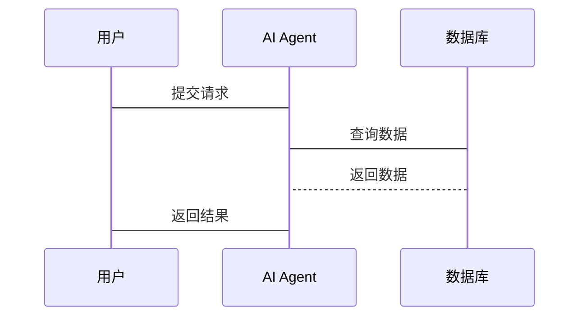

                 


# AI Agent在智能材料设计与发现中的角色

## 关键词
AI Agent, 智能材料, 材料设计, 机器学习, 优化算法, 实验验证

## 摘要
AI Agent在智能材料设计与发现中扮演着越来越重要的角色。通过数据驱动的方法和机器学习算法，AI Agent能够高效地探索材料空间，优化材料性能，并指导实验设计。本文将详细探讨AI Agent的核心原理、算法实现、系统架构以及实际应用案例，帮助读者理解如何将AI技术应用于智能材料的研发过程中。

---

## 第1章：AI Agent的基本概念与应用

### 1.1 AI Agent的定义与核心特征

#### 1.1.1 AI Agent的定义
AI Agent（人工智能代理）是一种能够感知环境、自主决策并采取行动的智能实体。它能够通过传感器获取信息，利用算法处理数据，并根据目标执行特定任务。

#### 1.1.2 AI Agent的核心特征
- **自主性**：AI Agent能够在没有外部干预的情况下独立运作。
- **反应性**：能够实时感知环境变化并做出反应。
- **目标导向**：具有明确的目标，并采取行动以实现目标。

#### 1.1.3 AI Agent与传统计算方法的对比
| 特性             | AI Agent                     | 传统计算方法               |
|------------------|------------------------------|-----------------------------|
| 自主性           | 高                          | 低                         |
| 反应能力         | 强                          | 弱                         |
| 适应性           | 高                          | 低                         |

### 1.2 智能材料的定义与分类

#### 1.2.1 智能材料的定义
智能材料是指能够感知外界环境变化并做出响应的材料。这些材料能够根据温度、压力、光照等刺激改变自身的物理或化学性质。

#### 1.2.2 智能材料的分类
- **形状记忆合金**：在外力作用下能够恢复原始形状。
- **压电材料**：在外力作用下产生电荷，可用于传感器和执行器。
- **智能高分子材料**：能够响应环境变化，如温度敏感性聚合物。

#### 1.2.3 智能材料的应用领域
- 医疗领域：如形状记忆合金在医疗设备中的应用。
- 能源领域：如压电材料在能量收集中的应用。
- 建筑领域：如智能高分子材料用于智能建筑结构。

### 1.3 AI Agent在智能材料设计中的角色

#### 1.3.1 材料发现中的作用
AI Agent能够通过机器学习算法快速筛选和预测材料性能，显著缩短材料 discovery 的周期。

#### 1.3.2 材料优化中的应用
AI Agent可以通过优化算法调整材料的物理化学性质，提高材料的性能。

#### 1.3.3 与实验验证的结合
AI Agent指导实验设计，减少试错次数，降低研发成本。

---

## 第2章：AI Agent的核心原理

### 2.1 AI Agent的感知与决策机制

#### 2.1.1 感知模块
AI Agent通过传感器获取环境数据，并进行特征提取和数据处理。

#### 2.1.2 决策模块
基于机器学习模型，AI Agent做出决策。例如，使用决策树算法进行分类。

#### 2.1.3 执行模块
AI Agent与实验设备交互，执行特定操作。

### 2.2 智能材料的属性与建模

#### 2.2.1 属性建模
建立材料性能的数学模型，如弹性模量与温度的关系。

#### 2.2.2 数学模型
材料性能模型：$Y = aX + b$，其中$Y$是材料性能，$X$是输入变量。

#### 2.2.3 材料数据库
构建材料数据库，用于数据驱动的设计。

---

## 第3章：AI Agent的算法原理

### 3.1 机器学习算法在AI Agent中的应用

#### 3.1.1 算法选择
比较随机森林、支持向量机、神经网络等算法的优缺点。

#### 3.1.2 算法实现
用Python实现机器学习模型，例如：

```python
from sklearn.ensemble import RandomForestRegressor
model = RandomForestRegressor(n_estimators=100)
model.fit(X_train, y_train)
```

#### 3.1.3 优化算法
介绍遗传算法和模拟退火算法，用于优化材料性能。

---

## 第4章：系统分析与架构设计

### 4.1 项目背景与目标

#### 4.1.1 项目背景
提高材料研发效率，降低研发成本。

#### 4.1.2 项目目标
实现材料性能预测、优化和实验指导。

### 4.2 系统功能设计

#### 4.2.1 领域模型
用Mermaid类图展示系统实体及其关系。



#### 4.2.2 系统架构设计
用Mermaid架构图展示系统分层架构。


#### 4.2.3 接口设计与交互流程
用Mermaid序列图展示用户与系统交互流程。



---

## 第5章：项目实战

### 5.1 环境安装与配置

#### 5.1.1 安装Python与相关库
```bash
pip install numpy scikit-learn tensorflow
```

#### 5.1.2 安装工具链
安装Jupyter Notebook或IDE。

### 5.2 核心代码实现

#### 5.2.1 数据预处理
```python
import numpy as np
from sklearn import preprocessing

# 数据标准化
X_normalized = preprocessing.normalize(X, norm='l2')
```

#### 5.2.2 模型训练与优化
```python
from sklearn.model_selection import GridSearchCV
from sklearn.ensemble import RandomForestRegressor

# 超参数优化
param_grid = {'n_estimators': [100, 200], 'max_depth': [None, 10]}
grid_search = GridSearchCV(RandomForestRegressor(), param_grid, cv=5)
grid_search.fit(X_train, y_train)
best_model = grid_search.best_estimator_
```

#### 5.2.3 结果分析与可视化
```python
import matplotlib.pyplot as plt

# 预测结果与真实值对比
plt.scatter(y_true, y_pred)
plt.xlabel('真实值')
plt.ylabel('预测值')
plt.show()
```

### 5.3 案例分析与实际应用

#### 5.3.1 案例背景
选择高弹性智能聚合物作为案例，探讨其设计过程。

#### 5.3.2 数据收集与分析
收集材料性能数据，分析其与结构参数的关系。

#### 5.3.3 模型预测与实验验证
用AI Agent预测材料性能，与实验结果对比，验证模型的准确性。

---

## 第6章：小结、最佳实践与注意事项

### 6.1 小结
总结AI Agent在智能材料设计中的应用，强调其对材料研发效率的提升作用。

### 6.2 最佳实践 tips
- 数据质量是关键，确保数据的准确性和完整性。
- 根据具体问题选择合适的算法，避免盲目使用复杂模型。
- 持续优化模型，通过反馈机制提升预测精度。

### 6.3 注意事项
- 注意数据隐私与安全，避免敏感信息泄露。
- 避免过拟合，确保模型的泛化能力。
- 实验与计算相结合，验证模型预测的准确性。

### 6.4 拓展阅读
推荐相关书籍和论文，供读者深入学习。

---

## 总结
通过本文的系统介绍，读者可以全面了解AI Agent在智能材料设计中的角色和应用。从基本概念到算法实现，再到实际案例分析，本文为读者提供了丰富的知识和实用的指导，帮助他们在智能材料研发中充分利用AI技术。

