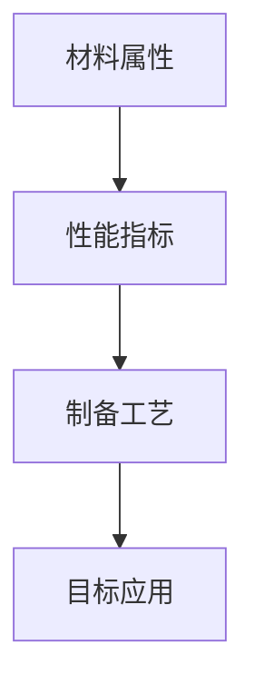

                 


# AI Agent在智能材料设计中的实践

> **关键词**：AI Agent，智能材料，设计优化，强化学习，数学建模

> **摘要**：本文深入探讨了AI Agent在智能材料设计中的应用，从基本概念、核心原理到实际应用，全面分析了AI Agent如何助力智能材料的创新设计。文章结合理论与实践，详细阐述了AI Agent的算法原理、系统架构以及在智能材料设计中的具体应用场景，为读者提供了从理论到实践的完整指南。

---

# 《AI Agent在智能材料设计中的实践》

## # 第1章: AI Agent与智能材料设计的背景与基础

### ## 1.1 AI Agent的基本概念与特点

AI Agent（人工智能代理）是指在计算机系统中，能够感知环境并采取行动以实现目标的智能体。与传统自动化系统相比，AI Agent具有以下特点：

- **自主性**：AI Agent能够自主决策，无需人工干预。
- **反应性**：能够实时感知环境并做出反应。
- **学习能力**：通过数据和经验不断优化自身行为。
- **社交能力**：能够与其他Agent或人类进行交互协作。

### ## 1.2 智能材料的基本概念与分类

智能材料是指能够感知外界环境变化并做出响应的材料。其分类如下：

- **形状记忆材料**：在外力作用下可变形，并在特定条件下恢复原状。
- **压电材料**：能够将机械能转化为电能，或反之。
- **导电材料**：具有良好的导电性，可用于传感器或执行器。
- **响应性材料**：对外界刺激（如温度、湿度、光照）产生特定响应。

### ## 1.3 AI Agent在智能材料设计中的定位与作用

AI Agent在智能材料设计中扮演着关键角色，其作用包括：

- **需求分析**：理解设计目标并提取关键参数。
- **性能预测**：通过建模预测材料的物理性能。
- **结构优化**：优化材料的微观结构以实现目标性能。
- **制备指导**：提供制备工艺建议并监控过程。

---

## # 第2章: AI Agent的核心原理与技术

### ## 2.1 AI Agent的决策机制

AI Agent的决策机制主要基于以下几种方法：

#### 1. 基于强化学习的决策过程

强化学习是一种通过试错机制优化决策的算法。其核心是通过最大化奖励函数来优化策略。

$$
Q(s, a) = r + \gamma \max_{a'} Q(s', a')
$$

其中：
- $Q(s, a)$ 表示状态 $s$ 下采取动作 $a$ 的价值。
- $r$ 表示奖励。
- $\gamma$ 表示折扣因子。

#### 2. 基于监督学习的决策过程

监督学习通过训练数据预测目标输出，常用于分类和回归问题。

$$
y = f(x) + \epsilon
$$

其中：
- $y$ 表示目标输出。
- $f(x)$ 表示模型预测函数。
- $\epsilon$ 表示误差项。

#### 3. 基于知识图谱的决策过程

知识图谱是一种结构化的知识表示方式，通过图结构表示实体及其关系。

**示例知识图谱：**



---

## # 第3章: 智能材料设计的核心技术

### ## 3.1 智能材料的物理模型与数学描述

智能材料的物理模型是设计的基础。例如，形状记忆材料的热力学模型如下：

$$
E = k_B T \ln \frac{N}{N_0}
$$

其中：
- $E$ 表示能量。
- $k_B$ 表示玻恩-朗德常数。
- $T$ 表示温度。
- $N$ 表示粒子数。
- $N_0$ 表示参考状态的粒子数。

---

## # 第4章: AI Agent在智能材料设计中的应用

### ## 4.1 AI Agent驱动的智能材料设计流程

设计流程包括以下步骤：

1. **需求分析**：明确设计目标。
2. **性能预测**：建立数学模型预测性能。
3. **结构优化**：优化材料结构。
4. **制备指导**：提供制备工艺建议。

---

## # 附录

### ## 附录A: AI Agent算法实现代码

以下是一个基于强化学习的AI Agent实现示例：

```python
import numpy as np
import gym

env = gym.make('CartPole-v0')
env.seed(42)

class Agent:
    def __init__(self, state_space, action_space, lr=0.01, gamma=0.99):
        self.state_space = state_space
        self.action_space = action_space
        self.lr = lr
        self.gamma = gamma
        self.Q = np.zeros((state_space, action_space))
    
    def act(self, state):
        return np.argmax(self.Q[state])
    
    def learn(self, state, action, reward, next_state):
        target = reward + self.gamma * np.max(self.Q[next_state])
        self.Q[state, action] = self.Q[state, action] + self.lr * (target - self.Q[state, action])

agent = Agent(env.observation_space.shape[0], env.action_space.n)
for episode in range(100):
    state = env.reset()
    for _ in range(1000):
        action = agent.act(state)
        next_state, reward, done, _ = env.step(action)
        agent.learn(state, action, reward, next_state)
        state = next_state
        if done:
            break
```

---

## # 结语

AI Agent在智能材料设计中的应用前景广阔，通过结合先进的算法和数学建模技术，AI Agent能够显著提升材料设计的效率和精度。随着技术的不断进步，AI Agent在智能材料设计中的应用将更加深入，为材料科学的发展注入新的活力。

