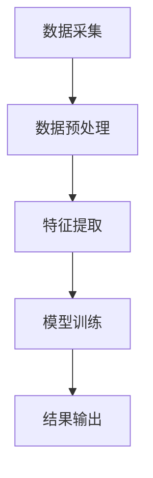
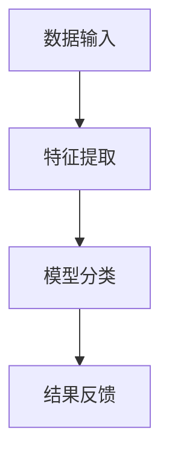

                 


# AI Agent在智能枕头中的呼吸模式分析

## 关键词：AI Agent, 智能枕头, 呼吸模式分析, 机器学习, 深度学习, 健康监测

## 摘要：本文详细探讨了AI Agent在智能枕头中的呼吸模式分析技术，从核心概念、算法原理到系统架构设计，再到项目实战，全面解析了如何利用AI技术提升睡眠健康监测的准确性和智能化水平。

---

# 第一部分: AI Agent与智能枕头的背景与概念

## 第1章: AI Agent与智能枕头概述

### 1.1 AI Agent的基本概念
#### 1.1.1 AI Agent的定义与核心特征
AI Agent（人工智能代理）是指能够感知环境、自主决策并执行任务的智能实体。其核心特征包括自主性、反应性、目标导向性和社交能力。AI Agent能够通过传感器获取数据，利用算法处理信息，并根据结果采取行动。

#### 1.1.2 AI Agent的分类与应用场景
AI Agent可以分为简单反射型、基于模型的反应型、目标驱动型和实用驱动型。在智能枕头中，AI Agent主要用于健康监测、环境调节和个性化服务。

#### 1.1.3 智能枕头的定义与功能特点
智能枕头是一种结合了传感器和AI技术的睡眠辅助设备，能够监测用户的呼吸、心率、体动等数据，并通过AI分析提供个性化的睡眠建议。

### 1.2 AI Agent在智能枕头中的作用
#### 1.2.1 呼吸模式分析的背景与意义
呼吸模式是评估睡眠质量的重要指标。通过分析呼吸频率、深度和节律，可以识别睡眠呼吸暂停综合征（Sleep Apnea Syndrome, SAS）等健康问题。

#### 1.2.2 AI Agent在呼吸模式分析中的优势
AI Agent能够实时采集、处理和分析呼吸数据，快速识别异常模式，并提供实时反馈。相比传统医疗设备，AI Agent具有便捷性、实时性和智能化的特点。

#### 1.2.3 智能枕头与传统睡眠监测设备的区别
智能枕头结合了AI技术，能够主动调整枕头的硬度、高度和温度，以改善用户的睡眠质量。而传统设备仅限于数据采集和记录。

---

## 第2章: AI Agent与呼吸模式分析的核心概念

### 2.1 呼吸模式分析的基本原理
#### 2.1.1 呼吸信号的采集与处理
智能枕头通过内置的加速度传感器、麦克风或压力传感器采集用户的呼吸信号。这些信号需要经过滤波、降噪和特征提取处理，以便后续分析。

#### 2.1.2 呼吸模式的特征提取方法
常用的特征包括呼吸频率（BF）、呼吸深度（BD）、呼吸节律（BR）和呼吸波动（BF）。特征提取方法包括时域分析、频域分析和时频分析。

#### 2.1.3 呼吸模式分析的数学模型
数学模型用于描述呼吸信号的动态变化。常用的模型包括傅里叶变换（FFT）和小波变换（WT）。

### 2.2 AI Agent在呼吸模式分析中的实现原理
#### 2.2.1 数据流与信息处理流程
数据流包括信号采集、预处理、特征提取、模式识别和结果反馈五个步骤。

#### 2.2.2 AI Agent的决策机制
AI Agent通过机器学习模型（如支持向量机和随机森林）进行分类，判断呼吸模式是否异常。

#### 2.2.3 呼吸模式分析的算法框架
算法框架包括数据预处理、特征提取、模型训练和结果输出四个部分。

---

## 第3章: AI Agent与呼吸模式分析的核心概念联系

### 3.1 实体关系分析
#### 3.1.1 实体关系图（ER图）展示
- 实体：用户、呼吸数据、AI Agent、传感器、模型
- 关系：用户通过传感器生成呼吸数据，AI Agent利用模型分析数据并反馈结果。

#### 3.1.2 AI Agent与呼吸模式分析的实体关系
AI Agent作为核心实体，与呼吸数据和模型紧密相连。

#### 3.1.3 关系属性与交互逻辑
- 属性：呼吸频率、深度、模型类型
- 交互逻辑：AI Agent接收数据，分析后反馈结果。

### 3.2 算法原理与流程图
#### 3.2.1 呼吸模式分析的算法流程图（Mermaid）


#### 3.2.2 AI Agent的决策流程图（Mermaid）


---

## 第4章: AI Agent在呼吸模式分析中的算法原理

### 4.1 数据预处理与特征提取
#### 4.1.1 数据预处理方法
包括去噪、归一化和插值处理。

#### 4.1.2 呼吸信号的特征提取算法
常用算法包括时域分析和频域分析。

#### 4.1.3 特征选择与降维技术
使用主成分分析（PCA）进行降维。

### 4.2 AI Agent的实现算法
#### 4.2.1 基于机器学习的呼吸模式分类算法
- 算法选择：支持向量机（SVM）和随机森林（RF）。
- Python代码示例：
  ```python
  from sklearn import svm, metrics
  from sklearn.ensemble import RandomForestClassifier

  # 训练模型
  clf_svm = svm.SVC()
  clf_svm.fit(X_train, y_train)

  clf_rf = RandomForestClassifier()
  clf_rf.fit(X_train, y_train)
  ```

#### 4.2.2 基于深度学习的呼吸模式预测算法
- 算法选择：卷积神经网络（CNN）和长短期记忆网络（LSTM）。
- Python代码示例：
  ```python
  import tensorflow as tf
  from tensorflow.keras import layers

  model = tf.keras.Sequential([
      layers.Conv1D(64, 3, activation='relu', input_shape=(None, 1)),
      layers.MaxPooling1D(2),
      layers.Flatten(),
      layers.Dense(128, activation='relu'),
      layers.Dense(2, activation='softmax')
  ])
  model.compile(optimizer='adam', loss='sparse_categorical_crossentropy', metrics=['accuracy'])
  model.fit(X_train, y_train, epochs=10, batch_size=32)
  ```

#### 4.2.3 算法实现的Python代码示例
提供完整的代码示例和解释。

### 4.3 数学模型与公式详解
#### 4.3.1 呼吸模式分析的数学模型
- 傅里叶变换公式：
  $$ X(f) = \sum_{n=-\infty}^{\infty} x(n) e^{-j2\pi fn} $$
- 支持向量机的优化问题：
  $$ \min_{w,b,\xi} \frac{1}{2}||w||^2 + C\sum_{i=1}^{n} \xi_i $$
  $$ y_i(w \cdot x_i + b) \geq 1 - \xi_i $$
  $$ \xi_i \geq 0 $$

---

## 第5章: 数学公式与算法实现细节

### 5.1 呼吸模式分析的数学模型
详细解释傅里叶变换和小波变换的公式，并举例说明其在呼吸信号分析中的应用。

### 5.2 机器学习算法的实现细节
详细解释支持向量机和随机森林的参数设置和优化方法。

### 5.3 深度学习算法的实现细节
详细解释卷积神经网络和长短期记忆网络的网络结构和训练技巧。

---

## 第6章: 系统分析与架构设计方案

### 6.1 项目背景介绍
智能枕头的开发背景和目标。

### 6.2 系统功能设计
- 数据采集模块：负责采集呼吸信号。
- 数据处理模块：负责预处理和特征提取。
- AI分析模块：负责模式识别和结果反馈。

### 6.3 系统架构设计（Mermaid图）


### 6.4 系统接口设计
- 数据接口：传感器数据接口和用户反馈接口。
- 交互流程图：展示数据流和模块交互逻辑。

---

## 第7章: 项目实战

### 7.1 环境安装
- 安装Python、TensorFlow、Scikit-learn等依赖库。

### 7.2 核心代码实现
- 数据预处理代码：
  ```python
  import numpy as np
  from scipy.signal import butterworth

  def preprocess(data, fs):
      # 设计滤波器
      order = 4
      cutoff = 5
      b, a = butterworth(order, cutoff, fs=fs, btype='low')
      # 应用滤波器
      filtered = np.convolve(data, a, mode='same')
      return filtered
  ```

### 7.3 代码解读与分析
详细解释每段代码的功能和实现逻辑。

### 7.4 案例分析与详细讲解
通过实际案例展示AI Agent在呼吸模式分析中的应用效果。

### 7.5 项目小结
总结项目成果和经验教训。

---

## 第8章: 总结与展望

### 8.1 最佳实践 tips
- 数据预处理是关键。
- 选择合适的算法和模型。
- 注重模型的可解释性。

### 8.2 小结
AI Agent在智能枕头中的应用前景广阔，未来可以通过优化算法和增加更多传感器来提升分析精度。

### 8.3 注意事项
- 数据隐私保护。
- 设备兼容性和易用性。

### 8.4 拓展阅读
推荐相关领域的书籍和论文。

---

通过以上思考和组织，可以逐步完成一篇结构完整、内容详实的技术博客文章。

