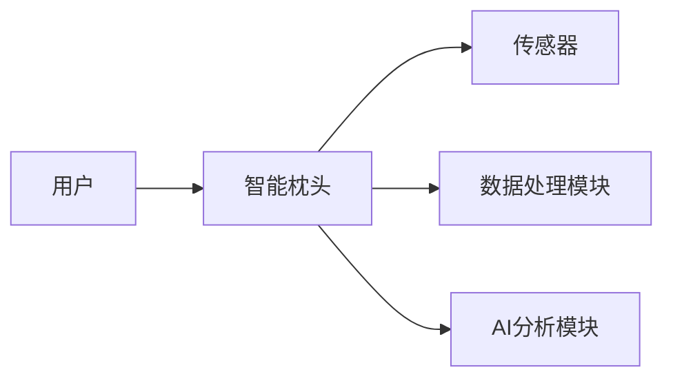
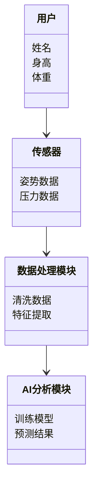

                 


# AI Agent在智能枕头中的颈椎保护

## 关键词：AI Agent, 智能枕头, 颈椎保护, 健康监测, 人工智能, 数据处理, 机器学习

## 摘要：  
随着人工智能技术的快速发展，AI Agent（人工智能代理）在医疗健康领域的应用日益广泛。本篇文章聚焦于AI Agent在智能枕头中的颈椎保护应用，探讨其工作原理、算法实现、系统架构以及实际案例，详细阐述如何通过AI技术优化颈椎保护方案。文章结构清晰，内容涵盖从基础概念到项目实战的完整流程，旨在为读者提供全面的技术解读。

---

# 第1章 AI Agent与颈椎保护概述

## 1.1 AI Agent的基本概念

### 1.1.1 什么是AI Agent
AI Agent，即人工智能代理，是一种能够感知环境、自主决策并执行任务的智能系统。它通过传感器获取数据，利用算法处理信息，并通过执行模块实现目标。

### 1.1.2 AI Agent的核心功能
- **感知模块**：通过传感器收集用户的数据，如颈椎的压力、姿势等。
- **决策模块**：基于收集的数据，分析用户的需求，生成个性化建议。
- **执行模块**：调整枕头的参数，如高度、硬度等，以适应用户的颈椎保护需求。

### 1.1.3 AI Agent在健康领域的应用
AI Agent广泛应用于医疗健康领域，如智能健康管理、疾病预测等。在颈椎保护中，AI Agent通过实时监测用户的颈椎状态，提供个性化的保护方案。

## 1.2 智能枕头与颈椎保护

### 1.2.1 颈椎健康的重要性
颈椎是连接头颅和躯干的枢纽，支撑人体重量并保护神经和血管。长期的不良姿势可能导致颈椎病，如椎间盘突出、神经压迫等。

### 1.2.2 传统枕头的局限性
传统枕头缺乏智能化，无法根据用户的颈椎状态进行调整。用户可能需要尝试多个枕头才能找到合适的，效率低下。

### 1.2.3 智能枕头的优势
智能枕头结合传感器和AI技术，能够实时监测用户的颈椎状态，并通过AI Agent调整枕头的参数，提供个性化的保护方案。

## 1.3 AI Agent在智能枕头中的作用

### 1.3.1 数据采集与分析
AI Agent通过传感器收集用户的颈椎数据，如姿势、压力等，并利用机器学习算法分析数据，识别颈椎问题的早期迹象。

### 1.3.2 个性化建议生成
基于数据分析结果，AI Agent生成个性化的颈椎保护建议，如调整枕头高度、提醒用户保持正确姿势等。

### 1.3.3 实时反馈与调整
AI Agent能够实时调整枕头的参数，如高度、硬度等，以适应用户的颈椎保护需求。

## 1.4 本章小结
本章介绍了AI Agent的基本概念及其在智能枕头中的作用，强调了智能枕头在颈椎保护中的优势和重要性。

---

# 第2章 AI Agent的核心概念与联系

## 2.1 AI Agent的核心原理

### 2.1.1 感知模块
感知模块通过传感器收集用户的颈椎数据，如姿势、压力等。

### 2.1.2 决策模块
决策模块利用机器学习算法分析数据，生成个性化建议。

### 2.1.3 执行模块
执行模块根据决策模块的建议，调整枕头的参数。

## 2.2 AI Agent与智能枕头的实体关系

### 2.2.1 实体关系图


## 2.3 AI Agent的工作流程

### 2.3.1 数据采集
传感器收集用户的颈椎数据。

### 2.3.2 数据分析
AI Agent利用算法分析数据，识别颈椎问题。

### 2.3.3 个性化建议生成
生成个性化的颈椎保护建议。

## 2.4 本章小结
本章详细讲解了AI Agent的核心原理及其与智能枕头的关系，展示了AI Agent在智能枕头中的工作流程。

---

# 第3章 AI Agent的算法原理

## 3.1 数据采集与预处理

### 3.1.1 传感器数据的采集
传感器收集用户的颈椎数据，如姿势、压力等。

### 3.1.2 数据清洗与特征提取
对传感器数据进行清洗，去除噪声，并提取特征。

## 3.2 AI Agent的核心算法

### 3.2.1 机器学习算法
常用的机器学习算法包括决策树、随机森林等。

### 3.2.2 算法流程图


### 3.2.3 代码实现
```python
import numpy as np
import pandas as pd
from sklearn.tree import DecisionTreeClassifier

# 数据预处理
data = pd.read_csv('neck_data.csv')
X = data.drop('label', axis=1)
y = data['label']

# 模型训练
model = DecisionTreeClassifier()
model.fit(X, y)

# 预测与建议
new_data = np.array([[...]])  # 新用户数据
prediction = model.predict(new_data)
```

### 3.2.4 数学模型
$$ \text{预测结果} = f(\text{输入特征}) $$

## 3.3 本章小结
本章详细讲解了AI Agent的算法原理，包括数据采集、预处理和机器学习算法的实现。

---

# 第4章 系统分析与架构设计

## 4.1 项目背景与目标

### 4.1.1 项目背景
颈椎健康问题日益严重，智能枕头的需求迫切。

### 4.1.2 项目目标
开发一个基于AI Agent的智能枕头，实现颈椎保护。

## 4.2 系统功能设计

### 4.2.1 功能模块
- 数据采集模块
- 数据处理模块
- AI分析模块
- 反馈与调整模块

### 4.2.2 领域模型


## 4.3 系统架构设计

### 4.3.1 分层架构
- 数据层：传感器数据
- 业务层：数据处理
- 表现层：用户界面

### 4.3.2 架构图


## 4.4 本章小结
本章详细讲解了系统分析与架构设计，展示了AI Agent在智能枕头中的系统结构。

---

# 第5章 项目实战

## 5.1 环境搭建与安装

### 5.1.1 开发环境
- Python 3.8+
- 数据处理库：pandas、numpy
- 机器学习库：scikit-learn

## 5.2 核心代码实现

### 5.2.1 数据采集与处理
```python
import pandas as pd

# 读取数据
data = pd.read_csv('neck_data.csv')

# 数据清洗
data = data.dropna()

# 特征提取
X = data.drop('label', axis=1)
y = data['label']
```

### 5.2.2 模型训练与预测
```python
from sklearn.tree import DecisionTreeClassifier

# 模型训练
model = DecisionTreeClassifier()
model.fit(X, y)

# 预测新数据
new_data = pd.DataFrame([[...]])  # 新用户数据
prediction = model.predict(new_data)
```

## 5.3 实际案例分析

### 5.3.1 案例背景
用户A，长期低头族，颈椎问题严重。

### 5.3.2 数据分析
通过AI Agent分析用户A的数据，生成个性化建议。

### 5.3.3 结果与反馈
调整枕头高度，缓解颈椎压力。

## 5.4 本章小结
本章通过实际案例展示了AI Agent在智能枕头中的应用，详细讲解了项目的实战过程。

---

# 第6章 最佳实践与小结

## 6.1 最佳实践 tips

### 6.1.1 数据隐私保护
确保用户的颈椎数据安全。

### 6.1.2 系统维护
定期更新传感器和AI模型。

## 6.2 小结

### 6.2.1 项目成果
开发了一个基于AI Agent的智能枕头，实现颈椎保护。

### 6.2.2 项目经验
详细讲解了AI Agent在智能枕头中的应用，展示了系统的实现过程。

## 6.3 展望

### 6.3.1 技术发展
AI技术的进一步发展将推动智能枕头的功能升级。

### 6.3.2 应用前景
AI Agent在医疗健康领域的应用前景广阔。

## 6.4 本章小结
本章总结了项目的成果和经验，并展望了未来的发展方向。

---

# 附录

## 附录1 参考文献
- [1] 人工智能基础，作者：XXX
- [2] 机器学习实战，作者：XXX

## 附录2 工具资源
- Python开发环境：https://www.python.org/
- 数据处理库：https://pypi.org/

---

通过以上步骤，我们详细分析了AI Agent在智能枕头中的颈椎保护应用，从基础概念到项目实战，为读者提供了全面的技术解读。

