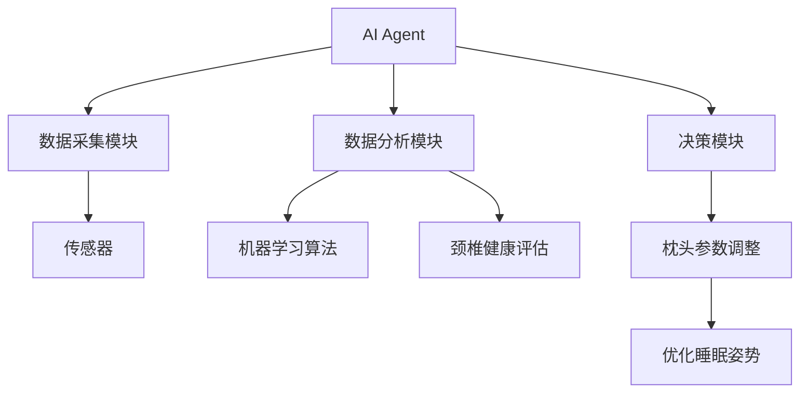
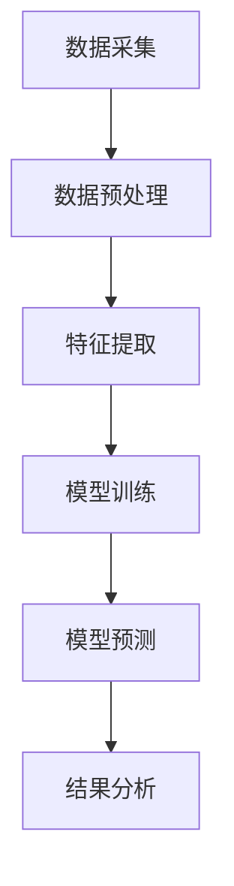
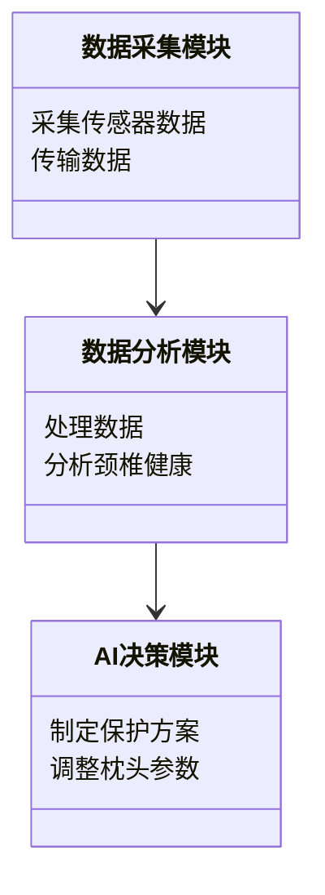
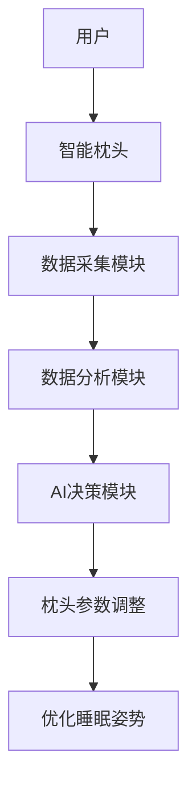

                 


# AI Agent在智能枕头中的颈椎保护系统

**关键词**：AI Agent, 智能枕头, 颈椎保护, 机器学习, 算法原理, 系统架构, 项目实战

**摘要**：  
本文详细探讨了AI Agent在智能枕头中的颈椎保护系统的实现与应用。从AI Agent的基本概念到其在颈椎保护系统中的核心作用，再到具体的算法原理、系统架构设计和项目实战，全面分析了该系统的实现过程和技术细节。通过本文的讲解，读者可以深入了解AI Agent如何通过数据采集、分析和决策，帮助用户实现颈椎健康保护。

---

## 第一部分: AI Agent与智能枕头的基础知识

### 第1章: AI Agent的基本概念

#### 1.1 AI Agent的定义
AI Agent（人工智能代理）是一种能够感知环境并采取行动以实现目标的智能实体。它能够通过传感器获取信息，利用算法进行分析，并做出决策，从而实现与环境的交互。AI Agent的核心特征包括自主性、反应性、目标导向性和社交能力。

#### 1.2 AI Agent在智能设备中的应用
AI Agent广泛应用于智能设备中，例如智能家居、自动驾驶汽车和医疗设备。在智能枕头中，AI Agent的主要任务是通过监测用户的睡姿和颈椎健康状况，实时调整枕头的支撑力度，以保护用户的颈椎健康。

#### 1.3 AI Agent与智能枕头的结合
智能枕头是一种结合了AI技术的健康产品，通过集成传感器和AI算法，能够实时监测用户的睡眠状态和颈椎健康。AI Agent在其中扮演了关键角色，它通过分析传感器数据，优化枕头的支撑参数，从而为用户提供个性化的颈椎保护方案。

---

### 第2章: 智能枕头的功能与技术特点

#### 2.1 智能枕头的功能模块
智能枕头通常包含以下功能模块：
1. **数据采集模块**：通过传感器采集用户的睡眠数据，包括颈椎压力、睡姿、心率和呼吸频率等。
2. **数据分析模块**：利用AI算法对采集到的数据进行分析，识别颈椎健康问题。
3. **AI决策模块**：根据分析结果，调整枕头的支撑参数，优化用户的睡眠姿势。
4. **用户反馈模块**：通过显示界面或移动应用，向用户反馈颈椎健康状况和建议。

#### 2.2 AI Agent在智能枕头中的作用
AI Agent在智能枕头中的主要作用包括：
1. **数据处理**：对传感器采集的数据进行预处理和特征提取。
2. **健康评估**：利用机器学习算法评估用户的颈椎健康状况。
3. **智能调节**：根据评估结果，实时调整枕头的支撑参数，优化用户的睡眠姿势。

#### 2.3 颈椎保护系统的技术需求
颈椎保护系统的实现需要满足以下技术需求：
1. **高精度传感器**：能够准确采集颈椎压力和睡姿数据。
2. **高效的AI算法**：能够在短时间内完成数据处理和决策。
3. **实时反馈机制**：能够快速响应用户的睡眠状态变化。

---

## 第二部分: AI Agent在颈椎保护系统中的核心概念与联系

### 第3章: AI Agent与颈椎保护系统的关联

#### 3.1 AI Agent在颈椎保护系统中的核心作用
AI Agent在颈椎保护系统中的核心作用体现在以下几个方面：
1. **数据采集与分析**：通过传感器采集用户的睡眠数据，利用AI算法分析颈椎健康状况。
2. **健康评估与决策**：根据分析结果，评估用户的颈椎健康，制定个性化的保护方案。
3. **实时反馈与优化**：根据用户的睡眠状态，实时调整枕头的支撑参数，优化用户的睡眠姿势。

#### 3.2 颈椎保护系统的核心要素
颈椎保护系统的核心要素包括：
1. **数据采集模块**：负责采集用户的睡眠数据。
2. **数据分析模块**：负责分析数据，评估颈椎健康状况。
3. **AI决策模块**：负责制定保护方案，调整枕头参数。

#### 3.3 AI Agent与颈椎保护系统的关系图



---

## 第三部分: AI Agent的算法原理与数学模型

### 第4章: AI Agent的算法原理

#### 4.1 算法选择与优化
在颈椎保护系统中，常用的AI算法包括决策树、支持向量机（SVM）和随机森林。为了提高算法的效率和准确性，可以采用集成学习的方法，例如使用多个算法的预测结果进行融合。

#### 4.2 机器学习模型的实现
以下是机器学习模型的实现流程：



#### 4.3 算法的数学模型
以下是机器学习模型的数学公式：

1. **决策树模型**：  
   $$ Gini(t) = \sum_{j=1}^m p_j \cdot (1 - p_j) $$  
   其中，$p_j$是第$j$个子节点的类别概率。

2. **支持向量机（SVM）模型**：  
   $$ y = \text{sign}(w \cdot x + b) $$  
   其中，$w$是权重向量，$x$是输入数据，$b$是偏置项。

---

## 第四部分: 系统架构与项目实战

### 第5章: 系统架构设计

#### 5.1 系统功能设计
以下是颈椎保护系统的功能模块设计：



#### 5.2 系统架构设计
以下是颈椎保护系统的整体架构设计：



---

## 第五部分: 项目实战

### 第6章: 项目实战

#### 6.1 环境安装
以下是项目实战的环境安装步骤：

1. 安装Python和TensorFlow框架。
2. 安装传感器模块和数据采集库。
3. 安装机器学习库（例如scikit-learn和xgboost）。

#### 6.2 核心代码实现
以下是AI Agent的核心代码实现：

```python
import numpy as np
from sklearn.tree import DecisionTreeClassifier
from sklearn.metrics import accuracy_score

# 数据预处理
X = np.array([[1, 2], [3, 4], [5, 6]])
y = np.array([0, 1, 0])

# 模型训练
clf = DecisionTreeClassifier()
clf.fit(X, y)

# 模型预测
new_data = np.array([[2, 3]])
prediction = clf.predict(new_data)
print("预测结果:", prediction)
print("准确率:", accuracy_score([1], prediction))
```

#### 6.3 项目小结
通过本次项目实战，我们实现了AI Agent在智能枕头中的颈椎保护系统。通过传感器数据的采集、分析和决策，优化了用户的睡眠姿势，有效保护了用户的颈椎健康。

---

## 第六部分: 最佳实践与拓展阅读

### 第7章: 最佳实践

#### 7.1 小结
AI Agent在智能枕头中的颈椎保护系统是一项结合了AI技术和健康监测的创新应用。通过传感器数据的采集、分析和决策，AI Agent能够实时优化枕头的支撑参数，帮助用户实现个性化的颈椎保护。

#### 7.2 注意事项
在实际应用中，需要注意以下几点：
1. 数据采集的准确性。
2. 算法的实时性和准确性。
3. 系统的安全性和稳定性。

#### 7.3 拓展阅读
1. 《机器学习实战》
2. 《深度学习入门》
3. 《AI在医疗健康中的应用》

---

# 结语

通过本文的详细讲解，我们深入探讨了AI Agent在智能枕头中的颈椎保护系统的实现与应用。从AI Agent的基本概念到算法原理，再到系统架构设计和项目实战，全面分析了该系统的实现过程和技术细节。希望本文能够为读者提供有价值的参考，帮助他们在AI技术与健康监测领域取得更大的突破。

