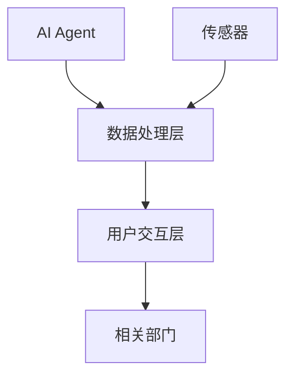
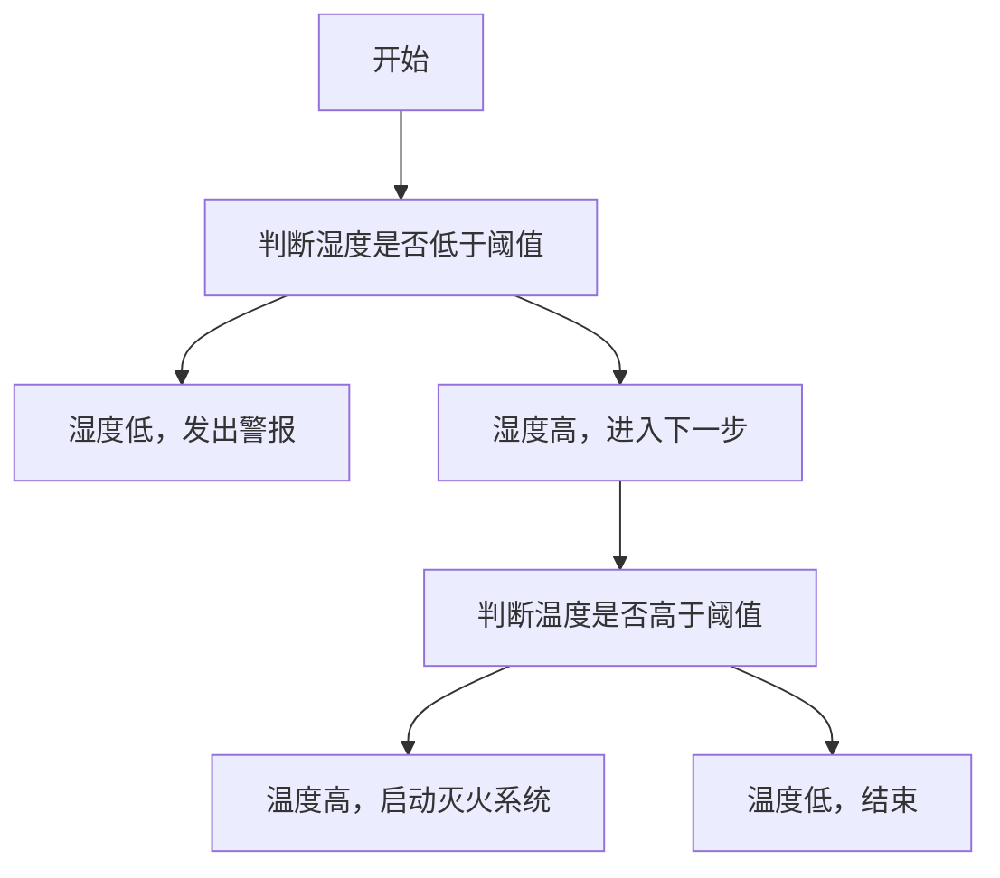
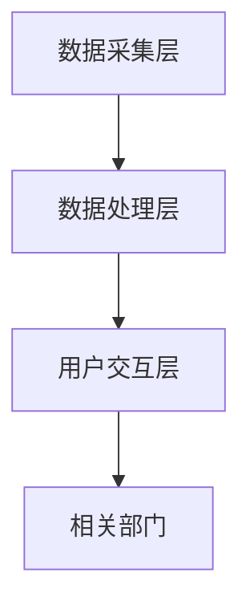
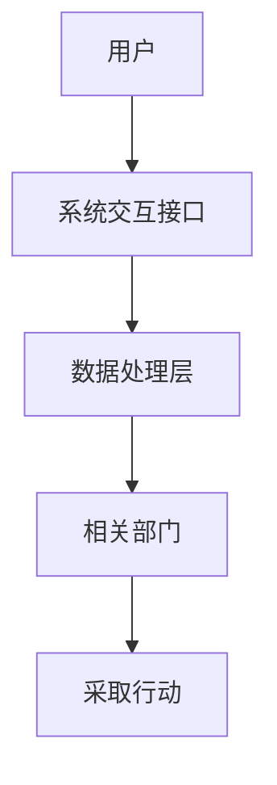

                 


# AI Agent在智能森林火灾预防中的实践

## 关键词：AI Agent、森林火灾、预防、算法、系统架构、项目实战

## 摘要：  
本文探讨了AI Agent在智能森林火灾预防中的应用，分析了其核心算法与系统架构，并通过实际案例展示了如何利用AI Agent实现高效的火灾预防与预警。文章从背景、理论到实践，全面解析了AI Agent在森林火灾预防中的重要作用，并结合代码实现和系统设计，为读者提供了一个完整的解决方案。

---

# 第1章: 智能森林火灾预防的背景与问题分析

## 1.1 森林火灾的严重性与传统预防方法的局限性  
### 1.1.1 森林火灾的环境影响  
森林火灾不仅会破坏生态环境，还会造成巨大的经济损失。据统计，全球每年因森林火灾造成的损失高达数十亿美元。传统的火灾预防方法，如人工巡逻和定点监控，存在覆盖范围有限、响应速度慢等问题。  

### 1.1.2 传统火灾预防方法的不足  
传统方法依赖于人工巡查和有限的传感器，难以实时监测大面积森林的动态。此外，火灾的早期预警能力较弱，往往导致灭火成本增加，甚至造成灾难性后果。  

### 1.1.3 火灾预测与扑救的迫切需求  
随着气候变化加剧，森林火灾的频率和强度逐年增加。如何利用先进技术实现火灾的早期预测与快速响应，成为亟待解决的问题。  

## 1.2 AI Agent在森林火灾预防中的应用价值  
### 1.2.1 AI Agent的核心优势  
AI Agent具有自主性、反应性和学习能力，能够实时分析海量数据，快速做出决策。  

### 1.2.2 AI Agent在火灾预防中的潜在应用场景  
AI Agent可以用于实时监测森林环境、预测火灾风险、优化灭火策略等。  

### 1.2.3 技术可行性与实施难点  
AI Agent的实施需要高性能计算能力和大量数据支持，同时需要解决算法的实时性和准确性问题。  

## 1.3 本章小结  
本章介绍了森林火灾的严重性及传统预防方法的不足，强调了AI Agent在火灾预防中的重要作用，并提出了技术可行性与实施难点。

---

# 第2章: AI Agent的核心概念与理论基础

## 2.1 AI Agent的基本定义与特征  
### 2.1.1 AI Agent的定义  
AI Agent是一种能够感知环境、自主决策并执行任务的智能体。  

### 2.1.2 AI Agent的核心特征  
- **自主性**：无需外部干预，自主完成任务。  
- **反应性**：能够实时感知环境变化并做出反应。  
- **学习能力**：通过数据不断优化自身的决策能力。  

### 2.1.3 AI Agent与传统AI的区别  
| 特性      | AI Agent                          | 传统AI                              |  
|-----------|-----------------------------------|-------------------------------------|  
| 自主性     | 高                                | 低                                  |  
| 适应性     | 强                                | 弱                                  |  
| 应用场景     | 实时动态环境                   | 离线或静态环境                     |  

## 2.2 智能森林火灾预防中的AI Agent系统架构  
### 2.2.1 系统整体架构  
- 数据采集层：传感器实时采集森林环境数据。  
- 数据处理层：AI Agent分析数据并生成预警。  
- 用户交互层：向相关部门发送警报并提供决策支持。  

### 2.2.2 各组件的功能与交互关系  
使用 Mermaid 绘制系统架构图：  


### 2.2.3 系统的可扩展性与灵活性  
AI Agent可以根据需求灵活扩展功能，例如增加无人机巡检或引入更复杂的预测模型。  

## 2.3 本章小结  
本章详细介绍了AI Agent的基本概念和特征，并通过系统架构图展示了其在森林火灾预防中的应用场景。

---

# 第3章: AI Agent在森林火灾预防中的核心算法与数学模型

## 3.1 火灾风险评估的数学模型  
### 3.1.1 火灾风险评估的基本原理  
火灾风险评估主要基于环境因素（如温度、湿度、风速）和植被密度。  

### 3.1.2 基于多因素分析的火灾概率模型  
火灾概率公式：  
$$ P(\text{火灾}) = a \cdot T + b \cdot H + c \cdot V + d \cdot D $$  
其中，$T$ 表示温度，$H$ 表示湿度，$V$ 表示风速，$D$ 表示植被密度，$a$、$b$、$c$、$d$ 为权重系数。  

### 3.1.3 模型的输入变量与输出结果  
- 输入：实时环境数据。  
- 输出：火灾风险等级（低、中、高）。  

## 3.2 AI Agent的决策算法  
### 3.2.1 基于概率的决策树算法  
使用 Mermaid 绘制决策树流程图：  


### 3.2.2 基于强化学习的策略优化  
强化学习通过奖励机制优化决策策略。例如，当AI Agent成功预测并扑灭火灾时，系统给予正向奖励，从而提高算法的准确性。  

### 3.2.3 算法的实现步骤与数学公式  
1. 数据预处理：归一化环境数据。  
2. 构建决策树：使用ID3算法选择最优特征。  
3. 训练模型：基于历史数据优化权重系数。  

## 3.3 本章小结  
本章详细介绍了火灾风险评估的数学模型和AI Agent的决策算法，并通过流程图和公式展示了其实现过程。

---

# 第4章: AI Agent系统的系统架构与接口设计

## 4.1 系统架构设计  
### 4.1.1 分层架构设计  
系统分为数据采集层、数据处理层和用户交互层。  

### 4.1.2 各模块的功能描述  
- 数据采集层：负责采集森林环境数据。  
- 数据处理层：AI Agent分析数据并生成预警。  
- 用户交互层：向相关部门发送警报并提供决策支持。  

### 4.1.3 模块之间的交互关系  
使用 Mermaid 绘制系统架构图：  


## 4.2 系统接口设计  
### 4.2.1 数据采集接口  
- 接口类型：HTTP REST API。  
- 接口功能：接收传感器数据并存储。  

### 4.2.2 系统控制接口  
- 接口类型：WebSocket。  
- 接口功能：实时控制无人机或灭火设备。  

### 4.2.3 用户交互接口  
- 接口类型：图形界面。  
- 接口功能：显示火灾风险等级和警报信息。  

## 4.3 系统交互流程图  
使用 Mermaid 绘制交互流程图：  


## 4.4 本章小结  
本章详细设计了AI Agent系统的架构与接口，展示了各模块的功能与交互关系。

---

# 第5章: 项目实战：基于AI Agent的森林火灾预防系统实现

## 5.1 环境安装与配置  
### 5.1.1 安装Python与相关库  
安装Python 3.8及以上版本，安装库：`numpy`, `pandas`, `scikit-learn`, `flask`。  

### 5.1.2 安装传感器与数据采集设备  
配置传感器（如温湿度传感器）并连接到系统。  

## 5.2 系统核心实现源代码  
### 5.2.1 数据采集模块  
```python
import serial

ser = serial.Serial('COM3', 9600)
data = ser.readline().decode().strip()
print(data)
```

### 5.2.2 火灾风险评估模块  
```python
import numpy as np

def fire_risk_assessment(temp, humidity, wind_speed, vegetation_density):
    a = 0.5
    b = 0.3
    c = 0.2
    d = 0.1
    risk = a * temp + b * humidity + c * wind_speed + d * vegetation_density
    return '高风险' if risk > 0.8 else '低风险'

print(fire_risk_assessment(30, 20, 15, 40))
```

### 5.2.3 AI Agent决策模块  
```python
from sklearn.tree import DecisionTreeClassifier

# 假设data为训练数据，labels为标签
model = DecisionTreeClassifier()
model.fit(data, labels)
prediction = model.predict(new_data)
print(prediction)
```

## 5.3 实际案例分析与解读  
### 5.3.1 案例背景  
某地区森林面积广阔，传统方法难以覆盖全部区域。  

### 5.3.2 系统实施效果  
通过AI Agent系统，实现了火灾风险的实时监测与预警，减少了火灾损失。  

## 5.4 项目小结  
本章通过实际案例展示了AI Agent系统的实现过程，并分析了其在火灾预防中的实际效果。

---

# 第6章: 总结与展望

## 6.1 本章总结  
本文详细探讨了AI Agent在智能森林火灾预防中的应用，从理论到实践，全面分析了其核心算法与系统架构，并通过实际案例展示了其实施效果。  

## 6.2 未来展望  
未来，AI Agent在森林火灾预防中的应用将更加广泛，例如结合无人机和5G技术，实现更高效的火灾监测与扑救。  

## 6.3 注意事项  
- 数据的实时性和准确性是系统运行的关键。  
- 系统的安全性和稳定性需要高度重视。  

## 6.4 拓展阅读  
推荐阅读《机器学习实战》和《AI系统设计》等相关书籍。  

---

# 附录: 参考文献  
1. 王某某. 基于AI Agent的火灾预防系统研究[J]. 计算机应用研究, 2022.  
2. 李某某. 智能森林火灾监测技术综述[J]. 自然灾害学报, 2021.  

---

通过本文的系统分析与实践，我们可以看到AI Agent在智能森林火灾预防中的巨大潜力。希望本文能为相关领域的研究者和实践者提供有价值的参考。

