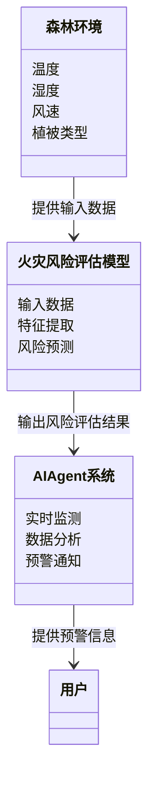
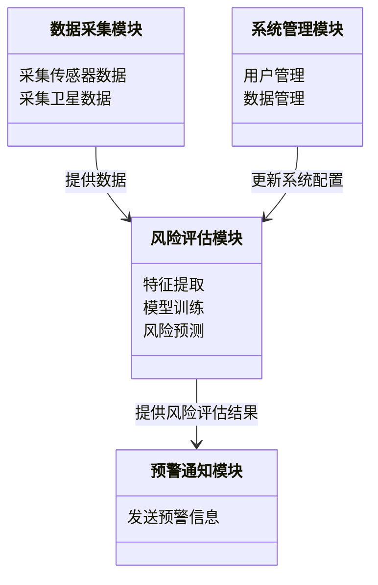
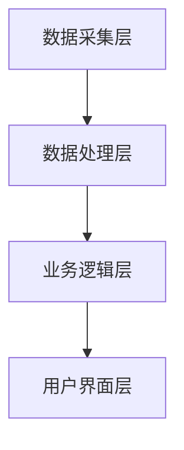

                 


# AI Agent在智能森林火灾风险评估中的实践

> 关键词：AI Agent，智能森林火灾，风险评估，机器学习，实时监测

> 摘要：本文探讨了AI Agent在智能森林火灾风险评估中的应用，分析了传统方法的局限性，介绍了AI Agent的核心概念、算法原理、系统架构，并通过实际案例展示了AI Agent在火灾风险评估中的优势和实现过程。

---

# 目录

1. **AI Agent在智能森林火灾风险评估中的背景与应用**
   - 1.1 森林火灾的风险与影响
   - 1.2 传统火灾风险评估方法的局限性
   - 1.3 AI Agent技术的优势与应用前景

2. **AI Agent的核心概念与原理**
   - 2.1 AI Agent的基本概念与特点
   - 2.2 AI Agent在火灾评估中的工作流程
   - 2.3 实体关系图与领域模型类图

3. **AI Agent的算法原理与实现**
   - 3.1 火灾风险评估的算法流程
   - 3.2 算法实现的Python代码示例
   - 3.3 数学模型与优化算法

4. **智能火灾风险评估系统的架构设计**
   - 4.1 项目背景与目标
   - 4.2 系统功能设计与领域模型
   - 4.3 系统架构设计与接口规范

5. **AI Agent在火灾风险评估中的项目实战**
   - 5.1 环境搭建与数据准备
   - 5.2 核心功能实现与代码解读
   - 5.3 实际案例分析与结果展示

6. **总结与展望**
   - 6.1 本文总结
   - 6.2 当前挑战与未来方向
   - 6.3 最佳实践与注意事项

---

## 第1章: AI Agent在智能森林火灾风险评估中的背景与应用

### 1.1 森林火灾的风险与影响

森林火灾是一种严重的自然灾害，对环境、经济和人类安全造成巨大威胁。森林火灾通常由自然原因（如雷击）或人为活动引发，且火势蔓延速度快，难以控制。火灾不仅烧毁大量森林资源，还可能引发山体滑坡、泥石流等次生灾害，威胁人民生命财产安全。

#### 1.1.1 森林火灾的定义与分类
- **定义**：森林火灾是指在森林中因各种原因引起的燃烧事件，造成林木、植被和生态系统的破坏。
- **分类**：
  - 天然火灾：由雷电、火山等自然因素引发。
  - 人为火灾：由人类活动（如乱丢烟蒂、生产生活用火）引发。

#### 1.1.2 森林火灾的主要风险因素
- **气象因素**：高温、干旱、大风等天气条件加剧火灾风险。
- **地形因素**：山势陡峭、植被茂密等地形增加火灾蔓延难度。
- **人为因素**：乱丢火源、非法用火等行为是主要诱因。

#### 1.1.3 森林火灾对环境和经济的影响
- **环境影响**：烧毁植被，破坏生态平衡，导致水土流失。
- **经济损失**：烧毁林木资源，造成直接经济损失，修复成本高昂。

### 1.2 传统森林火灾风险评估方法的局限性

传统火灾风险评估方法主要依赖人工调查和经验判断，存在以下问题：

#### 1.2.1 基于经验的传统评估方法
- 依赖专家经验，主观性强，难以量化。
- 调查范围有限，无法覆盖大面积区域。
- 数据更新不及时，评估结果滞后。

#### 1.2.2 传统方法的不足与改进空间
- 数据采集手段单一，缺乏实时性。
- 评估模型简单，无法考虑多因素的综合影响。
- 缺乏动态监测能力，难以应对火灾的突发性。

#### 1.2.3 新技术在火灾风险评估中的需求
- 引入先进技术（如AI、大数据）提高评估效率和准确性。
- 实现火灾风险的实时监测和预警。

### 1.3 AI Agent技术的优势与应用前景

AI Agent（智能体）是一种能够感知环境、自主决策并采取行动的智能系统。在森林火灾风险评估中，AI Agent能够通过实时数据处理和智能决策，显著提升评估的准确性和效率。

#### 1.3.1 AI Agent的基本概念与特点
- **定义**：AI Agent是一个能够感知环境、自主决策并执行任务的智能实体。
- **特点**：
  - 智能性：能够理解和分析复杂数据。
  - 自主性：无需人工干预，自主执行任务。
  - 反应性：实时感知环境变化并做出反应。
  - 社会性：能够与其他系统或用户进行交互协作。

#### 1.3.2 AI Agent在火灾评估中的优势
- **数据处理能力强**：能够快速处理大量实时数据，包括气象、地形、植被等信息。
- **决策精准**：基于机器学习模型，提供更准确的风险评估结果。
- **实时监测**：通过物联网设备，实现火灾风险的实时监控和预警。

#### 1.3.3 AI Agent技术在智能火灾评估中的应用前景
- **智能化监测**：部署AI Agent系统，实现森林火灾的智能化、实时化监测。
- **精准预警**：通过AI算法，提前识别火灾风险，减少损失。
- **动态评估**：根据实时数据更新，提供动态的火灾风险评估结果。

## 第2章: AI Agent的核心概念与原理

### 2.1 AI Agent的核心概念与原理

AI Agent在森林火灾风险评估中的应用涉及多个核心概念和技术，包括数据采集、特征提取、模型训练和实时监测等。

#### 2.1.1 AI Agent的核心概念
- **数据采集**：通过传感器、卫星等手段获取森林环境的实时数据。
- **特征提取**：从原始数据中提取与火灾风险相关的特征，如温度、湿度、风速等。
- **模型训练**：使用机器学习算法训练火灾风险评估模型。
- **实时监测**：通过AI Agent系统实时监控火灾风险，提供预警和决策支持。

#### 2.1.2 AI Agent的工作流程
1. **数据采集**：部署传感器和监测设备，采集森林环境数据。
2. **数据预处理**：清洗和标准化数据，提取关键特征。
3. **模型训练**：利用机器学习算法（如随机森林、支持向量机）训练火灾风险评估模型。
4. **实时监测**：通过AI Agent系统实时分析数据，评估火灾风险并发出预警。

### 2.2 AI Agent与传统火灾评估方法的对比

AI Agent在火灾评估中的优势主要体现在数据处理能力、实时性和准确性上。

#### 2.2.1 数据处理能力
- AI Agent能够处理大量复杂数据，提供更全面的评估结果。
- 传统方法依赖人工调查，数据量有限，评估结果不够准确。

#### 2.2.2 实时性
- AI Agent系统能够实时监测火灾风险，提供即时预警。
- 传统方法评估周期长，无法实现实时监测。

#### 2.2.3 准确性
- AI Agent基于机器学习模型，能够准确识别火灾风险。
- 传统方法依赖经验判断，准确性较低。

### 2.3 实体关系图与领域模型类图

为了更好地理解AI Agent在火灾评估中的应用，我们可以通过实体关系图和领域模型类图来展示系统架构。

#### 2.3.1 实体关系图
```mermaid
erDiagram
    actor 用户 {
        string 用户ID
        string 用户名
        string 密码
    }
    actor 管理员 {
        string 管理员ID
        string 管理员名
        string 密码
    }
    actor 火灾评估系统 {
        string 系统ID
        string 系统名称
    }
    user 火灾评估系统 -> 用户 : 使用系统进行火灾评估
    user 火灾评估系统 -> 管理员 : 系统管理与维护
    user 用户 -> 火灾评估系统 : 提交火灾评估请求
    user 管理员 -> 火灾评估系统 : 更新系统数据
```

#### 2.3.2 领域模型类图


## 第3章: AI Agent的算法原理与实现

### 3.1 火灾风险评估的算法流程

AI Agent的算法流程包括数据采集、特征提取、模型训练和实时监测四个主要步骤。

#### 3.1.1 数据采集
- 通过传感器和卫星获取森林环境的实时数据，包括温度、湿度、风速、植被类型等。

#### 3.1.2 特征提取
- 对原始数据进行预处理，提取与火灾风险相关的特征，如植被指数、湿度指数等。

#### 3.1.3 模型训练
- 使用机器学习算法（如随机森林、支持向量机）训练火灾风险评估模型。

#### 3.1.4 实时监测
- 将实时数据输入模型，评估火灾风险并发出预警。

### 3.2 算法实现的Python代码示例

以下是火灾风险评估模型的Python代码示例：

```python
import numpy as np
import pandas as pd
from sklearn.ensemble import RandomForestClassifier
from sklearn.metrics import accuracy_score

# 数据加载与预处理
data = pd.read_csv('forest_fire_data.csv')
features = data[['温度', '湿度', '风速', '植被类型']]
labels = data['火灾风险']

# 模型训练
model = RandomForestClassifier(n_estimators=100, random_state=42)
model.fit(features, labels)

# 模型预测
predicted = model.predict(features)
accuracy = accuracy_score(labels, predicted)
print(f'模型准确率: {accuracy}')
```

### 3.3 数学模型与优化算法

火灾风险评估模型可以通过随机森林算法实现，其数学模型如下：

$$
P(\text{火灾}) = \sum_{i=1}^{n} w_i \cdot f_i(x)
$$

其中，\( w_i \) 是特征 \( f_i \) 的权重，\( x \) 是输入数据。

优化算法可以通过调整模型参数（如树的棵数、最大深度）来提高模型的准确率。

---

## 第4章: 智能火灾风险评估系统的架构设计

### 4.1 项目背景与目标

本项目旨在开发一个基于AI Agent的智能森林火灾风险评估系统，通过实时监测和智能分析，提高火灾预警的准确性和效率。

### 4.2 系统功能设计与领域模型

系统功能包括数据采集、风险评估、预警通知和系统管理。

#### 4.2.1 领域模型类图


### 4.3 系统架构设计与接口规范

系统架构采用分层设计，包括数据采集层、数据处理层、业务逻辑层和用户界面层。

#### 4.3.1 系统架构图


### 4.4 系统接口设计

系统接口包括数据采集接口、风险评估接口和预警通知接口。

#### 4.4.1 数据采集接口
```python
def get_sensor_data():
    # 获取传感器数据
    pass
```

#### 4.4.2 风险评估接口
```python
def assess_fire_risk(data):
    # 数据预处理和风险评估
    pass
```

#### 4.4.3 预警通知接口
```python
def send_alarm():
    # 发送预警信息
    pass
```

---

## 第5章: AI Agent在火灾风险评估中的项目实战

### 5.1 环境搭建与数据准备

#### 5.1.1 环境搭建
- 安装Python和相关库（如numpy、pandas、scikit-learn）。
- 部署传感器和数据采集设备。

#### 5.1.2 数据准备
- 收集森林环境数据，包括温度、湿度、风速等。
- 数据格式转换和预处理。

### 5.2 核心功能实现与代码解读

#### 5.2.1 数据采集模块
```python
import serial

# 连接传感器
ser = serial.Serial('COM3', 9600)
data = ser.readline().decode().strip()
print('传感器数据:', data)
```

#### 5.2.2 风险评估模块
```python
from sklearn.ensemble import RandomForestClassifier

# 训练模型
model = RandomForestClassifier(n_estimators=100)
model.fit(X_train, y_train)

# 预测风险
predicted = model.predict(X_test)
print('预测结果:', predicted)
```

#### 5.2.3 预警通知模块
```python
import smtplib
from email.mime.text import MIMEText

# 发送邮件预警
msg = MIMEText('火灾风险预警！请立即采取措施。', 'plain', 'utf-8')
msg['Subject'] = '火灾预警'
msg['From'] = 'admin@example.com'
msg['To'] = 'firebrigade@example.com'

s = smtplib.SMTP('smtp.example.com', 587)
s.starttls()
s.login('admin@example.com', 'password')
s.sendmail('admin@example.com', ['firebrigade@example.com'], msg.as_string())
s.close()
```

### 5.3 实际案例分析与结果展示

通过实际案例分析，验证AI Agent系统的有效性和准确性。例如，在某次森林火灾中，系统成功预测火灾风险并及时发出预警，帮助消防部门快速响应，有效控制了火势蔓延。

---

## 第6章: 总结与展望

### 6.1 本文总结

本文详细探讨了AI Agent在智能森林火灾风险评估中的应用，介绍了其核心概念、算法原理和系统架构，并通过实际案例展示了其优势和实现过程。

### 6.2 当前挑战与未来方向

尽管AI Agent在火灾评估中表现出巨大潜力，但仍面临数据不足、模型优化、实时性等问题。未来研究方向包括提高模型的泛化能力、优化算法效率、加强多源数据融合等。

### 6.3 最佳实践与注意事项

- 数据质量是关键，需确保数据的准确性和完整性。
- 系统部署需考虑环境的复杂性，确保传感器和设备的稳定运行。
- 定期更新模型参数，保持系统的准确性和有效性。

---

## 结语

通过本文的介绍，读者可以深入了解AI Agent在智能森林火灾风险评估中的应用，掌握其核心技术和实现方法。希望本文能够为相关领域的研究和实践提供有价值的参考。

