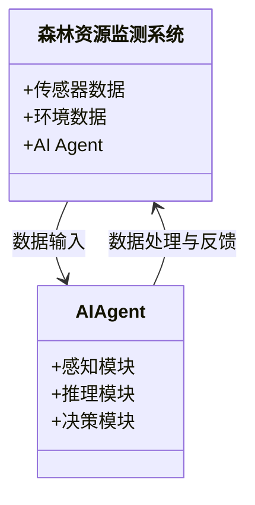

                 


# AI Agent在智能森林生态系统管理中的实践

## 关键词：
AI Agent, 智能森林, 生态系统管理, 算法原理, 项目实战

## 摘要：
本文探讨了AI Agent在智能森林生态系统管理中的应用，从背景、核心概念、算法原理到系统架构和项目实战，全面分析了AI Agent在森林资源监测、火灾预警和资源优化中的实践应用，提供详细的实现方案和案例分析。

---

## 第1章: AI Agent与森林生态系统管理概述

### 1.1 智能森林生态系统管理的背景
#### 1.1.1 森林生态系统管理的现状与挑战
- 森林生态系统是全球重要的生态系统，提供资源、环境和经济价值。
- 当前面临的问题：资源浪费、环境污染、森林火灾频发、生态破坏加剧。
- AI技术的应用潜力：通过智能监测、预测和决策，提升管理效率和精准度。

#### 1.1.2 AI Agent的核心概念与作用
- AI Agent的定义：智能体（Agent）是能够感知环境并采取行动以实现目标的实体。
- AI Agent的特点：
  - **自主性**：无需外部干预，自主决策。
  - **反应性**：实时感知环境变化并做出反应。
  - **社会性**：与其他Agent或人类进行协作与通信。
  - **学习性**：通过数据和经验不断优化自身行为。

#### 1.1.3 AI Agent与传统自动化系统的区别
| 特性          | 传统自动化系统          | AI Agent                |
|---------------|------------------------|--------------------------|
| 决策方式      | 基于预设规则            | 基于数据学习与推理        |
| 环境适应性    | 固定场景，适应性有限    | 能够动态适应复杂环境      |
| 学习能力      | 无学习能力              | 具备自适应学习能力        |
| 交互方式      | 单向操作                | 支持双向互动与协作        |

---

## 第2章: AI Agent的核心概念与原理

### 2.1 AI Agent的核心概念
#### 2.1.1 知识表示与推理
- **知识表示**：将问题空间中的知识以符号、语义网络或逻辑规则的形式表示。
- **知识推理**：通过逻辑推理引擎，从已有知识中推导出新结论。

#### 2.1.2 感知与决策
- **感知**：通过传感器、摄像头等设备获取环境数据。
- **决策**：基于感知数据和目标函数，选择最优行动方案。

#### 2.1.3 人机交互与协作
- **人机交互**：通过自然语言处理（NLP）实现与人类的对话交互。
- **协作**：与其他AI Agent或人类团队协作完成复杂任务。

---

## 第3章: AI Agent在森林生态系统管理中的应用

### 3.1 森林资源监测与保护
#### 3.1.1 系统功能需求分析
- 实时监测森林资源状态，包括树木生长、土壤湿度、空气质量等。
- 识别非法采伐和破坏行为。

#### 3.1.2 系统架构设计


### 3.2 基于AI Agent的森林火灾预警系统
#### 3.2.1 火灾预警的原理与算法
- **原理**：通过卫星遥感和地面传感器数据，分析异常温度和烟雾，预测火灾风险。
- **算法**：使用强化学习（Reinforcement Learning）优化火灾扑救路径。
- **实现步骤**：
  1. 数据采集：整合多源数据（温度、湿度、风速、卫星图像）。
  2. 数据预处理：清洗和特征提取。
  3. 模型训练：训练火灾风险预测模型。
  4. 决策优化：基于强化学习优化扑救路径。

#### 3.2.2 火灾扑救的决策过程
- **强化学习模型**：使用Q-learning算法优化决策路径。
  ```python
  import numpy as np
  class QLearningAgent:
      def __init__(self, state_space, action_space):
          self.Q = np.zeros((state_space, action_space))
  ```

---

## 第4章: AI Agent系统开发与实现

### 4.1 系统开发环境搭建
- **开发工具**：Python、TensorFlow、Keras、OpenCV。
- **数据集**：公开森林数据集（如NASA的火灾监测数据）。

### 4.2 AI Agent算法实现
#### 4.2.1 强化学习算法实现
- **Q-learning算法**：
  ```python
  def update_q(self, current_state, action, reward, next_state):
      self.Q[current_state, action] = self.Q[current_state, action] + 0.1 * (reward + np.max(self.Q[next_state, :]))
  ```

#### 4.2.2 监督学习算法实现
- **随机森林模型**用于火灾预测：
  ```python
  from sklearn.ensemble import RandomForestClassifier
  model = RandomForestClassifier(n_estimators=100)
  model.fit(X_train, y_train)
  ```

---

## 第5章: 项目实战与案例分析

### 5.1 环境安装与数据准备
- **环境搭建**：安装Python、TensorFlow、Pandas。
- **数据准备**：下载并处理森林火灾数据集。

### 5.2 系统功能实现
#### 5.2.1 资源监测模块
- 使用OpenCV进行图像处理，实时监测森林资源状态。
- 代码示例：
  ```python
  import cv2
  def detect_fire(image):
      gray = cv2.cvtColor(image, cv2.COLOR_BGR2GRAY)
      ret, binary = cv2.threshold(gray, 250, 255, cv2.THRESH_BINARY)
      fire_area = cv2.countNonZero(binary)
      return fire_area
  ```

#### 5.2.2 火灾预警模块
- 使用训练好的随机森林模型进行火灾预测。
- 代码示例：
  ```python
  import joblib
  model = joblib.load('fire_model.pkl')
  prediction = model.predict(X_test)
  ```

---

## 第6章: 总结与展望

### 6.1 本章小结
- AI Agent在森林生态系统管理中的应用显著提升了管理效率和决策精度。
- 关键技术包括知识表示、强化学习和分布式系统架构。

### 6.2 展望
- 结合边缘计算和物联网技术，进一步提升AI Agent的实时性和响应速度。
- 探索多Agent协作机制，优化复杂场景下的任务分配。

---

## 参考文献
- [1] Russell, S., & Norvig, P. (2010). Artificial Intelligence: A Modern Approach.
- [2] LeCun, Y., Bengio, Y., & Hinton, G. (2015). Deep learning.
- [3] Sutton, R. S., & Barto, A. G. (2018). Reinforcement learning: Theory and algorithms.

---

以上是《AI Agent在智能森林生态系统管理中的实践》的技术博客文章的大纲和详细内容。文章从背景、原理、系统架构到项目实战，全面阐述了AI Agent在森林管理中的应用，结合理论与实践，提供丰富的技术细节和代码示例，帮助读者深入了解和实际应用。

