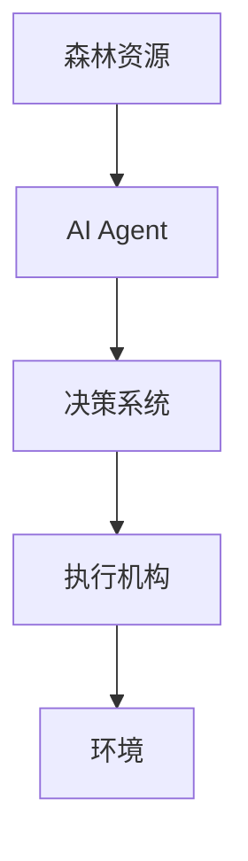
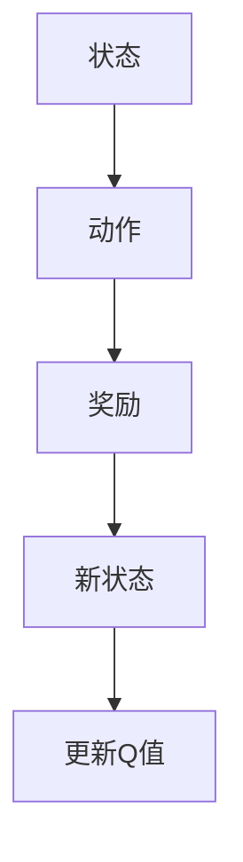
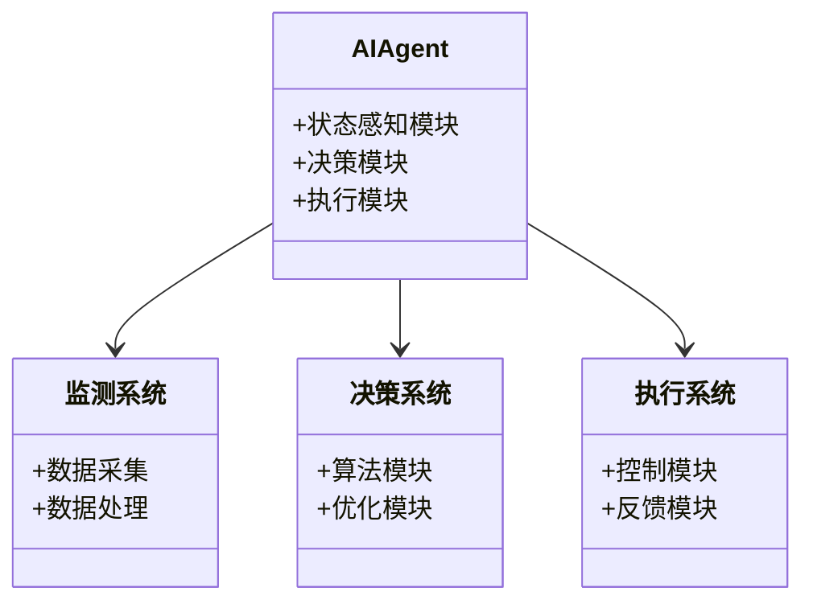

                 


# AI Agent在智能森林资源管理中的实践

> 关键词：AI Agent，森林资源管理，强化学习，系统架构，项目实战

> 摘要：本文探讨了AI Agent在森林资源管理中的应用，从概念、算法、系统架构到实际项目，全面分析AI Agent如何优化森林资源管理。通过强化学习实现资源监测和优化，结合系统设计和实战案例，展示AI Agent的实际价值。

---

# 第1章: AI Agent与森林资源管理概述

## 1.1 AI Agent的基本概念
AI Agent是一种智能体，能够感知环境并采取行动以实现目标。在森林资源管理中，AI Agent可以执行监测、优化和控制任务。

## 1.2 森林资源管理的现状与挑战
传统管理依赖人工，效率低、覆盖面小，难以应对复杂环境和实时监测需求。

## 1.3 AI Agent在森林资源管理中的应用前景
AI Agent能提高管理效率，优化资源配置，实时监测环境变化，预防灾害。

## 1.4 本章小结
介绍了AI Agent的基本概念和森林资源管理的现状，强调了AI Agent的应用价值。

---

# 第2章: AI Agent的核心概念与联系

## 2.1 AI Agent的工作原理
### 2.1.1 感知模块
收集环境数据，如卫星图像和传感器数据。

### 2.1.2 决策模块
基于数据，制定优化策略。

### 2.1.3 执行模块
执行决策，如调整灌溉或监测设备。

## 2.2 核心概念对比分析
### 表2-1 传统管理与AI Agent对比

| 特性       | 传统管理       | AI Agent       |
|------------|----------------|----------------|
| 效率       | 低             | 高             |
| 实时性      | 差             | 好             |
| 覆盖范围    | 有限           | 广泛           |

## 2.3 实体关系架构图
### 图2-1 森林资源管理实体关系图


---

# 第3章: AI Agent算法原理与数学模型

## 3.1 算法原理概述
选择强化学习中的Q-learning算法。

## 3.2 算法流程图


## 3.3 数学模型与公式
Q-learning公式：
$$ Q(s,a) = Q(s,a) + \alpha [r + \gamma \max Q(s',a') - Q(s,a)] $$

## 3.4 举例说明
以森林火灾监测为例，AI Agent通过学习最优路径进行监测。

---

# 第4章: 系统分析与架构设计

## 4.1 系统功能设计
设计监测、优化和执行模块。

## 4.2 系统架构设计


---

# 第5章: 项目实战

## 5.1 环境安装
安装Python和相关库，如TensorFlow和OpenCV。

## 5.2 核心代码实现
实现Q-learning算法的Python代码：

```python
import numpy as np

class AI-Agent:
    def __init__(self, state_space, action_space):
        self.q_table = np.zeros((state_space, action_space))
        self.alpha = 0.1
        self.gamma = 0.9

    def choose_action(self, state):
        return np.argmax(self.q_table[state])

    def learn(self, state, action, reward, next_state):
        self.q_table[state, action] += self.alpha * (reward + self.gamma * np.max(self.q_table[next_state]) - self.q_table[state, action])

# 初始化环境和AI Agent
env = ForestManagementEnvironment()
agent = AI-Agent(env.state_space, env.action_space)

# 训练过程
for episode in range(1000):
    state = env.reset()
    while not done:
        action = agent.choose_action(state)
        next_state, reward, done = env.step(action)
        agent.learn(state, action, reward, next_state)
```

## 5.3 实际案例分析
以火灾监测为例，展示AI Agent如何优化监测路径。

---

# 第6章: 最佳实践与总结

## 6.1 小结
AI Agent显著提升了森林资源管理的效率和决策能力。

## 6.2 注意事项
数据质量、算法选择和系统集成是成功的关键。

## 6.3 拓展阅读
建议阅读强化学习和系统架构设计的相关文献。

---

通过以上步骤，文章详细讲解了AI Agent在森林资源管理中的应用，从概念到实践，帮助读者全面理解其价值和实现过程。

