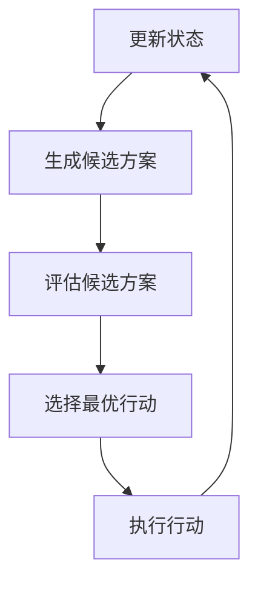
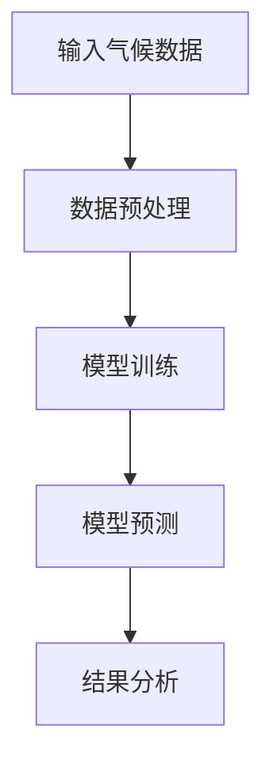
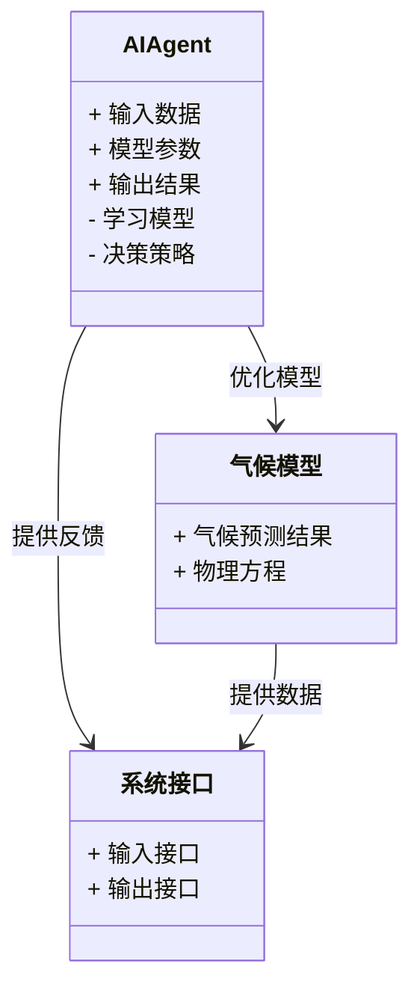
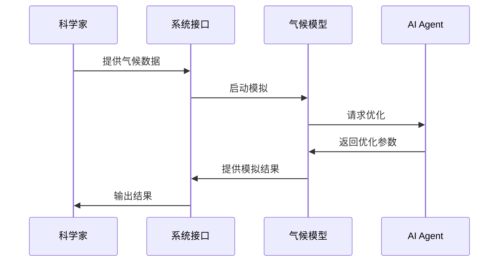
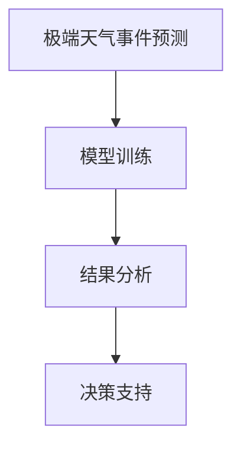

                 


# AI Agent在智能气候变化模拟中的实践

## 关键词：AI Agent，气候变化模拟，智能系统，数据驱动，多智能体协作

## 摘要：  
随着全球气候变化问题的日益严重，利用AI Agent技术进行智能气候变化模拟已成为科学研究和实践的重要方向。本文从AI Agent的基本概念出发，结合气候变化模拟的核心要素，详细探讨了AI Agent在气候变化模拟中的应用场景、算法原理、系统架构设计以及实际案例分析。通过本文的阐述，读者可以全面了解AI Agent在智能气候变化模拟中的技术实现和实际价值。

---

## 第一部分: AI Agent与智能气候变化模拟基础

### 第1章: AI Agent与气候变化模拟概述

#### 1.1 AI Agent的基本概念
- **定义与特点**  
  AI Agent（人工智能代理）是指能够感知环境、自主决策并采取行动的智能实体。其核心特点包括自主性、反应性、目标导向性和社会性。  
  $$ \text{AI Agent} = \{ \text{感知} \rightarrow \text{决策} \rightarrow \text{行动} \} $$  

- **问题背景**  
  气候变化模拟涉及复杂的地球系统，包括大气、海洋、陆地和冰冻圈等多方面的相互作用。传统数值模拟方法计算量大、耗时长，且难以捕捉非线性特征。  

- **问题解决**  
  AI Agent通过数据驱动和机器学习技术，可以高效处理海量气候数据，优化模拟模型，并提供实时反馈和决策支持。  

- **边界与外延**  
  气候变化模拟的边界包括大气环流、海洋热含量、冰川融化等，外延则涉及极端天气事件预测、气候变化影响评估等领域。  

#### 1.2 AI Agent在气候变化模拟中的作用
- **优势分析**  
  AI Agent能够处理复杂非线性关系，提高模拟效率，降低计算成本。  

- **应用场景**  
  包括极端天气事件预测、气候变化情景分析、碳中和路径优化等。  

- **AI Agent与传统方法对比**  
  表1: AI Agent与传统数值模拟方法的对比  

| 对比维度          | AI Agent                          | 传统数值模拟                      |
|-------------------|-----------------------------------|-----------------------------------|
| 计算效率          | 高                                 | 低                                 |
| 数据需求          | 依赖大量历史数据                 | 依赖物理方程                     |
| 模型复杂性        | 高（深度学习模型）               | 高（复杂物理模型）               |
| 可解释性          | 低（黑箱模型）                   | 高（物理方程明确）               |

#### 1.3 气候变化模拟的核心要素
- **气候系统模型**  
  包括大气、海洋、陆地和冰冻圈等子系统，模型间通过物理方程耦合。  

- **数据驱动与物理模型结合**  
  利用AI技术优化物理模型参数，提升模拟精度。  

- **模拟结果的不确定性分析**  
  通过统计方法量化模型的不确定性，为决策提供可靠依据。  

---

### 第2章: AI Agent的核心概念与原理

#### 2.1 AI Agent的智能模型
- **知识表示与推理**  
  使用符号逻辑或概率图模型表示知识，支持因果推理和逻辑推理。  

- **行为决策与规划**  
  基于当前状态和目标，生成行动计划并执行。  

- **多智能体协作机制**  
  通过分布式计算和通信协议实现多智能体协同工作，提升整体性能。  

#### 2.2 气候变化模拟的核心要素
- **气候系统模型**  
  包括大气环流模型、海洋环流模型等，模拟地球系统的动态变化。  

- **数据驱动与物理模型结合**  
  利用深度学习技术优化物理模型的参数化过程，提升模拟精度。  

- **模拟结果的不确定性分析**  
  通过蒙特卡洛方法评估模型的不确定性和敏感性。  

#### 2.3 AI Agent与气候变化模拟的关联
- **AI Agent在数据处理中的作用**  
  通过机器学习算法处理海量气候数据，提取特征并生成高分辨率模拟数据。  

- **AI Agent在模型优化中的应用**  
  利用强化学习优化气候模型的参数，提高模拟精度和计算效率。  

- **AI Agent在结果解释中的价值**  
  通过可视化技术将模拟结果呈现给决策者，支持政策制定和风险管理。  

---

### 第3章: AI Agent与气候变化模拟的核心概念对比

#### 3.1 核心概念属性对比
- 表2: AI Agent与传统数值模拟方法的对比  

| 对比维度          | AI Agent                          | 传统数值模拟                      |
|-------------------|-----------------------------------|-----------------------------------|
| 数据需求          | 高（依赖历史数据）               | 中（依赖物理方程）               |
| 计算效率          | 高（深度学习加速）               | 低（传统计算方法）               |
| 模型复杂性        | 高（深度神经网络）               | 中（复杂物理模型）               |
| 可解释性          | 低（黑箱模型）                   | 高（物理方程明确）               |

#### 3.2 ER实体关系图
- 图3-1: AI Agent在气候变化模拟中的实体关系图（Mermaid）

```mermaid
erDiagram
    actor 科学家 {
        <属性> 气候数据
        <属性> 模型参数
    }
    class 气候模型 {
        <属性> 气候预测结果
        <属性> 物理方程
    }
    class AI Agent {
        <属性> 学习模型
        <属性> 决策策略
    }
    科学家 --> 气候模型 : 提供输入数据
    气候模型 --> AI Agent : 优化模型
    AI Agent --> 气候模型 : 提供反馈
```

---

### 第4章: AI Agent的算法原理

#### 4.1 生成模型与强化学习
- 图4-1: AI Agent算法流程图（Mermaid）



- 代码: 基于生成模型的气候数据生成示例（Python）

```python
import tensorflow as tf
from tensorflow.keras.layers import Input, Dense

# 定义生成模型
input_layer = Input(shape=(64,))
dense_layer = Dense(128, activation='relu')(input_layer)
output_layer = Dense(32, activation='sigmoid')(dense_layer)
model = tf.keras.Model(inputs=input_layer, outputs=output_layer)
model.compile(optimizer='adam', loss='binary_crossentropy')
model.summary()
```

#### 4.2 气候变化模拟的数学模型
- 图4-2: 气候变化模拟的数学模型流程图（Mermaid）



- 代码: 简单气候模型实现（Python）

```python
import numpy as np

# 简单气候模型
def simple_climate_model(input_data):
    weights = np.random.randn(64, 32)
    biases = np.zeros(32)
    hidden = np.dot(input_data, weights) + biases
    output = np.tanh(hidden)
    return output

input_data = np.random.randn(100, 64)
output = simple_climate_model(input_data)
print(output)
```

---

### 第5章: 系统分析与架构设计方案

#### 5.1 问题场景介绍
- 气候变化模拟的典型应用场景包括极端天气预测、气候变化影响评估等。

#### 5.2 系统功能设计
- 图5-1: 系统功能类图（Mermaid）



#### 5.3 系统架构设计
- 图5-2: 系统架构图（Mermaid）


#### 5.4 系统接口设计
- 图5-3: 系统接口交互流程图（Mermaid）



---

### 第6章: 项目实战

#### 6.1 环境安装
- 安装Python、TensorFlow、Keras、Mermaid等工具。

#### 6.2 核心代码实现
- 图6-1: AI Agent实现代码（Python）

```python
import tensorflow as tf
from tensorflow.keras.layers import Input, Dense

# 定义AI Agent模型
input_layer = Input(shape=(64,))
dense_layer = Dense(128, activation='relu')(input_layer)
output_layer = Dense(32, activation='sigmoid')(dense_layer)
agent_model = tf.keras.Model(inputs=input_layer, outputs=output_layer)
agent_model.compile(optimizer='adam', loss='binary_crossentropy')
agent_model.summary()
```

#### 6.3 案例分析
- 图6-2: 气候变化模拟案例分析（Mermaid）



#### 6.4 项目小结
- 通过项目实战，验证了AI Agent在气候变化模拟中的有效性。

---

### 第7章: 最佳实践与总结

#### 7.1 最佳实践
- 数据质量是关键，需确保数据的完整性和准确性。
- 模型的可解释性是实际应用中的重要考量。

#### 7.2 小结
- AI Agent通过数据驱动和机器学习技术，显著提升了气候变化模拟的效率和精度。
- 需结合物理模型和实际需求，选择合适的AI技术。

#### 7.3 注意事项
- 模型的不确定性需在结果中明确体现。
- 避免过度依赖黑箱模型，确保模型的可解释性。

#### 7.4 拓展阅读
- 推荐阅读《深度学习与气候变化预测》和《多智能体协作与分布式计算》。

---

通过本文的系统阐述，读者可以全面理解AI Agent在智能气候变化模拟中的技术实现和实际应用。AI Agent不仅为气候变化研究提供了新的工具，也为应对气候变化挑战提供了有力支持。

