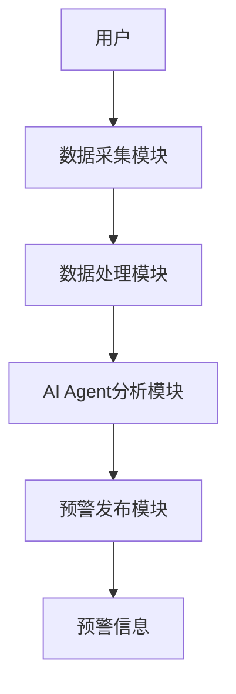

                 


# AI Agent在智能气象灾害预警系统中的实践

> 关键词：AI Agent，智能气象灾害预警系统，机器学习，深度学习，气象数据

> 摘要：本文探讨了AI Agent在智能气象灾害预警系统中的应用，分析了气象灾害的基本类型与特征，介绍了AI Agent的核心原理与技术特点，并详细讲解了AI Agent在气象灾害预警中的算法原理。文章还设计了一个基于AI Agent的智能气象灾害预警系统架构，并通过实际案例展示了系统的实现与应用。最后，本文总结了项目的成果与经验，并展望了未来的发展方向。

---

## 第1章: AI Agent与智能气象灾害预警系统背景

### 1.1 智能气象灾害预警系统的基本概念

#### 1.1.1 气象灾害的基本类型与特征

气象灾害是指由气象条件异常变化所导致的灾害性天气事件，常见的气象灾害包括台风、暴雨、干旱、洪涝、高温、寒潮、龙卷风、雷暴等。这些灾害具有突发性、区域性、破坏性强等特点，往往对人民生命财产安全造成严重威胁。

#### 1.1.2 智能气象灾害预警系统的定义

智能气象灾害预警系统是一种基于人工智能技术的气象灾害监测、预测和预警系统。该系统通过整合气象数据、实时监测气象变化、运用AI算法进行预测，并通过多种渠道向相关部门和公众发布预警信息。

#### 1.1.3 AI Agent在气象灾害预警中的作用

AI Agent（智能代理）是一种能够感知环境、自主决策并执行任务的智能体。在气象灾害预警系统中，AI Agent主要用于实时监测气象数据、分析预测灾害风险、动态调整预警策略，并与用户、气象监测设备和灾害预警中心进行高效交互。

---

### 1.2 AI Agent的基本概念与技术特点

#### 1.2.1 AI Agent的定义与核心功能

AI Agent是一种具有自主性、反应性、目标导向和智能性的软件实体。其核心功能包括：

1. **感知环境**：通过传感器、数据库等获取实时数据。
2. **决策与推理**：基于数据进行分析、预测和决策。
3. **自主执行**：根据决策结果执行任务或触发预警。

#### 1.2.2 AI Agent与传统气象预警系统的区别

传统气象预警系统依赖人工操作和固定的预测模型，存在响应速度慢、预测准确性不足等问题。而AI Agent能够实时感知数据变化，动态调整预测模型，并通过自主决策提高预警效率和准确性。

#### 1.2.3 AI Agent在气象灾害预警中的优势

1. **高效性**：AI Agent能够快速处理海量气象数据。
2. **准确性**：基于机器学习和深度学习的预测模型能够显著提高灾害预测的准确性。
3. **自适应性**：AI Agent能够根据数据变化动态调整预测策略。

---

### 1.3 智能气象灾害预警系统的应用场景

#### 1.3.1 气象灾害预警的典型场景

- **台风预警**：AI Agent通过分析台风路径、强度和登陆时间，提前发出预警。
- **暴雨预警**：AI Agent结合气象数据和历史数据，预测暴雨发生的时间和区域。

#### 1.3.2 AI Agent在不同场景中的应用

- **台风预警**：AI Agent实时监测台风路径和强度变化，预测台风可能带来的灾害。
- **暴雨预警**：AI Agent通过分析降雨量、湿度等数据，预测暴雨发生的位置和时间。

#### 1.3.3 智能气象灾害预警系统的社会价值

- 保护人民生命财产安全。
- 减少气象灾害带来的经济损失。
- 提高社会防灾减灾能力。

---

## 第2章: AI Agent与气象灾害预警的核心概念

### 2.1 AI Agent的核心原理

#### 2.1.1 AI Agent的感知与决策机制

AI Agent通过传感器、数据库等获取气象数据，利用机器学习和深度学习算法进行分析和预测。感知层负责数据采集，决策层负责模型训练和预测。

#### 2.1.2 AI Agent的自主性与智能性

AI Agent的自主性体现在无需人工干预即可完成任务，而其智能性则体现在能够根据数据变化动态调整预测模型。

#### 2.1.3 AI Agent与气象数据的交互方式

AI Agent通过接口与气象监测设备进行数据交互，分析处理后向灾害预警中心输出结果。

---

### 2.2 智能气象灾害预警系统的构成要素

#### 2.2.1 数据采集与处理模块

- 数据采集：通过气象传感器获取实时气象数据。
- 数据预处理：对数据进行清洗、归一化等处理。

#### 2.2.2 AI Agent的分析与决策模块

- 模型训练：基于机器学习和深度学习算法进行预测。
- 预警规则：根据预测结果制定预警策略。

#### 2.2.3 系统输出与反馈模块

- 预警信息：通过多种渠道向用户发布预警信息。
- 系统反馈：根据用户反馈优化预测模型。

---

### 2.3 AI Agent与气象灾害预警系统的实体关系

```mermaid
er
    actor 用户
    actor 气象监测设备
    actor 灾害预警中心
    actor AI Agent
    user -> 气象监测设备: 获取实时数据
    气象监测设备 -> AI Agent: 数据处理与分析
    AI Agent -> 灾害预警中心: 输出预警结果
    灾害预警中心 -> 用户: 发布预警信息
```

---

## 第3章: AI Agent在气象灾害预警中的算法原理

### 3.1 常见AI算法在气象灾害预警中的应用

#### 3.1.1 机器学习算法（如决策树、随机森林）

- **决策树**：通过特征选择构建决策树模型，用于分类和回归。
- **随机森林**：通过集成学习提高模型的准确性和鲁棒性。

#### 3.1.2 深度学习

- **卷积神经网络（CNN）**：用于图像处理和时空序列分析。
- **循环神经网络（RNN）**：用于时间序列预测和自然语言处理。

#### 3.1.3 时间序列分析

- **LSTM（长短期记忆网络）**：适用于时间序列数据的预测和建模。

---

### 3.2 算法实现步骤

#### 3.2.1 数据预处理

- 数据清洗：去除噪声数据和异常值。
- 特征提取：提取有助于预测的关键特征。

#### 3.2.2 模型训练

- 数据划分：将数据集划分为训练集、验证集和测试集。
- 模型调优：通过交叉验证优化模型参数。

#### 3.2.3 模型评估

- 评估指标：准确率、召回率、F1值。
- 模型优化：通过网格搜索选择最优模型。

---

### 3.3 数学公式

#### 3.3.1 机器学习模型的损失函数

$$ L = \frac{1}{n}\sum_{i=1}^{n} (y_i - \hat{y_i})^2 $$

其中，$L$为损失函数，$y_i$为真实值，$\hat{y_i}$为预测值。

#### 3.3.2 深度学习模型的激活函数

$$ \text{ReLU}(x) = \begin{cases} 0 & \text{if } x < 0 \\ x & \text{if } x \geq 0 \end{cases} $$

---

## 第4章: 智能气象灾害预警系统的架构设计

### 4.1 系统架构概述

#### 4.1.1 系统功能模块划分

- 数据采集模块：负责数据的采集和预处理。
- 数据分析模块：基于AI Agent进行数据分析和预测。
- 预警发布模块：根据预测结果发布预警信息。

#### 4.1.2 系统架构图



---

### 4.2 系统功能设计

#### 4.2.1 数据采集模块

- 数据采集：通过传感器获取实时气象数据。
- 数据存储：将采集到的数据存储到数据库中。

#### 4.2.2 数据分析模块

- 数据分析：利用机器学习和深度学习算法进行预测。
- 预警规则：根据预测结果制定预警策略。

#### 4.2.3 预警发布模块

- 预警信息生成：根据预测结果生成预警信息。
- 多渠道发布：通过短信、邮件、APP等多种渠道向用户发布预警信息。

---

### 4.3 系统接口设计

#### 4.3.1 数据接口

- 数据采集接口：用于与气象监测设备进行数据交互。
- 数据分析接口：用于与AI Agent进行数据交互。

#### 4.3.2 用户接口

- 用户端接口：用于用户查询和接收预警信息。
- 管理端接口：用于系统管理员进行系统管理和配置。

---

### 4.4 系统交互设计

#### 4.4.1 用户与系统的交互流程

1. 用户提交请求：用户通过APP或网页提交气象预警请求。
2. 系统处理请求：系统接收请求并启动数据采集和分析。
3. 系统返回结果：系统根据预测结果生成预警信息并发送给用户。

#### 4.4.2 系统内部的交互流程

1. 数据采集模块采集数据并发送给数据处理模块。
2. 数据处理模块对数据进行预处理并发送给AI Agent分析模块。
3. AI Agent分析模块进行数据预测并生成预警结果。
4. 预警发布模块接收预警结果并发送给用户。

---

## 第5章: AI Agent在智能气象灾害预警系统中的应用实践

### 5.1 项目背景与目标

#### 5.1.1 项目背景

随着全球气候变化的加剧，气象灾害频发，给人民生命财产安全带来严重威胁。传统的气象预警系统存在响应速度慢、预测准确性不足等问题，亟需引入AI技术进行优化。

#### 5.1.2 项目目标

通过引入AI Agent技术，构建一个高效、准确的智能气象灾害预警系统，能够实时监测气象数据、动态调整预测模型，并通过多种渠道向用户发布预警信息。

---

### 5.2 项目实施步骤

#### 5.2.1 环境搭建

- 安装必要的开发工具：Python、TensorFlow、Keras等。
- 配置气象监测设备：安装传感器、数据采集卡等。

#### 5.2.2 数据采集与预处理

- 数据采集：通过传感器采集实时气象数据。
- 数据预处理：对数据进行清洗、归一化等处理。

#### 5.2.3 模型训练与优化

- 选择合适的算法：根据数据特点选择机器学习或深度学习算法。
- 模型训练：利用训练数据训练模型，优化模型参数。

#### 5.2.4 系统集成与测试

- 系统集成：将数据采集、数据分析、预警发布等模块集成到一起。
- 系统测试：进行功能测试、性能测试和用户体验测试。

---

### 5.3 项目成果展示

#### 5.3.1 系统功能展示

- 数据采集与处理：展示数据采集和预处理的流程。
- AI Agent分析：展示AI Agent如何进行数据分析和预测。
- 预警信息发布：展示预警信息的生成和发布过程。

#### 5.3.2 项目案例分析

- 典型案例：展示一个实际气象灾害预警案例，分析系统在其中的应用。
- 成功经验：总结项目实施中的成功经验和教训。

---

## 第6章: 总结与展望

### 6.1 项目总结

#### 6.1.1 核心成果

- 成功构建了一个基于AI Agent的智能气象灾害预警系统。
- 系统能够高效、准确地进行气象灾害预测和预警。

#### 6.1.2 经验与教训

- 经验：数据预处理和模型优化是系统成功的关键。
- 教训：模型的选择和调优需要充分考虑数据特点和实际需求。

---

### 6.2 未来展望

#### 6.2.1 技术发展

- AI技术的进一步发展将推动气象灾害预警系统更加智能化和精准化。
- 新型算法的应用将进一步提高系统的预测能力。

#### 6.2.2 应用拓展

- 气象灾害预警系统的进一步优化：引入更多数据源和预测模型。
- AI Agent在其他领域的潜在应用：如环境监测、公共安全等领域。

---

## 第7章: 最佳实践与Tips

### 7.1 最佳实践

#### 7.1.1 数据处理

- 数据清洗是系统成功的关键，需要仔细处理异常值和噪声数据。
- 数据特征的选择与优化能够显著提高模型的预测能力。

#### 7.1.2 模型选择

- 根据数据特点选择合适的算法，如时间序列数据适合LSTM。
- 模型优化需要结合实际需求进行参数调整和模型调优。

---

### 7.2 Tips

#### 7.2.1 项目管理

- 项目进度需要严格把控，确保各模块按时完成。
- 团队协作是项目成功的关键，需要明确分工和有效沟通。

#### 7.2.2 技术学习

- 持续学习是技术发展的关键，需要不断更新知识和技能。
- 技术创新是系统优化的重要途径，需要积极探索新技术和新方法。

---

## 参考文献

1. 《人工智能基础》
2. 《机器学习实战》
3. 《深度学习入门》
4. 《气象灾害预警系统设计》
5. 《AI Agent与智能系统》

---

以上是《AI Agent在智能气象灾害预警系统中的实践》的详细目录大纲和部分正文内容。后续可以根据实际需求进一步完善各章节内容，补充具体案例和详细技术实现。

