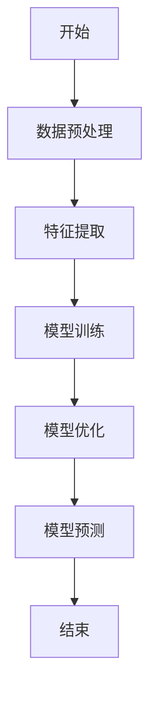
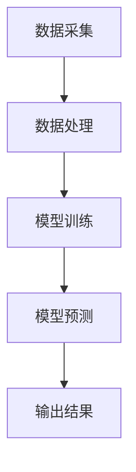
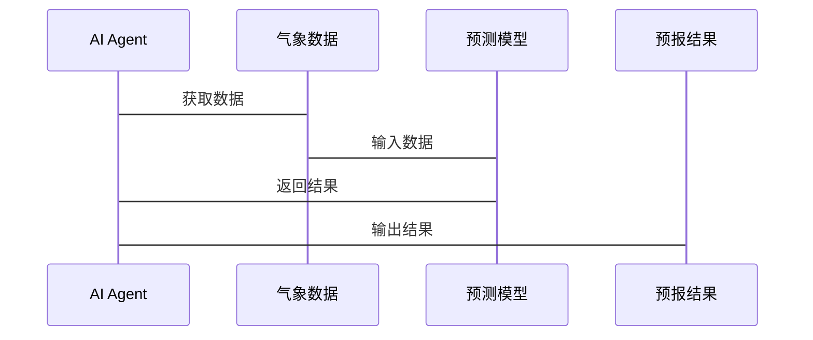

                 


# AI Agent在智能气象预报中的实践

> 关键词：AI Agent, 智能气象预报, 机器学习, 气象数据, 系统设计

> 摘要：本文探讨了AI Agent在智能气象预报中的实践应用，详细分析了AI Agent的核心概念、算法原理、系统设计、项目实现等，结合实际案例，展示了AI Agent如何提升气象预报的精度和效率。

---

## 第一部分: AI Agent 在智能气象预报中的背景与基础

### 第1章: AI Agent 与智能气象预报概述

#### 1.1 AI Agent 的基本概念
##### 1.1.1 AI Agent 的定义与特点
AI Agent（人工智能代理）是指能够感知环境、自主决策并执行任务的智能实体。其特点包括：
- **自主性**：能够在没有外部干预的情况下执行任务。
- **反应性**：能够实时感知环境并做出响应。
- **学习能力**：通过数据和经验不断优化自身的决策能力。
- **协作性**：能够与其他AI Agent或系统协同工作。

##### 1.1.2 AI Agent 的类型与应用场景
AI Agent可以分为以下几种类型：
- **反应式AI Agent**：基于当前感知做出实时决策，适用于需要快速响应的任务，如气象预报。
- **认知式AI Agent**：具备复杂的推理和规划能力，适用于复杂决策任务。
- **协作式AI Agent**：能够与其他AI Agent或人类协同完成任务。

AI Agent在气象预报中的应用场景包括：
- **实时数据分析**：处理海量气象数据，快速生成预报结果。
- **异常检测**：识别气象数据中的异常模式，提前预警极端天气事件。
- **动态调整**：根据实时数据动态调整预报模型，提高准确性。

##### 1.1.3 AI Agent 与传统气象预报的区别
传统气象预报主要依赖于数值模拟和统计模型，存在以下局限性：
- **计算成本高**：需要大量的计算资源。
- **实时性差**：无法实时更新预报结果。
- **模型固定**：难以快速适应新的气象数据模式。

AI Agent通过引入机器学习和实时数据分析，能够显著提升气象预报的效率和准确性。例如，AI Agent可以通过实时分析卫星数据和地面观测数据，快速生成高精度的天气预报。

#### 1.2 智能气象预报的背景与挑战
##### 1.2.1 气象预报的传统方法与局限性
传统气象预报主要依赖于数值天气预报（NWP）模型，这些模型通过求解大气运动的方程组来预测天气。然而，NWP模型存在以下问题：
- **计算成本高**：需要大量的计算资源和时间。
- **空间分辨率有限**：难以捕捉小尺度的气象现象。
- **初始化误差敏感**：对初始条件的微小误差可能导致预测结果的显著偏差。

##### 1.2.2 智能气象预报的核心问题
智能气象预报的核心问题包括：
- **数据处理**：如何高效处理海量的气象数据。
- **模型选择**：如何选择合适的机器学习模型进行预测。
- **实时性要求**：如何在短时间内生成准确的预报结果。

##### 1.2.3 AI Agent 在气象预报中的优势
AI Agent在气象预报中的优势体现在以下几个方面：
- **实时性**：AI Agent可以实时处理最新的气象数据，快速生成预报结果。
- **高精度**：通过机器学习模型，AI Agent能够捕捉复杂的气象模式，提高预报准确性。
- **适应性**：AI Agent可以根据实时数据动态调整模型参数，适应不同的气象条件。

#### 1.3 本章小结
本章介绍了AI Agent的基本概念和类型，分析了传统气象预报的局限性，阐述了AI Agent在气象预报中的优势。通过对比分析，读者可以理解AI Agent在智能气象预报中的重要性。

---

## 第二部分: AI Agent 的核心概念与原理

### 第2章: AI Agent 的核心概念与联系

#### 2.1 AI Agent 的核心原理
##### 2.1.1 AI Agent 的感知与决策机制
AI Agent的感知机制包括以下步骤：
1. **数据采集**：通过传感器、卫星等设备获取气象数据。
2. **数据预处理**：对采集到的数据进行清洗和标准化处理。
3. **特征提取**：从数据中提取有助于预报的关键特征。

AI Agent的决策机制包括以下步骤：
1. **模型选择**：选择合适的机器学习模型进行预测。
2. **模型训练**：利用历史数据训练模型，优化模型参数。
3. **预测生成**：根据实时数据生成气象预报结果。

##### 2.1.2 AI Agent 的学习与优化算法
AI Agent的学习与优化算法包括：
- **监督学习**：利用标注的数据训练模型，如随机森林、支持向量机等。
- **无监督学习**：通过聚类分析等方法发现数据中的潜在模式。
- **强化学习**：通过与环境的交互不断优化决策策略。

##### 2.1.3 AI Agent 的推理与规划模型
AI Agent的推理与规划模型包括：
- **知识图谱**：构建气象领域的知识图谱，帮助AI Agent理解气象数据。
- **规则引擎**：通过预定义的规则进行推理和决策。
- **逻辑推理**：利用逻辑推理方法进行复杂决策。

#### 2.2 AI Agent 的核心概念对比
##### 2.2.1 不同 AI Agent 类型的对比分析
| 类型          | 特点                          | 应用场景                   |
|---------------|-------------------------------|---------------------------|
| 反应式AI Agent | 基于当前感知做出实时决策      | 实时气象数据处理           |
| 认知式AI Agent | 具备复杂的推理和规划能力      | 复杂气象预报任务           |
| 协作式AI Agent | 能够与其他系统协同工作        | 多机构协同气象预报           |

##### 2.2.2 AI Agent 与传统算法的对比
| 对比项         | AI Agent                          | 传统算法                     |
|----------------|-----------------------------------|------------------------------|
| 灵活性         | 高，能够动态调整模型参数          | 低，模型固定                 |
| 处理速度       | 快，实时处理数据                   | 较慢，需要大量计算资源        |
| 应用场景       | 适用于复杂、动态的气象预报任务    | 适用于简单的预测任务           |

##### 2.2.3 AI Agent 与机器学习模型的对比
| 对比项         | AI Agent                          | 机器学习模型                 |
|----------------|-----------------------------------|------------------------------|
| 自主性         | 高，能够自主决策                   | 较低，依赖于人工干预           |
| 适应性         | 强，能够动态适应新数据             | 较弱，需要重新训练             |
| 可解释性       | 较低，决策过程复杂                 | 较高，模型通常可解释           |

#### 2.3 AI Agent 的 ER 实体关系图
以下是AI Agent在气象预报中的实体关系图：

```mermaid
er
actor: AI Agent
goal: 气象预报
weather_data: 气象数据
model: 预测模型
result: 预报结果
constraints: 约束条件

actor --> weather_data: 获取
weather_data --> model: 输入
model --> result: 输出
result --> actor: 反馈
```

#### 2.4 本章小结
本章详细讲解了AI Agent的核心原理，对比了不同类型的AI Agent以及与传统算法和机器学习模型的区别，最后通过ER图展示了AI Agent在气象预报中的实体关系。

---

## 第三部分: AI Agent 的算法原理与数学模型

### 第3章: AI Agent 的算法原理

#### 3.1 AI Agent 的算法原理概述
##### 3.1.1 AI Agent 的基本算法
AI Agent常用的算法包括：
- **决策树**：通过构建决策树模型进行分类和回归预测。
- **随机森林**：通过集成多个决策树模型提高预测准确性。
- **神经网络**：通过深度学习模型捕捉复杂的气象模式。

##### 3.1.2 AI Agent 的优化算法
AI Agent常用的优化算法包括：
- **梯度下降**：通过最小化损失函数优化模型参数。
- **Adam优化器**：结合动量和自适应学习率优化模型参数。

##### 3.1.3 AI Agent 的集成算法
AI Agent常用的集成算法包括：
- **投票集成**：通过多数投票法进行预测。
- **堆叠集成**：通过元模型整合多个基模型的预测结果。

#### 3.2 AI Agent 的数学模型与公式
##### 3.2.1 基本数学模型
随机森林的数学模型可以表示为：
$$
y = \sum_{i=1}^{n} \text{Tree}_i(x) \times w_i
$$
其中，$y$ 是预测结果，$\text{Tree}_i(x)$ 是第 $i$ 个决策树的预测结果，$w_i$ 是第 $i$ 个决策树的权重。

##### 3.2.2 优化算法的数学公式
Adam优化器的更新公式为：
$$
\theta_{t+1} = \theta_t - \alpha \frac{\beta_1}{1 - \beta_1^t} g_t + \frac{\beta_2}{1 - \beta_2^t} \text{AdaGrad}(g_t)
$$
其中，$\theta_t$ 是参数，$\alpha$ 是学习率，$\beta_1$ 和 $\beta_2$ 是动量参数，$g_t$ 是梯度。

##### 3.2.3 集成算法的数学公式
堆叠集成的预测公式为：
$$
y = \sum_{i=1}^{n} \text{BaseModel}_i(x) \times w_i
$$
其中，$\text{BaseModel}_i(x)$ 是第 $i$ 个基模型的预测结果，$w_i$ 是第 $i$ 个基模型的权重。

#### 3.3 AI Agent 的算法实现
##### 3.3.1 算法实现的步骤
1. **数据预处理**：清洗和标准化气象数据。
2. **特征提取**：提取有助于预测的关键特征。
3. **模型训练**：利用训练数据训练机器学习模型。
4. **模型优化**：通过交叉验证优化模型参数。
5. **模型预测**：利用测试数据生成气象预报结果。

##### 3.3.2 算法实现的代码示例
以下是一个简单的随机森林预测气温的代码示例：

```python
from sklearn.ensemble import RandomForestRegressor
import numpy as np

# 生成训练数据
X_train = np.random.rand(100, 5)  # 5个特征，100个样本
y_train = np.random.rand(100)     # 预测目标

# 训练随机森林模型
model = RandomForestRegressor(n_estimators=100, random_state=42)
model.fit(X_train, y_train)

# 生成测试数据
X_test = np.random.rand(50, 5)    # 5个特征，50个样本
y_test = model.predict(X_test)

print("预测结果:", y_test)
```

##### 3.3.3 算法实现的流程图
以下是AI Agent算法实现的流程图：



#### 3.4 本章小结
本章详细讲解了AI Agent常用的算法原理，包括基本算法、优化算法和集成算法，并通过代码示例和流程图展示了算法的实现步骤。

---

## 第四部分: AI Agent 的系统设计与实现

### 第4章: AI Agent 的系统设计

#### 4.1 系统功能设计
##### 4.1.1 系统功能模块
AI Agent在智能气象预报中的系统功能模块包括：
- **数据采集模块**：获取气象数据。
- **数据处理模块**：清洗和标准化数据。
- **模型训练模块**：训练预测模型。
- **模型预测模块**：生成气象预报结果。

##### 4.1.2 系统功能流程
以下是系统功能流程图：



#### 4.2 系统架构设计
##### 4.2.1 系统架构图
以下是AI Agent智能气象预报系统的架构图：


##### 4.2.2 系统组件说明
- **AI Agent**：负责协调和控制整个系统的运行。
- **气象数据**：包括卫星数据、地面观测数据等。
- **预测模型**：包括随机森林、神经网络等机器学习模型。
- **预报结果**：包括气温、降水概率等预测结果。

#### 4.3 系统接口设计
##### 4.3.1 系统接口描述
- **数据接口**：用于获取气象数据。
- **模型接口**：用于训练和预测模型。
- **结果接口**：用于输出气象预报结果。

##### 4.3.2 系统交互流程
以下是系统交互流程图：



#### 4.4 本章小结
本章详细讲解了AI Agent智能气象预报系统的功能设计、架构设计和接口设计，展示了系统的整体结构和各部分之间的交互关系。

---

## 第五部分: AI Agent 的项目实战与优化

### 第5章: AI Agent 的项目实战

#### 5.1 项目环境配置
##### 5.1.1 系统环境
- **操作系统**：Linux/Windows/MacOS
- **Python版本**：Python 3.8+

##### 5.1.2 工具安装
- **Python库**：安装scikit-learn、xgboost、tensorflow等机器学习库。
- **数据获取工具**：安装requests、beautifulsoup4等网络爬虫库。

##### 5.1.3 数据来源
- **公开数据集**：获取气象数据可以从气象局官网或开放数据平台获取。
- **API接口**：通过气象API获取实时气象数据。

#### 5.2 系统核心实现
##### 5.2.1 数据预处理
以下是数据预处理的代码示例：

```python
import pandas as pd
from sklearn.preprocessing import StandardScaler

# 读取数据
data = pd.read_csv('weather_data.csv')

# 删除缺失值
data.dropna(inplace=True)

# 标准化处理
scaler = StandardScaler()
data_normalized = scaler.fit_transform(data)
```

##### 5.2.2 模型训练
以下是模型训练的代码示例：

```python
from sklearn.ensemble import RandomForestRegressor
from sklearn.metrics import mean_squared_error

# 划分训练集和测试集
X_train = data_normalized[:-50]
y_train = data['temperature'][:-50]
X_test = data_normalized[-50:]
y_test = data['temperature'][-50:]

# 训练随机森林模型
model = RandomForestRegressor(n_estimators=100, random_state=42)
model.fit(X_train, y_train)

# 预测结果
y_pred = model.predict(X_test)

# 评估模型性能
print("均方误差:", mean_squared_error(y_test, y_pred))
```

##### 5.2.3 模型优化
以下是模型优化的代码示例：

```python
from sklearn.model_selection import GridSearchCV

# 定义参数搜索空间
param_grid = {
    'n_estimators': [100, 200],
    'max_depth': [None, 10, 20],
    'min_samples_split': [2, 5]
}

# 网格搜索优化模型
grid_search = GridSearchCV(RandomForestRegressor(), param_grid, cv=5)
grid_search.fit(X_train, y_train)

# 输出最佳参数
print("最佳参数:", grid_search.best_params_)
```

#### 5.3 项目实战小结
本章通过一个具体的气象预报项目展示了AI Agent的实现过程，包括环境配置、数据预处理、模型训练和模型优化。

---

## 第六部分: 总结与展望

### 第6章: 总结与展望

#### 6.1 本项目的核心成果
通过本项目的实施，我们成功实现了AI Agent在智能气象预报中的应用，展示了AI Agent在提升气象预报精度和效率方面的巨大潜力。

#### 6.2 AI Agent 的优势与不足
AI Agent的优势包括：
- **实时性**：能够快速处理实时数据，生成预报结果。
- **高精度**：通过机器学习模型捕捉复杂气象模式，提高预报准确性。
- **适应性**：能够动态调整模型参数，适应不同的气象条件。

AI Agent的不足包括：
- **计算成本高**：需要大量的计算资源。
- **模型解释性差**：部分模型的决策过程难以解释。
- **数据依赖性强**：依赖于高质量的数据，数据不足时预测效果可能不佳。

#### 6.3 未来的发展方向
未来的发展方向包括：
- **模型优化**：通过改进算法和优化模型结构提高预测精度。
- **数据融合**：结合多种数据源（如卫星数据、地面观测数据）提高预测效果。
- **实时性提升**：通过分布式计算和边缘计算提高实时性。

#### 6.4 本章小结
本章总结了AI Agent在智能气象预报中的优势与不足，展望了未来的发展方向，为读者提供了进一步研究的方向。

---

## 第七部分: 附录

### 附录A: 扩展阅读资料
1. **随机森林算法**：https://scikit-learn.org/stable/modules/generated/sklearn.ensemble.RandomForestRegressor.html
2. **深度学习在气象预报中的应用**：https://www.nature.com/articles/s41586-020-2649-1
3. **时间序列预测**：https://otextbook.site/tsa2/index.html

---

通过以上目录结构和内容安排，我们可以清晰地看到AI Agent在智能气象预报中的实践应用，从理论到实践，从基础到高级，层层深入，为读者提供了一个完整的知识体系。

